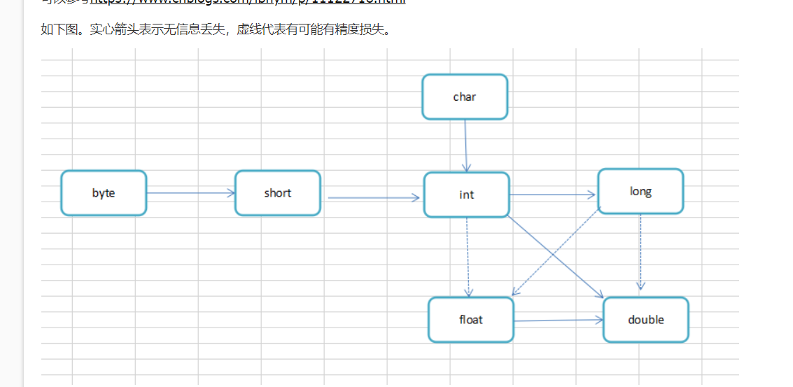
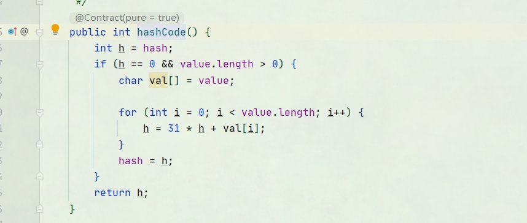

## 数据类型

Java语言提供了八种基本类型。六种数字类型（四个整数型，两个浮点型），一种字符类型，还有一种布尔型。

+ 八种基本类型（4种整形int,short,long,byte，2种浮点类型double,float，1种char, 1种boolean）

### 整型

**int：**

- int 数据类型是32位、有符号的以二进制补码表示的整数；四个字节
- 最小值是 **-2,147,483,648（-2^31）**；
- 最大值是 **2,147,483,647（2^31 - 1）**；
- 一般地整型变量默认为 int 类型；
- 默认值是 **0** ；

**byte：**

- byte 数据类型是8位、有符号的，以二进制补码表示的整数；一个字节
- 最小值是 **-128（-2^7）**；
- 最大值是 **127（2^7-1）**；
- 默认值是 **0**；
- byte 类型用在大型数组中节约空间，主要代替整数，因为 byte 变量占用的空间只有 int 类型的四分之一；

**short：**

- short 数据类型是 16 位、有符号的以二进制补码表示的整数；两个字节
- 最小值是 **-32768（-2^15）**；
- 最大值是 **32767（2^15 - 1）**；
- Short 数据类型也可以像 byte 那样节省空间。一个short变量是int型变量所占空间的二分之一；
- 默认值是 **0**；
- 例子：short s = 1000，short r = -20000。

**long：**

- long 数据类型是 64 位、有符号的以二进制补码表示的整数；八个字节
- 最小值是 **-9,223,372,036,854,775,808（-2^63）**；
- 最大值是 **9,223,372,036,854,775,807（2^63 -1）**；
- 这种类型主要使用在需要比较大整数的系统上；
- 默认值是 **0L**；
- 例子： long a = 100000L，Long b = -200000L。
  "L"理论上不分大小写，但是若写成"l"容易与数字"1"混淆，不容易分辩。所以最好大写。

### 浮点型

**float：**

- float 数据类型是单精度、32位、符合IEEE 754标准的浮点数；四个字节
- float 在储存大型浮点数组的时候可节省内存空间；
- 默认值是 **0.0f**；
- 浮点数不能用来表示精确的值，如货币；
- 例子：float f1 = 234.5f。

**double：**

- double 数据类型是双精度、64 位、符合IEEE 754标准的浮点数；八个字节
- 浮点数的默认类型为double类型；
- double类型同样不能表示精确的值，如货币；
- 默认值是 **0.0d**；
- 例子：double d1 = 123.4

### 两种其他类型

**boolean：**

- boolean数据类型表示一位的信息；
- 只有两个取值：true 和 false；
- 不能和整数类型进行转换

**char：**（不建议使用）

- char类型是一个单一的 16 位 Unicode 字符；
- 最小值是 **\u0000**（即为0）；
- 最大值是 **\uffff**（即为65,535）；
- char 数据类型可以储存任何字符；

### Unicode编码

Unicode 可以使用的编码有三种，分别是：(一个字节是八个bit)

- UTF-8：一种变长的编码方案，使用 1~6 个字节来存储；
- UTF-32：一种固定长度的编码方案，不管字符编号大小，始终使用 4 个字节来存储；
- UTF-16：介于 UTF-8 和 UTF-32 之间，使用 2 个或者 4 个字节来存储，长度既固定又可变。

UTF 是 Unicode Transformation Format 的缩写，意思是“Unicode转换格式”，后面的数字表明至少使用多少个比特位（Bit）来存储字符

__注意__

在使用注释的时候前往要注意 \u(详情请问百度)

### 数据类型应用场景

| 类型                | 简介                                | 特性                                             | 场景                     |
| ------------------- | ----------------------------------- | ------------------------------------------------ | ------------------------ |
| String              | 二进制安全                          | 任何数据，序列化对象，512M                       |                          |
| Hash(字典)          | 键值对集合，Map类型                 | 存储对象，                                       | 存储，读取，修改用户属性 |
| List(列表)          | 链表                                | 增删快，提供操作莫一段元素API                    | 消息队列，               |
| Set(集合)           | 哈希实现，元素不重复                | 添加,删除的复杂度都是O(1)2，提供交集，并集，差集 | 共同好友，唯一性         |
| SotredSet(有序集合) | 将Sett添加权重参数score,按score排序 | 数据插入集合时，已经天然排序                     | 排行榜，权重消息队列     |


##  变量

### 初始化变量

声明一个变量后必须赋予初始值。

### 常量

关键字final,只能被赋值一次，以后就不会被改变，习惯上常量名称全部大写。

## 运算符

+ java中的运算符+，-，*，/

+ 当/运算时，操作数都是int时，标识整数除法，否则标识浮点除法
+ %标识取余操作（15/2=7，15%2=1，15.0/2=7.5）
+ 整数被0除产生一个异常，浮点数被0除得到要给无穷大或者Nan结果
+ 因为处理器不同在进行浮点数运算的时候产生的结果也不同

### 数学函数

Math类种有各种各样的运算符，

### 数值类型之间的转换




强转

```java
double x = 123.11;
int nx = (int)x;
```

### 位运算符

Java定义了位运算符，应用于整数类型(int)，长整型(long)，短整型(short)，字符型(char)，和字节型(byte)等类型。

位运算符作用在所有的位上，并且按位运算。假设a = 60，b = 13;它们的二进制格式表示将如下：

```java
A = 0011 1100
B = 0000 1101
-----------------
A&B = 0000 1100
A | B = 0011 1101
A ^ B = 0011 0001
~A= 1100 0011
```

下表列出了位运算符的基本运算，假设整数变量 A 的值为 60 (111100)和变量 B 的值为 13(1101)：

| 操作符 | 描述                                                         | 例子                           |
| :----- | :----------------------------------------------------------- | :----------------------------- |
| ＆     | 如果相对应位都是1，则结果为1，否则为0                        | （A＆B），得到12，即0000 1100  |
| \|     | 如果相对应位都是 0，则结果为 0，否则为 1                     | （A \| B）得到61，即 0011 1101 |
| ^      | 如果相对应位值相同，则结果为0，否则为1                       | （A ^ B）得到49，即 0011 0001  |
| 〜     | 按位取反运算符翻转操作数的每一位，即0变成1，1变成0。         | （〜A）得到-61，即1100 0011    |
| <<     | 按位左移运算符。左操作数按位左移右操作数指定的位数。         | A << 2得到240，即 1111 0000    |
| >>     | 按位右移运算符。左操作数按位右移右操作数指定的位数。         | A >> 2得到15即 1111            |
| >>>    | 按位右移补零操作符。左操作数的值按右操作数指定的位数右移，移动得到的空位以零填充。 | A>>>2得到15即0000 1111         |

### 运算符级别

| 优先级 | 运算符                                           | 结合性   |
| ------ | ------------------------------------------------ | -------- |
| 1      | ()、[]、{}                                       | 从左向右 |
| 2      | !、+、-、~、++、--                               | 从右向左 |
| 3      | *、/、%                                          | 从左向右 |
| 4      | +、-                                             | 从左向右 |
| 5      | «、»、>>>                                        | 从左向右 |
| 6      | <、<=、>、>=、instanceof                         | 从左向右 |
| 7      | ==、!=                                           | 从左向右 |
| 8      | &                                                | 从左向右 |
| 9      | ^                                                | 从左向右 |
| 10     | \|                                               | 从左向右 |
| 11     | &&                                               | 从左向右 |
| 12     | \|\|                                             | 从左向右 |
| 13     | ?:                                               | 从右向左 |
| 14     | =、+=、-=、*=、/=、&=、\|=、^=、~=、«=、»=、>>>= | 从右向左 |

## 字符串String

从概念上来讲，Java字符串就是Unicode字符序列。Java没有内置字符类型，而是在标准的Java类中提供的一个预定义类，叫做String双引号引起来的就是一个String。

### 子串

从String中截取需要的部分

```java
String greeting = "Hell0";
        //第一个参数时想复制的第一个参数，第二个参数是不想复制的第一个参数
        String s = greeting.substring(0,2);
        String v = greeting.substring(0);
```

### 拼接

两个或者多个String连接在一起

一般可以用    +    来拼接

分界符

```java
 String l = String.join("#", "许","xu");
//结果  许#xu
```

### 不可变字符串

一般作为共享来用

```java
final String NAME = "xuhongyu";
String xu = NAME.substring(0,2);
```

### 检测字符串是否相等

equal方法检测是否相等

千万不要用 == 来判断，这个判断还要要求两个字符的位置相同，+和subtring等操作产生的String位置是不同的，容易产生bug，从表面上来看这种bug很像随机产生的间歇性错误。

```java
final String NAME = "xuhongyu";
String xu = NAME.substring(0);
boolean empty = NAME.equals(xu);
//true
equalsIgnoreCase  //判断大小但是不区分大小写
```

### String 哈希值的由来

大致经过如下流程

1. 将String 转化正char[]
2. 遍历char[]数组，char转为int后放大31倍。
3. 将每个char放大后的值相加就是String 哈希值



所以，正常情况下必须是完全一致的String值，hash值才会一致（空格也是字符串也会计算进去）。一致的的

### 空串与null串

""是长度为0的串内容为空，String还可以存储一个特殊的NULL表示目前没有任何对象或者关联。

```java
//判断是否为空串
if(str.length()=0)  or   if(str.equals(""))
//判断是否为NUll
    if(str==null)
```

### String API

| SN(序号) | 方法描述                                                     |
| :------- | :----------------------------------------------------------- |
| 1        | [char charAt(int index)](https://www.runoob.com/java/java-string-charat.html) 返回指定索引处的 char 值。 |
| 2        | [int compareTo(Object o)](https://www.runoob.com/java/java-string-compareto.html) 把这个字符串和另一个对象比较。 |
| 3        | [int compareTo(String anotherString)](https://www.runoob.com/java/java-string-compareto.html) 按字典顺序比较两个字符串。 |
| 4        | [int compareToIgnoreCase(String str)](https://www.runoob.com/java/java-string-comparetoignorecase.html) 按字典顺序比较两个字符串，不考虑大小写。 |
| 5        | [String concat(String str)](https://www.runoob.com/java/java-string-concat.html) 将指定字符串连接到此字符串的结尾。 |
| 6        | [boolean contentEquals(StringBuffer sb)](https://www.runoob.com/java/java-string-contentequals.html) 当且仅当字符串与指定的StringBuffer有相同顺序的字符时候返回真。 |
| 7        | [static String copyValueOf(char[\] data)](https://www.runoob.com/java/java-string-copyvalueof.html) 返回指定数组中表示该字符序列的 String。 |
| 8        | [static String copyValueOf(char[\] data, int offset, int count)](https://www.runoob.com/java/java-string-copyvalueof.html) 返回指定数组中表示该字符序列的 String。 |
| 9        | [boolean endsWith(String suffix)](https://www.runoob.com/java/java-string-endswith.html) 测试此字符串是否以指定的后缀结束。 |
| 10       | [boolean equals(Object anObject)](https://www.runoob.com/java/java-string-equals.html) 将此字符串与指定的对象比较。 |
| 11       | [boolean equalsIgnoreCase(String anotherString)](https://www.runoob.com/java/java-string-equalsignorecase.html) 将此 String 与另一个 String 比较，不考虑大小写。 |
| 12       | [byte[\] getBytes()](https://www.runoob.com/java/java-string-getbytes.html)  使用平台的默认字符集将此 String 编码为 byte 序列，并将结果存储到一个新的 byte 数组中。 |
| 13       | [byte[\] getBytes(String charsetName)](https://www.runoob.com/java/java-string-getbytes.html) 使用指定的字符集将此 String 编码为 byte 序列，并将结果存储到一个新的 byte 数组中。 |
| 14       | [void getChars(int srcBegin, int srcEnd, char[\] dst, int dstBegin)](https://www.runoob.com/java/java-string-getchars.html) 将字符从此字符串复制到目标字符数组。 |
| 15       | [int hashCode()](https://www.runoob.com/java/java-string-hashcode.html) 返回此字符串的哈希码。 |
| 16       | [int indexOf(int ch)](https://www.runoob.com/java/java-string-indexof.html) 返回指定字符在此字符串中第一次出现处的索引。 |
| 17       | [int indexOf(int ch, int fromIndex)](https://www.runoob.com/java/java-string-indexof.html) 返回在此字符串中第一次出现指定字符处的索引，从指定的索引开始搜索。 |
| 18       | [int indexOf(String str)](https://www.runoob.com/java/java-string-indexof.html)  返回指定子字符串在此字符串中第一次出现处的索引。 |
| 19       | [int indexOf(String str, int fromIndex)](https://www.runoob.com/java/java-string-indexof.html) 返回指定子字符串在此字符串中第一次出现处的索引，从指定的索引开始。 |
| 20       | [String intern()](https://www.runoob.com/java/java-string-intern.html)  返回字符串对象的规范化表示形式。 |
| 21       | [int lastIndexOf(int ch)](https://www.runoob.com/java/java-string-lastindexof.html)  返回指定字符在此字符串中最后一次出现处的索引。 |
| 22       | [int lastIndexOf(int ch, int fromIndex)](https://www.runoob.com/java/java-string-lastindexof.html) 返回指定字符在此字符串中最后一次出现处的索引，从指定的索引处开始进行反向搜索。 |
| 23       | [int lastIndexOf(String str)](https://www.runoob.com/java/java-string-lastindexof.html) 返回指定子字符串在此字符串中最右边出现处的索引。 |
| 24       | [int lastIndexOf(String str, int fromIndex)](https://www.runoob.com/java/java-string-lastindexof.html)  返回指定子字符串在此字符串中最后一次出现处的索引，从指定的索引开始反向搜索。 |
| 25       | [int length()](https://www.runoob.com/java/java-string-length.html) 返回此字符串的长度。 |
| 26       | [boolean matches(String regex)](https://www.runoob.com/java/java-string-matches.html) 告知此字符串是否匹配给定的正则表达式。 |
| 27       | [boolean regionMatches(boolean ignoreCase, int toffset, String other, int ooffset, int len)](https://www.runoob.com/java/java-string-regionmatches.html) 测试两个字符串区域是否相等。 |
| 28       | [boolean regionMatches(int toffset, String other, int ooffset, int len)](https://www.runoob.com/java/java-string-regionmatches.html) 测试两个字符串区域是否相等。 |
| 29       | [String replace(char oldChar, char newChar)](https://www.runoob.com/java/java-string-replace.html) 返回一个新的字符串，它是通过用 newChar 替换此字符串中出现的所有 oldChar 得到的。 |
| 30       | [String replaceAll(String regex, String replacement)](https://www.runoob.com/java/java-string-replaceall.html) 使用给定的 replacement 替换此字符串所有匹配给定的正则表达式的子字符串。 |
| 31       | [String replaceFirst(String regex, String replacement)](https://www.runoob.com/java/java-string-replacefirst.html)  使用给定的 replacement 替换此字符串匹配给定的正则表达式的第一个子字符串。 |
| 32       | [String[\] split(String regex)](https://www.runoob.com/java/java-string-split.html) 根据给定正则表达式的匹配拆分此字符串。 |
| 33       | [String[\] split(String regex, int limit)](https://www.runoob.com/java/java-string-split.html) 根据匹配给定的正则表达式来拆分此字符串。limit为拆分成几段 |
| 34       | [boolean startsWith(String prefix)](https://www.runoob.com/java/java-string-startswith.html) 测试此字符串是否以指定的前缀开始。 |
| 35       | [boolean startsWith(String prefix, int toffset)](https://www.runoob.com/java/java-string-startswith.html) 测试此字符串从指定索引开始的子字符串是否以指定前缀开始。 |
| 36       | [CharSequence subSequence(int beginIndex, int endIndex)](https://www.runoob.com/java/java-string-subsequence.html)  返回一个新的字符序列，它是此序列的一个子序列。 |
| 37       | [String substring(int beginIndex)](https://www.runoob.com/java/java-string-substring.html) 返回一个新的字符串，它是此字符串的一个子字符串。 |
| 38       | [String substring(int beginIndex, int endIndex)](https://www.runoob.com/java/java-string-substring.html) 返回一个新字符串，它是此字符串的一个子字符串。 |
| 39       | [char[\] toCharArray()](https://www.runoob.com/java/java-string-tochararray.html) 将此字符串转换为一个新的字符数组。 |
| 40       | [String toLowerCase()](https://www.runoob.com/java/java-string-tolowercase.html) 使用默认语言环境的规则将此 String 中的所有字符都转换为小写。 |
| 41       | [String toLowerCase(Locale locale)](https://www.runoob.com/java/java-string-tolowercase.html)  使用给定 Locale 的规则将此 String 中的所有字符都转换为小写。 |
| 42       | [String toString()](https://www.runoob.com/java/java-string-tostring.html)  返回此对象本身（它已经是一个字符串！）。 |
| 43       | [String toUpperCase()](https://www.runoob.com/java/java-string-touppercase.html) 使用默认语言环境的规则将此 String 中的所有字符都转换为大写。 |
| 44       | [String toUpperCase(Locale locale)](https://www.runoob.com/java/java-string-touppercase.html) 使用给定 Locale 的规则将此 String 中的所有字符都转换为大写。 |
| 45       | [String trim()](https://www.runoob.com/java/java-string-trim.html) 返回字符串的副本，忽略前导空白和尾部空白。 |
| 46       | [static String valueOf(primitive data type x)](https://www.runoob.com/java/java-string-valueof.html) 返回给定data type类型x参数的字符串表示形式。 |

### 构建字符串

每次的字符连接都会产生新的String对象，浪费时间与空间，产生了StringBuilder类

```java
//创建一个String构建器
StringBuilder builder = new StringBuilder();
//追加一个字符串,返回this
StringBuilder a = builder.append("abcdef");
//在第三个位置插入char 或者String，返回this
StringBuilder b = builder.insert(3, "-xuhongyu");
//删除偏移量，返回this
StringBuilder c = builder.delete(4, 5);
//将第二个代码单元改变成a
builder.setCharAt(2, 'a');
int length = builder.length();
```

__注意__

在对这个String进行操作的时候是对这个构造器操作，并不会创建一个新的StringBuilder来接收。

String:安全的

StringBuffer： 安全的

StringBuilder: 不安全的

安全与不安全，是在线程同步方面，如果是单线程推荐使用StringBuffer  速度快。

## 输入和输出

### 读取输入

读取输入的时候首先需要创建一个Scanner对象

```java
Scanner scan = new Scanner(System.in);
// 从键盘接收数据

// next方式接收字符串
System.out.println("next方式接收：");
// 判断是否还有输入
if (scan.hasNext()) {
    
    String str1 = scan.next();
    System.out.println("输入的数据为：" + str1);
}
scan.close();

//读取下一个单词
scan.next()
//读取下一行
scan.nextLine()
//检测是否还有其他单词
scan.hasNext()    scan.hasNextLine()
    
    
```

### 格式化输出

```java
System.out.format("%d%n",year);
```

| 转换符       | 类型                                          | 举例                         |
| ------------ | --------------------------------------------- | ---------------------------- |
| c            | 完整的日期和时间                              | Mon Feb 09 18:05:11 PST 2004 |
| F            | ISO 8061日期                                  | 2004-02-09                   |
| D            | 美国格式的日期                                | 02/09/2004                   |
| T            | 24小时时间                                    | 18:03:23                     |
| r            | 12小时时间                                    | 05:03:23 pm                  |
| R            | 24小时时间没有秒                              | 18:05                        |
| Y            | 4位数字的年（前面补0）                        | 2004                         |
| y            | 年的后两位数字（前面补0）                     | 04                           |
| C            | 年的前两位数字（前面补0）                     | 20                           |
| B            | 月的完整拼写                                  | February                     |
| b或h         | 月的缩写                                      | Feb                          |
| m            | 两位数字的月（前面补0）                       | 02                           |
| d            | 两位数字的日（前面补0）                       | 09                           |
| e            | 两位数字的月（前面不补0）                     | 9                            |
| A            | 星期几的完整拼写                              | Monday                       |
| a            | 星期几的缩写                                  | Mon                          |
| j            | 三位数的年中的日子（前面补0），在001到366之间 | 069                          |
| H            | 两位数字的小时（前面补0），在0到23之间        | 18                           |
| k            | 两位数字的小时（前面不补0）在0到23之间        | 8                            |
| I（大写的i） | 两位数字的小时（前面补0），在0到12之间        | 06                           |
| l（小写的L） | 两位数字的小时（前面不补0），在0到12之间      | 6                            |
| M            | 两位数字的分钟（前面补0）                     | 05                           |
| S            | 两位数字的秒（前面补0）                       | 19                           |
| L            | 三位数字的毫秒（前面补0）                     | 047                          |
| N            | 九位数字的毫微秒（前面补0）                   | 047000000                    |
| P            | 上午或者下午的大写标志                        | PM                           |
| p            | 上午或者下午的小写标志                        | pm                           |
| z            | 从GMT起，RFC822数字移位                       | -0800                        |
| Z            | 时区                                          | PST                          |
| s            | 从格林威治时间1970-01-01 00:00:00起的秒数     | 107884319                    |
| Q            | 从格林威治时间1970-01-01 00:00:01起的毫秒数   | 107884319047                 |

### 文件的输入和输出

```java
 Path path = Paths.get("C:\\Users\\xiayu\\Desktop\\test.txt");//输入
        Scanner in = new Scanner(path,"UTF-8");
        PrintWriter printWriter = new PrintWriter("C:\\Users\\xiayu\\Desktop\\test.txt","UTF-8");//输出
```

## 控制流程

### while 循环

while是最基本的循环，它的结构为：

```java
while( 布尔表达式 ) {
  //循环内容
}
```

### do…while 循环

对于 while 语句而言，如果不满足条件，则不能进入循环。但有时候我们需要即使不满足条件，也至少执行一次。

do…while 循环和 while 循环相似，不同的是，do…while 循环至少会执行一次。

```java
do {
       //代码语句
}while(布尔表达式);
```

### for循环

虽然所有循环结构都可以用 while 或者 do...while表示，但 Java 提供了另一种语句 —— for 循环，使一些循环结构变得更加简单。

for循环执行的次数是在执行前就确定的。语法格式如下：

for(初始化; 布尔表达式; 更新) {     //代码语句 }

关于 for 循环有以下几点说明：

- 最先执行初始化步骤。可以声明一种类型，但可初始化一个或多个循环控制变量，也可以是空语句。
- 然后，检测布尔表达式的值。如果为 true，循环体被执行。如果为false，循环终止，开始执行循环体后面的语句。
- 执行一次循环后，更新循环控制变量。
- 再次检测布尔表达式。循环执行上面的过程。

###  Java 增强 for 循环

Java5 引入了一种主要用于数组的增强型 for 循环。

Java 增强 for 循环语法格式如下:

```java
for(声明语句 : 表达式) 
{    //代码句子 }
```

**声明语句：**声明新的局部变量，该变量的类型必须和数组元素的类型匹配。其作用域限定在循环语句块，其值与此时数组元素的值相等。

**表达式：**表达式是要访问的数组名，或者是返回值为数组的方法。

### break 关键字

break 主要用在循环语句或者 switch 语句中，用来跳出整个语句块。

break 跳出最里层的循环，并且继续执行该循环下面的语句。


### continue 关键字

continue 适用于任何循环控制结构中。作用是让程序立刻跳转到下一次循环的迭代。

在 for 循环中，continue 语句使程序立即跳转到更新语句。

在 while 或者 do…while 循环中，程序立即跳转到布尔表达式的判断语句。

### Java 条件语句 - if...else

一个 if 语句包含一个布尔表达式和一条或多条语句。

```java
if(布尔表达式)
{
   //如果布尔表达式为true将执行的语句
}
```

### if...else语句

if 语句后面可以跟 else 语句，当 if 语句的布尔表达式值为 false 时，else 语句块会被执行。

```java
if(布尔表达式){
   //如果布尔表达式的值为true
}else{
   //如果布尔表达式的值为false
}
```

### Java switch case 语句（不建议使用）

switch case 语句判断一个变量与一系列值中某个值是否相等，每个值称为一个分支。

```java
switch(expression){
    case value :
       //语句
       break; //可选
    case value :
       //语句
       break; //可选
    //你可以有任意数量的case语句
    default : //可选
       //语句
}
```

- switch 语句中的变量类型可以是： byte、short、int 或者 char。从 Java SE 7 开始，switch 支持字符串 String 类型了，同时 case 标签必须为字符串常量或字面量。
- switch 语句可以拥有多个 case 语句。每个 case 后面跟一个要比较的值和冒号。
- case 语句中的值的数据类型必须与变量的数据类型相同，而且只能是常量或者字面常量。
- 当变量的值与 case 语句的值相等时，那么 case 语句之后的语句开始执行，直到 break 语句出现才会跳出 switch 语句。
- 当遇到 break 语句时，switch 语句终止。程序跳转到 switch 语句后面的语句执行。case 语句不必须要包含 break 语句。如果没有 break 语句出现，程序会继续执行下一条 case 语句，直到出现 break 语句。
- switch 语句可以包含一个 default 分支，该分支一般是 switch 语句的最后一个分支（可以在任何位置，但建议在最后一个）。default 在没有 case 语句的值和变量值相等的时候执行。default 分支不需要 break 语句。

### 注意

+ 在for循环的时候检测两个浮点数是否相等要格外的小心，可能因为精准度问题两个浮点数永远也不会相等。
+ 在switch 中我们可能触发多个分支，如果分支末尾没有加 break,将会执行下一个分支。
+ break也可以运用在if标签，或者其他的标签上。

## 大数值

在java.math中有`BigInteger`和`BigDecimal`，这两个类可以处理包含任意长度的数字序列的数值

+ BigInteger 实现了任意精度的整数运算。
+ bigDecimal 实现了任意精度的浮点数运算。

valueOf方法可以将普通的数值转换为大数值

```java
BigInteger a= BigInteger.valueOf(2);
```

不能用人们熟知的方法来计算大数值

### 大数值的计算

__BigInteger__

- **BigInteger add(BigInteger other)--------和**
- **BigInteger subtract(BigInteger other)---------差**
- **Biginteger multiply(BigInteger other)----------积**
- **BigInteger divide(BigInteger other)-----------除**
- **BigInteger mod(BigInteger other)-----------余**
- **int compareTo(BigInteger other)** 如果这个大整数与另一个大整数other相等，返回0；小于返回负数；大于返回正数。

- **static BigInteger valueOf(long x)**  返回值等于x的大整数

- **BigDecimal add(BigDecimal other)----------和**
- **BigDecimal substract(BigDecimal other)---------差**
- **BigDecimal multiply(BigDecimal other)----------积**
- **BigDecimal divide(BigDecimal other RoundingMode mode)--------商** 想要计算商，必须给出舍入方式（round mod）。

- **int compareTo(BigDecimal other)**              参考整数。

- **static BigDecimal valueOf(long x)**
- **static BigDecimal valueOf(long x, int scale)**

## 数组

数组是一种数据结构，用来存储一种类型的集合，Java 语言中提供的数组是用来存储固定大小的同类型元素。

### 数组的声明

```java
dataType[] arrayRefVar;   // 首选的方法
dataType arrayRefVar[];  // 效果相同，但不是首选方法
int[] a = new int[100] 
//初始化的大小就是元素的个数
double[] myList = {1.9, 2.9, 3.4, 3.5};
```

+ 数组大小不可改变，创建的时候确定。
+ 创建的时候，所有元素初始化为0，boolean初始化为false,其他类型null
+ 数组大小可以为0，但是数组大小为0时，数组不时null。
+ System.out.println(Arrays.toString(a));能够输出a数组中所有的值

### 数组拷贝

Java允许一个数组拷贝给另一个数组，这时，两个变量引用同一个数组。

### 数组排序（Arrays）

java.util.Arrays 类能方便地操作数组，它提供的所有方法都是静态的。

具有以下功能：

- 给数组赋值：通过 fill 方法。
- 对数组排序：通过 sort 方法,按升序。
- 比较数组：通过 equals 方法比较数组中元素值是否相等。
- 查找数组元素：通过 binarySearch 方法能对排序好的数组进行二分查找法操作。

具体说明请查看下表：

| 序号 | 方法和说明                                                   |
| :--- | :----------------------------------------------------------- |
| 1    | **public static int binarySearch(Object[] a, Object key)** 用二分查找算法在给定数组中搜索给定值的对象(Byte,Int,double等)。数组在调用前必须排序好的。如果查找值包含在数组中，则返回搜索键的索引；否则返回 (-(*插入点*) - 1)。 |
| 2    | **public static boolean equals(long[] a, long[] a2)** 如果两个指定的 long 型数组彼此*相等*，则返回 true。如果两个数组包含相同数量的元素，并且两个数组中的所有相应元素对都是相等的，则认为这两个数组是相等的。换句话说，如果两个数组以相同顺序包含相同的元素，则两个数组是相等的。同样的方法适用于所有的其他基本数据类型（Byte，short，Int等）。 |
| 3    | **public static void fill(int[] a, int val)** 将指定的 int 值分配给指定 int 型数组指定范围中的每个元素。同样的方法适用于所有的其他基本数据类型（Byte，short，Int等）。 |
| 4    | **public static void sort(Object[] a)** 对指定对象数组根据其元素的自然顺序进行升序排列。同样的方法适用于所有的其他基本数据类型（Byte，short，Int等）。 |
| 5    | static String toString(type[] a) 返回a中数据元素的字符串类型，逗号隔开 |
| 6    | static type copyOf(type[] a,int length)                      |
| 7    | static type copyOfRange(type[] a ,int start ,int end) 返回一个与a数组一样类型的数组，长度类end-start     a 数组    start 起始下标 ， 终结下标 ，length长度 |

### 多维数组

多维数组可以看成是数组的数组，比如二维数组就是一个特殊的一维数组，其每一个元素都是一个一维数组，例如：

```java
String str[][] = new String[3][4];
```


### 多维数组的动态初始化（以二维数组为例）

1. 直接为每一维分配空间，格式如下：

type[][] typeName = new type[typeLength1][typeLength2];

type 可以为基本数据类型和复合数据类型，arraylength1 和 arraylength2 必须为正整数，arraylength1 为行数，arraylength2 为列数。

例如：

```java
int a[][] = new int[2][3];
```


解析：

二维数组 a 可以看成一个两行三列的数组。

2. 从最高维开始，分别为每一维分配空间，例如：

```java
String s[][] = new String[2][]; 
s[0] = new String[2]; 
s[1] = new String[3];
s[0][0] = new String("Good");
s[0][1] = new String("Luck");
s[1][0] = new String("to"); 
s[1][1] = new String("you");
s[1][2] = new String("!");
```


解析：

**s[0]=new String[2]** 和 **s[1]=new String[3]** 是为最高维分配引用空间，也就是为最高维限制其能保存数据的最长的长度，然后再为其每个数组元素单独分配空间 **s0=new String("Good")** 等操作。

+ 快速打印出一个二维数组的数据元素列表

```java
System.out.println(Arrys.deepToString(a))
```

### 不规则数组

实际上Java没有多维数组，多维数组是由多个一维数组整合而成的。

```java
public static void main(String[] args) {
    	//不规则二维数组
    	final int length=9;
        int[][] ints = new int[length][];
        for (int i = 0; i < length; i++) {
            ints[i] = new int[i + 1];
            for (int j = 0; j < i + 1; j++) {
                ints[i][j] = i + 1;
            }
        }
        for (int[] i : ints) {
            for (int j : i) {
                System.out.print(j);
            }
            System.out.println();
        }
    }
```

结果

```java
1
22
333
4444
55555
666666
7777777
88888888
999999999
```

