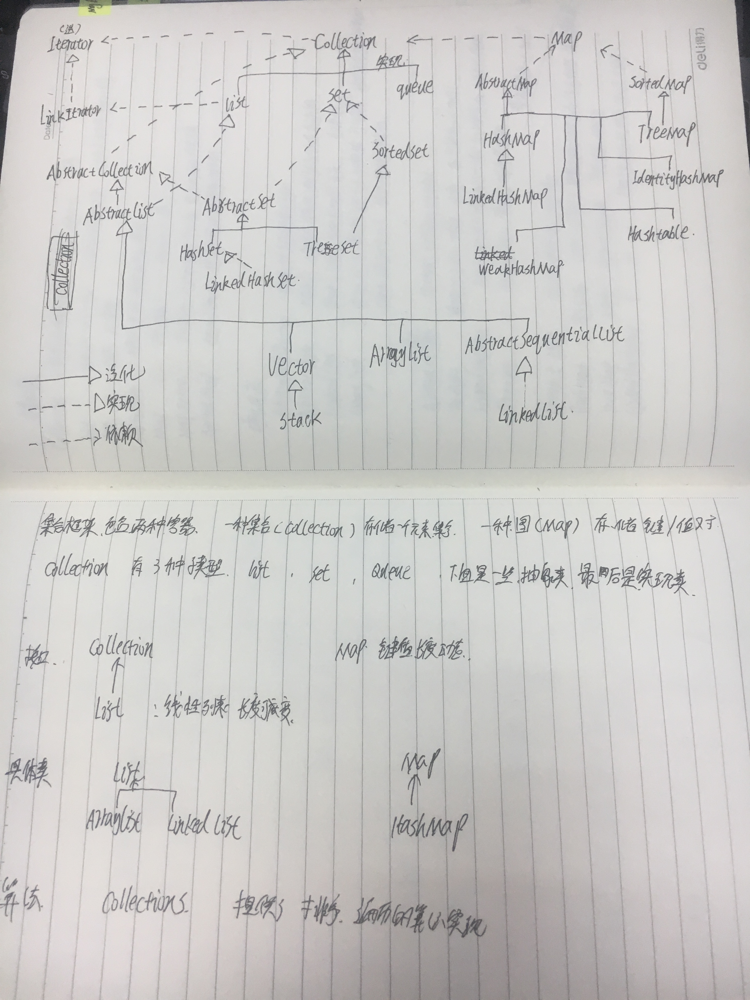

## Java集合介绍（Collection）

什么是集合（Collection）？集合就是“由若干个确定的元素所构成的整体”。

在Java类库中，集合类的基本接口时Collection接口，这个接口有两个最基本的方法

```java
public interface Collection<E>{
	bolean add(E element);   //用于向集合中添加元素，添加成功后返回true添加失败返回false
    Iterator<E> iterator();	//用于返回一个实现了Iterator接口的对象，可以使用这个迭代器对象异常访问
}
```

在Java中，如果一个Java对象可以在内部持有若干其他Java对象，并对外提供访问接口，我们把这种Java对象称为集合。很显然，Java的数组可以看作是一种集合。



标准集合类汇总于下表：

| 序号 | 类描述                                                       |
| :--- | :----------------------------------------------------------- |
| 1    | **AbstractCollection**  实现了大部分的集合接口。             |
| 2    | **AbstractList**  继承于AbstractCollection 并且实现了大部分List接口。 |
| 3    | **AbstractSequentialList**  继承于 AbstractList ，提供了对数据元素的链式访问而不是随机访问。 |
| 4    | LinkedList 该类实现了List接口，允许有null（空）元素。主要用于创建链表数据结构，该类没有同步方法，如果多个线程同时访问一个List，则必须自己实现访问同步，解决方法就是在创建List时候构造一个同步的List。例如：`Listlist=Collections.synchronizedList(newLinkedList(...));`LinkedList 查找效率低。 |
| 5    | ArrayList 该类也是实现了List的接口，实现了可变大小的数组，随机访问和遍历元素时，提供更好的性能。该类也是非同步的,在多线程的情况下不要使用。ArrayList 增长当前长度的50%，插入删除效率低。 |
| 6    | **AbstractSet**  继承于AbstractCollection 并且实现了大部分Set接口。 |
| 7    | HashSet 该类实现了Set接口，不允许出现重复元素，不保证集合中元素的顺序，允许包含值为null的元素，但最多只能一个。 |
| 8    | LinkedHashSet 具有可预知迭代顺序的 `Set` 接口的哈希表和链接列表实现。 |
| 9    | TreeSet 该类实现了Set接口，可以实现排序等功能。              |
| 10   | **AbstractMap**  实现了大部分的Map接口。                     |
| 11   | HashMap HashMap 是一个散列表，它存储的内容是键值对(key-value)映射。 该类实现了Map接口，根据键的HashCode值存储数据，具有很快的访问速度，最多允许一条记录的键为null，不支持线程同步。 |
| 12   | TreeMap 继承了AbstractMap，并且使用一颗树。                  |
| 13   | WeakHashMap 继承AbstractMap类，使用弱密钥的哈希表。          |
| 14   | LinkedHashMap 继承于HashMap，使用元素的自然顺序对元素进行排序. |
| 15   | IdentityHashMap 继承AbstractMap类，比较文档时使用引用相等。  |

## 迭代器

Iterator接口有四个方法

```java
public interface Iterator<E>{
    E next();  //通过反复调用next方法，可以逐个访问集合中的每个元素，到最后一个抛出									NoSuchElementException
    bollean hasNext();//用于遍历所有的元素 当遍历最后一个的时候返回true  列 while(iter.hasNext){}
    void remove() //移除元素 需要与 next（）搭配使用，本着在删除前再看他一眼的原则
    default void forEachRemaining(Consumer<? super E> action)//提供了 一个Lambda表达式的
        //例如   iterator.forEachRemining(element -> do something with element)
}
```

在遍历元素时迭代器所处于的位置，跟其他的不同，迭代器并不只向数据本身，而是在数据的 中间


## 对集合操作的几个方法

collection之继承体系

```java
Collection   
    |-----List有序(存储顺序和取出顺序一致)，可重复
    |----ArrayList，线程不安全，底层使用数组实现，查询快，增删慢。效率高。
            每次容量不足时，自增长度的一半，如下源码可知
                  int newCapacity = oldCapacity + (oldCapacity >> 1);
    |----LinkedList ， 线程不安全，底层使用链表实现，查询慢，增删快。效率高
 
    |----Vector ， 线程安全，底层使用数组实现，查询快，增删慢。效率低         每次容量不足时，默认自增长度的一倍（如果不指定增量的话），如下源码可知
                   int newCapacity = oldCapacity + ((capacityIncrement > 0) ?
                                     capacityIncrement : oldCapacity);
    |-----Set   元素唯一一个不包含重复元素的 collection。更确切地讲，set 不包含满足 e1.equals(e2) 的元素对 e1 和 e2，并且最多包含一个 null 元素。
 
    |--HashSet 底层是由HashMap实现的，通过对象的hashCode方法与equals方法来保证插入元素的唯一性，无序(存储顺序和取出顺序不一致)。
 
    |--LinkedHashSet 底层数据结构由哈希表和链表组成。哈希表保证元素的唯一性，链表保证元素有序。(存储和取出是一致)
 
    |--TreeSet 基于 TreeMap 的 NavigableSet 实现。使用元素的自然顺序对元素进行排序，或者根据创建 set 时提供的 Comparator 进行排序，具体取决于使用的构造方法。 元素唯一。
```

__Collection泛型接口__

```java
boolean add(E e) 
    确保此 collection 包含指定的元素（可选操作）。    
        boolean addAll(Collection<? extends E> c) 
    将指定collection中的所有元素都添加到此collection 中（可选操作）。    
        void clear() 
    移除此 collection 中的所有元素（可选操作）。 
        boolean contains(Object o) 
    如果此 collection 包含指定的元素，则返回 true。 
        boolean containsAll(Collection<?> c) 
    如果此 collection 包含指定 collection 中的所有元素，则返回 true。 
        boolean equals(Object o) 
    比较此 collection 与指定对象是否相等。 
        int hashCode() 
    返回此 collection 的哈希码值。 
        boolean isEmpty() 
    如果此 collection 不包含元素，则返回 true。 
        Iterator<E> iterator() 
    返回在此 collection 的元素上进行迭代的迭代器。 
        boolean remove(Object o) 
    从此 collection 中移除指定元素的单个实例，如果存在的话（可选操作）。 
        boolean removeAll(Collection<?> c) 
    移除此 collection 中那些也包含在指定 collection 中的所有元素（可选操作）。 
        boolean retainAll(Collection<?> c) 
    仅保留此 collection 中那些也包含在指定 collection 的元素（可选操作）。 
        int size() 
    返回此 collection 中的元素数。 
        Object[] toArray() 
    返回包含此 collection 中所有元素的数组。 
       <T> T[] 
        toArray(T[] a) 
```

## 链表 List

在集合类中，`List`是最基础的一种集合：它是一种有序链表。

`List`的行为和数组几乎完全相同：`List`内部按照放入元素的先后顺序存放，每个元素都可以通过索引确定自己的位置，`List`的索引和数组一样，从`0`开始。

```ascii
┌───┬───┬───┬───┬───┬───┐
│ A │ B │ C │ D │ E │   │
└───┴───┴───┴───┴───┴───┘
              │   │
          ┌───┘   │
          │   ┌───┘
          │   │
          ▼   ▼
┌───┬───┬───┬───┬───┬───┐
│ A │ B │ D │ E │   │   │
└───┴───┴───┴───┴───┴───┘
```

注意，在对数组插入或者删除的时候特别的影响性能

### List的特点

使用`List`时，我们要关注`List`接口的规范。`List`接口允许我们添加重复的元素，即`List`内部的元素可以重复：

```java
HEAD ──>│ A │ ●─┼──>│ B │ ●─┼──>│ C │ ●─┼──>│ D │   │
```

`List`还允许添加`null`：

__创建List__

除了使用`ArrayList`和`LinkedList`，我们还可以通过`List`接口提供的`of()`方法，根据给定元素快速创建`List`：

```java
List<Integer> list = List.of(1, 2, 5);
```

但是`List.of()`方法不接受`null`值，如果传入`null`，会抛出`NullPointerException`异常。

### List和Array转换

把`List`变为`Array`有三种方法，第一种是调用`toArray()`方法直接返回一个`Object[]`数组：

```java
public class Main {
    public static void main(String[] args) {
        List<String> list = List.of("apple", "pear", "banana");
        Object[] array = list.toArray();
        for (Object s : array) {
            System.out.println(s);
        }
    }
}
```

这种方法会丢失类型信息，所以实际应用很少。

第二种方式是给`toArray(T[])`传入一个类型相同的`Array`，`List`内部自动把元素复制到传入的`Array`中：

```java
public class Main {
    public static void main(String[] args) {
        List<Integer> list = List.of(12, 34, 56);
        Integer[] array = list.toArray(new Integer[3]);
        for (Integer n : array) {
            System.out.println(n);
        }
    }
}

```

最后一种更简洁的写法是通过`List`接口定义的`T[] toArray(IntFunction<T[]> generator)`方法：

```java
Integer[] array = list.toArray(Integer[]::new);
```

反过来，把`Array`变为`List`就简单多了，通过`List.of(T...)`方法最简单：

```java
Integer[] array = { 1, 2, 3 };
List<Integer> list = List.of(array);
```

### 比较 ArrayList 和  LinkedList

ArrayList 是一个动态的的在分配的数组。

|                     | ArrayList    | LinkedList           |
| :------------------ | :----------- | -------------------- |
| 获取指定元素        | 速度很快     | 需要从头开始查找元素 |
| 添加元素到末尾      | 速度很快     | 速度很快             |
| 在指定位置添加/删除 | 需要移动元素 | 不需要移动元素       |
| 内存占用            | 少           | 较大                 |
| 数据结构 | 连续存储 | 双向列表不是连续的空间存储 |
| 能否重复 | 不能 | 能 |

通常情况下，我们总是优先使用`ArrayList`。

ArrayList适用于随机访问
LinkedList适用于于随机位置增加、删除


### List中的接口 ，ArrayList类接口 ,LinkedList类接口,vector类接口

List中的接口 

```java
boolean add(E o) 
          向列表的尾部追加指定的元素（可选操作）。 
 void add(int index, E element) 
          在列表的指定位置插入指定元素（可选操作）。 
 boolean addAll(Collection<? extends E> c) 
          追加指定 collection 中的所有元素到此列表的结尾，顺序是指定 collection 的迭代器返回这些元素的顺序（可选操作）。 
 boolean addAll(int index, Collection<? extends E> c) 
          将指定 collection 中的所有元素都插入到列表中的指定位置（可选操作）。 
 void clear() 
          从列表中移除所有元素（可选操作）。 
 boolean contains(Object o) 
          如果列表包含指定的元素，则返回 true。 
 boolean containsAll(Collection<?> c) 
          如果列表包含指定 collection 的所有元素，则返回 true。 
 boolean equals(Object o) 
          比较指定的对象与列表是否相等。 
 E get(int index) 
          返回列表中指定位置的元素。 
 int hashCode() 
          返回列表的哈希码值。 
 int indexOf(Object o) 
          返回列表中首次出现指定元素的索引，如果列表不包含此元素，则返回 -1。 
 boolean isEmpty() 
          如果列表不包含元素，则返回 true。 
 Iterator<E> iterator() 
          返回以正确顺序在列表的元素上进行迭代的迭代器。 
 int lastIndexOf(Object o) 
          返回列表中最后出现指定元素的索引，如果列表不包含此元素，则返回 -1。 
 ListIterator<E> listIterator() 
          返回列表中元素的列表迭代器（以正确的顺序）。 
 ListIterator<E> listIterator(int index) 
          返回列表中元素的列表迭代器（以正确的顺序），从列表的指定位置开始。 
 E remove(int index) 
          移除列表中指定位置的元素（可选操作）。 
 boolean remove(Object o) 
          移除列表中出现的首个指定元素（可选操作）。 
 boolean removeAll(Collection<?> c) 
          从列表中移除指定 collection 中包含的所有元素（可选操作）。 
 boolean retainAll(Collection<?> c) 
          仅在列表中保留指定 collection 中所包含的元素（可选操作）。 
 E set(int index, E element) 
          用指定元素替换列表中指定位置的元素（可选操作）。 
 int size() 
          返回列表中的元素数。 
 List<E> subList(int fromIndex, int toIndex) 
          返回列表中指定的 fromIndex（包括 ）和 toIndex（不包括）之间的部分视图。 
 Object[] toArray() 
          返回以正确顺序包含列表中的所有元素的数组。 
<T> T[] 
 toArray(T[] a) 
          返回以正确顺序包含列表中所有元素的数组；返回数组的运行时类型是指定数组的运行时类型。
```

ArrayList类接口

```java
ArrayList() 
          构造一个初始容量为 10 的空列表。 
ArrayList(Collection<? extends E> c) 
          构造一个包含指定 collection 的元素的列表，这些元素是按照该 collection 的迭代器返回它们的顺序排列的。 
ArrayList(int initialCapacity) 
          构造一个具有指定初始容量的空列表。 
 
 
 boolean add(E o) 
          将指定的元素追加到此列表的尾部。 
 void add(int index, E element) 
          将指定的元素插入此列表中的指定位置。 
 boolean addAll(Collection<? extends E> c) 
          按照指定 Collection 的迭代器所返回的元素顺序，将该 Collection 中的所有元素追加到此列表的尾部。 
 boolean addAll(int index, Collection<? extends E> c) 
          从指定的位置开始，将指定 Collection 中的所有元素插入到此列表中。 
 void clear() 
          移除此列表中的所有元素。 
 Object clone() 
          返回此 ArrayList 实例的浅表复制。 
 boolean contains(Object elem) 
          如果此列表中包含指定的元素，则返回 true。 
 void ensureCapacity(int minCapacity) 
          如有必要，增加此 ArrayList 实例的容量，以确保它至少能够容纳最小容量参数所指定的元素数。 
 E get(int index) 
          返回此列表中指定位置上的元素。 
 int indexOf(Object elem) 
          搜索给定参数第一次出现的位置，使用 equals 方法进行相等性测试。 
 boolean isEmpty() 
          测试此列表中是否没有元素。 
 int lastIndexOf(Object elem) 
          返回指定的对象在列表中最后一次出现的位置索引。 
 E remove(int index) 
          移除此列表中指定位置上的元素。 
 boolean remove(Object o) 
          从此列表中移除指定元素的单个实例（如果存在），此操作是可选的。 
protected  void removeRange(int fromIndex, int toIndex) 
          移除列表中索引在 fromIndex（包括）和 toIndex（不包括）之间的所有元素。 
 E set(int index, E element) 
          用指定的元素替代此列表中指定位置上的元素。 
 int size() 
          返回此列表中的元素数。 
 Object[] toArray() 
          返回一个按照正确的顺序包含此列表中所有元素的数组。 
<T> T[] 
 toArray(T[] a) 
          返回一个按照正确的顺序包含此列表中所有元素的数组；返回数组的运行时类型就是指定数组的运行时类型。 
 void trimToSize() 
          将此 ArrayList 实例的容量调整为列表的当前大小。 
从类 java.util.AbstractList 继承的方法 
equals, hashCode, iterator, listIterator, listIterator, subList 
  从类 java.util.AbstractCollection 继承的方法 
containsAll, removeAll, retainAll, toString 
  从类 java.lang.Object 继承的方法 
finalize, getClass, notify, notifyAll, wait, wait, wait 
  从接口 java.util.List 继承的方法 
containsAll, equals, hashCode, iterator, listIterator, listIterator, removeAll, retainAll, subList  
```

LinkedList类接口

```java
 boolean add(E o) 
          将指定元素追加到此列表的结尾。 
 void add(int index, E element) 
          在此列表中指定的位置插入指定的元素。 
 boolean addAll(Collection<? extends E> c) 
          追加指定 collection 中的所有元素到此列表的结尾，顺序是指定 collection 的迭代器返回这些元素的顺序。 
 boolean addAll(int index, Collection<? extends E> c) 
          将指定集合中的所有元素从指定位置开始插入此列表。 
 void addFirst(E o) 
          将给定元素插入此列表的开头。 
 void addLast(E o) 
          将给定元素追加到此列表的结尾。 
 void clear() 
          从此列表中移除所有元素。 
 Object clone() 
          返回此 LinkedList 的浅表复制。 
 boolean contains(Object o) 
          如果此列表包含指定元素，则返回 true。 
 E element() 
          找到但不移除此列表的头（第一个元素）。 
 E get(int index) 
          返回此列表中指定位置处的元素。 
 E getFirst() 
          返回此列表的第一个元素。 
 E getLast() 
          返回此列表的最后一个元素。 
 int indexOf(Object o) 
          返回此列表中首次出现的指定元素的索引，如果列表中不包含此元素，则返回 -1。 
 int lastIndexOf(Object o) 
          返回此列表中最后出现的指定元素的索引，如果列表中不包含此元素，则返回 -1。 
 ListIterator<E> listIterator(int index) 
          返回此列表中的元素的列表迭代器（按适当顺序），从列表中指定位置开始。 
 boolean offer(E o) 
          将指定元素添加到此列表的末尾（最后一个元素）。 
 E peek() 
          找到但不移除此列表的头（第一个元素）。 
 E poll() 
          找到并移除此列表的头（第一个元素）。 
 E remove() 
          找到并移除此列表的头（第一个元素）。 
 E remove(int index) 
          移除此列表中指定位置处的元素。 
 boolean remove(Object o) 
          移除此列表中首次出现的指定元素。 
 E removeFirst() 
          移除并返回此列表的第一个元素。 
 E removeLast() 
          移除并返回此列表的最后一个元素。 
 E set(int index, E element) 
          将此列表中指定位置的元素替换为指定的元素。 
 int size() 
          返回此列表的元素数。 
 Object[] toArray() 
          以正确顺序返回包含此列表中所有元素的数组。 
<T> T[] 
 toArray(T[] a) 
          以正确顺序返回包含此列表中所有元素的数组；返回数组的运行时类型即为指定数组的类。
```

vector类接口  矢量set

```java
 boolean add(E o) 
          将指定元素追加到此向量的末尾。 
 void add(int index, E element) 
          在此向量的指定位置插入指定的元素。 
 boolean addAll(Collection<? extends E> c) 
          将指定 Collection 中的所有元素追加到此向量的末尾，按照指定集合的迭代器所返回的顺序追加这些元素。 
 boolean addAll(int index, Collection<? extends E> c) 
          在指定位置将指定 Collection 中的所有元素插入到此向量中。 
 void addElement(E obj) 
          将指定的组件添加到此向量的末尾，将其大小增加 1。 
 int capacity() 
          返回此向量的当前容量。 
 void clear() 
          从此向量中移除所有元素。 
 Object clone() 
          返回向量的一个副本。 
 boolean contains(Object elem) 
          测试指定的对象是否为此向量中的组件。 
 boolean containsAll(Collection<?> c) 
          如果此向量包含指定 Collection 中的所有元素，则返回 true。 
 void copyInto(Object[] anArray) 
          将此向量的组件复制到指定的数组中。 
 E elementAt(int index) 
          返回指定索引处的组件。 
 Enumeration<E> elements() 
          返回此向量的组件的枚举。 
 void ensureCapacity(int minCapacity) 
          增加此向量的容量（如有必要），以确保其至少能够保存最小容量参数指定的组件数。 
 boolean equals(Object o) 
          比较指定对象与此向量的相等性。 
 E firstElement() 
          返回此向量的第一个组件（位于索引 0 处的项）。 
 E get(int index) 
          返回向量中指定位置的元素。 
 int hashCode() 
          返回此向量的哈希码值。 
 int indexOf(Object elem) 
          搜索给定参数的第一个匹配项，使用 equals 方法测试相等性。 
 int indexOf(Object elem, int index) 
          搜索给定参数的第一个匹配项，从 index 处开始搜索，并使用 equals 方法测试其相等性。 
 void insertElementAt(E obj, int index) 
          将指定对象作为此向量中的组件插入到指定的 index 处。 
 boolean isEmpty() 
          测试此向量是否不包含组件。 
 E lastElement() 
          返回此向量的最后一个组件。 
 int lastIndexOf(Object elem) 
          返回指定的对象在此向量中最后一个匹配项的索引。 
 int lastIndexOf(Object elem, int index) 
          向后搜索指定的对象，从指定的索引处开始搜索，并返回一个索引。 
 E remove(int index) 
          移除此向量中指定位置的元素。 
 boolean remove(Object o) 
          移除此向量中指定元素的第一个匹配项，如果向量不包含该元素，则元素保持不变。 
 boolean removeAll(Collection<?> c) 
          从此向量中移除包含在指定 Collection 中的所有元素。 
 void removeAllElements() 
          从此向量中移除全部组件，并将其大小设置为零。 
 boolean removeElement(Object obj) 
          从此向量中移除变量的第一个（索引最小的）匹配项。 
 void removeElementAt(int index) 
          删除指定索引处的组件。 
protected  void removeRange(int fromIndex, int toIndex) 
          从此 List 中移除其索引位于 fromIndex（包括）与 toIndex（不包括）之间的所有元素。 
 boolean retainAll(Collection<?> c) 
          在此向量中仅保留包含在指定 Collection 中的元素。 
 E set(int index, E element) 
          用指定的元素替换此向量中指定位置处的元素。 
 void setElementAt(E obj, int index) 
          将此向量指定 index 处的组件设置为指定的对象。 
 void setSize(int newSize) 
          设置此向量的大小。 
 int size() 
          返回此向量中的组件数。 
 List<E> subList(int fromIndex, int toIndex) 
          返回此 List 的部分视图，元素范围为从 fromIndex（包括）到 toIndex（不包括）。 
 Object[] toArray() 
          返回一个数组，包含此向量中以正确顺序存放的所有元素。 
<T> T[] 
 toArray(T[] a) 
          返回一个数组，包含此向量中以正确顺序存放的所有元素；返回数组的运行时类型为指定数组的类型。 
 String toString() 
          返回此向量的字符串表示形式，其中包含每个元素的 String 表示形式。 
 void trimToSize() 
          对此向量的容量进行微调，使其等于向量的当前大小。
```


## 散列表  hash  set     与树集（TreeSet）

没有次序，查找元素的速度比较快.

```ascii
       ┌───┐
       │Set│
       └───┘
         ▲
    ┌────┴─────┐
    │          │
┌───────┐ ┌─────────┐
│HashSet│ │SortedSet│
└───────┘ └─────────┘
               ▲
               │
          ┌─────────┐
          │ TreeSet │
          └─────────┘
```

在Java中，散列表用链表数组实现，每个列表称为桶，想要查找表中对象的位置，就向先计算他的散列码，然后与同的总数取余，所得就是索引。

__java.util.HaseSet<E>__

+ HashSet()    构造一个空散列表
+ HashSet(Collection<? extends E> elements)  构造一个散列集，并将集合中的所有元素添加带这个散列集中
+ HashSet（int i） 构造一个空的具有指定容器的散列集
+ HashSet( int r,float a) 构造一个指定容量和装填因子的散列集

__java.lang.Object__

+ int hasheCode()  返回一个对象的散列码

 __树集（TreeSet）__

树集可以说是对set的改进，树集是一个有序集合，在插入的时候速度还是要慢很对的（相对于hashSet）

__java.util.TreeSet<E>__

+ TreeSet()
+ TreeSet(Comparator<? super E> comparator) 构建一个空树集
+ TreeSet(Comparator<? extends E> elements)
+ TreeSet(SortedSet<E> s) 构造一个树集，并增加一个集合或者有序集合的所有元素

## 队列与双端队列

队列可以有效的让人们在尾端添加一个元素，在前端删除一个元素

双端队列，可以有效的在两头添加或者删除


__队列`Queue`实现了一个先进先出（FIFO）的数据结构：__

- 通过`add()`/`offer()`方法将元素添加到队尾；
- 通过`remove()`/`poll()`从队首获取元素并删除；
- 通过`element()`/`peek()`从队首获取元素但不删除。

要避免把`null`添加到队列。


__双端队列（Double Ended Queue），学名`Deque`__

`Deque`实现了一个双端队列（Double Ended Queue），它可以：

- 将元素添加到队尾或队首：`addLast()`/`offerLast()`/`addFirst()`/`offerFirst()`；
- 从队首／队尾获取元素并删除：`removeFirst()`/`pollFirst()`/`removeLast()`/`pollLast()`；
- 从队首／队尾获取元素但不删除：`getFirst()`/`peekFirst()`/`getLast()`/`peekLast()`；
- 总是调用`xxxFirst()`/`xxxLast()`以便与`Queue`的方法区分开；
- 避免把`null`添加到队列。

扩展

__java.util.ArrayDeque<E>__

+ ArrayDeque()
+ ArrayDeque(int i) 用初始容器16或者给定容器构造一个无限双段队列

## 优先级队列（PriorityQueue）

优先级队列可以按照任意的顺序插入，却总是按照排序的顺序进行排列。无论何时调用remove，总会获得当前优先级最小的元素。在底层实现的时候用的是堆，二叉树能够自我条件。

`PriorityQueue`调用`remove()`或`poll()`方法，返回的总是优先级最高的元素。

小结

`PriorityQueue`实现了一个优先队列：从队首获取元素时，总是获取优先级最高的元素。

`PriorityQueue`默认按元素比较的顺序排序（必须实现`Comparable`接口），也可以通过`Comparator`自定义排序算法（元素就不必实现`Comparable`接口）。

## 映射 Map

### 基本概念

可以简单的理解为是键值对 key -value。产生的原因： 集合可以快速的查找到现有的元素，但是要产看一个元素，需要查找元素的精确副本，这样就比较浪费时间，映射由此出现。

HashMap`和 `TreeMap `这两个类都实现了Map接口

Map接口中键和值一一映射. 可以通过键来获取值。

- 给定一个键和一个值，你可以将该值存储在一个Map对象. 之后，你可以通过键来访问对应的值。
- 当访问的值不存在的时候，方法就会抛出一个NoSuchElementException异常.
- 当对象的类型和Map里元素类型不兼容的时候，就会抛出一个 ClassCastException异常。
- 当在不允许使用Null对象的Map中使用Null对象，会抛出一个NullPointerException 异常。
- 当尝试修改一个只读的Map时，会抛出一个UnsupportedOperationException异常。

__java.util.Map<K,V>__                 中的方法

+ V get(Object key)   获取与键值对对应的对象，如果在也难割舍中没有这个对象就返回null
+ default V getOrDefault(Object key, V defaultValue)  获得与键值对的值： 返回与键值对关联的对象，如果没有就返回`defaultValue`这个值。
+ V put (K key, V value) 将键与对应的值插入到映射中，如果这个键值对存在，就覆盖，并且返回被取代的旧值（分别前在看他一眼），没有出现就返回 `null`  键可以为 `null`值不可以
+ void putAll(Map<? extends K, ? extends V> entries)     给定的所有条目添加到这个映射中
+ boolean containsKey(Object key)  检出集合中有没有包含Key为key的元素，有返回true，否则返回false。
+ boolean containsValue(Object value)检出集合中有没有包含Value为value的元素，有返回true否返回false。

+ default void forEach(BiConsumer<? super, K,? super v> action) 8    对这个键值对做Action这个动作

+ map.remove("key1"); 移除

+ map.clear();   清空

+ default V mergek(K key ,V value , BiFunction<? super V , ? super V , ? extends V>  remappingFunction) 8

  ​					合并Map如果v不为空，将函数应用到V和value，就将k 和 V  关联否则就删除， 返回get（key）

+ default V compute(K key,BiFunction<? super V , ? super V , ? extends V>  remappingFunction)将函数应            用到Key和get(key),将Key关联，为null就删除

__[Java8 Map特性](https://blog.csdn.net/qq_41701956/article/details/83620297)__

### HashMap

对Map方法进行实现，在存储数据的时候用的是Hash算法存储，性能比较稳定，在使用时候一般用HsahMap

__性能比较__

|               | 插入10次平均(ms) | 读取10次平均(ms) |      |      |      |      |
| ------------- | ---------------- | ---------------- | ---- | ---- | ---- | ---- |
|               | 1W               | 10W              | 100W | 1W   | 10W  | 100W |
| HashMap       | 56               | 261              | 3030 | 2    | 21   | 220  |
| LinkedHashMap | 25               | 229              | 3069 | 2    | 20   | 216  |
| TreeMap       | 29               | 295              | 4117 | 5    | 103  | 1446 |
| Hashtable     | 24               | 234              | 3275 | 2    | 22   | 259  |

__java.util.HashMap<K,V>__

+ HashMap()
+ HashMap( int initialCapaity)
+ HashMap( int initialCapaity ,float f)  创建一个HashMap，给定容量 给定装填因子


### TreeMap

TreeMap 是一个**有序的key-value集合**，它是通过[红黑树](http://www.cnblogs.com/skywang12345/p/3245399.html)实现的。
TreeMap **继承于AbstractMap**，所以它是一个Map，即一个key-value集合。
TreeMap 实现了NavigableMap接口，意味着它**支持一系列的导航方法。**比如返回有序的key集合。
TreeMap 实现了Cloneable接口，意味着**它能被克隆**。
TreeMap 实现了java.io.Serializable接口，意味着**它支持序列化**。

TreeMap基于**红黑树（Red-Black tree）实现**。该映射根据**其键的自然顺序进行排序**，或者根据**创建映射时提供的 Comparator 进行排序**，具体取决于使用的构造方法。
TreeMap的基本操作 containsKey、get、put 和 remove 的时间复杂度是 log(n) 。
另外，TreeMap是**非同步**的。 它的iterator 方法返回的**迭代器是fail-fastl**的。

TreeMap的构造函数

```java
// 默认构造函数。使用该构造函数，TreeMap中的元素按照自然排序进行排列。  
TreeMap()  
  
// 创建的TreeMap包含Map  
TreeMap(Map<? extends K, ? extends V> copyFrom)  
  
// 指定Tree的比较器  
TreeMap(Comparator<? super K> comparator)  
  
// 创建的TreeSet包含copyFrom  
TreeMap(SortedMap<K, ? extends V> copyFrom) 
```

TreeMap的API

```java
Map.Entry<K,V>    ceilingEntry(K key)   
         返回一个键-值映射关系，它与大于等于给定键的最小键关联；如果不存在这样的键，则返回 null。  
K   ceilingKey(K key)   
         返回大于等于给定键的最小键；如果不存在这样的键，则返回 null。  
void    clear()   
         从此映射中移除所有映射关系。  
Object  clone()   
         返回此 TreeMap 实例的浅表副本。  
Comparator<? super K> comparator()   
         返回对此映射中的键进行排序的比较器；如果此映射使用键的自然顺序，则返回 null。  
boolean containsKey(Object key)   
         如果此映射包含指定键的映射关系，则返回 true。  
boolean containsValue(Object value)   
         如果此映射为指定值映射一个或多个键，则返回 true。  
NavigableSet<K>   descendingKeySet()   
         返回此映射中所包含键的逆序 NavigableSet 视图。  
NavigableMap<K,V> descendingMap()   
         返回此映射中所包含映射关系的逆序视图。  
Set<Map.Entry<K,V>> entrySet()   
         返回此映射中包含的映射关系的 Set 视图。  
Map.Entry<K,V>    firstEntry()   
         返回一个与此映射中的最小键关联的键-值映射关系；如果映射为空，则返回 null。  
K   firstKey()   
         返回此映射中当前第一个（最低）键。  
Map.Entry<K,V>    floorEntry(K key)   
         返回一个键-值映射关系，它与小于等于给定键的最大键关联；如果不存在这样的键，则返回 null。  
K   floorKey(K key)   
         返回小于等于给定键的最大键；如果不存在这样的键，则返回 null。  
V   get(Object key)   
         返回指定键所映射的值，如果对于该键而言，此映射不包含任何映射关系，则返回 null。  
SortedMap<K,V>    headMap(K toKey)   
         返回此映射的部分视图，其键值严格小于 toKey。  
NavigableMap<K,V> headMap(K toKey, boolean inclusive)   
         返回此映射的部分视图，其键小于（或等于，如果 inclusive 为 true）toKey。  
Map.Entry<K,V>    higherEntry(K key)   
         返回一个键-值映射关系，它与严格大于给定键的最小键关联；如果不存在这样的键，则返回 null。  
K   higherKey(K key)   
         返回严格大于给定键的最小键；如果不存在这样的键，则返回 null。  
Set<K>    keySet()   
         返回此映射包含的键的 Set 视图。  
Map.Entry<K,V>    lastEntry()   
         返回与此映射中的最大键关联的键-值映射关系；如果映射为空，则返回 null。  
K   lastKey()   
         返回映射中当前最后一个（最高）键。  
Map.Entry<K,V>    lowerEntry(K key)   
         返回一个键-值映射关系，它与严格小于给定键的最大键关联；如果不存在这样的键，则返回 null。  
K   lowerKey(K key)   
         返回严格小于给定键的最大键；如果不存在这样的键，则返回 null。  
NavigableSet<K>   navigableKeySet()   
         返回此映射中所包含键的 NavigableSet 视图。  
Map.Entry<K,V>    pollFirstEntry()   
         移除并返回与此映射中的最小键关联的键-值映射关系；如果映射为空，则返回 null。  
Map.Entry<K,V>    pollLastEntry()   
         移除并返回与此映射中的最大键关联的键-值映射关系；如果映射为空，则返回 null。  
V   put(K key, V value)   
         将指定值与此映射中的指定键进行关联。  
void    putAll(Map<? extends K,? extends V> map)   
         将指定映射中的所有映射关系复制到此映射中。  
V   remove(Object key)   
         如果此 TreeMap 中存在该键的映射关系，则将其删除。  
int size()   
         返回此映射中的键-值映射关系数。  
NavigableMap<K,V> subMap(K fromKey, boolean fromInclusive, K toKey, boolean toInclusive)   
         返回此映射的部分视图，其键的范围从 fromKey 到 toKey。  
SortedMap<K,V>    subMap(K fromKey, K toKey)   
         返回此映射的部分视图，其键值的范围从 fromKey（包括）到 toKey（不包括）。  
SortedMap<K,V>    tailMap(K fromKey)   
         返回此映射的部分视图，其键大于等于 fromKey。  
NavigableMap<K,V> tailMap(K fromKey, boolean inclusive)   
         返回此映射的部分视图，其键大于（或等于，如果 inclusive 为 true）fromKey。  
Collection<V> values()   
         返回此映射包含的值的 Collection 视图。  
```

### EnumMap

因为`HashMap`是一种通过对key计算`hashCode()`，通过空间换时间的方式，直接定位到value所在的内部数组的索引，因此，查找效率非常高。

如果作为key的对象是`enum`类型，那么，还可以使用Java集合库提供的一种`EnumMap`，它在内部以一个非常紧凑的数组存储value，并且根据`enum`类型的key直接定位到内部数组的索引，并不需要计算`hashCode()`，不但效率最高，而且没有额外的空间浪费。

```java
public class Main {
    public static void main(String[] args) {
        Map<DayOfWeek, String> map = new EnumMap<>(DayOfWeek.class);
        map.put(DayOfWeek.MONDAY, "星期一");
        map.put(DayOfWeek.TUESDAY, "星期二");
        map.put(DayOfWeek.WEDNESDAY, "星期三");
        map.put(DayOfWeek.THURSDAY, "星期四");
        map.put(DayOfWeek.FRIDAY, "星期五");
        map.put(DayOfWeek.SATURDAY, "星期六");
        map.put(DayOfWeek.SUNDAY, "星期日");
        System.out.println(map);
        System.out.println(map.get(DayOfWeek.MONDAY));
    }
}

```

小结

如果`Map`的key是`enum`类型，推荐使用`EnumMap`，既保证速度，也不浪费空间。

使用`EnumMap`的时候，根据面向抽象编程的原则，应持有`Map`接口。

## 排序

__java.util.Collections __

+ static <T extends Comparable <? super T >> void sort(List<T> elements)文档的排序算法，对列表排序
+ static void shuffle(List<?> elements )
+ static void shuffle(List<?> elements  ,Random) 随机打列表中的元素

__java.util.List__

+ default void sort(Comparator<? super T> comparator) 给定一个比较器，对列表排序

## 集合之间的判断

equals方法  isEmpty方法 判断是否相等

我们知道`List`是一种有序链表：`List`内部按照放入元素的先后顺序存放，并且每个元素都可以通过索引确定自己的位置。

__编写equals__

如何正确编写`equals()`方法？`equals()`方法要求我们必须满足以下条件：

- 自反性（Reflexive）：对于非`null`的`x`来说，`x.equals(x)`必须返回`true`；
- 对称性（Symmetric）：对于非`null`的`x`和`y`来说，如果`x.equals(y)`为`true`，则`y.equals(x)`也必须为`true`；
- 传递性（Transitive）：对于非`null`的`x`、`y`和`z`来说，如果`x.equals(y)`为`true`，`y.equals(z)`也为`true`，那么`x.equals(z)`也必须为`true`；
- 一致性（Consistent）：对于非`null`的`x`和`y`来说，只要`x`和`y`状态不变，则`x.equals(y)`总是一致地返回`true`或者`false`；
- 对`null`的比较：即`x.equals(null)`永远返回`false`。


__boolean **isEmpty**()        __检出集合中是否有元素，如果没有则返回true，如果有元素则返回false

__小结__

在`List`中查找元素时，`List`的实现类通过元素的`equals()`方法比较两个元素是否相等，因此，放入的元素必须正确覆写`equals()`方法，Java标准库提供的`String`、`Integer`等已经覆写了`equals()`方法；

编写`equals()`方法可借助`Objects.equals()`判断。

如果不在`List`中查找元素，就不必覆写`equals()`方法。

## 待续

内容有待扩充