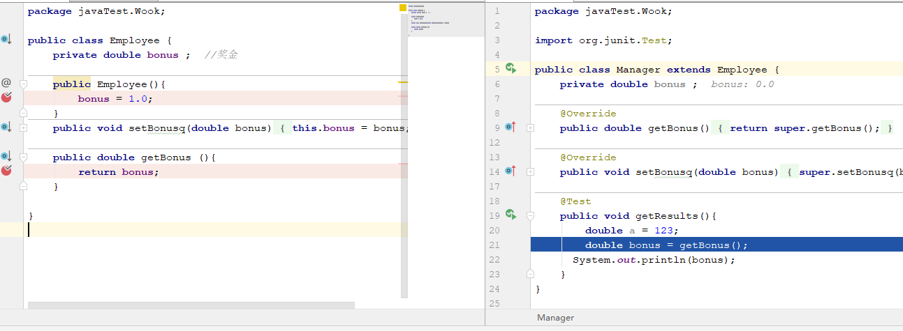
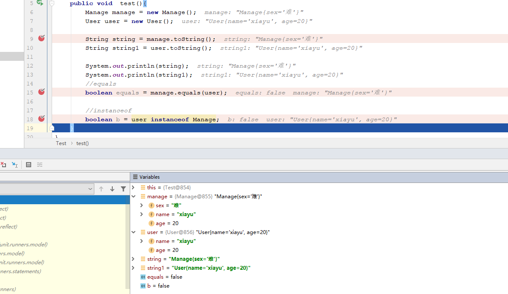
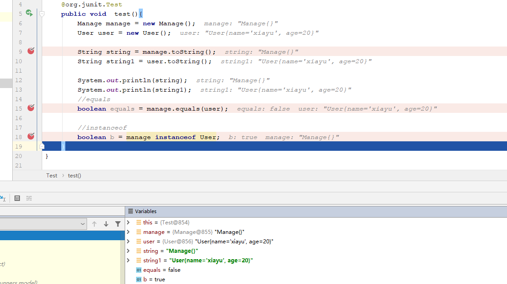
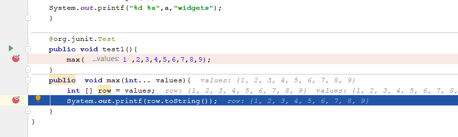

## 类，超类，子类

### 定义子类  覆盖方法

关键字 extends 标识继承。

extends表示正在构建一个新类派生于一个已经存在的类，已经存在的类称为，父类，基类，超类，新生成的类称为子类。

一般情况下，子类时对父类功能的扩充。




一些方法子类不一定适用，需要修改时，只需要用 super.方法名 把父类的方法拿过来，自己修改即可。

一个父类可以有多个子类，但是一个子类只能有一个父类。

警告   在覆盖方法的时候，子类方法的可见性必须高于父类方法的可见性。

子类也无法访问超类的私有域。

### 多态

在Java中，每个对象的状态是多态的，每个子类的对象同时也是超类的对象。

在对方法调用的时候，需要获得方法的签名。 方法的签名 =  方法的名称 + 方法的参数列表；

### 方法的调用过程

x.f(args)  x为一个类的对象，

1. 编译器查看声明的类型和方法名，分析方法名和方法的参数列表。

2. 编译器查看调用方法时提供的参数类型，如果有条件匹配的，就选择这个方法，如果没有，就开始考虑类型转换，子类父类对象转换，int转成double等等，如果没有找到匹配的，或者这个转换后的有多个类型与之匹配就会报错。

3. 如果方法时 private  static  final 或者构造器类型，编译器可以直接准确的知道时哪个方法。

4. 程序运行时，如果时动态绑定的情况，虚拟机调用合适方法，优先自己的类，再考虑子类中的方法，依次类推，每次调用时间开销相当大。虚拟机预先创建一个对照表，缓解这个压力


### 阻止继承： final 类和方法

在定义类和方法的时候使用到了final 就表明这个时final类，不允许扩展。

子类在继承的时候不能覆盖期中的方法

### 强制类型转换

```java
double x = 23.123;
int nx = (int) x;
```

如果类型转换出现了问题就会报  ClassCastException 的异常

判断是否能够转换

```java
类型1 instanceof 类型2   //类型2是一个类不是一个对象
```


+ 只能在继承层次内进行类型转换
+ 在超类转换成子类的时候，先用instanceof检验

### 抽象类

关键词 abstract

```java
public abstract class Name{
    public abstract String setname(){
        //抽象方法
    }
}
```

一般情况下，认为抽象类中不包含，具体方法。

抽象类不能被实例化

### protected

只有本类或者是子类可以访问

## Object

Object是所有类的超类，Java中每个类都是由他扩展而来的。

可以用Object类型的变量来引用任何类型的对象。

### equals方法  和  hashCode方法   和 toString()

#### equals

用于检测一个对象是否等于另一个对象(物理地址)，在Object中判断这两个对象是否有相同的引用。

在子类中定义equals方法时，首先调用超类中的equals

__instanceof __  表示    拿着一个对象来判断这个对象是否属于这个类。语言上是否一致，并不关心数据

这里我们创建了一个类继承了另外一个类并添加了一条属性发现equals和instanceof都为false

   

当我们没有添加属性时，发现equals 返回的仍然时false,而instanceof返回的时true。



 equals 
public boolean equals(Object obj)指示其他某个对象是否与此对象“相等”。 
equals 方法在非空对象引用上实现相等关系： 

+ 自反性：对于任何非空引用值 x，x.equals(x) 都应返回 true。 
+ 对称性：对于任何非空引用值 x 和 y，当且仅当 y.equals(x) 返回 true 时，x.equals(y) 才应返回 true。 
+ 传递性：对于任何非空引用值 x、y 和 z，如果 x.equals(y) 返回 true，并且 y.equals(z) 返回 true，那么 x.equals(z) 应返回 true。 
+ 一致性：对于任何非空引用值 x 和 y，多次调用 x.equals(y) 始终返回 true 或始终返回 false，前提是对象上 equals 比较中所用的信息没有被修改。 
+ 对于任何非空引用值 x，x.equals(null) 都应返回 false。 
+ Object 类的 equals 方法实现对象上差别可能性最大的相等关系；即，对于任何非空引用值 x 和 y，当且仅当 x 和 y 引用同一个对象时，此方法才返回 true（x == y 具有值 true）。   

编写完美equals的建议

1. 显示参数命名为otherObject

2. 检测this与other是否引用同一个对象 `if (this = otherObject) return true;`

3. 检测otherObject是否为null `if (otherObject == null) return false;`

4. 比较this与otherObject是否属于同一类

   如果equals的语义在每个子类中有改变，用getClass检测 `if (getClass() != otherObject.getClass()) return false;`

   如果所有的子类都有同一的语义，用instanceof检测 `if (!(otherObject instanceof ClassName)) return false;`

5. 将otherObject转换为相应的类类型变量 `ClassName other = (ClassName) otherObject;`

6. 对需要比较的域进行比较

   基本类型域用==比较 `field1 == other.field1;`

   对象域用equals比较 `Objects.equals(field2, other.field2)`

```java
	return field1 == other.field1
		&& Objects.equals(field2, other.field2)
		&& ...;

```

如果在子类中重新定义 equals, 就要在其中包含调用 super.equals(other)

+ static Boolean equals(type[] a,type[] a,)  两个元素大小相同相同位置上的参数也相等返回true
+ static boolena equals(Object a, Object b)   a,b为null 返回true,ruguo you y

#### hashCode  散列码

散列码是由对象导出的一个整形值，保存在内存级别的,非稳定性。

__Integer__

+ int hashCode()  返回对象的散列码，任意整数，两个相等的对象要求散列码相同
+ static int hash(Object  ......)  返回一个散列码，又多个对象组合提供
+ static int hashCode(Object a) 返回一个散列码，如果a 为null则返回0，否则a.hashCode()
+ static int hashCode(int|long......)返回给定值的散列码
+ static int hashCode(type[])  返回数组的散列值

#### toString 

返回对象值的字符串，

__Integer__

+ Calss gitClass()   返回对象值得类对象
+ toString()  返回对象值的描述
+ String getName() 返回对象值的类名
+ String getSuerclass()返回对象值的超类信息

## 泛型数组列表

ArryaList<>;  可变长数组。  

__原理__

数组列表管理这对象的内部数组，当数组空间被用尽的时候，再次add时数组列表就自动的创建一个更大的数组，并将数据从小的里面拷贝的新建的大的里面。

__ArryList<E>__

+ ArrayList<E>()   构造一个数组
+ ArrayList<E>(int i)   构造一个数组，初始容量
+ boolenan add( E obj)  再数组的后边添加一个数组，永远返回true 。 E 添加的位置，obj添加的对象
+ int size () 返回大小
+ void ensureCapacity(int a) ，构造一个数组，赋予大小，大小固定
+ void trimToSize() 数组列表削减到当前的尺寸

__访问数组__

__ArryList<E>__

+ void set(int ,obj)  操作数组的一个元素，覆盖这个值， 
+ E get(int)  获得指定位置的元素
+ void add(int ,obj)向指定位置插入元素，后面的元素依次后移
+ E remove(int) 移除指定位置的元素，返回移除元素的值

### 对象包装器与自动装箱

有时候需要基础类型转换为对象，所有基本类型都有对应的对象类。这些对象包装类分别是：Integer、Long、Float、Double、Short、Byte、Character、Void和Boolean。

　对象包装类是不可变的，即一旦构造了包装器，就不允许更改包装在其中的值。同时，对象包装器类还是final，因此不能定义它们的子类。

由于每个值分别包装在对象中，所以ArrayList<Integer>的效率远远低于int[] 数组。因此，可以用来构造小型数组，因为此时操作方便性比执行效率更加重要。

在对基本包装类进行操作时，会进行自动装箱，或者自动拆箱

```java
ArrayList<Integer> list = new ArrayList<>();
int a= 1;
list.add(a);  //自动装箱
int b = list.get(0);  //自动拆箱
```

__Integer__

+ `int intValue()`
  以int的形式返回Integer对象的值（在Number类中覆盖了intValue方法。）
+ `static String toString(int i)`
  以一个新String对象的形式返回给定数值i的十进制表示。
+ `static String toString(int i, int radix)`
  返回数值i的基于给定radix参数进制的表示。
+ `static int parseInt(String s)`
  `static int parseInt(String s, int radix)`
  返回字符串s表示的整型数值，给定字符串表示的是十进制的 整数（第一种方法）或者返回radix参数进制的整数（第二种方法）
+ `static Integer valueOf(String s)`
  `static Integer valueOf(String s, int radix)`
  返回用s表示的整型数值进行初始化后的一个新Integer对象，给定字符串表示的是十进制的整数（第一种方法），或者是radix参数进制的整数（第二种方法）

__NumberFormat__

+ Number parse(String s)返回数值，假设给定的s表示了一个数值。

## 参数数量可变的方法

可变参数的方法

一个格式时字符串，另一个格式时Object[]数组

```java
  public PrintStream printf(String format, Object ... args) {
        return format(format, args);
    }
```



```java
   public void test1(){
        max( 1 ,2,3,4,5,6,7,8,9);
    }
    public  void max(int... values){
        int [] row = values;
        System.out.printf(row.toString());
    }
```


## 枚举类 enum

在比较枚举类的时候，不能使用queals ,用 ==。

所有的枚举类都是Enum的子类。

```java
public class Dome {
    public static void main(String[] args) {
        Size size = Enum.valueOf(Size.class, "EXTRA_LARGE");
        System.out.println("size=" + size);
        System.out.println("abbreviation=" + size.getAbbreviation());
        if (size == Size.EXTRA_LARGE)
            System.out.println("Good job--you paid attention to the _.");
    }
}

enum Size {
    SMALL("S"), MEDIUM("M"), LARGE("L"), EXTRA_LARGE("XL");
    private String abbreviation;

    private Size(String abbreviation) {
        this.abbreviation = abbreviation;
    }

    public String getAbbreviation() {
        return abbreviation;
    }
}
```

使用实例

设置枚举

```java
public enum SeniorHigh {
    ONE_GRADE(10,"高一"),
    TWO_GRADE(11,"高二"),
    THREE_GRADE(12,"高三");

    private int index;
    private String grade;
    SeniorHigh(int index, String grade) {
        this.index = index;
        this.grade = grade;
    }
    public int getIndex(){
        return this.index;
    }
    public String getGrade(){
        return this.grade;
    }
}
```

使用实例

```java
import com.yunhenedu.user.enums.SeniorHigh;//导入
//设定高中年级
if (Integer.valueOf(1).equals(param.getHighSchool())) {
    check = false;
    //获取高中年级枚举
    SeniorHigh[] seniorHighs = SeniorHigh.values();
    for (SeniorHigh seniorHigh : seniorHighs) {
        //获取年级编号
        String gradeCode = schoolCode + seniorHigh.getIndex();
        //追加设定年级
        gradeVos.add(getGrade(gradeCode, seniorHigh.getGrade(), vo, PHASE_THREE, seniorHigh.getIndex()));
    }
}
```

| 返回类型                      | 方法名称                                         | 方法说明                                                     |
| ----------------------------- | ------------------------------------------------ | ------------------------------------------------------------ |
| `int`                         | `compareTo(E o)`                                 | 比较此枚举与指定对象的顺序                                   |
| `boolean`                     | `equals(Object other)`                           | 当指定对象等于此枚举常量时，返回 true。                      |
| `Class<?>`                    | `getDeclaringClass()`                            | 返回与此枚举常量的枚举类型相对应的 Class 对象                |
| `String`                      | `name()`                                         | 返回此枚举常量的名称，在其枚举声明中对其进行声明             |
| `int`                         | `ordinal()`                                      | 返回枚举常量的序数（它在枚举声明中的位置，其中初始常量序数为零） |
| `String`                      | `toString()`                                     | 返回枚举常量的名称，它包含在声明中                           |
| `static<T extends Enum<T>> T` | `static valueOf(Class<T> enumType, String name)` | `返回带指定名称的指定枚举类型的枚举常量。`                   |

## 反射

反射的原理

```java
private static void reflection() throws ClassNotFoundException, IllegalAccessException, InstantiationException, InvocationTargetException, NoSuchMethodException {
        Class aClass = Class.forName("com.xiayu.params.User");
        //创建一个构造器  如果需要反射的方法有构造方法，需要提前设置参数类型
        Constructor constructor = aClass.getConstructor(String.class, String.class);
        User o = (User)constructor.newInstance("xiayu","123456");
        System.out.println(o);
    }
```


**运行状态中，对于任意一个类，都能够知道这个类的所有属性和方法**

- **获得类相关的方法**

| 方法                       | 用途                                                   |
| -------------------------- | ------------------------------------------------------ |
| asSubclass(Class<U> clazz) | 把传递的类的对象转换成代表其子类的对象                 |
| Cast                       | 把对象转换成代表类或是接口的对象                       |
| getClassLoader()           | 获得类的加载器                                         |
| getClasses()               | 返回一个数组，数组中包含该类中所有公共类和接口类的对象 |
| getDeclaredClasses()       | 返回一个数组，数组中包含该类中所有类和接口类的对象     |
| forName(String className)  | 根据类名返回类的对象                                   |
| getName()                  | 获得类的完整路径名字                                   |
| newInstance()              | 创建类的实例                                           |
| getPackage()               | 获得类的包                                             |
| getSimpleName()            | 获得类的名字                                           |
| getSuperclass()            | 获得当前类继承的父类的名字                             |
| getInterfaces()            | 获得当前类实现的类或是接口                             |

- **获得类中属性相关的方法**

| 方法                          | 用途                   |
| ----------------------------- | ---------------------- |
| getField(String name)         | 获得某个公有的属性对象 |
| getFields()                   | 获得所有公有的属性对象 |
| getDeclaredField(String name) | 获得某个属性对象       |
| getDeclaredFields()           | 获得所有属性对象       |

- **获得类中注解相关的方法**

| 方法                                            | 用途                                   |
| ----------------------------------------------- | -------------------------------------- |
| getAnnotation(Class<A> annotationClass)         | 返回该类中与参数类型匹配的公有注解对象 |
| getAnnotations()                                | 返回该类所有的公有注解对象             |
| getDeclaredAnnotation(Class<A> annotationClass) | 返回该类中与参数类型匹配的所有注解对象 |
| getDeclaredAnnotations()                        | 返回该类所有的注解对象                 |

- **获得类中构造器相关的方法**

| 方法                                               | 用途                                   |
| -------------------------------------------------- | -------------------------------------- |
| getConstructor(Class...<?> parameterTypes)         | 获得该类中与参数类型匹配的公有构造方法 |
| getConstructors()                                  | 获得该类的所有公有构造方法             |
| getDeclaredConstructor(Class...<?> parameterTypes) | 获得该类中与参数类型匹配的构造方法     |
| getDeclaredConstructors()                          | 获得该类所有构造方法                   |

- **获得类中方法相关的方法**

| 方法                                                       | 用途                   |
| ---------------------------------------------------------- | ---------------------- |
| getMethod(String name, Class...<?> parameterTypes)         | 获得该类某个公有的方法 |
| getMethods()                                               | 获得该类所有公有的方法 |
| getDeclaredMethod(String name, Class...<?> parameterTypes) | 获得该类某个方法       |
| getDeclaredMethods()                                       | 获得该类所有方法       |

- **类中其他重要的方法**

| 方法                                                         | 用途                             |
| ------------------------------------------------------------ | -------------------------------- |
| isAnnotation()                                               | 如果是注解类型则返回true         |
| isAnnotationPresent(Class<? extends Annotation> annotationClass) | 如果是指定类型注解类型则返回true |
| isAnonymousClass()                                           | 如果是匿名类则返回true           |
| isArray()                                                    | 如果是一个数组类则返回true       |
| isEnum()                                                     | 如果是枚举类则返回true           |
| isInstance(Object obj)                                       | 如果obj是该类的实例则返回true    |
| isInterface()                                                | 如果是接口类则返回true           |
| isLocalClass()                                               | 如果是局部类则返回true           |
| isMemberClass()                                              | 如果是内部类则返回true           |

## 继承的设计技巧

1. 将公告操作和域放在超类
2. 不要使用收保护的域
3. 使用继承实现“is -a”关系      注意关系不要滥用继承
4. 除法所有继承的方法都有意义，不然不使用继承       
5. 在覆盖方法的时候，不要改变预期的行为
6. 使用多态，而非类型信息