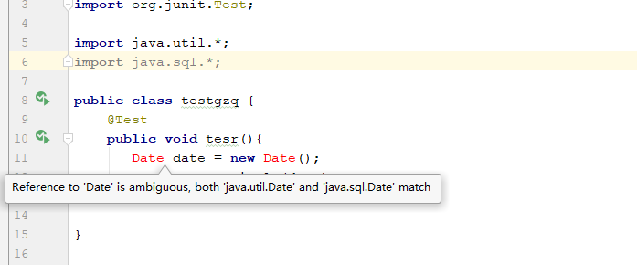

## Java 对象和类

Java作为一种面向对象语言。支持以下基本概念：

- 多态
- 继承
- 封装
- 抽象
- 类
- 对象
- 实例
- 方法
- 重载

本节我们重点研究对象和类的概念。

- **对象**：对象是类的一个实例（**对象不是找个女朋友**），有状态和行为。例如，一条狗是一个对象，它的状态有：颜色、名字、品种；行为有：摇尾巴、叫、吃等。
- **类**：类是一个模板，它描述一类对象的行为和状态。

### Java中的对象


现在让我们深入了解什么是对象。看看周围真实的世界，会发现身边有很多对象，车，狗，人等等。所有这些对象都有自己的状态和行为。

拿一条狗来举例，它的状态有：名字、品种、颜色，行为有：叫、摇尾巴和跑。

对比现实对象和软件对象，它们之间十分相似。

软件对象也有状态和行为。软件对象的状态就是属性，行为通过方法体现。

在软件开发中，方法操作对象内部状态的改变，对象的相互调用也是通过方法来完成。

### 创建对象

对象是根据类创建的。在Java中，使用关键字new来创建一个新的对象。创建对象需要以下三步：

- **声明**：声明一个对象，包括对象名称和对象类型。
- **实例化**：使用关键字new来创建一个对象。
- **初始化**：使用new创建对象时，会调用构造方法初始化对象。

下面是一个创建对象的例子：

```java
public class Puppy{
   public Puppy(String name){
      //这个构造器仅有一个参数：name
      System.out.println("小狗的名字是 : " + name ); 
   }
   public static void main(String[] args){
      // 下面的语句将创建一个Puppy对象
      Puppy myPuppy = new Puppy( "tommy" );
   }
}
```


### Java中的类

类可以看成是创建Java对象的模板。

通过下面一个简单的类来理解下Java中类的定义：

一个类可以包含以下类型变量：

- **局部变量**：在方法、构造方法或者语句块中定义的变量被称为局部变量。变量声明和初始化都是在方法中，方法结束后，变量就会自动销毁。
- **成员变量**：成员变量是定义在类中，方法体之外的变量。这种变量在创建对象的时候实例化。成员变量可以被类中方法、构造方法和特定类的语句块访问。
- **类变量**：类变量也声明在类中，方法体之外，但必须声明为static类型。

## 自定义方法

### 构造方法

每个类都有构造方法。如果没有显式地为类定义构造方法，Java编译器将会为该类提供一个默认构造方法。

在创建一个对象的时候，至少要调用一个构造方法。构造方法的名称必须与类同名，一个类可以有多个构造方法。

下面是一个构造方法示例：

```java
public class Puppy{
    public Puppy(){
    }
 
    public Puppy(String name){
        // 这个构造器仅有一个参数：name
    }
}
```

### 预定义类

```java
//构造器
//构造器的名字应该与类名相同
new Date()    //创造一个新的对象，这个对象默认时间为当前时间
String xu;   //这里xu只是一个对象变量，并不是一个对象，不能引用String的方法
// xu  在使用前必须实例化，用构造器构造出一个String类型的对象
xu = new String();
//或者
xu = dateStirng;


```


### 权限访问

| 访问权限  | 本类 | 本包的类 | 子类 | 非子类的外包类 |
| --------- | ---- | -------- | ---- | -------------- |
| public    | 是   | 是       | 是   | 是             |
| protected | 是   | 是       | 是   | 否             |
| default   | 是   | 是       | 否   | 否             |
| private   | 是   | 否       | 否   | 否             |

### Java的final实例域

可以将实例域定义为final。构建对象时必须初始化这样的域。意思就是，必须确保在每个构造器执行后，这个域的值被设置，并且在后面的操作中，不能对他进行改变。例如将某类的name声明为final，构建对象后，不可更改，即没有setname方法。

fianl修饰符大多数应用基本的类型域，或者不可变类的域中的每个方法都不会改变其对象，这种类是不可变类。


## 静态域与静态方法

### 静态域

如果将域定义为static,每个类中只有一个这样的域，但是验证可以有多个，这个类的所有对象将共享这个域，这个域称为静态域。
这个域属于类，而不属于任何独立的对象。


### 静态常量

```java
public static  final  int i = 123213123;
    public static void main(String ago[]) throws IOException {
          int i1 =  i;
    }
```


### 静态方法

静态方法是一种不能面对对象的方法，

需要用       __类名.方法名__  来进行调用 

非静态方法是通过   __对象.方法__


1.静态内部类跟静态方法一样，只能访问静态的成员变量和方法，不能访问非静态的方法和属性，但是普通内部类可以访问任意外部类的成员变量和方法

2.静态内部类可以声明普通成员变量和方法，而普通内部类不能声明static成员变量和方法。

3.静态内部类可以单独初始化

### main方法

在Java中，main()方法是Java应用程序的入口方法，public static void main(String args[])。必须这么定义，这是Java的规范。、main()方法中可以throw Exception因此main()方法中可以抛出异常，

需要注意，不需要使用对象调用静态方法。

main方法不对任何对象进行操作。

## 方法参数

在程序设计语言中，关于方法参数的传递有很多种，按值调用，引用调用，按名调用。等等

Java用的是按值调用。

+ 一个方法不能修改一个基本数据类型的参数
+ 一个方法可以改变一个对象参数的状态
+ 一个方法不能让对象参数引用另一个新的对象

## 对象构造

### 重载

重载是指不同的函数使用相同的函数名，但是函数的参数个数或类型不同。调用的时候根据函数的参数来区别不同的函数。

Java允许重载任何参数，不只是构造器。

### 无参构造器

每个类都会有一个构造器，如果没有编写，系统会提供一个无参构造器，这个构造器将所有的实例域设置为默认值，数值类型的为0，布尔型为false,对象设置为null.

__注意__

+ 每个类只有没有创造构造器的时候，系统才会生成一个无参构造器
+ 当写了一个构造器的时候，一定要写一个无参构造器（这时候你希望赋予所有属性初始值 public ClassName()}）

构造器可以简单的理解为，

### 初始化模块

初始化的方法

+ 在构造器中设置值
+ 在声明中赋值

还有第三种

```java
 	private static  int nextId = 123;
    private int id;

    {
        id = nextId ;
    }

	//静态的初始化模块
	{
        id = nextId ;
    }
```

调用构造器的具体步骤：

1. 所有数据域被初始化为默认值（0 false null）
2. 按照在类声明中的次序，依次执行，所有的__域初始化语句，初始化模块__
3. 执行构造器

## 包   类  类路径

Java允许使用包（package）将类组织起来，进行管理。从编译角度上来讲，嵌套的包之间没有任何关系。

### 类的导入

```java
import java.io.*;//导入io下的所有类。当然如果能够明确的指明导入的类有助于阅读。
```

有些特定的类需不能用 *

```java
import java.util.*;
import java.sql.*;
```



同时导进去两个，程序会不知道应该使用哪个。

如果必须使用两个的话在声明的时候需要在前面加上完整的类名。

```java
java.util.Date date = new java.util.Date();
```

### 包的作用域

+ public  随意调用
+ private 只能被定义的类使用。

### 类路径

类的路径必须与包名匹配，

__符合含义__

+ : 	在UNIX环境中，不同的项目用 ：分割；
+ ；   在Windows中用;分割不同项目
+ .      在以上两种系统中.表示当前目录
+ *在Windows中，是拓展。但是在UNIN中不适用
+ -classpath 指定类的路径

在虚拟机开始运行时，首先查找jre/lib和jre/lib/ext目录下面的系统文件类，没有的话再查看类路径。

## 注释

+ 比较专业的注释    开始/**      /** *  */

+ 快速注释 		/**/

+ 单行注释     //

### 类注释

类注释一般卸载 import 语句之后，再类的定义之前。

```java
import java.util.*;
/**
 * @Package: com.yunhenedu.questioncenter.service.impl
 * @Description： TODO
 * @Author: zhouaidong
 * @Date: 2019/9/25 2:24 下午
 */
@Service
public class SyncQuesServiceImpl
```

没有必要每行开始都要用*

### 方法注释

开始  /**

+ @param 变量描述
+ @return 返回值描述
+ @throws 异常描述

再使用描述时可以用HTML标记

Javadoc 标签

| **标签**      |                        **描述**                        |                           **示例**                           |
| :------------ | :----------------------------------------------------: | :----------------------------------------------------------: |
| @author       |                    标识一个类的作者                    |                     @author description                      |
| @deprecated   |                 指名一个过期的类或成员                 |                   @deprecated description                    |
| {@docRoot}    |                指明当前文档根目录的路径                |                        Directory Path                        |
| @exception    |                  标志一个类抛出的异常                  |            @exception exception-name explanation             |
| {@inheritDoc} |                  从直接父类继承的注释                  |      Inherits a comment from the immediate surperclass.      |
| {@link}       |               插入一个到另一个主题的链接               |                      {@link name text}                       |
| {@linkplain}  |  插入一个到另一个主题的链接，但是该链接显示纯文本字体  |          Inserts an in-line link to another topic.           |
| @param        |                   说明一个方法的参数                   |              @param parameter-name explanation               |
| @return       |                     说明返回值类型                     |                     @return explanation                      |
| @see          |               指定一个到另一个主题的链接               |                         @see anchor                          |
| @serial       |                   说明一个序列化属性                   |                     @serial description                      |
| @serialData   | 说明通过writeObject( ) 和 writeExternal( )方法写的数据 |                   @serialData description                    |
| @serialField  |             说明一个ObjectStreamField组件              |              @serialField name type description              |
| @since        |               标记当引入一个特定的变化时               |                        @since release                        |
| @throws       |                 和 @exception标签一样.                 | The @throws tag has the same meaning as the @exception tag.  |
| {@value}      |         显示常量的值，该常量必须是static属性。         | Displays the value of a constant, which must be a static field. |
| @version      |                      指定类的版本                      |                        @version info                         |

## 类的设计技巧

### 一定要保证数据私有

绝对不要破坏数据的封装性，不要为了方便，保持数据的私有性。

### 一定要对数据初始化

Java不对局部变量初始化，但是会对对象的实例域初始化，我们不应该依赖系统的默认，设置成隐形。

### 不要再类中过多的使用基本类型

### 不是所有的域都需要独立的域访问器和域更改器

### 将职责过多的类进行分解

### 类名和方法名要能够具体的体现职责

### 优先使用不可变类

