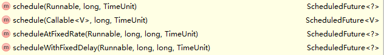
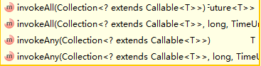
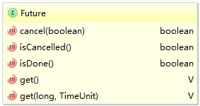
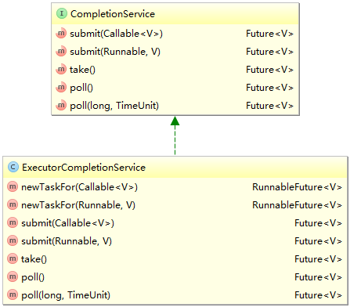

## 并发

Java 给多线程编程提供了内置的支持。 一条线程指的是进程中一个单一顺序的控制流，一个进程中可以并发多个线程，每条线程并行执行不同的任务。

多线程是多任务的一种特别的形式，但多线程使用了更小的资源开销。

这里定义和线程相关的另一个术语 - 进程：一个进程包括由操作系统分配的内存空间，包含一个或多个线程。一个线程不能独立的存在，它必须是进程的一部分。一个进程一直运行，直到所有的非守护线程都结束运行后才能结束。

多线程能满足程序员编写高效率的程序来达到充分利用 CPU 的目的。


- 新建状态:

  使用 **new** 关键字和 **Thread** 类或其子类建立一个线程对象后，该线程对象就处于新建状态。它保持这个状态直到程序 **start()** 这个线程。

- 就绪状态:

  当线程对象调用了start()方法之后，该线程就进入就绪状态。就绪状态的线程处于就绪队列中，要等待JVM里线程调度器的调度。

- 运行状态:

  如果就绪状态的线程获取 CPU 资源，就可以执行 **run()**，此时线程便处于运行状态。处于运行状态的线程最为复杂，它可以变为阻塞状态、就绪状态和死亡状态。

- 阻塞状态:

  如果一个线程执行了sleep（睡眠）、suspend（挂起）等方法，失去所占用资源之后，该线程就从运行状态进入阻塞状态。在睡眠时间已到或获得设备资源后可以重新进入就绪状态。可以分为三种：

  - 等待阻塞：运行状态中的线程执行 wait() 方法，使线程进入到等待阻塞状态。
  - 同步阻塞：线程在获取 synchronized 同步锁失败(因为同步锁被其他线程占用)。
  - 其他阻塞：通过调用线程的 sleep() 或 join() 发出了 I/O 请求时，线程就会进入到阻塞状态。当sleep() 状态超时，join() 等待线程终止或超时，或者 I/O 处理完毕，线程重新转入就绪状态。

- 死亡状态:

  一个运行状态的线程完成任务或者其他终止条件发生时，该线程就切换到终止状态。exits

## 状态和一些方法

### __线程的状态__（Java核心技术提出的）

+ New (新建)
+ Runnable(可执行)
+ Blocked(被阻塞)
+ Waiting(等待)
+ Timed waiting (计时等待)
+ Terminated(被终止)

### 基础方法

#### 创建一个线程

Java 提供了三种创建线程的方法：

- 通过实现 Runnable 接口；
- 通过继承 Thread 类本身；
- 通过 Callable 和 Future 创建线程。

----

__java.lang.Thread 1.0__

+ static void sleep (long millis) 休眠给定参数。 millis 休眠的时间毫秒
+ Thread  (Runnable target) 创造一个新的线程，用于调用给定目标的run()方法
+ void start() 启动这个线程，将引发调用run()方法，这个方法将立即返回，并且新线程将并发运行
+ void run()  调用管理Runnable的run方法。

__java.lang.Runnable 1.0__

+ void run() 必须覆盖这个方法，并在这个方法种提供所要执行的任何指令

### 中断

__java.lang.Thread 1.0__

+ void interrupt() 线程中断请求，线程的中断状态我true，如果目前线程被一个sleep阻塞则抛出InterruptedException()异常
+ static boolean interrupted() 测试当前线程，是否被中断，并将状态重置为false
+ boolean isInterrupted() 测试线程是否被终止，不改变线程状态
+ static Thread currentThread() 返回代码当前线程的Thread对象

### 终止

__java.lang.Thread 1.0__

+ void join() 等待终止指定的线程
+ void join(long millis) 等待终止的指定线程，经过指定的毫秒数
+ Thread.State getState() 返回线程的状态

### 优先级

__java.lang.Thread 1.0__

+ void setPriority( int newPririty) 设置线程的优先级
+ static int Min_PRINRITY 设置最小优先级1
+ static int NORM_PRIORITY 设置默认优先级5
+ static int MAX_PRIORITY 设置最高优先级10
+ static void yield()  暂停当前正在执行的线程对象，并执行其他线程。 

### 线程守护

线程守护为其他线程提供服务的线程

__java.lang.Thread 1.0__

+ void setDaemon(boolean inDaemon) 表示该线程为守护线程或者用户线程，这一方法必须在启用线程的前面

### 未捕获异常处理

线程的run方法不能抛出任何受检查异常，但是非受检查异常会刀子线程终止，这时线程就死亡。线程不需要使用catch子句来处理可以被传播的异常，相反，就在线程死亡前，异常被传递到一个用未捕获异常的处理器。Thread.UncaughtExceptionHandler接口的类，这个接口只有一个方法

void uncaughtException(Thread t , Throwable e)

可以用setUncaughtExceptionHandler方法为任何线程安装一个处理器，也可以用setDefaulUncaughtExceptionHandler为所有线程安装一个默认的处理器，替换原来的（默认为空的时候，此时处理器就是线程的ThreadGroup对象）

ThreadGroup类实现了，Thread.UncaughtExceptionHandler接口，他的uncaughtException方法如下操作：

1. 如果线程组有父线程组，那么线程组的uncaughException方法被调用
2. 否则，如果Thread。getDefaulUncaughtExceptionHandler()返回一个非空的处理器，则调用该处理器
3. 否则，如果线程Thrieable是ThreadDeath的一个实例，s什么都不做。
4. 否则，线程的名字和Throwable的轨迹被输出到System.err上

__java.lang.Thread 1.0__

+ static void setDefaultuncaughtExceptionHandler(Thread.UncaughtExceptionHandler handler )
+ static Thread.UncaughtExceptionHandler getDefaultuncaughtExceptionHandler  设置或者获取未捕获异常的默认处理器
+ void setUncaughtExceptionHandler (Thread.UncaughtExceptionHandler handler)
+ Thread.UncaughtExceptionHandler getUncaughtExceptionHandler()设置或获取未捕获异常的处理器，如果没有安装处理器，返回线程组对象作为处理器

__java.lang.Thread.UncaughtExceptionHandler __

+ void uncaughtException(Thread t , Throwable e)  当一个线程因为未捕获异常而终止时，按照规定将客户报告记录到日志种  参数 t   有与未捕获异常而终止的对象  e   未捕获的异常对象

__java.lang.ThreadGroup__

+ void uncaughtException(Thread t , Throwable e) 如果有夫线程，条用浮现出组的这一个方法，或者，如果Thread类有迷人处理器，调用该处理器，否则输出栈轨机到错误标准流上

### __注意__

1. 不要调用Thread类或者Runnable对象的run方法，直接调用run，指挥执行同一个线程种的任务，不会启动新的线程，应该调用Trhead.satrt方法，这个方法将传教一个直接run方法的新线程。
2. 守护线程为其他线程提供服务，当没有线程使用守护线程，守护线程也将结束。守护线程不应该访问任何固有的资源，因为在任何时刻，守护线程都有可能终止
3. 在线程管理的时候引入了线程组的概念，线程组是一个可以统一管理线程的集合，默认所有情况下，创建的线程属于同一个线程组

```java
  Runnable r = () -> { 
         try
         {  
            for (int i = 1; i <= STEPS; i++)
            {
               ball.move(comp.getBounds());
               comp.repaint();
               Thread.sleep(DELAY);
            }
         }
         catch (InterruptedException e)
         {
         }
      };
      Thread t = new Thread(r);
      t.start();
   }
```

## 同步

在大多数的时候，多个线程会对同一个资源进行操作，每个线程都调整用了一个修改和对象状态的方法，就会产生问题。

### 锁对象（Lock）

为了防止代码块受并发访问的干扰，Java提供了，synchronized，锁，当一个线程占用了这个资源，其他线程想要访问这个资源就必须等待上一个线程释放。

```java
myLock.lock()//锁上
    try{
        //访问资源
    }finally{
        myLock.unlock();//解锁
    }
```

线程之间时互不干扰的

锁是可重入的，在一个线程访问多个有锁的资源时，getTotalBalance方法能调出添加了几层锁。

__java.util.concurrent.locks.Lock__

+ void lock()  上锁，另一个资源来了就发生阻塞
+ vodi unlock ()   释放锁

__java.util.centurrent,local.ReentrantLock__

+ ReentrantLock()  构建一个可以被用来保护临界去的可重入锁
+ ReentrantLock(boolean fair) 构建一个带公平策略的锁，策略是谁等待的时间长就，优先启用谁。

### 条件对象（Condition）

在临界区中，给一些线程中添加条件，

__java.util.concurrent.locks.Lock 5.0__

+ Condition newCondition() 返回一个与该锁相关的条件对象

__java.utile.concurrent.locks.Condition__

+ void await()  将该线程放入条件等待集中
+ void signalAll() 解除该条件的等待集中的所有线程的阻塞状态
+ void signal() 从该条件的等待集中随机选择一个线程，解除器阻塞状态

###  synchronized关键字

总结锁Lock和条件Condition的关键处

+ 锁可以用来保护代码片段，任何时刻只能有一个线程执行被保护的代码
+ 锁也可管理试图进入被保护代码段的线程
+ 锁可以用于一个或者多个相关的条件对象。
+ 每个条件对象只能管理那些已经进入被保护的代码段中但是还不能运行的线程

在java 1.0 中引入了synchronized 每个对象都有一个内部锁，如果一个方法用synchronized关键字声明，那么对象的锁将保护整个方法，也就是说，要调用该方法，线程必须获得内部的对象锁。

```java
public synchronized void method(){
    method body
}
//等价于
public void method(){
    this.intrinsicLock.lock();
    try{
        method body
    }
    finally{
        this.intrinsicLock.unlock();
    }
}
```

Java中每一个对象都可以作为锁，这是synchronized实现同步的基础：

1. 普通同步方法（实例方法），锁是当前实例对象 ，进入同步代码前要获得当前实例的锁
2. 静态同步方法，锁是当前类的class对象 ，进入同步代码前要获得当前类对象的锁
3. 同步方法块，锁是括号里面的对象，对给定对象加锁，进入同步代码库前要获得给定对象的锁。

__内部锁和条件的局限性__

1. 不能中断一个试图获得锁的线程
2. 试图获得锁是不能设定超时
3. 每个锁只有单一的条件，可能是不够的

在锁的问题上的一些建议：

1. 最好不使用Lock/Condition也不使用 synchronized 关键字，可以使用 java.util.concurrent包中的一种机制，他会为你提供各种机制，后面会讲
2. 如果synchrionized关键字适合你的程序，那么尽量使用他
3. 如果提别需要Lock/Condition结构提供的特有性，才使用它

__java.lang.Object 1.0__

+ void notifyAll() 解除那些在该对象上调用wait方法的现在阻塞状态，该方法只能在同步方法或者同步块内部调用，如果线程不是对象锁的持有者，该方法抛出IllegaMonitorStateException异常（监控状态异常）

+ void notify()  随机挑一个在放对象的wait方法的线程，接触阻塞状态，该方法只能在同步方法或者同步块内部调用，如果线程不是对象锁的持有者，该方法抛出IllegaMonitorStateException异常（监控状态异常）

+ void wait() 导致线程进入等待状态，知道他被通知，该该方法只能在同步方法或者同步块内部调用，如果线程不是对象锁的持有者，该方法抛出IllegaMonitorStateException异常（监控状态异常）

+ void wait(long millis) 

+ void wait(long millis, int nanos)  导致线程进入等待状态直到他被通知或者经过指定的时间，这些方法只能在同步方法或者同步块内部调用，如果线程不是对象锁的持有者，该方法抛出IllegaMonitorStateException异常（监控状态异常） 

  参数

  millis  毫秒数

  nanos   纳秒数  <1 000 000

__synchronized 锁对象问题__

synchronized从锁的是谁的维度一共有两种情况：

1. 锁住类
2. 锁住对象实例

1）静态方法上的锁

静态方法是属于“类”，不属于某个实例，是所有对象实例所共享的方法。也就是说如果在静态方法上加入synchronized，那么它获取的就是这个类的锁，**锁住的就是这个类**。

2）实例方法（普通方法）上的锁

实例方法并不是类所独有的，每个对象实例独立拥有它，它并不被对象实例所共享。这也比较能推出，在实例方法上加入synchronized，那么它获取的就是这个累的锁，**锁住的就是这个对象实例**。

__一个栗子__

创建两个资源对象，创建两个线程，分别调用这两个资源对象。发现两个线程都能够同时运行

```java
//资源
public class Demo {
    public synchronized void demo() {
        while (true) {   //synchronized方法内部是一个死循环，一旦一个线程持有过后就不会释放这个锁
            System.out.println(Thread.currentThread());
        }
    }
}
//main方法
public class Main {
    public static void main(String[] args) {
        Demo demo1 = new Demo();
        Demo demo2 = new Demo();
        Thread thread1 = new Thread(new MyThread(demo1));
        Thread thread2 = new Thread(new MyThread(demo2));
        thread1.start();
        thread2.start();
    }
}
//对资源的操作
public class MyThread implements Runnable {
    private Demo demo;

    public MyThread(Demo demo) {
        this.demo = demo;
    }

    @Override
    public void run() {
        demo.demo();
    }
}


```

[参考文章]( https://www.cnblogs.com/yulinfeng/p/11020576.html )

### 阻塞的概念

 **同步阻塞**：你打电话告诉老板你要买《ECMAScript 6入门》这本书，老板拿起电话听你说完就去查书，没有说话，你什么也不知道，在得到任何结果之前，你一直拿着电话干等，你此时什么也干不了。30分钟后老板直接把书送到你家，这时你才挂断电话。每次电话你都要得到结果（书到家）后你才挂断电话，这是同步。你一直拿着电话等结果，这是阻塞。

**同步非阻塞**：你打电话告诉老板你要买《ECMAScript 6入门》这本书，老板拿起电话后说“我不知道有没有货，现在去查”便挂了电话，又过了10分种你第二次打电话说你要买《ECMAScript 6入门》这本书，老板拿起电话说完“还没有查到，你再等会儿”便挂断电话。挂断电话5分钟后老板查到有书，但并没有主动打电话告诉你。你再次等待10分钟后第三次电话老板问结果，老板说“书有了，我给你送到家”，你断挂电话。每次电话你都要得得到结果（去查->还没有查到->有货）后你才挂断电话，这是同步。你每隔10分钟打电话询问结果，这是非阻塞。

**异步阻塞**：你打电话过去问老板有没有《ECMAScript 6入门》这本书，老板说“我不知道有没有货，现在去查，先挂了电话，有结果告诉你，你等我电话”就挂掉电话。等电话期间你什么也不干，老板主动给你发短信通知你结果书有了，5分钟后希望老板现在把书送来，你再次打电话让老板送书，老板马上送书上门。老板主动给你发短信，这是异步。等待老板的短信期间你什么也没干，这是阻塞。

**异步非阻塞**：你打电话过去后问老板有没有《ECMAScript 6入门》这本书，老板说“好的，有货我直接给你送上门”就挂掉电话。然后你想干嘛干嘛，等老板门到后你看书。等待老板主动给你送书上门，这是异步。挂了电话后你就想干嘛干嘛，这是非阻塞。所以一般异步是配合非阻塞使用的，这样才能发挥异步的效用。 

### Volatile域 		final变量 		原子性 	死锁

__Volatile域 __  

vilatile( 挥发性 )关键字为实例域的同步访问提供一种免锁机制，如果声明一个域为volatile那么编译器就指定这个域是可能被另一个线程并发更新的。

例如

这里我们设置一个变量，这个变量被不同的线程调用设置，调用时，需要加锁，这个时候我们可以这样

```java
private boolean done;
public synchronized boolean isDone(){return done};
public synchronized void setDone{done =true;};
```

这个时候如果其他的资源在调用done那么 isDone  setDone将会阻塞。

这个时候我们可以使用 	Volatile

```java
private volatile boolean done;
public  boolean isDone(){return done};
public  void setDone{done =true;};
```

需要注意的时volatile不具备有原子性

__final变量  __

当一个变量声明为final的时候其他线程会在构造函数完成构造后才会看到这个accounts变量，如果不使用final,就不呢个保证其他线程看到的时accounts更新后的值。

__原子性__

即一个操作或者多个操作 要么全部执行并且执行的过程不会被任何因素打断，要么就都不执行。 

__死锁__

产生死锁的必要条件：

1. 互斥条件：进程要求对所分配的资源进行排它性控制，即在一段时间内某资源仅为一进程所占用。
2. 请求和保持条件：当进程因请求资源而阻塞时，对已获得的资源保持不放。
3. 不剥夺条件：进程已获得的资源在未使用完之前，不能剥夺，只能在使用完时由自己释放。
4. 环路等待条件：在发生死锁时，必然存在一个进程--资源的环形链。

### 线程局部变量

```java
public static final SimpleDateFormat = new SimpleDateFormat("yyyy-MM-dd");
//如果两个线程都调用
String dateStamp = dateFormatfirmat(new Date());
//就会报错，内部数据结构被并发访问破坏
//我们可以这样
String dateStamp = dataFormat.get().format(new Date());

//多个线程产生随机数的时候，使用同一个生成器就会等待，产生资源浪费
int randmo =ThreadLocalRandom.current().nestInt(upperBound)
```

__java.lang.ThreadLocal<T>__

+ T get()   得到这个线程的当前值，如果首次调用get,会调用initialize来得到这个值
+ protected initialiez()   覆盖这个方法提供一个初始值，默认情况返回null
+ void set（T t）为这个线程设置一个值
+ void remove( )删除对应这个线程的值
+ static <S> ThreadLocal<S> withInitial(Upplier<? extends S> supplier )  创建一个线程局部变量，初始值通过调用给定 的supplier生成

__java.util.concurrent.ThreadLocalRandom __

+ static ThreadLocalRandom current()  放回特定域当前线程的Random类实例

### 锁测试与超时

在使用锁的时候我们需要慎重

synchronized 是不占用到手不罢休的，会一直试图占用下去。与 synchronized 的钻牛角尖不一样，Lock接口还提供了一个trylock方法。trylock会在指定时间范围内试图占用，占成功了，就啪啪啪。 如果时间到了，还占用不成功，扭头就走~

__java.utilconcureent.locks.Lock 5.0__

+ boolean tryLock()  尝试获得锁而没有发生阻塞，如果成功返回真，这个方法会抢夺可用的锁，即使该锁有公平加锁策略，即使其他线程等待很久也是如此。
+ bolean tryLock(Long time , TimeUnit unit) 尝试获得锁，阻塞时间不会超过给定的时间，如果成功返会true;
+ void lockInterruptibly()  获得锁，但是不确定会发生阻塞，如果线程中断则派出InterruptedExcetion异常

__java.util.concurrent.locks.Condition 5.0__

+ boolean await ()  进入该条件的等待集，指定线程从等待集中移出或者等待了指定的时间之后蔡解除阻塞，如果因为等待时间到了返会false ,否则就返回true
+ void auaitUninterruptibly()  进入该条件的等待集，直到线程从等待集移出才解除阻塞，如果线程被中断，该方法不会抛出InterruptedExcetion异常

### 读/写锁

java.util.concurrent.locks包定义了两个类锁，在适当的情况下，允许对读者线程共享访问是何时的。

__java.util.concurrent.locks.ReentrantReadWriteLock 5.0__

+ Lock readLock()   得到一个可以被多个读操作共享读锁，但是会排斥所有写操作
+ Lock writeLock() 得到一个写锁，排斥所有的其他的读写操作。

## 阻塞队列

 对于实际编程来说，应该尽可能远离底层结构。使用由并发处理的专业人士实现的较高层次的结构要方便得多，要安全得多。 

对于很多线程问题，可以通过使用一个或者多个队列以优雅且安全的方式将其形式化。

 阻塞队列方法分为以下3类，这取决于当队列满或空时它们的响应方式。如果将队列当做线程管理工具来使用，将要用到`put`和`take`。当试图向满的队列中添加或从空队列中移出元素时，add，remove和element操作抛出异常。当然，在一个多线程程序中，队列会在任何时候满，因此，一定要使用offer,poll和peek方法作为替代。这些方法如果不能完成任务，只是给出一个错误提示而不会抛出异常 

.jpg)


__java.utli.concurrent.ArrayBlockingQueue<E> 5 .0__

+ ArrayBlockingQueue(int capacity)
+ ArrayBlockingQueue(int capacity, boolean fair)  构造一个带有指定容器和公平性设置的阻塞队列，该对象用循环数组实现

__java.util.concurrent.LinkedBlockingDeque<E>__

+ LinkedBlockingQueue()
+ LinkedBlockingdeque() 构造一个无上限的阻塞对象或者双向对象，用链表实现
+ LinkedBlockingQueue(int capacity)
+ LinkedBlockingDueue(int capacity)  根据指定容量构建一个优先的阻塞队列或者双向队列，用链表实现

————————待续

## 线程安全的集合

### 高效的映射，集和队列

java.util.concurrent提供了映射，有序集，和对象的高兴实现：ConcurrentHashMap,ConcurrentSkipListMap,ConcurrentSkipListSet和 ConcurrentLinkedQueue

__java.util.concurrent.ConcurrentLinkedQueue__

+ ConcurrentLinkedQueue<E> 构造一个可以被多线程安全访问的五边界非阻塞的队列

__java.util.concurrent.ConcurrentLinkedQueue<E>__

+ ConcurrentSkipListSet<E>()
+ ConcurrentSkipListSet<E>(Comparator<? super E> comp) 构造一个可以被多线程访问的有序集，第一个构造器要求元素实现Comparable接口。

+ ConcurrentLinkedQueue<E> 构造一个可以被多线程安全访问的五边界非阻塞的队列

__java.util.concurrent.ConcurrentSkipListMap<K,V>__

+ ConcurrentHashMap<k ,v>()

+ ConcurrentHashMap<k ,v>(int initialCapacity )

+ ConcurrentHashMap<k ,v>(int initialCapacity ,float loadFactor , int concurrencyLevel)构造一个可以被多线程访问的散列映射表

  参数	initialCapacity   集合的初始容量  默认16

  ​			loadFactor 	控制调整： 如果一个桶的平均负载超过这个因子，表的大小会被重新调整，默认 0.75

  ​			concurrencyLevel		并发写着线程的估计数目

+ ConcurrentSkipListMap<k,v>()
+ ConcurrentSkipListMap<k,v>(Comparator<? super K> comp) 构造一个可以被多线程安全访问的有序的映射表，第一个构造器要求键实现Comparable接口。

## Callable 与 Future

 Callable接口类似于Runnable，但是Runnable不会返回结果，并且无法抛出返回结果的异常，而Callable功能更强大一些，被线程执行后，可以返回值，这个返回值可以被Future拿到，也就是说，Future可以拿到异步执行任务的返回值。　　 

__Runnable__封装一个异步允许的任务，可以想象成为一个没参数和返回值的异步方法。Callable 与Runnable类似，但是有返回值，Callable接口时一个参数化的类型，只有一个方法Call

```java
public interface Callable<V>{
    V call() throws Exception;
}
```

类型参数时返回值类型

__Future__保存异步计算的结果，可以启动一个计算，将Future对象交给某个线程，然后忘记他，Future对象的所有者在结果计算好之后就可以获得它。

__java.util.concurrent.Callable<V>__

+ V call()  运行一个将产生结果的任务

__java.util.concurrent.Funture<V>__

+ V get()
+ V get(long time,TimeUnit unit) 获取结果，如果没有结果可用，则阻塞直到真正的结果超过知道的时间为止，如果不成功，第二个方法会抛出TimeoutException异常
+ boolean cancel(boolean mayInterrupt) 尝试取消这一任务的运行，如果任务已经开始，并将mayInterrupt参数值为true，它就会被中断，如果成功执行了取消操作，返回true.
+ boolean isCancelled() 如果任务在完成前被取消，则返回ture
+ boolean isDone() 如果任务结束，无论什么情况都返回，true

__java.util.concurrent.FuntureTask(V)__

+ FutureTask(Callable<V> task)
+ FutureTask(Runnable task,  V tesult) 构造一个即是Future<V> 又是Runnable对象

## 执行器（Executor）

构建一个新的线程是有一定的代价的，这里引入了线程池来管理，[参考]( https://www.cnblogs.com/uodut/p/6808612.html )

执行器（Executor）类有许多静态工程方法来构建线程池

.jpg)

### 线程执行器的四种实例方法

#### newCachedThreadPool()：缓存线程池

```java
1   public static ExecutorService newCachedThreadPool() {
2         return new ThreadPoolExecutor(0, Integer.MAX_VALUE,
3                                       60L, TimeUnit.SECONDS,
4                                       new SynchronousQueue<Runnable>());
5     }
```

需要注意的地方：

​    如果需要执行新任务，缓存线程池就会创建新线程；如果线程所运行的任务执行完成后并且这个线程可用，那么缓存线程池将会重用这些线程。

   优点：减少了创建新线程所花费的时间

   缺点：如果任务过多，系统的负荷会过载

   使用条件：线程数量合理（不太多）或者线程运行只会运行很短的时间 

#### newFixedThreadPool()：固定线程池，(fixed：固定)

```java
1 public static ExecutorService newFixedThreadPool(int nThreads) {
2         return new ThreadPoolExecutor(nThreads, nThreads,
3                                       0L, TimeUnit.MILLISECONDS,
4                                       new LinkedBlockingQueue<Runnable>());
5     }
```

需要注定的地方：

​    创建了具有线程最大数量值（即线程数量 <= nThreads）的执行器。如果发送超过数量的任务给执行器，剩余的任务将被阻塞知道线程池中有可空闲的线程来处理它们。

#### newSingleThreadExecutor():单线程执行器

```java
1 public static ExecutorService newSingleThreadExecutor() {
2         return new FinalizableDelegatedExecutorService
3             (new ThreadPoolExecutor(1, 1,
4                                     0L, TimeUnit.MILLISECONDS,
5                                     new LinkedBlockingQueue<Runnable>()));
6 }
```

#### newScheduledThreadPool(int corePoolSize):定时执行器

```java
1 public static ScheduledExecutorService newScheduledThreadPool(int corePoolSize) {
2         return new ScheduledThreadPoolExecutor(corePoolSize);
3 }
```

需要注意的地方：

​    使用方式如下：

```java
1 ScheduledExecutorService executor=(ScheduledExecutorService)Executors.newScheduledThreadPool(1);
2 executor.schedule(task,i+1 , TimeUnit.SECONDS);
```

其中：task是实现了Callable接口的任务。schedule的参数含义：

```java
1 public <V> ScheduledFuture<V> schedule(Callable<V> callable,//即将执行的任务
2                                            long delay,//任务执行前需要等待的时间
3                                            TimeUnit unit)//时间单位
```

### 延时执行任务

涉及到这种调度的一般使用ScheduledThreadPoolExecutor类。ScheduledThreadPoolExecutor类涉及到的和调度有关的函数如下：



**延时执行任务：**

```
1 ScheduledExecutorService executor=(ScheduledExecutorService)Executors.newScheduledThreadPool(1);
2 
3         for (int i=0; i<5; i++) {
4             Task task=new Task("Task "+i);
5             executor.schedule(task,i+1 , TimeUnit.SECONDS);
6         }
7         
8         executor.shutdown();
```

这里声明一个定时执行器，返回ScheduleExecutorService接口。然后调用schedule()方法。schedule的参数含义：

```
1 public <V> ScheduledFuture<V> schedule(Callable<V> callable,//即将执行的任务
2                                            long delay,      //任务执行前需要等待的时间
3                                            TimeUnit unit)   //时间单位
```

### 周期性执行任务

周期性执行任务和延时执行任务相似，只不过调用的方法是scheduleAtFixedRate()。

```
1 ScheduledExecutorService executor=Executors.newScheduledThreadPool(1);
2 
3         Task task=new Task("Task");
4         ScheduledFuture<?> result=executor.scheduleAtFixedRate(task, 1, 2, TimeUnit.SECONDS);
```

其中scheduleAtFixedRate函数的参数含义：

```
1 public ScheduledFuture<?> scheduleAtFixedRate(Runnable command,     //将被周期性执行的任务
2                                                   long initialDelay,//任务第一次执行后的延后时间
3                                                   long period,      //两次执行的时间周期
4                                                   TimeUnit unit) {  //第二和第三个参数的时间单位
```

**需要注意的地方：**

两次执行之间的周期（即period）是指任务在两次执行开始时的时间间隔。如果有一个周期性的任务需要执行5秒钟，但是却让他没三秒执行一次，那么在任务的执行过程中会将有两个任务实例同时存在。

 

### 对线程任务的控制

**invokeAny()和invokeAll()**

这两个方法在ExecutorService中声明，ExecutorService是比较核心也是比较基础的接口。所以这两个方法应该算是执行器提供的比较宽范围(下面的子类都可以用到)的方法。



编程中比较常见的问题是，当采用多个并发任务来解决一个问题时，往往只关心这些任务中的第一个结果。比如，对一个数组排序有很多种算法，可以并发启动所有算法，对于给定的数组，第一个得到排序结果的算法就是最快的算法。这种场景可以使用invokeAny(）函数实现，即：**运行多个任务并返回第一个结果。** 

```
 1     UserValidator ldapValidator=new UserValidator("LDAP");
 2         UserValidator dbValidator=new UserValidator("DataBase");
 3         
 4         // Create two tasks for the user validation objects
 5         TaskValidator ldapTask=new TaskValidator(ldapValidator, username, password);
 6         TaskValidator dbTask=new TaskValidator(dbValidator,username,password);
 7         
 8         // Add the two tasks to a list of tasks
 9         List<TaskValidator> taskList=new ArrayList<>();
10         taskList.add(ldapTask);
11         taskList.add(dbTask);
12         
13         // Create a new Executor
14         ExecutorService executor=(ExecutorService)Executors.newCachedThreadPool();
15         String result;
16         try {
17             // Send the list of tasks to the executor and waits for the result of the first task 
18             // that finish without throw and Exception. If all the tasks throw and Exception, the
19             // method throws and ExecutionException.
20             result = executor.invokeAny(taskList);
21             System.out.printf("Main: Result: %s\n",result);
22         } catch (InterruptedException e) {
23             e.printStackTrace();
24         } catch (ExecutionException e) {
25             e.printStackTrace();
26         }
27         
28         // Shutdown the Executor
29         executor.shutdown();
```

其中UserValidator类睡眠一个随机模拟校验任务

```
 1 public boolean validate(String name, String password) {
 2         Random random=new Random();
 3         
 4         try {
 5             Long duration=(long)(Math.random()*10);
 6             System.out.printf("Validator %s: Validating a user during %d seconds\n",this.name,duration);
 7             TimeUnit.SECONDS.sleep(duration);
 8         } catch (InterruptedException e) {
 9             return false;
10         }
11         
12         return random.nextBoolean();
13     }
```

接下来是invokeAll(),invokeAll()方法接收一个任务列表，然后返回任务列表的所有任务的执行结果。

```
 1 List<Task> taskList = new ArrayList<>();
 2         for (int i = 0; i < 3; i++) {
 3             Task task = new Task("Task-" + i);
 4             taskList.add(task);
 5         }
 6         // Call the invokeAll() method
 7         List<Future<Result>> resultList = null;
 8         try {
 9             resultList = executor.invokeAll(taskList);
10         } catch (InterruptedException e) {
11             e.printStackTrace();
12         }
13         // Finish the executor
14         executor.shutdown();
```

### Future和FutureTask

Future接口用来对接收任务执行完成后的结果以及对交给执行器执行的任务进行控制。接口提供的函数如下：



**cancel()、isCancelled()**

cancel()方法用来取消交给执行器的任务。isCancelled()方法用来判断是否取消成功。其中cancel(boolean)接收一个boolean类型的参数，用来表示是否要取消任务。具体用法：

```java
 1 Task task=new Task();
 2         
 3         Future<String> result=executor.submit(task);
 4         
 5         try {
 6             TimeUnit.SECONDS.sleep(2);
 7         } catch (InterruptedException e) {
 8             e.printStackTrace();
 9         }
10         
11         System.out.printf("Main: Cancelling the Task\n");
12         result.cancel(true);
```

线程交给执行器执行后会立即返回一个FutureTask<T>对象，（例如：java.util.concurrent.FutureTask@610455d6），通过调用cancel(true)方法显示来取消执行器中正在运行的任务。

**注意的地方：**

1、如果任务已经完成，或者之前已被取消，或者由于某种原因不能取消，则方法将返回false。

2、如果任务在执行器中等待分配Thread对象来执行它，那么任务被取消，并且不会开始执行。

3、如果任务已经在运行，那么依赖于调用cancel()方法时传递的参数。如果传递的参数为true,并且任务正在执行，任务将会取消。如果传递的参数为false并且任务正在执行，任务不会被取消。

4、如果Future对象所控制已经被取消，那么使用Future对象的get()方法将抛出CalcellationException异常控制任务的完成

**isDone()**

任务完成，返回值为boolean类型**
**

**get()、get(longTimeUnit)**

get()方法一直等待直到Callable对象的call()方法执行完成并返回结果。如果get()方法在等待结果时线程中断了，则将抛出一个InterruptException异常。如果call()方法抛出异常那么get()方法也将随之抛出ExecutionException异常。

get(long timeout,TimeUnit unit):如果调用这个方法时，任务的结果并未准备好，则方法等待所指定的timeout时间。如果等待超过了时间而任务的结果还没准备好，那么这个方法返回null。

思考：get()方法用来接收call()函数的返回值，因为call()函数是交由线程执行的，所以会等到所有线程执行完毕后才能得到正确的执行结果。所以在线程没有执行完成时，get()方法将一直阻塞。

FutureTask中的get()方法实现：可以看到，如果状态为非完成，则调用函数awaitDone()等待完成。

```java
1 public V get() throws InterruptedException, ExecutionException {
2         int s = state;
3         if (s <= COMPLETING)
4             s = awaitDone(false, 0L);
5         return report(s);
6     }
```

**FutureTask：done()**

FutureTask是Future的实现类，除了实现Future的功能外，有一个done()方法需要注意：**用来控制执行器中任务的完成**


done()方法允许在执行器中的任务执行结束后，还可以执行一些后续操作。可以用来产生报表，通过邮件发送结果或者释放一些系统资源。当任务执行完成是受FutureTask类控制时，这个方法在内部被FutureTask类调用。在任务结果设置后以及任务的状态已改为isDone()之后，无论任务是否被取消或者正常结束，done()方法才被调用。

默认情况下，done()方法的实现为空，我们可以覆盖FutureTask类并实现done()方法来改变这种行为。


```java
 1 public class ResultTask extends FutureTask<String> {
 2 @Override
 3     protected void done() {
 4         if (isCancelled()) {
 5             System.out.printf("%s: Has been cancelled\n",name);
 6         } else {
 7             System.out.printf("%s: Has finished\n",name);
 8         }
 9     }
10 }
```

**CompletionService和ExecutorCompletionService**

CompletionService:完成服务

当向Executor提交批处理任务时，并且希望在它们完成后获得结果，如果用FutureTask，你可以循环获取task，并用future.get()去获取结果，但是如果这个task没有完成，你就得阻塞在这里，这个实效性不高，其实在很多场合，其实你拿第一个任务结果时，此时结果并没有生成并阻塞，其实在阻塞在第一个任务时，第二个task的任务已经早就完成了，显然这种情况用future task不合适的，效率也不高。

自己维护list和CompletionService的区别：

1.从list中遍历的每个Future对象并不一定处于完成状态，这时调用get()方法就会被阻塞住，如果系统是设计成每个线程完成后就能根据其结果继续做后面的事，这样对于处于list后面的但是先完成的线程就会增加了额外的等待时间。

2.而CompletionService的实现是维护一个保存Future对象的BlockingQueue。只有当这个Future对象状态是结束的时候，才会加入到这个Queue中，take()方法其实就是Producer-Consumer中的Consumer。它会从Queue中取出Future对象，如果Queue是空的，就会阻塞在那里，直到有完成的Future对象加入到Queue中。

CompletionService采取的是BlockingQueue<Future<V>>无界队列来管理Future。则有一个线程执行完毕把返回结果放到BlockingQueue<Future<V>>里面。就可以通过completionServcie.take().get()取出结果。

类图如下：



对于批处理任务，完成服务一方面负责去执行(submit)，一方面通过take()或者poll()方法可以获取已完成的任务，任务列表中有任务完成，结果就会返回。

 

**处理被执行器拒绝的任务（RejectExecutionHandler）**

当我们想结束执行器的执行时，调用shutdown()方法来表示执行器应该结束。但是，执行器只有等待正在运行的任务或者等待执行的任务结束后，才能真正的结束。

如果在shutdown()方法与执行器结束之间发送了一个任务给执行器，这个任务会被拒绝，因为这个时间段执行器

## 并发的一些注意事项

### volatile 关键字

volatile 关键字，使一个变量在多个线程间可见，                 无锁同步

```java
/*
*
 * volatile 关键字，使一个变量在多个线程间可见
 * A B线程都用到一个变量，java默认是A线程中保留一份copy，这样如果B线程修改了该变量，则A线程未必知道
 * 使用volatile关键字，会让所有线程都会读到变量的修改值
 *
 * 在下面的代码中，running是存在于堆内存的t对象中
 * 当线程t1开始运行的时候，会把running值从内存中读到t1线程的工作区，在运行过程中直接使用这个copy，并不会每次都去
 * 读取堆内存，这样，当主线程修改running的值之后，t1线程感知不到，所以不会停止运行
 *
 * 使用volatile，将会强制所有线程都去堆内存中读取running的值
 * 如果没有volatile 在修改false 后程序永远结束不了
 * 可以阅读这篇文章进行更深入的理解
 * http://www.cnblogs.com/nexiyi/p/java_memory_model_and_thread.html
 *
 * volatile并不能保证多个线程共同修改running变量时所带来的不一致问题，也就是说volatile不能替代synchronized
 * @author mashibing
*/

//volatile 理解为当对象信息修改了，他会去通知cpu这个对象信息改变，cpu从新去读一次 
    
    
package yxxy.c_012;

import java.util.concurrent.TimeUnit;

public class T {
	/*volatile*/ boolean running = true; //对比一下有无volatile的情况下，整个程序运行结果的区别
	void m() {
		System.out.println("m start");
		while(running) {
			/*
			try {
				TimeUnit.MILLISECONDS.sleep(10);
			} catch (InterruptedException e) {
				e.printStackTrace();
			}*/
		}
		System.out.println("m end!");
	}
	public static void main(String[] args) {
		T t = new T();
		new Thread(t::m, "t1").start();
		
		try {
			TimeUnit.SECONDS.sleep(1);
		} catch (InterruptedException e) {
			e.printStackTrace();
		}
		t.running = false;
	}
}
```

volatile并不能保证多个线程共同修改running变量时所带来的不一致问题，也就是说volatile不能替代synchronized

### AtomXXX (原子操作)

解决同样的问题的更高效的方法，使用AtomXXX类

AtomXXX类本身方法都是原子性的，但不能保证多个方法连续调用是原子性的

### 被锁的对象发生改变时

锁定某对象o，如果o的属性发生改变，不影响锁的使用

但是如果o变成另外一个对象，则锁定的对象发生改变

应该避免将锁定对象的引用变成另外的对象

```java
public class T{
	Object o = new Object();
	void m() {
		synchronized(o) {
			while(true) {
				try {
					TimeUnit.SECONDS.sleep(1);
				} catch (InterruptedException e) {
					e.printStackTrace();
				}
				System.out.println(Thread.currentThread().getName());	
			}
		}
	}
	public static void main(String[] args) {
		T t = new T();
		//启动第一个线程
		new Thread(t::m, "t1").start();
		try {
			TimeUnit.SECONDS.sleep(3);
		} catch (InterruptedException e) {
			e.printStackTrace();
		}
		//创建第二个线程
		Thread t2 = new Thread(t::m, "t2");
		t.o = new Object(); //锁对象发生改变，所以t2线程得以执行，如果注释掉这句话，线程2将永远得不到执行机会
		t2.start();
	}
}
```

###  不要以字符串常量作为锁定对象

```java
/**
 * 不要以字符串常量作为锁定对象
 * 在下面的例子中，m1和m2其实锁定的是同一个对象
 * 这种情况还会发生比较诡异的现象，比如你用到了一个类库，在该类库中代码锁定了字符串“Hello”，
 * 但是你读不到源码，所以你在自己的代码中也锁定了"Hello",这时候就有可能发生非常诡异的死锁阻塞，
 * 因为你的程序和你用到的类库不经意间使用了同一把锁
 * jetty
 * @author mashibing
 */
package yxxy.c_018;
public class T {
	String s1 = "Hello";
	String s2 = "Hello";
	void m1() {
		synchronized(s1) {
		}
	}
	void m2() {
		synchronized(s2) {
		}
	}
}
```

其实锁的是一个对象

### 线程等待问题

+ wait		等待	 会释放锁

+ notify     释放等待      不会释放锁

```java
/**
 * 曾经的面试题：（淘宝？）
 * 实现一个容器，提供两个方法，add，size
 * 写两个线程，线程1添加10个元素到容器中，线程2实现监控元素的个数，当个数到5个时，线程2给出提示并结束
 * 
 * 给lists添加volatile之后，t2能够接到通知，但是，t2线程的死循环很浪费cpu，如果不用死循环，该怎么做呢？
 * 
 * 这里使用wait和notify做到，wait会释放锁，而notify不会释放锁
 * 需要注意的是，运用这种方法，必须要保证t2先执行，也就是首先让t2监听才可以
 * 
 * 阅读下面的程序，并分析输出结果
 * 可以读到输出结果并不是size=5时t2退出，而是t1结束时t2才接收到通知而退出
 * 想想这是为什么？
 * @author mashibing
 */
import java.util.ArrayList;
import java.util.List;
import java.util.concurrent.TimeUnit;
public class MyContainer3 {
	//添加volatile，使t2能够得到通知
	volatile List lists = new ArrayList();
	public void add(Object o) {
		lists.add(o);
	}
	public int size() {
		return lists.size();
	}
	public static void main(String[] args) {
		MyContainer3 c = new MyContainer3();
		final Object lock = new Object();
		new Thread(() -> {
			synchronized(lock) {
				System.out.println("t2启动");
				if(c.size() != 5) {
					try {
						lock.wait();
					} catch (InterruptedException e) {
						e.printStackTrace();
					}
				}
				System.out.println("t2 结束");
			}
		}, "t2").start();
		try {
			TimeUnit.SECONDS.sleep(1);
		} catch (InterruptedException e1) {
			e1.printStackTrace();
		}
		new Thread(() -> {
			System.out.println("t1启动");
			synchronized(lock) {
				for(int i=0; i<10; i++) {
					c.add(new Object());
					System.out.println("add " + i);
					
					if(c.size() == 5) {
						lock.notify();
					}
					try {
						TimeUnit.SECONDS.sleep(1);
					} catch (InterruptedException e) {
						e.printStackTrace();
					}
				}
			}
		}, "t1").start();
	}
}
```

```java
/**
 * 曾经的面试题：（淘宝？）
 * 实现一个容器，提供两个方法，add，size
 * 写两个线程，线程1添加10个元素到容器中，线程2实现监控元素的个数，当个数到5个时，线程2给出提示并结束
 * 
 * 给lists添加volatile之后，t2能够接到通知，但是，t2线程的死循环很浪费cpu，如果不用死循环，该怎么做呢？
 * 
 * 这里使用wait和notify做到，wait会释放锁，而notify不会释放锁
 * 需要注意的是，运用这种方法，必须要保证t2先执行，也就是首先让t2监听才可以
 * 
 * 阅读下面的程序，并分析输出结果
 * 可以读到输出结果并不是size=5时t2退出，而是t1结束时t2才接收到通知而退出
 * 想想这是为什么？
 * 
 * notify之后，t1必须释放锁，t2退出后，也必须notify，通知t1继续执行
 * 整个通信过程比较繁琐
 * @author mashibing
 */
import java.util.ArrayList;
import java.util.List;
import java.util.concurrent.TimeUnit;
public class MyContainer4 {
	//添加volatile，使t2能够得到通知
	volatile List lists = new ArrayList();

	public void add(Object o) {
		lists.add(o);
	}

	public int size() {
		return lists.size();
	}
	public static void main(String[] args) {
		MyContainer4 c = new MyContainer4();
		
		final Object lock = new Object();
		
		new Thread(() -> {
			synchronized(lock) {
				System.out.println("t2启动");
				if(c.size() != 5) {
					try {
						lock.wait();
					} catch (InterruptedException e) {
						e.printStackTrace();
					}
				}
				System.out.println("t2 结束");
				//通知t1继续执行
				lock.notify();
			}
		}, "t2").start();
		try {
			TimeUnit.SECONDS.sleep(1);
		} catch (InterruptedException e1) {
			e1.printStackTrace();
		}
		new Thread(() -> {
			System.out.println("t1启动");
			synchronized(lock) {
				for(int i=0; i<10; i++) {
					c.add(new Object());
					System.out.println("add " + i);
					
					if(c.size() == 5) {
						lock.notify();
						//释放锁，让t2得以执行
						try {
							lock.wait();
						} catch (InterruptedException e) {
							e.printStackTrace();
						}
					}
					try {
						TimeUnit.SECONDS.sleep(1);
					} catch (InterruptedException e) {
						e.printStackTrace();
					}
				}
			}
		}, "t1").start();
	}
}

```

### 门闩问题 （ Latch）


```java
/**
 * 曾经的面试题：（淘宝？）
 * 实现一个容器，提供两个方法，add，size
 * 写两个线程，线程1添加10个元素到容器中，线程2实现监控元素的个数，当个数到5个时，线程2给出提示并结束
 * 
 * 给lists添加volatile之后，t2能够接到通知，但是，t2线程的死循环很浪费cpu，如果不用死循环，该怎么做呢？
 * 
 * 这里使用wait和notify做到，wait会释放锁，而notify不会释放锁
 * 需要注意的是，运用这种方法，必须要保证t2先执行，也就是首先让t2监听才可以
 * 
 * 阅读下面的程序，并分析输出结果
 * 可以读到输出结果并不是size=5时t2退出，而是t1结束时t2才接收到通知而退出
 * 想想这是为什么？
 * 
 * notify之后，t1必须释放锁，t2退出后，也必须notify，通知t1继续执行
 * 整个通信过程比较繁琐
 * 
 * 使用Latch（门闩）替代wait notify来进行通知
 * 好处是通信方式简单，同时也可以指定等待时间
 * 使用await和countdown方法替代wait和notify
 * CountDownLatch不涉及锁定，当count的值为零时当前线程继续运行
 * 当不涉及同步，只是涉及线程通信的时候，用synchronized + wait/notify就显得太重了
 * 这时应该考虑countdownlatch/cyclicbarrier/semaphore
 * @author mashibing
 */
package yxxy.c_019;

import java.util.ArrayList;
import java.util.List;
import java.util.concurrent.CountDownLatch;
import java.util.concurrent.TimeUnit;

public class MyContainer5 {

	// 添加volatile，使t2能够得到通知
	volatile List lists = new ArrayList();

	public void add(Object o) {
		lists.add(o);
	}

	public int size() {
		return lists.size();
	}

	public static void main(String[] args) {
		MyContainer5 c = new MyContainer5();

		CountDownLatch latch = new CountDownLatch(1);

		new Thread(() -> {
			System.out.println("t2启动");
			if (c.size() != 5) {
				try {
					latch.await();
					
					//也可以指定等待时间
					//latch.await(5000, TimeUnit.MILLISECONDS);
				} catch (InterruptedException e) {
					e.printStackTrace();
				}
			}
			System.out.println("t2 结束");

		}, "t2").start();

		try {
			TimeUnit.SECONDS.sleep(1);
		} catch (InterruptedException e1) {
			e1.printStackTrace();
		}

		new Thread(() -> {
			System.out.println("t1启动");
			for (int i = 0; i < 10; i++) {
				c.add(new Object());
				System.out.println("add " + i);

				if (c.size() == 5) {
					// 打开门闩，让t2得以执行
					latch.countDown();
				}

				try {
					TimeUnit.SECONDS.sleep(1);
				} catch (InterruptedException e) {
					e.printStackTrace();
				}
			}

		}, "t1").start();
	}
}
```


