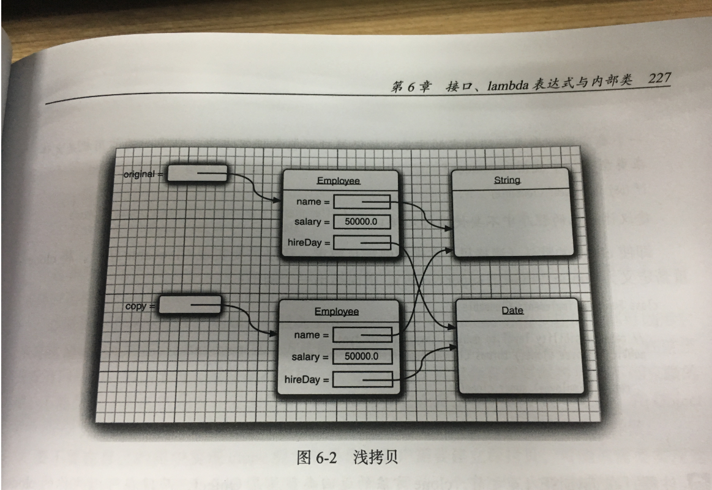
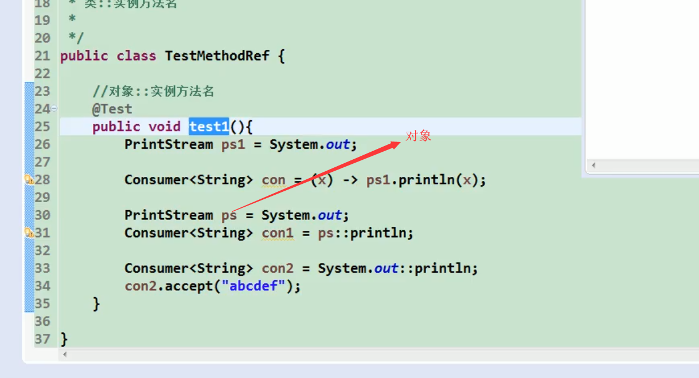
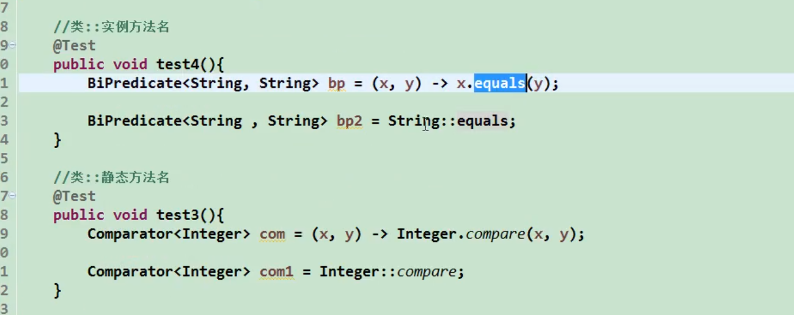
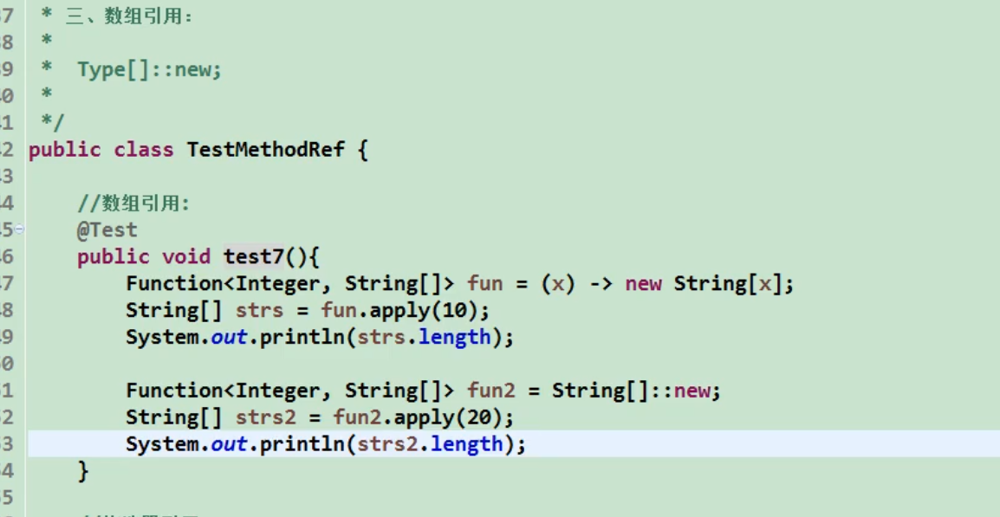

## 接口

### 接口概念

接口（英文：Interface），在JAVA编程语言中是一个抽象类型，是抽象方法的集合，接口通常以interface来声明。一个类通过继承接口的方式，从而来继承接口的抽象方法。

接口不是类，而是对类的一组需求的描述，这些类需要遵循接口描述的统一格式进行定义。

在接口中的方法自动的默认为public,所有在创建的时候不必写权限 

接口对象不能被实现，关键字为 implement .

__Comparable__

+ int compareTo(t other)  用这个对象与other进行比较，如果这个对象小于oteher则返回负，等于0 大于 正

__Arrays__

+ static void sort(Object [] a)  使用mergesort算法对数组进行排序，要求数组中得到元素必须属于实现了Comparable接口的类，并且元素之间是可以比较的

__Integer__

+ static int compare(int x ,int y)       x<y 返回负值 x=y 0    x>y 正值

__Double__

+ static int compare(double x ,doubler x)      x<y 返回负值 x=y 0    x>y 正值

### 接口特性

+ 接口不是类，不能new一个实例化对象。

```java
x= new Comparable   //Comparable是接口  这样写是错的
 Comparable x ; //这样写是可以的
```


+ 虽然接口不能有实例域或者静态方法，但是可以保护常量
+ 一个类可以同时继承多个接口
+ 接口和抽象类的关系，抽象类只能继承一个，而接口多个
+ 在Java SE8中允许在接口中增加静态方法

__默认方法__

可以为接口提供一个默认的实现，必须用defauble修饰符标记这样的一个方法；

```java
public interface Inter<T>{
    default int compartTo(){
        return 0;
    }
}
```


__默认方法的冲突解决__

+ 超类优先，如果超类提供了具体的方法，同名而且参数相同，默认方法会被忽略
+ 接口冲突，如果一个超接口提供了一个默认方法,另一个接口也提供了一样的，则会冲突报错
+ 类优先，在一个类实现了一个接口，同时又是另一个超类的子类，在遇到方法相同的时候，

### 接口示例

#### 接口回调

每个一段时间回调一次自己

```java
public class TimerTest
{  
   public static void main(String[] args)
   {  
      ActionListener listener = new TimePrinter();

      // construct a timer that calls the listener
      // once every 10 seconds
      Timer t = new Timer(10000, listener);
      t.start();

      JOptionPane.showMessageDialog(null, "Quit program?");
      System.exit(0);
   }
}

class TimePrinter implements ActionListener
{  
   public void actionPerformed(ActionEvent event)
   {  
      System.out.println("At the tone, the time is " + new Date());
      Toolkit.getDefaultToolkit().beep();
   }
}
```

__javax.swing.Time__

+ Timer(int interval ,ActionListerner listerner) 构造一个定时器，每个interval通告一次listener一次
+ void start()  启动定时器，启动成功，定时器将调用监听器的actionPerformed
+ void stop()  停止定时器，

#### Comparator接口

在前面我们知道了sort排序,这个排序必须实现了Comparable接口的实例，假设我们虚妄按长度来排序而不是按照数据字典来，这里Arrays.sort方法还有第二个版本，

```java
public interface Interfaces<T> {
    int compare(T first,T second);
}
public class Interfacesimp implements Interfaces<String>{
    @Override
    public int compare(String first, String second) {
        return first.length()-second.length();
    }
```

#### 对象克隆 clone 与序列化克隆

##### clone

克隆产生的本质是，之前的引用如果参数改变那么会影响另一个参数，如果希望产生的是一个新的对象，他的初始状态域originla相同，但是他们各自会有自己不同的状态，可以用clone。

```java
Employee copy = original.clnoe();
```

clone方法是Object的一个protected方法，代码不能直接调用，只能是类可以克隆自己的对象，他对对象一无所知，需要逐个的进行拷贝，在遇到包含子对象的时候，就会将__子对象拿来引用__这就是所谓的浅拷贝。



对于每一个类需要确定

1. 默认的clone方法是否满足要求
2. 是否可以在可变的子对象上调用clone来修补默认的clone方法
3. 是否不该使用clone

如果用了需要注意

1. 实现Cloneable接口
2. 重新定义clone方法，并指定publci

+ 当一个的对象调用了clone但是这个对象没有实现Cloneable接口，就会抛出CloneNotSupportedException

实体类并继承Cloneable

```java
public class Employee implements Cloneable
{
   private String name;
   private double salary;
   private Date hireDay;

   public Employee(String name, double salary)
   {
      this.name = name;
      this.salary = salary;
      hireDay = new Date();
   }

   public Employee clone() throws CloneNotSupportedException
   {
      // call Object.clone()
      Employee cloned = (Employee) super.clone();

      // clone mutable fields
      cloned.hireDay = (Date) hireDay.clone();

      return cloned;
   }

   /**
    * Set the hire day to a given date. 
    * @param year the year of the hire day
    * @param month the month of the hire day
    * @param day the day of the hire day
    */
   public void setHireDay(int year, int month, int day)
   {
      Date newHireDay = new GregorianCalendar(year, month - 1, day).getTime();
      
      // Example of instance field mutation
      hireDay.setTime(newHireDay.getTime());
   }

   public void raiseSalary(double byPercent)
   {
      double raise = salary * byPercent / 100;
      salary += raise;
   }

   public String toString()
   {
      return "Employee[name=" + name + ",salary=" + salary + ",hireDay=" + hireDay + "]";
   }
}
```

实现类

```java
public class CloneTest
{
   public static void main(String[] args)
   {
      try
      {
         Employee original = new Employee("John Q. Public", 50000);
         original.setHireDay(2000, 1, 1);
         Employee copy = original.clone();
         copy.raiseSalary(10);
         copy.setHireDay(2002, 12, 31);
         System.out.println("original=" + original);
         System.out.println("copy=" + copy);
      }
      catch (CloneNotSupportedException e)
      {
         e.printStackTrace();
      }
   }   
}
```

##### 序列化克隆

分析上面的clone属于浅克隆，序列化克隆属于深度克隆。这个方案是在编译时出现异常

实体类序列化

```java

public class Person implements Serializable {
 
    private static final long serialVersionUID = -9102017020286042305L;
 
    private String name;    // 姓名
    private int age;        // 年龄
    private Car car;        // 座驾
 
    public Person(String name, int age, Car car) {
        this.name = name;
        this.age = age;
        this.car = car;
    }
 
    public String getName() {
        return name;
    }
 
    public void setName(String name) {
        this.name = name;
    }
 
    public int getAge() {
        return age;
    }
 
    public void setAge(int age) {
        this.age = age;
    }
 
    public Car getCar() {
        return car;
    }
 
    public void setCar(Car car) {
        this.car = car;
    }
 
    @Override
    public String toString() {
        return "Person [name=" + name + ", age=" + age + ", car=" + car + "]";
    }
 
}
______________________________________

public class Car implements Serializable {
    private static final long serialVersionUID = -5713945027627603702L;
 
    private String brand;       // 品牌
    private int maxSpeed;       // 最高时速
 
    public Car(String brand, int maxSpeed) {
        this.brand = brand;
        this.maxSpeed = maxSpeed;
    }
 
    public String getBrand() {
        return brand;
    }
 
    public void setBrand(String brand) {
        this.brand = brand;
    }
 
    public int getMaxSpeed() {
        return maxSpeed;
    }
 
    public void setMaxSpeed(int maxSpeed) {
        this.maxSpeed = maxSpeed;
    }
    @Override
    public String toString() {
        return "Car[brand=" + brand + ", maxSpeed=" + maxSpeed + "]";
    }
}
```

实现方法

```java
public class CloneUtil {
 private CloneUtil() {
        throw new AssertionError();
    }
    /**
     * Clone.
     * 调用ByteArrayInputStream或ByteArrayOutputStream对象的close方法没有任何意义，
     * 这两个基于内存的流只要垃圾回收器清理对象时就能够释放资源，这一点不同于对外部资源（如文件流）的释放。
     *
     * @param obj The object.
     * @param <T> The type.
     * @return The cloned object.
     * @throws Exception The exception.
     */
    public static <T> T clone(T obj) throws Exception {
        ByteArrayOutputStream byteArrayOutputStream = new ByteArrayOutputStream();
        ObjectOutputStream objectOutputStream = new ObjectOutputStream(byteArrayOutputStream);
        objectOutputStream.writeObject(obj);
 
        ByteArrayInputStream byteArrayInputStream = new ByteArrayInputStream(byteArrayOutputStream.toByteArray());
        ObjectInputStream objectInputStream = new ObjectInputStream(byteArrayInputStream);
        return (T) objectInputStream.readObject();
    }
```

测试代码

```java
package chimomo.learning.java.code.clone;
 
/**
 * @author Created by Chimomo
 */
public class CloneTest {
 
    public static void main(String[] args) {
        try {
            Person p1 = new Person("Chimomo", 18, new Car("Benz", 300));
 
            // 深度克隆。
            Person p2 = CloneUtil.clone(p1);
 
            // 修改克隆的Person对象p2关联的汽车对象的品牌属性，
            // 原来的Person对象p1关联的汽车不会受到任何影响，
            // 因为在克隆Person对象时其关联的汽车对象也被克隆了。
            p2.getCar().setBrand("Lamborghini");
 
            System.out.println(p1);
        } catch (Exception e) {
            e.printStackTrace();
        }
    }
}
 
// Output:
/*
Person [name=Chimomo, age=18, car=Car[brand=Benz, maxSpeed=300]]
*/
```

## lambda表达式

将一个代码块传递到某个对象，lambda表达式时一个可传递的代码块，可以在以后执行一次和多次。在使用的时候就是对对接口的实现，在实际的运用中我们没必要杂技来创建接口。Java给我们内置了很多的接口，能满足我们的日常需要。

### 语法

表达形式 ： 参数，箭头（->）以及一个表达式，如果一个表达式无法计算，也可以像写方法一样写一个{}包含显示的return语句

```java
(String first, String cecond) -> {
    if (first.length() < cecond.length()) return -1;
    else if (first.length() > cecond.length()) return 1;
    else return 0;
};
```

即使lambda没有参数，仍然需要提供空的括号

```java
() -> {for (int i = 100; i >= 0;i--) System.out.printle(i)}
```

如果可以推导出一个lambda表达式的参数类型，就可以将参数类型忽略掉。列如

```java
//生成一个比较器，来确定数组的排序
Comparator<String> comp =  (first, second) -> first.length() - second.length();
```

上面这个代码中，编译器推导出，first 和second比如时String因为这个lambda将赋予一个字符串表达式。


如果方法只有一个参数，并且这个参数类型可以被推导出来，那么甚至可以省略这个小括号。

```java
 ActionListener listener = ener  -> System.out.print("返回当前的时间"+ new Date());
// ACtionListerer一个动态监听接口
```

无需指定lambda表达式的返回类型，lambda表达式的返回类型，会由上下文推导出来，

```java
//按照String的长度来排序
String[] planets = new String[] { "Mercury", "Venus", "Earth", "Mars",
                "Jupiter", "Saturn", "Uranus", "Neptune" };
Arrays.sort(planets, (first, second) -> first.length() - second.length());
```

### 函数式接口

前面已经说过，Java中已经有很多封装代码块的接口，如ActionListener和Compararot这些接口都是与lambda表达式兼容的。

对于只有以恶抽象方法的接口，需要这种接口的对象时，就可以提供一个lambda表达式。这种称为函数接口

构造一个定时器

```java
 Timer timer = new Timer(100, a -> {
            System.out.println("当前的时间" + new Date());
            Toolkit.getDefaultToolkit().beep();
        });
```

### Java  8  内置的四大函数接口

#### Consumer<T> : 消费型接口

没有返回值类型

```java
void accepr(T t);
//例如
@Test
public void test5(){
    happy(100,(x) -> System.out.println("无返回值类型"+x));
}
public void happy(double money , Consumer<Double> con){
    con.accept(money);
}
```


#### Supplier<T> : 供给型接口 

有返回值，但是没有参数

```java
//get();
//需求 指定产生个数的整数，
@Test
public void test6(){
    List<Integer> numList = getNumList(10, () -> (int) (Math.random()*100));
    //iter
    for (Integer integer : numList) {
        System.out.println(integer);
    }
}

public List<Integer> getNumList(Integer num , Supplier<Integer> sup){
    List<Integer> rows = new ArrayList<>();
    for(int i = 0 ; i< num ; i++){
        Integer integer = sup.get();
        rows.add(integer);
    }
    return rows;
}
```

#### Function<T,R> : 函数型接口

用于处理字符串， 传递一个字符串，返回的额还是字符串

```java
//R apply(T t)
//用来处理字符串
@Test
public void  test7(){
    String s1 = strHandler("/t/t 测试内容     ", (str) -> str.trim());
    System.out.println(s1);
}
public String strHandler(String str , Function<String , String > function){
    return function.apply(str) ;
}
```


#### Predicate<T> : 断言型接口

```java
//Predicate<T>  断崖型接口
//需求 将满足条件的字符串，放入集合中
@Test
public void  test9(){
    List<String> strings = Arrays.asList("xiayu", "xuxu", "asdasdasdasd");
    List<String> strings1 = fileterStr(strings, (s) -> s.length() > 6);

    for (String st : strings1) {
        System.out.println(st);
    }
}
public List<String> fileterStr(List<String> str , Predicate<String> predicate){
    List<String> strings = new ArrayList<>();
    for (String s : str) {
        if(predicate.test(s)){
            strings.add(s);
        }
    }
    return  strings;
}
```

#### 其他接口

+ BiFunction() 对Function的扩充。

### 方法引用

有时候，可能已经有线程的方法可以完成你i想要传递的其他代码的某个动作出现一个定时器事件就打印这个事件对象

若Lambda体中的内容有方法已经实现了，我们可以使用”方法引用“。（可以理解为方法引用是Lambda表达式的另一种表现形式）

```java
Timer timer1 = new Timer(1000, en -> System.out.print(en));
```

但是如果直接把print方法传递套Timer构造器就好了

```java
Timer timer2 = new Timer(1000, System.out::println);
```

其他示例

```java
System.out::pring   等价于  x ->System.out.println(x)  
//对字符串排序不考虑大小写
Arrys.sort(String s,String::compareToIgnoreCase)
```

分析 要用 ：： 操作符分割方法名与对象或者类名。有一下三种情况 （instance 实例方法）

+ object::instanceMethod                     对象 :: 实例方法
+ Class::staticMethod                           类 :: 静态方法
+ Class::instanceMethod                      类 :: 实例方法

前两种情况中，方法的引用等价于提供方法参数的lambda表达式，System.out::pring   等价于  x ->System.out.println(x) ， Math::pow等价于(x,y) ->Math.pow(x,y)

对于第三种情况，第一个参数称为方法的目标，如String::compareToIgnoreCase等于(x,y) ->x.compareToIgnoreCase(y)。第一个参数是方法的调用者，第二个参数是方法的参数。可以使用





数组引用



#### 注意

+ Lambda 体中调用方法的参数列表与返回值类型，要与函数方法的函数列表的返回值类型保持一致；
+ Lambda 表达式就是对接口的实现，在对接口实现后，其他对象之间可以调用接口进行参数调用。

待续—————————————————————————————————————— 

## 内部类

内部类是定义在另一个类中的类，引入内部类的原因

+ 内部类方法可以访问该类定义所在作用域中的数据，包括私有域
+ 内部类可以对同一个包中的其他类隐藏起来
+ 当想要定义一个回调函数且不想编写大量的代码时，使用匿名内部类比较便捷

编译器

### 使用内部类访问对象状态

在内部类调用外围类的对象的时候，并不会为之创建一个对象，而是之间引用。隐式引用。


### 内部类的特殊语法规则

外部类引用内部类

+ OuterClass.this
+ OuterClass.InnerClass

下面是一个有内部类调用的实例，一个计时器

```java
public class InnerClassDome {
    private int interval;
    private boolean beep;


    public InnerClassDome(int interval, boolean beep)
    {
        this.interval = interval;
        this.beep = beep;
    }


    public void start()
    {
        ActionListener listener = new TimePrinter();
        Timer t = new Timer(interval, listener);
        t.start();
    }

    public class TimePrinter implements ActionListener
    {
        public void actionPerformed(ActionEvent event)
        {
            System.out.println("At the tone, the time is " + new Date());
            //这里beep之间就拿过来用了
            if (beep) Toolkit.getDefaultToolkit().beep();
        }
    }
}

-----------------------------------------------------------------------------
    public class InnerClassTest {
    public static void  main(String [] agrs){
        InnerClassDome clock = new InnerClassDome(1000, true);
        clock.start();

        // keep program running until user selects "Ok"
        JOptionPane.showMessageDialog(null, "Quit program?");
        System.exit(0);
    }
}
```

### 其他内部类

+ 局部内部类   内部类在方法的里面，只在该方法中能被调用，局部类不能使用public或者private来声明

局部类的方法在引用外部的变量时只能时final

+ 静态内部类 有些内部类的使用的时候只是为了隐藏内部类，并不会调用外部类的对象，为此，可以将内部类声明为static

  __声明在接口内的内部类自动生成static 和public__

### 匿名内部类

匿名内部类是对局部类的进一步扩展。

__语法__

```java
new SuperType(construction parameters)
{
  
}
//匿名类不能有构造器，取代的是将构造器参数传递给超类的构造器  格式如下  不能有参数
new InterfacaType()
{
    
}
```

匿名内部类使用的前提条件是，必须继承一个父类或者是实现一个接口

也就是对一个接口或者父类的扩充，和Lambd表达式相似

```java
public class TalkingClock {
    
    public void start(int interval, boolean beep) {
        ActionListener listener = new ActionListener() {
            @Override
            public void actionPerformed(ActionEvent event) {
                System.out.println("At the tone, the time is " + new Date());
                if (beep) Toolkit.getDefaultToolkit().beep();
            }
        };
        Timer t = new Timer(interval, listener);
        t.start();
    }
}
____________________________________________
public class AnonymousInnerClassTest
{
    public static void main(String[] args)
    {
        TalkingClock clock = new TalkingClock();
        clock.start(1000, true);

        // keep program running until user selects "Ok"
        JOptionPane.showMessageDialog(null, "Quit program?");
        System.exit(0);
    }
}
```

## 代理

-----------------__待续__