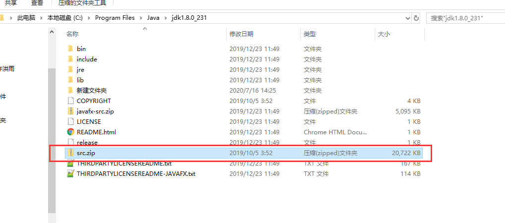
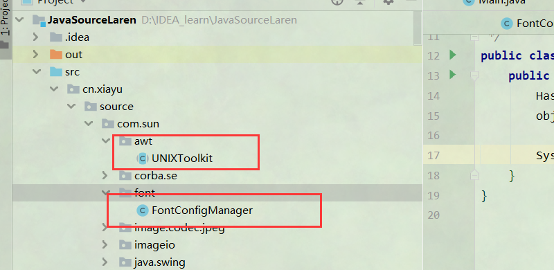
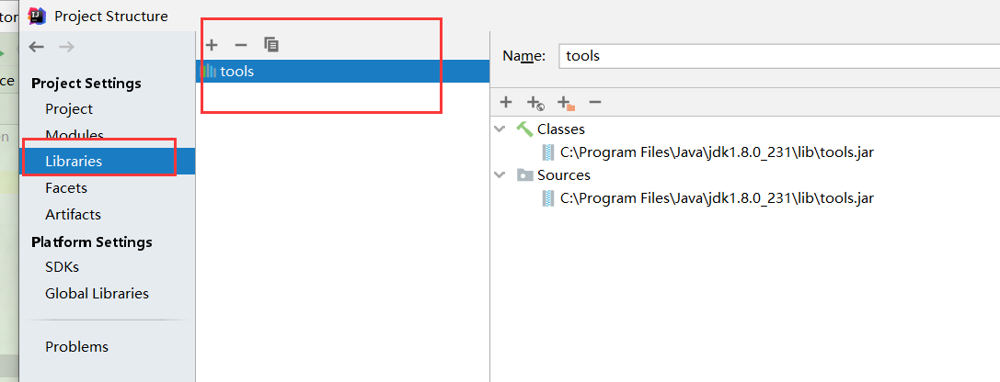
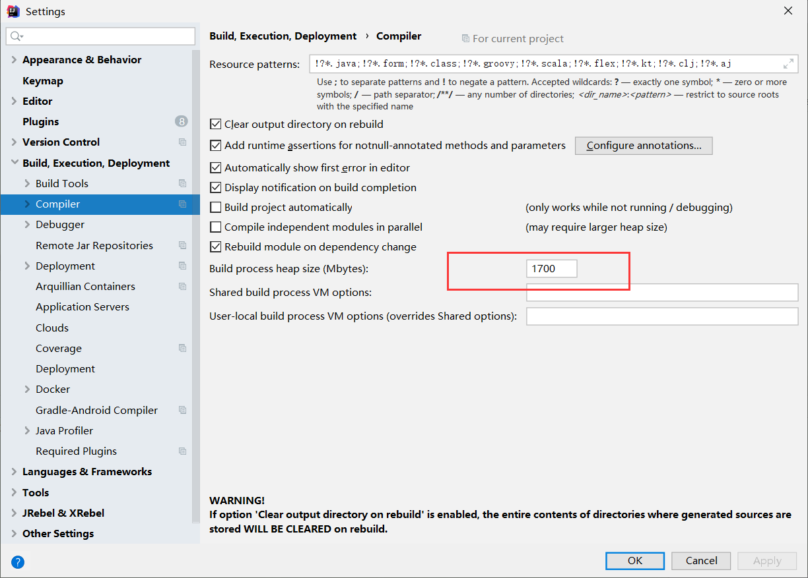
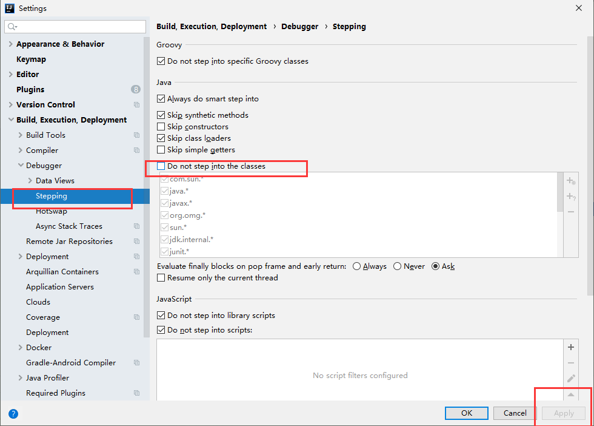
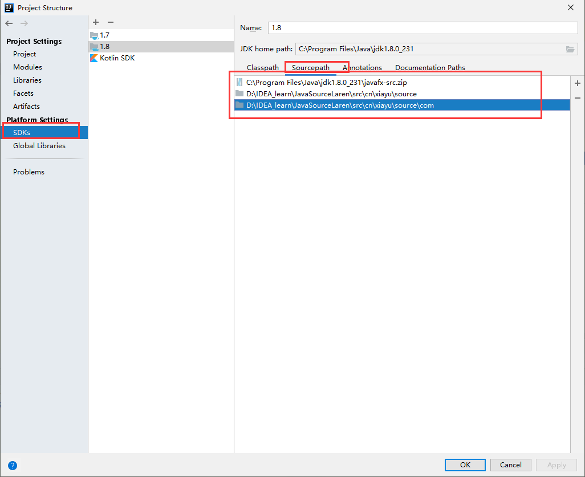
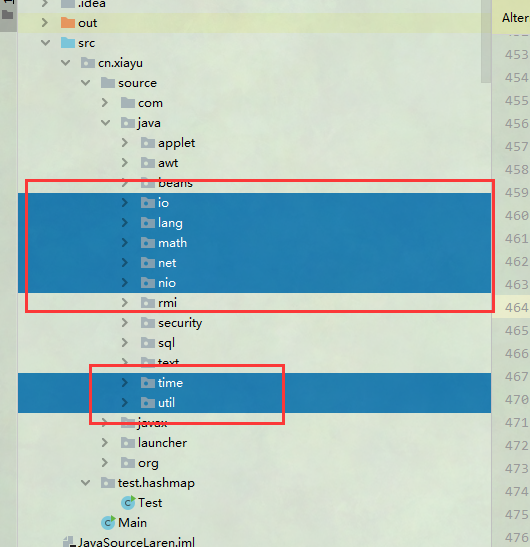

## 创建项目

使用IDEA创建一个正常的java项目，创建两个包source资源包，test测试包。将源码信息拷贝到资源包中

## 拷贝源码

在JDK中找到src.zip文件解压出来放到source资源包中

## 处理错误

会找不到两个类，需要去官网下载

__FontConfigManager.java __    http://hg.openjdk.java.net/jdk8u/jdk8u/jdk/file/beb15266ba1a/src/solaris/classes/sun/font/FontConfigManager.java

__UNIXToolkit.java__  http://hg.openjdk.java.net/jdk8u/jdk8u/jdk/file/d6ba796b8c9f/src/solaris/classes/sun/awt/UNIXToolkit.java

tools未找到

File —> Project structure —> Libraries 把jdk路径下的lib包下的tools.jar添加到工程中

资源不足问题

## 调试设置

调试无法进入内部

无法修改源码问题

将JDK源码移除，自己的路径加载进去

## 源码指南

只需要看Java目录

七个比较重要的

七个包的

lang>util>io>nio>math>time>net

lang包下 看散列的和annotation  reflect

util包下  看散列  conrurrent  function stream

in包下  

nin 非阻塞io

math 数学相关

time 日期和时间

net 网络通信

