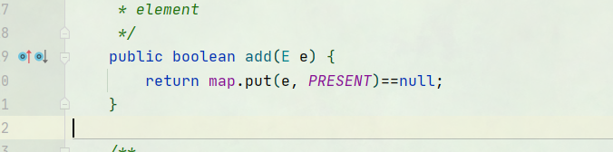
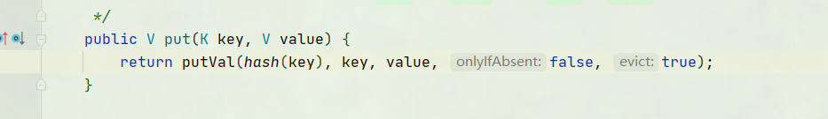

## 概述

　对于包含容器类型的程序设计语言来说，基本上都会涉及到hashCode。在Java中也一样，hashCode方法的主要作用是为了配合基于散列的集合一起正常运行，这样的散列集合包括HashSet、HashMap以及HashTable。

　　为什么这么说呢？考虑一种情况，当向集合中插入对象时，如何判别在集合中是否已经存在该对象了？（注意：集合中不允许重复的元素存在）

　　也许大多数人都会想到调用equals方法来逐个进行比较，这个方法确实可行。但是如果集合中已经存在一万条数据或者更多的数据，如果采用equals方法去逐一比较，效率必然是一个问题。此时hashCode方法的作用就体现出来了，当集合要添加新的对象时，先调用这个对象的hashCode方法，得到对应的hashcode值，实际上在HashMap的具体实现中会用一个table保存已经存进去的对象的hashcode值，如果table中没有该hashcode值，它就可以直接存进去，不用再进行任何比较了；如果存在该hashcode值， 就调用它的equals方法与新元素进行比较，相同的话就不存了，不相同就散列其它的地址，所以这里存在一个冲突解决的问题，这样一来实际调用equals方法的次数就大大降低了，说通俗一点：Java中的hashCode方法就是根据一定的规则将与对象相关的信息（比如对象的存储地址，对象的字段等）映射成一个数值，这个数值称作为散列值。

## Object 中的HashCode

int hashCode();

返回对象的哈希码值。 支持此方法是为了使哈希表受益，例如java.util.HashMap提供的哈希表。
hashCode的一般约定为：
在Java应用程序的执行过程中，只要在同一对象上多次调用它，则hashCode方法必须一致地返回相同的整数，前提是未修改该对象的equals比较中使用的信息。 从一个应用程序的执行到同一应用程序的另一执行，此整数不必保持一致。
如果根据equals(Object)方法，两个对象相等，则在两个对象中的每个对象上调用hashCode方法必须产生相同的整数结果。
这不是必需的：如果两个对象根据不相等equals(Object)方法，然后调用hashCode在各两个对象的方法必须产生不同的整数结果。 但是，程序员应该意识到，为不相等的对象生成不同的整数结果可能会提高哈希表的性能。
在合理可行的范围内，由Object类定义的hashCode方法确实为不同的对象返回不同的整数。 __（通常通过将对象的内部地址转换为整数来实现__，但是Java™编程语言不需要此实现技术。

重写 写hashcode方法

```java
//业务场景
// 这个实体类只要unm和name相等就认为这个对象是相等的。
// 实现 1 将unm和name合并为一个String 用类似String的hash值的方式生成一个哈希值
@Override
public int hashCode() {
    StringBuilder sb = new StringBuilder();
    sb.append(num);
    sb.append(name);
    char[] charArr = sb.toString().toCharArray();
    int hash = 0;
    
    for(char c : charArr) {
        hash = hash * 131 + c;
    }
    return hash;
}

// 到这里还没有结束，在底层的时候过程中，
//还需要重写equals才能实现上面功能
@Override
    public boolean equals(Object obj) {
        if (this == obj) {
            return true;
        }
        if (obj instanceof User) {
            if (((User) obj).getName().equals(this.getName())
                    && ((User) obj).getPassWord().equals(this.getPassWord())) {
                return true;
            }
        }
        return false;
    }
```

可以通过观察源码，hashSet在底层用的是调用的hashMap



然后以set的值来作为key放到hashmap中，此时value是创建的一个空对象；



在校验key的值是否重复的时候校验两项，1. 校验hash值。2. 校验equals()是否相等。


通过下面代码可知，equals（）方法在校验的时候是之间对比两个对象是否相等。相当于对比两个对象的物理地址是否一样，为了满足自己的需求所以需要重写equals();


## String中的HashCode

大致经过如下流程

1. 将String 转化正char[]
2. 创建一个hash值（int类型） 遍历char[]数组，hash扩大31倍后加上char值
3. 相加后得到的就是hashcode值


所以，正常情况下必须是完全一致的String值，hash值才会一致（空格也是字符串也会计算进去）。一致的的

## HashMap中的HashCode

在向hashmap中放数据时，将key的hashcode与key的hashcode高16位做与运算作为hash值


## 基础类型HashCode

### Integer 

Integer 的hashcode值就是int类型值本身。