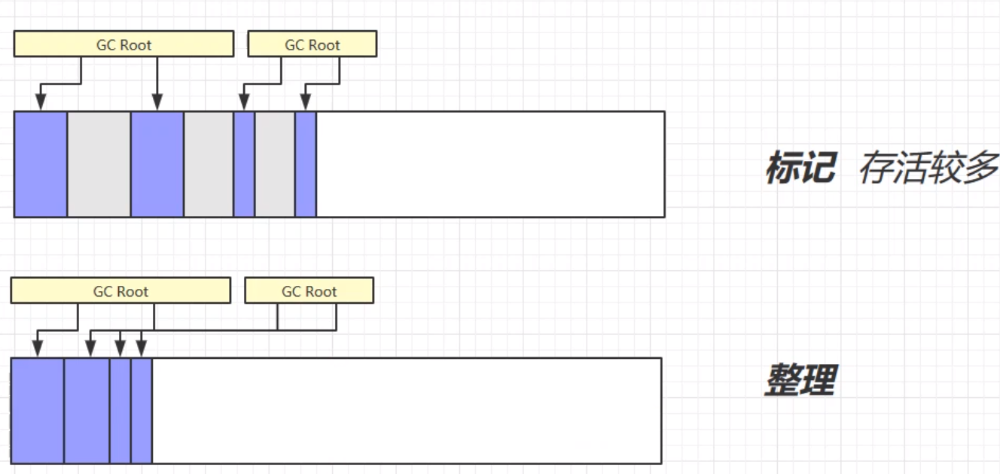

## 内存结构


### 程序计数器

__定义__

Program Counter Register 程序计数器（寄存器）作用，是记住下一条jvm指令的执行地址

__特点__

是线程私有的不会存在内存溢出

### 虚拟机栈

__定义__

Java Virtual Machine Stacks （Java 虚拟机栈）

+ 每个线程运行时所需要的内存，称为虚拟机栈

+ 每个栈由多个栈帧（Frame）组成，对应着每次方法调用时所占用的内存每个线程只能有一个活动栈帧，对应着当前正在执行的那个方法

问题辨析

1. 垃圾回收是否涉及栈内存？

> 圾回收的是堆内存

2. 栈内存分配越大越好吗？

> 当然不是，当栈内存分得过大的时候，栈的数量就收到了限制，创建线程的数量也就收到了限制

3. 法内的局部变量是否线程安全？

> 方法内局部变量没有逃离方法的作用访问，它是线程安全的
>
> 如果是局部变量引用了对象，并逃离方法的作用范围，需要考虑线程安全

__栈内存溢出__

+ 栈帧（每个方法）过多导致栈内存溢出
+ 栈过大导致栈内存溢出

__线程运行诊断__

linux环境下

1.  cpu 占用过多定

> + 用top定位哪个进程对cpu的占用过高
> + ps H -eo pid,tid,%cpu | grep 进程id （用ps命令进一步定位是哪个线程引起的cpu占用过高）
> +  jstack 进程id


### 本地方法栈

调用本地方法栈可以，直接调用本地的C/C++库，实现对系统底层的操作

### 堆

Heap 堆

+ 通过 new 关键字，创建对象都会使用堆内存特点

+ 它是线程共享的，堆中对象都需要考虑线程安全的问题有垃圾回收机制

### 方法区


+ 常量池中的信息，都会加载到运行时常量池，但是还没变为java中的对象

__StringTable[]__  是一个哈希表长度固定，并且不能扩容

+ 当程序运行的时候，运行到哪个字符串就将它与StringTable[]中对比如果没有就放入StingTable[]并且创建字符串对象,  ——用到才会加载，用不到就不会加载，懒惰的
+ 利用串池的机制，来避免重复创建字符串对象
+ 字符串常量的拼接的原理是StringBuilder(1.8)
+ 字符串变量的拼接原理是编译期间的优化
+ 可以用intern方法，主动将串池中还没有的字符串对象放入串池

```java
Stirng s1 = s.intern();
//将会把这个字符串对象尝试放入串池中，如果有则不会放入，如果没有则放入串池中，会把串池中的对象返回
```

__StringTable垃圾回收__

 在堆内存不够的时候会触发

__StringTable性能优化__

+ 当我们的StringTable要装很多的字符串的时候，为了减少哈希冲撞，我们可以把StringTable桶的大小设置的大一点减少冲撞

```tex
-XX: StringTableSize=桶个数
```

+ 考虑将字符串对象是否入池

> 当我们需要的字符串大量的重复的时候，我们可以将这个字符串入池，由于StringTable自身不重复的属性，可以减少重复，减少内存的占用
>
> ```java
> List<String> address = new ArrayList<>();
> address.add(line,intern())
> ```


__外传__

+ StringBuilder()是线程不安全的
+ 在执行String拼接的时候，首先创建一个StringBuilder，然后再后面append，最后再tostring，创建一个新的字符串

### 直接内存

不属于java的内存，而是直接用操作系统的内存

+ 常见于NIO操作时，用户数据缓冲区

+ 分配回收成本高，但读写性能高
+ 不受JVM内存回收管理

#### 基本使用（复制文件）

Java IO复制文件


ByteBuffer 复制文件在实现的时候利用了Unsafe 来复制对象


#### 内存溢出

直接内存必须主动的调用释放，不然不会释放

Unsafe ： java底层的方法可以用来释放直接内存

```java
/**
 * 直接内存分配的底层原理：Unsafe
 */
public class Demo1_27 {
    static int _1Gb = 1024 * 1024 * 1024;

    public static void main(String[] args) throws IOException {
        Unsafe unsafe = getUnsafe();
        // 分配内存
        long base = unsafe.allocateMemory(_1Gb);
        unsafe.setMemory(base, _1Gb, (byte) 0);
        System.in.read();
        
        // 释放内存
        unsafe.freeMemory(base);
        System.in.read();
    }
    /**
     * 通过反射获取Unsafe对象
     * @return
     */
    public static Unsafe getUnsafe() {
        try {
            Field f = Unsafe.class.getDeclaredField("theUnsafe");
            f.setAccessible(true);
            Unsafe unsafe = (Unsafe) f.get(null);
            return unsafe;
        } catch (NoSuchFieldException | IllegalAccessException e) {
            throw new RuntimeException(e);
        }
    }
}
```


## 垃圾回收

### 如何判断对象可以回收

#### 引用计数法

#### 可达性分析算法

#### 四种引用 

+ 软引用      仅有软引用引用该对象时，在垃圾回收后，内存仍不足时会再次触发垃圾回收，回收软引用 对象 可以配合引用队列来释放软引用自身  可能被垃圾回收掉 
+ 弱引用     仅有弱引用引用该对象时，在垃圾回收时，无论内存是否充足，都会回收弱引用对象 可以配合引用队列来释放弱引用自身   可能被垃圾回收掉（不管内存是否充足都会回收掉）
+ 虚引用     必须配合引用队列使用，主要配合 ByteBuffer 使用，被引用对象回收时，会将虚引用入队， 由 Reference Handler 线程调用虚引用相关方法释放直接内存
+ 终结器引用     无需手动编码，但其内部配合引用队列使用，在垃圾回收时，终结器引用入队（被引用对象 暂时没有被回收），再由 Finalizer 线程通过终结器引用找到被引用对象并调用它的 finalize 方法，第二次 GC 时才能回收被引用对象 

+ 强引用     只有所有 GC Roots 对象都不通过【强引用】引用该对象，该对象才能被垃圾回收


实线为强引用

对象引用了一个软引用对象，软引用对象引用到了A2对象


在调用虚引用，或者终结引用的时候必须配合引用队列使用


通过引用队列，来回收掉直接内存

终结器引用类似，也是通过引用队列来回收掉A4对象finallize()

#### __软引用实例__

应用场景

我们需要用一个List<String>来存放大量的图片，可能会引起内存的溢出，经常的full GC 为了减少情况发生，我们用软引用，当内存满的时候就把照片给删除了

```java
/**
 * 演示软引用 用来显示
 * -Xmx20m -XX:+PrintGCDetails -verbose:gc 
 */
public class Demo2_3 {
    private static final int _4MB = 4 * 1024 * 1024;
    public static void main(String[] args) throws IOException {
        List<byte[]> list = new ArrayList<>();
        for (int i = 0; i < 5; i++) {
            list.add(new byte[_4MB]);
        }
        System.in.read();
        //软引用
        soft();
    }
    public static void soft() {
        // list --> SoftReference --> byte[]
        List<SoftReference<byte[]>> list = new ArrayList<>();
        for (int i = 0; i < 5; i++) {
            SoftReference<byte[]> ref = new SoftReference<>(new byte[_4MB]);
            System.out.println(ref.get());
            list.add(ref);
            System.out.println(list.size());
        }
        System.out.println("循环结束：" + list.size());
        for (SoftReference<byte[]> ref : list) {
            System.out.println(ref.get());
        }
    }
}
```

软引用-引用队列

```java
/**
 * 演示软引用, 配合引用队列
 */
public class Demo2_4 {
    private static final int _4MB = 4 * 1024 * 1024;
    public static void main(String[] args) {
        List<SoftReference<byte[]>> list = new ArrayList<>();
        // 引用队列
        ReferenceQueue<byte[]> queue = new ReferenceQueue<>();
        for (int i = 0; i < 5; i++) {
            // 关联了引用队列， 当软引用所关联的 byte[]被回收时，软引用自己会加入到 queue 中去
            SoftReference<byte[]> ref = new SoftReference<>(new byte[_4MB], queue);
            System.out.println(ref.get());
            list.add(ref);
            System.out.println(list.size());
        }
        // 从队列中获取无用的 软引用对象，并移除
        Reference<? extends byte[]> poll = queue.poll();
        while( poll != null) {
            list.remove(poll);
            poll = queue.poll();
        }     System.out.println("===========================");
        for (SoftReference<byte[]> reference : list) {
            System.out.println(reference.get());
        }

    }
}
```

#### 弱引用实例

```java
/**
 * 演示弱引用
 * -Xmx20m -XX:+PrintGCDetails -verbose:gc
 */
public class Demo2_5 {
    private static final int _4MB = 4 * 1024 * 1024;
    public static void main(String[] args) {
        //  list --> WeakReference --> byte[]
        List<WeakReference<byte[]>> list = new ArrayList<>();
        for (int i = 0; i < 10; i++) {
            WeakReference<byte[]> ref = new WeakReference<>(new byte[_4MB]);
            list.add(ref);
            for (WeakReference<byte[]> w : list) {
                System.out.print(w.get()+" ");
            }
            System.out.println();
        }
        System.out.println("循环结束：" + list.size());
    }
}
```


我们发现在第四次存储得时候，内存占满，当想要放第五个数组得时候，将第四个对象回收，变为null.

### 垃圾回收算法

#### 标记清除

先标记哪些对象是垃圾，标记出来，第二部就是清除


标记清除只对当前的对象进行清除，没有对空闲的内存进行整理

缺点会产生大量的空闲内存空间，内存碎片

#### 标记整理

为了解决标记清除产生的内存碎片



优点没用内存碎片，缺点是速度较慢，涉及到内存的复制和引用的改变。

#### 复制

有两块相同的存储空间，

第一步，找到还有引用的对象并且标记出来，

第二步，将有引用的对象拷贝到第二个存储空间中，

第三步，第一个存储空间，都是垃圾，清除，两个存储空间交换位置。


优点，不会产生内存碎片

缺点，会占用双倍的内存空间

### 分代垃圾回收机制

结合，标记清除，标记整理，复制算法，产生的更优的回收机制，也是JVM现在所用的回收机制


默认情况下

+ 新生代和老年代的内存比例为1:2
+ 新生代平均分为十份其中，八分为伊甸园去，另外个为幸存区


+ 对象首先分配在伊甸园区域 
+ 新生代空间不足时，触发 minor gc，伊甸园和 from 存活的对象使用 copy 复制到 to 中，存活的 对象年龄加 1并且交换 from to 
+ minor gc 会引发 stop the world，暂停其它用户的线程，等垃圾回收结束，用户线程才恢复运行 当对象寿命超过阈值时，会晋升至老年代，最大寿命是15（4bit） 
+ 当老年代空间不足，会先尝试触发 minor gc，如果之后空间仍不足，那么触发 full gc，STW的时 间更长

### VM相关参数的设置

+ 堆初始大小 -Xms
+ 堆最大大小 -Xmx 或 -XX:MaxHeapSize=size
+ 新生代大小 -Xmn 或 (-XX:NewSize=size + -XX:MaxNewSize=size )
+ 幸存区比例（动态） -XX:InitialSurvivorRatio=ratio 和 -XX:+UseAdaptiveSizePolicy
+ 幸存区比例 -XX:SurvivorRatio=ratio
+ 晋升阈值 -XX:MaxTenuringThreshold=threshold
+ 晋升详情 -XX:+PrintTenuringDistribution
+ GC详情 -XX:+PrintGCDetails -verbose:gc
+ FullGC 前 MinorGC -XX:+ScavengeBeforeFullGC

### 垃圾回收器

#### 串行

__特点__

+ 单线程 当发生垃圾回收的时候整个线程暂停
+ 适用于内存较小，个人电脑

-XX:+UseSerialGC = Serial + SerialOld

+ Serial 存在于新生代，采用复制算法
+ SerialOld 存在于老年代，采用标记整理算法


#### 吞吐量优先

__特点__

+ 多线程
+ 堆内存较大，多核CPU支持
+ 让单位时间内，STW的时间最短（存着一起回收，降低回STW时间）


+ -XX:+UseParallelGC ~ -XX:+UseParallelOldGC开启吞吐量优先
+ -XX:+userAdaPtiveSizePolicy   开启新生代大小比例自动调整

+ -XX:GCTimeRatio=ratio   垃圾回收时间和总时间的占比 公式为  1/（1+ratio） ,默认为0.99即，垃圾回收的时间占总时间的百分之99以内
+ -XX:MaxGCPauseMillis=ms  垃圾回收时间最大设置（默认为200ms）

+ -XX:ParallelGCThreads=n 设置线程数量

#### 响应时间优先

__特点__

+ 多线程
+ 堆内存较大，多核CPU支持
+ 尽可能让STW的单次时间变短（当前时间，STW时间最短）


+ -XX:+UseConcMarkSweepGC ~ -XX:+UseParNewGC ~ SerialOld   

> -XX:+UseConcMarkSweepGC  并发的垃圾回收机制，工作在老年代的垃圾回收机制
>
>  -XX:+UseParNewGC  工作在新生带的垃圾会后机制
>
>  SerialOld    当UseConcMarkSweepGC 出现问题的时候退回到，串行的回收器机制

+ -XX:ParallelGCThreads=n   并行的垃圾回收线程数，一般是系统的线程数
+ -XX:ConcGCThreads=threads 并发的线程数一般为并行线程数的四分之一
+ -XX:CMSInitiatingOccupancyFraction=percent   控制CMS垃圾回收机制的时机  默认值为百分之65左右，
+ -XX:+CMSScavengeBeforeRemark 在重新标记的前对新生代进行一次垃圾回收 （这就是个开关，+ 打开 - 关闭）

### G1垃圾回收器

定义：Garbage First 

+ 2004 论文发布 

+ 2009 JDK 6u14 体验 

+ 2012 JDK 7u4 官方支持 

+ 2017 JDK 9 默认

适用场景

+ 同时注重吞吐量（Throughput）和低延迟（Low latency），默认的暂停目标是 200 ms 
+ 超大堆内存，会将堆划分为多个大小相等的 Region 
+ 整体上是 标记+整理 算法，两个区域之间是 复制 算法
  相关 JVM 参数
  -XX:+UseG1GC  启用
  -XX:G1HeapRegionSize=size    设置区的大小， 只能是 1   2   4   8
  -XX:MaxGCPauseMillis=time


#### Young Collection 新生代收集

第一个阶段，新生带的垃圾回收

会将堆内存分为大小相等的区域，新的对象放在E(伊甸园区)，当伊甸园区沾满的时候，回进行一次STW,(时间比较短)，将对象拷贝到S（幸存区）


#### Young Collection +CM

第二个阶段新生代的垃圾回收，和并发标记阶段

+ 在 Young GC 时会进行 GC Root 的初始标记 
+ 老年代占用堆空间比例达到阈值时，进行并发标记（不会 STW），由下面的 JVM 参数决定  -XX:InitiationHeapOccupancyPercent = percent (老年代占用比例 默认为45%)

当G1发起并发标记周期之后，并不会马上开始混合收集。G1会先等待下一次年轻代收集，然后在该收集阶段中，确定下次混合收集的CSet(Choose CSet)。

####  Mixed Collection

第三个阶段，混合收集

会对 E、S、O 进行全面垃圾回收

+ 最终标记（Remark）会 STW 
+ 拷贝存活（Evacuation）会 STW
  -XX:MaxGCPauseMillis=ms  最大暂停时间


####  full GC

SerialGC

+  新生代内存不足发生的垃圾收集 - minor gc 
+ 老年代内存不足发生的垃圾收集 - full 

gc ParallelGC

+  新生代内存不足发生的垃圾收集 - minor gc 
+ 老年代内存不足发生的垃圾收集 - full gc 

CMS 

+ CMS 新生代内存不足发生的垃圾收集 - minor gc 
+ 老年代内存不足

G1

+  G1 新生代内存不足发生的垃圾收集 - minor gc 
+ 老年代内存不足

> 当回收速度高于垃圾产生的时候，还是处于并发回收，当垃圾产生的速度高于垃圾回收的速度的时候，会触发fullGC （ STW时间会长一些）

#### Young Collection 跨代引用

+ 卡表与 Remembered Set 
+ 在引用变更时通过 post-write barrier + dirty card queue 
+ concurrent refinement threads 更新 Remembered Set

新生代引用的对象是老年代的情况

老年代会被分为若干个卡表 每个卡表大小为512K

当有新生代引用的时候，会把这个卡标记为脏卡，这样避免了检索索引的老年代，只需要再标记脏卡的老年代中就可以找到和新生代关联的对象


#### Remake 重新标记

当引用发生变化的时候，会将放入到一个队列里面，触发写屏障，当并发标记结束，进入重新标记，重新标记会来到这个队列中的对象做检查


#### 字符串去重

在java8中添加了字符去重

+ 优点：节省大量内存 
+ 缺点：略微多占用了 cpu 时间，新生代回收时间略微增加
+ -XX:+UseStringDeduplication

```java
String s1 = new String("hello"); // char[]{'h','e','l','l','o'} 
String s2 = new String("hello"); // char[]{'h','e','l','l','o'}
```

+ 将所有新分配的字符串放入一个队列 

+ 当新生代回收时，G1并发检查是否有字符串重复

+  如果它们值一样，让它们引用同一个 char[] 

+ 注意，与 String.intern() 不一样 

+ >  String.intern() 关注的是字符串对象 而字符串去重关注的是 char[] 在 JVM 内部，使用了不同的字符串表

#### 并发标记类卸载

在JDK8中所有对象都经过并发标记后，就能知道哪些类不再被使用，当一个类加载器的所有类都不再使用，则卸 载它所加载的所有类 -XX:+ClassUnloadingWithConcurrentMark 默认启用

#### 回收巨型对象 

+ 一个对象大于 region 的一半时，称之为巨型对象
+  G1 不会对巨型对象进行拷贝 
+ 回收时被优先考虑 
+ G1 会跟踪老年代所有 incoming 引用，这样老年代 incoming 引用为0 的巨型对象就可以在新生 代垃圾回收时处理掉


####  并发标记起始时间的调整

JDK9引入

+ 并发标记必须在堆空间占满前完成，否则退化为 FullGC

+  JDK 9 之前需要使用 -XX:InitiatingHeapOccupancyPercent   默认百分之45

+  JDK 9 可以动态调整 

+ > + -XX:InitiatingHeapOccupancyPercent 用来设置初始值 
  > + 进行数据采样并动态调整 
  > + 总会添加一个安全的空档空间

### GC调优

#### 调优领域

+ 内存
+ 锁竞争
+ CPU 占用
+ IO

#### 确定目标

+ {低延迟}还是{高吞吐量}，选择合适的回收器
+ CMS,G1,ZGC  低延迟
+ ParallelGC  高吞吐量

#### 最快的GC是不发生GC

查看FullGC前后的内存占用，考虑下面的几个问题

+ 数据是不是太多了 

+ 数据表示是否太臃肿

  > + 对象图
  > + 对象大小

+ 是否存在内存泄漏

#### 新生代调优

新生代的特点 

+ 所有的 new 操作的内存分配非常廉价 
+ + TLAB thread-local allocation buffer 
+ 死亡对象的回收代价是零 
+ 大部分对象用过即死 
+ Minor GC 的时间远远低于 Full GC

新生代过大过小都不好

+ 过小时，由于新生代过小新生代很容易满，minor GC频率过高
+ 过大时，当新生代过大，老年代就相对小，容易引起full GC
+ 推荐，百分之25到百分之50

新生代内存估算

+ 新生代能容纳所有【并发量 * (请求-响应)】的数据

+ 幸存区大到能保留【当前活跃对象+需要晋升对象】 

+ 晋升阈值配置得当，让长时间存活对象尽快晋升 

-XX:MaxTenuringThreshold=threshold
-XX:+PrintTenuringDistribution

#### 老年代调优

以 CMS 为例

+ CMS 的老年代内存越大越好 
+ 先尝试不做调优，如果没有 Full GC 那么已经...，否则先尝试调优新生代 
+ 观察发生 Full GC 时老年代内存占用，将老年代内存预设调大 1/4 ~ 1/3
+  -XX:CMSInitiatingOccupancyFraction=percent

### 注意

+ 当有大对象的时候会直接放入老年代，（对象比伊甸园区大的时候，老年代如果有空间，直接放入老年代）
+ 新建的线程报错，不会影响主线程的运行
+ 并行与并发

> 　普通解释：
>
> 　　并发：交替做不同事情的能力
>
> 　　并行：同时做不同事情的能力
>
> 　　专业术语：
>
> 　　并发：不同的代码块交替执行
>
> 　　并行：不同的代码块同时执行

## 类加载与字节码技术


### 字节码指令

#### 方法调用

```java
public class Demo3_9 {  
    public Demo3_9() { }
    private void test1() { }
    public void test3() { }
    public static void test4() { }
    public static void main(String[] args) { 
        Demo3_9 d = new Demo3_9();    
        d.test1();  
        d.test2();  
        d.test3();  
        d.test4();   
        Demo3_9.test4();  
    }
}


```


+ new 是创建【对象】，给对象分配堆内存，执行成功会将【对象引用】压入操作数栈 
+ dup 是赋值操作数栈栈顶的内容，本例即为【对象引用】，为什么需要两份引用呢，一个是要配 合 invokespecial 调用该对象的构造方法 "<init>":()V （会消耗掉栈顶一个引用），另一个要 配合 astore_1 赋值给局部变量 
+ 最终方法（final），私有方法（private），构造方法都是由 invokespecial 指令来调用，属于静 态绑定
+  普通成员方法是由 invokevirtual 调用，属于动态绑定，即支持多态
+  成员方法与静态方法调用的另一个区别是，执行方法前是否需要【对象引用】 
+ 比较有意思的是 d.test4(); 是通过【对象引用】调用一个静态方法，可以看到在调用 invokestatic 之前执行了 pop 指令，把【对象引用】从操作数栈弹掉了
+  还有一个执行 invokespecial 的情况是通过 super 调用父类方法

#### 多态原理

当执行 invokevirtual 指令时，

+ 先通过栈帧中的对象引用找到对象 
+ 分析对象头，找到对象的实际 Class 
+ Class 结构中有 vtable，它在类加载的链接阶段就已经根据方法的重写规则生成好了 
+ 查表得到方法的具体地址 
+  执行方法的字节码

#### Synchornized 解析

源码

```java
public class Demo3_13 {
    public static void main(String[] args) {     
        Object lock = new Object();
        synchronized (lock) {  
            System.out.println("ok");   
        }    
    }     
}
```

反编译


解析：

+ 在创建Object对象的时候，会复制一次对象的引用，为了能用两次，第一个调用构造方法，第二次为了加锁
+ 第二次吧Object对象的引用复制给了Lock
+ 把Lock对象的引用进行复制，一次给monitorenter(加锁)，一次给monitorexit(解锁用)内存模型
+ 在出现异常的时候有Execpting table （与try each相似）each模块解锁

### 编译期处理

#### 默认构造器

```java
public class test{
    
}
```

编译过后

```java
public class test{
    //编译器自动添加构造方法
    public test(){
        super;//即调用父类得Object得无参构造方法
    }
}
```

#### 自动拆装箱

在JDK5后加入得

```java
public class test2{
    public static void main (String [] args){
        Integer x = 1;
        int y = x;
    }
}
```

再jdk5之前是无法运行得

必须写为

```java
public class test2{
    public static void main (String [] args){
        Integer x = Integer.valueOf(1);//装箱
        int y = x.invalue;//拆箱
    }
}
```

#### 泛型集合取值

泛型是在JDL1.5之后开始加入得特征， 但java在编译泛型得时候会执行泛型擦除动作，即泛型信息在编译后就消失了，会创建一个LocalVariableTypeTable(基本信息类型表)在最后赋值的时候，调用这个表来重新转换为相应的类型

#### 可变参数

从JDK5后开始引入

```java
public class test4{
    public static void foo(String ... args){
        String[] array = args;//直接赋值  
    }
    public static void main (String [] args){
        foo("1","1");
    }
    
}
```

放foo()参数为空的时候，不会传递一个null过去，而是传递一个个数为0的数组过去

#### foreach循环优化

仍是 JDK 5 开始引入的语法糖，数组的循环：

```java
public class Candy5_1 {    
    public static void main(String[] args) {   
        int[] array = {1, 2, 3, 4, 5}; // 数组赋初值的简化写法也是语法糖哦       
        for (int e : array) {   
            System.out.println(e);    
        }   
    } 
}
```

编译过后

```java
public class Candy5_1 {   
    public Candy5_1() {   
    }   
    public static void main(String[] args) {   
        int[] array = new int[]{1, 2, 3, 4, 5}; 
        for(int i = 0; i < array.length; ++i) { 
            int e = array[i];    
            System.out.println(e);    
        }  
    } 
}
```

集合的循环编译

首先获取对象的迭代器

```java
public class Candy5_2 {  
    public Candy5_2() {    }  
    public static void main(String[] args) {  
        List<Integer> list = Arrays.asList(1, 2, 3, 4, 5);       
        Iterator iter = list.iterator();     
        while(iter.hasNext()) {   
            Integer e = (Integer)iter.next(); 
            System.out.println(e);    
        }  
    } 
}
```

注意 foreach 循环写法，能够配合数组，以及所有实现了 Iterable 接口的集合类一起使用，其 中 Iterable 用来获取集合的迭代器（ Iterator ）

#### switch 字符串

JDK7 开始switch可以作用于字符串和枚举类，这个功能其实也是语法糖

```java
public class Candy6_1 {    
    public static void choose(String str) {    
        switch (str) {       
            case "hello": {
                System.out.println("h"); 
  }           
            case "world": {     
                System.out.println("w"); 
                break;         
            }    
        }    
    } 
}
```

注意 switch 配合 String 和枚举使用时，变量不能为null，原因分析完语法糖转换后的代码应当自 然清楚

在编码的时候被拆分为

```java
public class Candy6_1 {    
    public Candy6_1() {   
    }   
    public static void choose(String str) {  
        byte x = -1;    
        switch(str.hashCode()) {    
            case 99162322: // hello 的 hashCode            
                if (str.equals("hello")) { 
                    x = 0;    
                }        
                break;    
            case 113318802: // world 的 hashCode            
                if (str.equals("world")) {  
                    x = 1;    
                }     
        }     
        switch(x) {      
            case 0:     
                System.out.println("h");   
                break;    
            case 1:     
                System.out.println("w"); 
        }   
    } 
}
```

可以看到，执行了两遍 switch，第一遍是根据字符串的 hashCode 和 equals 将字符串的转换为相应 byte 类型，第二遍才是利用 byte 执行进行比较。
为什么第一遍时必须既比较 hashCode，又利用 equals 比较呢？hashCode 是为了提高效率，减少可 能的比较；而 equals 是为了防止 hashCode 冲突

#### switch -枚举

原始代码

```java
enum Sex {
    MALE, FEMALE;
}
public class Candy7 {
    public static void foo(Sex sex) {
        switch (sex) {
            case MALE:
                System.out.println("男"); break;
            case FEMALE:
                System.out.println("女"); break;
        }
    }
}
```

转换后

```java
  // * 定义一个合成类（仅 jvm 使用，对我们不可见）     * 用来映射枚举的 ordinal 与数组元素的关系     * 枚举的 ordinal 表示枚举对象的序号，从 0 开始     * 即 MALE 的 ordinal()=0，FEMALE 的 ordinal()=1     */   

       static class $MAP {  
           // 数组大小即为枚举元素个数，里面存储case用来对比的数字       
           static int[] map = new int[2];   
           static {        
               map[Sex.MALE.ordinal()] = 1; 
               map[Sex.FEMALE.ordinal()] = 2;  
           } 
       }
    public static void foo(Sex sex) {    
        int x = $MAP.map[sex.ordinal()];  
        switch (x) {    
            case 1:     
                System.out.println("男");  
                break;          
            case 2:      
                System.out.println("女");      
                break;   
        }  
    } 
}
```

#### 枚举类

JDK7 新增了枚举类

#### try-with-resoureds

JDK 7 开始新增了对需要关闭的资源处理的特殊语法 try-with-resources`：

```java
try(资源变量 = 创建资源对象){
    
} catch( ) {
    
}

```

其中资源对象需要实现 AutoCloseable 接口，例如 InputStream 、 OutputStream 、 Connection 、 Statement 、 ResultSet 等接口都实现了 AutoCloseable ，使用 try-withresources 可以不用写 finally 语句块，编译器会帮助生成关闭资源代码

#### 方法重写时的桥接方法


在编译器处理的时候，会新建一个父类的方法，用这个父类的方法再调用当前子类

#### 匿名内部类


在编译的时候会new一个额外的类

### 类加载阶段

#### 加载

将类的字节码载入方法区中，内部采用 C++ 的 instanceKlass 描述 java 类，它的重要 field 有： 

+ _java_mirror 即 java 的类镜像，例如对 String 来说，就是 String.class，作用是把 klass 暴 露给 java 使用 
+ _super 即父类 
+ _fields 即成员变量 
+ _methods 即方法 
+ _constants 即常量池 
+ _class_loader 即类加载器 
+ _vtable 虚方法表 
+ _itable 接口方法表 

如果这个类还有父类没有加载，先加载父类 

加载和链接可能是交替运行的


分析：

镜像就相当于是桥梁的作用，将java与C++ 链接,java通过镜像的反射e就可以访问方法instanceKlass里面的方法

#### 链接

验证:验证类是否符合JVM规范，安全检查

准备：

为 static 变量分配空间，设置默认值

+ static 变量在 JDK 7 之前存储于 instanceKlass 末尾，从 JDK 7 开始，存储于 _java_mirror 末尾 
+ static 变量分配空间和赋值是两个步骤，分配空间在准备阶段完成，赋值在初始化阶段完成 
+ 如果 static 变量是 final 的基本类型，以及字符串常量，那么编译阶段值就确定了，赋值在准备阶 段完成 
+ 如果 static 变量是 final 的，但属于引用类型，那么赋值也会在初始化阶段完成

#### 初始化

<cinit>()V 方法 
初始化即调用 <cinit>()V ，虚拟机会保证这个类的『构造方法』的线程安全 

发生的时机 
概括得说，类初始化是【懒惰的】

+ main方法所在的方法，总是被首次初始化
+ 首次访问这个类的静态变量或静态方法时 
+ 子类初始化，如果父类还没初始化，会引发 子类访问父类的静态变量，只会触发父类的初始化
+  Class.forName
+  new 会导致初始化

不会导致类初始化的情况

+ 访问类的 static final 静态常量（基本类型和字符串）不会触发初始化 
+ 类对象.class 不会触发初始化 
+ 创建该类的数组不会触发初始化
+ 类加载器的locadClass方法
+ Class.forName的参数2为false

#### 成懒惰初始化单例模式

```java
public final class Singleton {  
    //重写构造方法， 设置为私有的
    private Singleton() { }    
    // 内部类中保存单例    
    private static class LazyHolder { 
        static final Singleton INSTANCE = new Singleton();   
    }    
    // 第一次调用 getInstance 方法，才会导致内部类加载和初始化其静态成员  
    public static Singleton getInstance() {  
        return LazyHolder.INSTANCE;  
    } 
}

```


### 类加载器


以上类加载器分别为

+ 启动类加载器（Bootsratp）， 有C++代码写的，我们的java代码无法直接访问
+ 扩展类加载器（extension），
+ 应用程序类加载器（Applaicate）
+ 自定义类加载器

以上四种类加载器的优先级由上到下，一次降低 

使用双亲委派模式，当优先级高的类加载器已经加载过的时候，优先级低的将不会再加载，当一个类需要加载的时候，下级先请上级加载

自定义类加载器

问问自己，什么时候需要自定义类加载器

+ 1）想加载非 classpath 随意路径中的类文件 
+ 2）都是通过接口来使用实现，希望解耦时，常用在框架设计 
+ 3）这些类希望予以隔离，不同应用的同名类都可以加载，不冲突，常见于 tomcat 容器

步骤：

+ 继承 ClassLoader 父类 
+ 要遵从双亲委派机制，重写 findClass 方法 注意不是重写 loadClass 方法，否则不会走双亲委派机制 
+ 读取类文件的字节码 
+ 调用父类的 defineClass 方法来加载类 
+ 使用者调用该类加载器的 loadClass 方法


### 运行时优化

#### 即时编译

##### 分层编译

JVM 将执行状态分成了 5 个层次：

+ 0 层，解释执行（Interpreter） 
+ 1 层，使用 C1 即时编译器编译执行（不带 profiling）
+  2 层，使用 C1 即时编译器编译执行（带基本的 profiling） 
+ 3 层，使用 C1 即时编译器编译执行（带完全的 profiling） 
+ 4 层，使用 C2 即时编译器编译执行

> profiling 是指在运行过程中收集一些程序执行状态的数据，例如【方法的调用次数】，【循环的 回边次数】等

即时编译器（JIT）与解释器的区别

+ 解释器是将字节码解释为机器码，下次即使遇到相同的字节码，仍会执行重复的解释 
+ JIT 是将一些字节码编译为机器码，并存入 Code Cache，下次遇到相同的代码，直接执行，无需 再编译 
+ 解释器是将字节码解释为针对所有平台都通用的机器码 
+ JIT 会根据平台类型，生成平台特定的机器码

对于占据大部分的不常用的代码，我们无需耗费时间将其编译成机器码，而是采取解释执行的方式运 行；另一方面，对于仅占据小部分的热点代码，我们则可以将其编译成机器码，以达到理想的运行速 度。 执行效率上简单比较一下 Interpreter < C1 < C2，总的目标是发现热点代码（hotspot名称的由 来），优化之刚才的一种优化手段称之为【逃逸分析】，发现新建的对象是否逃逸。可以使用 -XX:DoEscapeAnalysis 关闭逃逸分析，再运行刚才的示例观察结果,

分析这个代码块的对象有没有被外部引用。是否逃逸出去了

##### 方法内联

当我们的方法比较短的时候，就会进行内内联，将方法内的代码拷贝到调用者的位置


##### 字段优化

成员变量，静态成员变量读取上面的优化


## Java内存模型

很多人将【java 内存结构】与【java 内存模型】傻傻分不清，【java 内存模型】是 Java Memory Model（JMM）的意思。

 关于它的权威解释，请参考 https://download.oracle.com/otn-pub/jcp/memory_model-1.0-pfdspec-oth-JSpec/memory_model-1_0-pfd-spec.pdf?AuthParam=1562811549_4d4994cbd5b59d964cd2907ea22ca08b 

简单的说，JMM 定义了一套在多线程读写共享数据时（成员变量、数组）时，对数据的可见性、有序 性、和原子性的规则和保障

###  原子性

synchronized(同步关键字)

语法

```java
synchroized(对象){
    要作为原子操作的代码
}

```

解析:

当第一个线程来的时候synchronized对参数的对象进行加锁，其他线程来到后必须等待，当第一个线程结束，其他线程可以争抢这个对象进行加锁。 同一时刻只有一个线程能运行这个代码块

synchronized 既能保证原子性，又能保证可见性，缺点是synchronized属于重量级得锁，性能方面比较低

### 可见性

先来看一个现象，main 线程对 run 变量的修改对于 t 线程不可见，导致了 t 线程无法停止：

```java
static boolean run = true;
public static void main(String[] args) throws InterruptedException {    Thread t = new Thread(()->{        while(run){            // ....        }    });    t.start();
    Thread.sleep(1000);    run = false; // 线程t不会如预想的停下来 }

```

正常情况下，t线程再运行的时候会不断的从主存中去取，但是由于JVM自身的优化情况，当t线程取得次数过多得时候，会将这个值存储在工作内存中的高速缓存区中，主内存更新得时候，高速缓存区不更新。


__解决办法__

volatile（易变关键字）
它可以用来修饰成员变量和静态成员变量，他可以避免线程从自己的工作缓存中查找变量的值，必须到 主存中获取它的值，线程操作 volatile 变量都是直接操作主存

````java
volatile static boolean run = true;
````

volatile 只能解决一个写多个读得问题，不能解决多个写得问题，属于轻量级锁

__番外__

```java
system.out.println();
println();方法加了synchronized锁，确保了高速缓存区得值和主存区得值相同
```

###  有序性

```java
int num = 0; boolean ready = false;
// 线程1 执行此方法
public void actor1(I_Result r) {    
    if(ready) {     
        r.r1 = num + num;  
    } else {      
        r.r1 = 1;  
    } 
}
// 线程2 执行此方法 
public void actor2(I_Result r) {   
    num = 2;   
    ready = true;
}

```

I_Result 是一个对象，有一个属性 r1 用来保存结果，问，可能的结果有几种？
有同学这么分析
情况1：线程1 先执行，这时 ready = false，所以进入 else 分支结果为 1
情况2：线程2 先执行 num = 2，但没来得及执行 ready = true，线程1 执行，还是进入 else 分支，结 果为1 情况3：线程2 执行到 ready = true，线程1 执行，这回进入 if 分支，结果为 4（因为 num 已经执行过 了）
  但我告诉你，结果还有可能是 0 ，信不信吧！

系统优化得结果，发生了指令重排，线程2首先给ready复制了true然后才给num赋值

__解决办法__

ready变量用volatile来修饰

```java
volatile boolean ready = false;
```

__指令重排得理解__

```java
static int i; static int j;
// 在某个线程内执行如下赋值操作 
i = ...; // 较为耗时的操作 
j = ...;
```

由于i的赋值相对比较耗时，所以系统有可能先给J赋值，后给i 赋值

懒惰加载

```java
public final class Singleton {    private Singleton() { }    private static Singleton INSTANCE = null;    public static Singleton getInstance() {       
    // 实例没创建，才会进入内部的 synchronized代码块       
    if (INSTANCE == null) {   
        synchronized (Singleton.class) {          
    // 也许有其它线程已经创建实例，所以再判断一次             
        if (INSTANCE == null) {            
            INSTANCE = new Singleton();                
        }          
    }              
                 }     
    return INSTANCE;  
}  

```

可能会发生指令重排

__解决__

对 INSTANCE 使用 volatile 修饰即可，可以禁用指令重排，但要注意在 JDK 5 以上的版本的 volatile 才 会真正有效

### CAS 与原子类

#### CAS

CAS 即 Compare and Swap ，它体现的一种乐观锁的思想，比如多个线程要对一个共享的整型变量执 行 +1 操作：

```java
// 需要不断尝试
while(true) {  
    int 旧值 = 共享变量 ; // 比如拿到了当前值 0 
    int 结果 = 旧值 + 1; // 在旧值 0 的基础上增加 1 ，正确结果是 1    
    /*     这时候如果别的线程把共享变量改成了 5，本线程的正确结果 1 就作废了，这时候    
    compareAndSwap 返回 false，重新尝试，直到：    
    compareAndSwap 返回 true，表示我本线程做修改的同时，别的线程没有干扰  */  
    if( compareAndSwap ( 旧值, 结果 )) {   
        // 成功，退出循环 
    } 
}
```

__理解__

从主存中读取一个值，在计算后，得到新值，这个时候，再次取出主存中的这个值与旧值进行比较，如果一致，结束，如果不一致，整个再来一遍。

获取共享变量时，为了保证该变量的可见性，需要使用 volatile 修饰。结合 CAS 和 volatile 可以实现无 锁并发，适用于竞争不激烈、多核 CPU 的场景下。  

+ 因为没有使用 synchronized，所以线程不会陷入阻塞，这是效率提升的因素之一 
+ 但如果竞争激烈，可以想到重试必然频繁发生，反而效率会受影响

#### 乐观锁与悲观锁

+ CAS 是基于乐观锁的思想：乐观的估计，不怕别的线程来修改共享变量，就算改了也没关系， 我吃亏点再重试呗。 
+ synchronized 是基于悲观锁的思想：悲观的估计，得防着其它线程来修改共享变量，我上了锁 你们都别想改，我改完了解开锁，你们才有机会。

#### 原子操作类

juc（java.util.concurrent）中提供了原子操作类，可以提供线程安全的操作，例如：AtomicInteger(整数)、 AtomicBoolean（布尔型）等，它们底层就是采用 CAS 技术 + volatile 来实现的。 

可以使用 AtomicInteger 改写之前的例子：

```java
public class Demo4_4 {
    // 创建原子整数对象
    private static AtomicInteger i = new AtomicInteger(0);
    public static void main(String[] args) throws InterruptedException {
        Thread t1 = new Thread(() -> {
            for (int j = 0; j < 5000; j++) {
                i.getAndIncrement();  // 获取并且自增  i++
//                i.incrementAndGet();  // 自增并且获取  ++i
            }
        });
        Thread t2 = new Thread(() -> {
            for (int j = 0; j < 5000; j++) {
                i.getAndDecrement(); // 获取并且自减  i--
            }
        });
        t1.start();
        t2.start();
        t1.join();
        t2.join();
        System.out.println(i);
    }
}
```


### synchronized优化

Java HotSpot 虚拟机中，每个对象都有对象头（包括 class 指针和 Mark Word）。Mark Word 平时存 储这个对象的 哈希码 、 分代年龄 ，当加锁时，这些信息就根据情况被替换为 标记位 、 线程锁记录指 针 、 重量级锁指针 、 线程ID 等内容

#### 轻量级锁

如果一个对象虽然有多线程访问，但多线程访问的时间是错开的（也就是没有竞争），那么可以使用轻 量级锁来优化。这就好比：
学生（线程 A）用课本占座，上了半节课，出门了（CPU时间到），回来一看，发现课本没变，说明没 有竞争，继续上他的课。 如果这期间有其它学生（线程 B）来了，会告知（线程A）有并发访问，线程 A 随即升级为重量级锁，进入重量级锁的流程。 而重量级锁就不是那么用课本占座那么简单了，可以想象线程 A 走之前，把座位用一个铁栅栏围起来
假设有两个方法同步块，利用同一个对象加锁

```java
static Object obj = new Object(); 
public static void method1() {    
    synchronized( obj ) {      
        // 同步块 A       
        method2(); 
    }
} 
public static void method2() {  
    synchronized( obj ) {    
        // 同步块 B  
    } 
}
```

解析：

现在有一个线程A调用metod1方法对象 发现对象obj没锁，就把mark复制到线程A的锁记录中，CAS修改Mark为线程A锁的记录地址，加锁成功，运行同步块A,调用方法method2 ，sychorized锁obj对象，发现是自己之前已经锁过的，就锁重入，运行同步块B,B结束释放重入锁，A模块结束释放锁

#### 膨胀锁

锁为轻量级锁的时候，有其他线程来竞争，发现这个代码块有锁，就将轻量级锁升级为重量级锁

```java
public static void method1() {    
    synchronized( 
        obj ) {  
        // 同步块   
    } 
}
```


#### 重量锁

重量级锁竞争的时候，还可以使用自旋来进行优化，如果当前线程自旋成功（即这时候持锁线程已经退 出了同步块，释放了锁），这时当前线程就可以避免阻塞。

在 Java 6 之后自旋锁是自适应的，比如对象刚刚的一次自旋操作成功过，那么认为这次自旋成功的可能 性会高，就多自旋几次；反之，就少自旋甚至不自旋，总之，比较智能。

+ 自旋会占用CPU的时间，单核CPU自旋就是浪费时间，多核CPU自旋才能发挥优势。
+ Java7之后不能控制是否开启自旋

自旋成功的时候


自选也会出现失败，当自旋的时间过长

#### 偏向锁

轻量级锁在没有竞争的时候（就自己这个线程），没人重入仍需要执行CAS操作，JAVA6中进一步优化：只有第一次使用CAS将线程ID设置到对象的Mark word头，之后发现这个线程的ID都是自己的，表示就没有竞争不需要CAS

+ 撤销偏向需要将持锁线程升级为轻量级锁，这个过程中所有线程需要暂停（STW） 

+ 访问对象的 hashCode 也会撤销偏向锁 
+ 如果对象虽然被多个线程访问，但没有竞争，这时偏向了线程 T1 的对象仍有机会重新偏向 T2， 重偏向会重置对象的 Thread ID 
+ 撤销偏向和重偏向都是批量进行的，以类为单位 
+ 如果撤销偏向到达某个阈值，整个类的所有对象都会变为不可偏向的 
+ 可以主动使用 -XX:-UseBiasedLocking 禁用偏向锁

#### 其他优化

+ 减少上锁时间     同步代码块的代码尽量少
+ 减少锁的粒度     将一个锁拆分为多个锁题号并发度
+ 锁粗化     多次循环进入同步块不如同步块内多次循环 另外 JVM 可能会做如下优化，把多次 append 的加锁操作 粗化为一次（因为都是对同一个对象加锁，没必要重入多次）
+ 锁消除 JVM 会进行代码的逃逸分析，例如某个加锁对象是方法内局部变量，不会被其它线程所访问到，这时候 就会被即时编译器忽略掉所有同步操作
+  读写分离    CopyOnWriteArrayList ConyOnWriteSet

## 参数配置

`-Xms`为JVM启动时申请的最小内存，默认为操作系统物理内存的1/64但小于1G

`-Xmx`为JVM可申请的最大内存，默认为物理内存的1/4但小于1G，默认当空余堆内存小于40%时，JVM会增大Heap到`-Xmx`指定的大小，可通过`-XX:MinHeapFreeRation`来指定这个比列；当空余堆内存大于70%时，JVM会减小heap的大小到`-Xms`指定的大小，可通过`XX:MaxHeapFreeRation`来指定这个比列。


经典8G内存

```
java -Xmx3500m -Xms3500m -Xmn2g -Xss128k 
```

`-Xmx3500m` 设置JVM最大可用内存为3550M。
`-Xms3500m` 设置JVM促使内存为3550m。此值可以设置与-Xmx相同，以避免每次垃圾回收完成后JVM重新分配内存。
`-Xmn2g` 设置年轻代大小为2G。`整个堆大小=年轻代大小 + 年老代大小 + 持久代大小` 持久代一般固定大小为64m，所以增大年轻代后，将会减小年老代大小。此值对系统性能影响较大，Sun官方推荐配置为整个堆的3/8。
`-Xss128k` 设置每个线程的堆栈大小。JDK5.0以后每个线程堆栈大小为1M，以前每个线程堆栈大小为256K。更具应用的线程所需内存大小进行调整。在相同物理内存下，减小这个值能生成更多的线程。但是操作系统对一个进程内的线程数还是有限制的，不能无限生成，经验值在3000~5000左右。

```
java -Xmx3550m -Xms3
```

`-XX:NewRatio=4` 设置年轻代（包括Eden和两个Survivor区）与年老代的比值（除去持久代）。设置为4，则年轻代与年老代所占比值为1：4，年轻代占整个堆栈的1/5
`-XX:SurvivorRatio=4` 设置年轻代中Eden区与Survivor区的大小比值。设置为4，则两个Survivor区与一个Eden区的比值为2:4，一个Survivor区占整个年轻代的1/6
`-XX:MaxPermSize=16m` 设置持久代大小为16m。
`-XX:MaxTenuringThreshold=0` 设置垃圾最大年龄。如果设置为0的话，则年轻代对象不经过Survivor区，直接进入年老代。对于年老代比较多的应用，可以提高效率。如果将此值设置为一个较大值，则年轻代对象会在Survivor区进行多次复制，这样可以增加对象再年轻代的存活时间，增加在年轻代即被回收的概论。

## 新生代，老年代

新生代


[参考地址](https://halo.sherlocky.com/archives/java-xin-sheng-dai-lao-nian-dai/)

