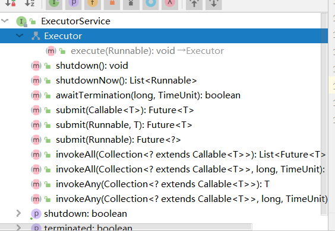
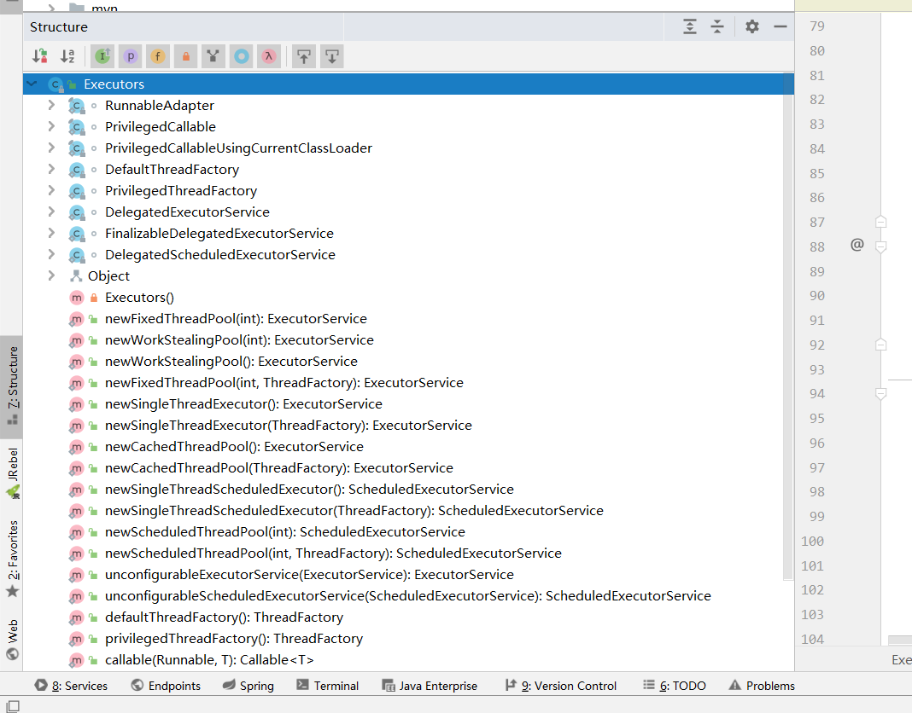

## 概念

+ volatile 使对象的值在读取的时候一直更新，在线程调用的时候从主内存中读取，而不是在高速缓存区读取，解决幻读问题
+ synchroized 重量级锁，能给对象加锁，下个线程访问的时候，无法访问

+ wait 等待，会释放锁

+ notify 会将wait等待的锁打开，继续运行，不会释放锁

+ Latch 门闩，给一个CountDownLatch不涉及锁定，当count的值为零时当前线程继续运行

+ ```java
  synchronized void m1() {} //这样的格式，锁定的是This对象
  ```

+ ThreadLocal线程局部变量 用来设置该对象的内容只能让自己的线程用，不放在主内存中，其他线程看不到，以volatile意思相反   
 ````java
 static ThreadLocal<Person> tl = new ThreadLocal<>();
 ````

### ReentranLock

Lock 是自定义锁的接口，通过实现Lock就可以实现一个锁

reetranlock手动锁，用来替代Synchronized

__注意__

+ ReentrantLock这个锁必须手动解锁，在遇到异常的时候不会解锁

```java
创建一把ReentrantLock 类型的锁
Lock lock = new ReentrantLock();
```

```java
public class ReentrantLock2 {
    Lock lock = new ReentrantLock();
    void m1() {
        try {
           // 加锁
            lock.lock(); //synchronized(this)
            for (int i = 0; i < 10; i++) {
                TimeUnit.SECONDS.sleep(1);
                System.out.println(i);
            }
        } catch (InterruptedException e) {
            e.printStackTrace();
        } finally {
            //解锁
            lock.unlock();
        }
    }
}
```

__优点__

+ trylock进行尝试锁定，不管锁定与否，方法都将继续执行

```java
//立刻尝试锁，如果能锁就返回true
boolean locked = lock.tryLock();
//在五秒钟后，尝试锁 （第一个参数 时间长度，第二参数时间类型）
locked = lock.tryLock(5, TimeUnit.SECONDS);
```

+ lockInterruptibly 可被打断的

```java
lock.lockInterruptibly(); //可以对interrupt()方法做出响应
t2.interrupt(); //在主线程中 打断线程2的等待
//t2为被打断线程的名称
```

+ 公平锁  每个线程得到运行的机会是一样的

```java
private static ReentrantLock lock = new ReentrantLock(true); //参数为true表示为公平锁，请对比输出结果
```

+ 可指定不同条件的 线程

```java
//Condition的方式可以更加精确的指定哪些线程被唤醒
private Lock lock = new ReentrantLock();private Condition producer = lock.newCondition();private Condition consumer = lock.newCondition();
```

## 创建线程

### new Thread

Java线程类也是一个object类,它的实例都继承自java.lang.Thread或其子类。 可以用如下方式用java中创建一个线程：

```java
Tread thread = new Thread(); //可以填入参数Runnable target
//执行该线程可以调用该线程的start()方法:
thread.start();
```

### 创建Thread的子类

创建Thread子类的一个实例并重写run方法，run方法会在调用start()方法之后被执行。例子如下：

```java
public class MyThread extends Thread {
   public void run(){
     System.out.println("MyThread running");
   }
}
//可以用如下方式创建并运行上述Thread子类
MyThread myThread = new MyThread();
myTread.start();

```

你也可以如下创建一个Thread的匿名子类：

```java
Thread thread = new Thread(){
   public void run(){
     System.out.println("Thread Running");
   }
};
thread.start();
```

当新的线程的run方法执行以后，计算机将会打印出字符串”Thread Running”。

### 实现Runnable接口

 第二种编写线程执行代码的方式是新建一个实现了java.lang.Runnable接口的类的实例，实例中的方法可以被线程调用。下面给出例子：

```java
public class MyRunnable implements Runnable {
   public void run(){
    System.out.println("MyRunnable running");
   }
}
//为了使线程能够执行run()方法，需要在Thread类的构造函数中传入 MyRunnable的实例对象。示例如下：
Thread thread = new Thread(new MyRunnable());
thread.start();

```

当线程运行时，它将会调用实现了Runnable接口的run方法。上例中将会打印出”MyRunnable running”。

同样，也可以创建一个实现了Runnable接口的匿名类，如下所示：

```java
Runnable myRunnable = new Runnable(){
   public void run(){
     System.out.println("Runnable running");
   }
}
Thread thread = new Thread(myRunnable);
thread.start();
```

### **创建子类还是实现Runnable接口**

对于这两种方式哪种好并没有一个确定的答案，它们都能满足要求。就我个人意见，我更倾向于实现Runnable接口这种方法。因为线程池可以有效的管理实现了Runnable接口的线程，如果线程池满了，新的线程就会排队等候执行，直到线程池空闲出来为止。而如果线程是通过实现Thread子类实现的，这将会复杂一些。

有时我们要同时融合实现Runnable接口和Thread子类两种方式。例如，实现了Thread子类的实例可以执行多个实现了Runnable接口的线程。一个典型的应用就是线程池。

### **线程名**

当创建一个线程的时候，可以给线程起一个名字。它有助于我们区分不同的线程。例如：如果有多个线程写入System.out，我们就能够通过线程名容易的找出是哪个线程正在输出。例子如下：

```java
MyRunnable runnable = new MyRunnable();
Thread thread = new Thread(runnable, "New Thread");
thread.start();
System.out.println(thread.getName());
```

需要注意的是，因为MyRunnable并非Thread的子类，所以MyRunnable类并没有getName()方法。可以通过以下方式得到当前线程的引用：

```java
Thread.currentThread();
```

因此，通过如下代码可以得到当前线程的名字：

```java
String threadName = Thread.currentThread().getName();
```


### 例子

启动线程

```java
public class TestThread  {
    public static void main(String[] args) {
        //继承Thread
        MyThread myThread = new MyThread();
        myThread.start();
        //实现Runnable
        Thread Runnable = new Thread(new MyThread2());
        Runnable.start();

        //实现Callbale 可以有返回值
        //创建FutureTask的对象
        FutureTask<String> task = new FutureTask<String>(new MyThread3());
        //创建Thread类的对象
        Thread thread3 = new Thread(task);
        //开启线程
        thread3.start();
        
        //创建实例
        new Thread(TestThread.getString()).start();
    }
    private static String getString (){
        System.out.println("创建Thread实例");
        return "213";
    }
}
```

继承 Thread

```java
public class MyThread extends Thread {
    @Override
    public void run() {
        System.out.println("继承Thread");
    }
}
```

实现 Runable

```java
public class MyThread2  implements  Runnable{
    @Override
    public void run() {
        System.out.println("实现Runable接口");
    }
}
```

实现 callable

```java
public class MyThread3 implements Callable<String> {
    @Override
    public String call() throws Exception {
        System.out.println("实现Callable");
        return null ;
    }
}
```


## 并发容器

### ConcurrentMap 

ConcurrentMap，它是一个接口，是一个能够支持并发访问的java.util.map集合；

ConcurrentHashMap是一个线程安全，并且是一个高效的HashMap。

```java
public interface ConcurrentMap<K, V> extends Map<K, V> {
    //插入元素
    V putIfAbsent(K key, V value);
    //移除元素
    boolean remove(Object key, Object value);
    //替换元素
    boolean replace(K key, V oldValue, V newValue);
    //替换元素  此replace不会对Map中原有的key--value进行比较，如果key存在则直接替换；
    V replace(K key, V value);
}
```

ConcurrentHashMap定位一个元素的过程需要进行两次Hash操作，第一次Hash定位到Segment，第二次Hash定位到元素所在的链表的头部。因此，这样的结构带来的缺点就是Hash的过程要比普通的HashMap要长，但是带来的好处就是写操作的时候可以支队元素所在的Segment进行加锁即可，不会影响到其他的Segment。这样，在最理想的情况下，

__Hashtable__

```java
Map<String, String> map = new Hashtable<>();
```

也是一个线程安全的接口，但是性能相对较低由于synchronized锁加在了HashTable的每一个方法上，所以这个锁就是HashTable本身--this。那么，可想而知HashTable的效率是如何，安全是保证了，但是效率却损失了。

__ConcurrentSkipListMap__

当高并发并且需要排序的时候用ConcurrentSkipListMap(跳表)

```java
Map<String, String> map = new ConcurrentSkipListMap<>(); //高并发并且排序
```


__总结__

+ 对于map/set的选择

>  不是并发的时候
>
> 可以用hashMap,treemap(有序),linkedhashmap
>
> 并发的时候
>
> Hashtable
>
> Collections.sychronizedXXX
>
> ConcurrentHashMap（并发较高的时候）
>
> ConcurrentSkipListMap（并发较高的时候，且需要排序）

### CopyOnwriteList

CopyOnwriteList（保证并发安全）写时复制写的效率非常的低，读的效率很高

在写的时候将这个list复制一份，对复制这份进行写操作，读的时候还读原来的，不影响读的效率

__Vector__

Vector是Java早期提供的线程安全的动态数组，synchronized关键字几乎修饰了所有对外暴露的方法，所以在读远大于写的操作场景中，Vector将会发生大量锁竞争，从而给系统带来性能开销。如果不需要线程安全，并不建议选择，毕竟同步是有额外开销的。Vector内部是使用对象数组来保存数据，可以根据需要自动的增加容量，当数组已满时，会创建新的数组，并拷贝原有数组数据。

```java
List<String> lists = new Vector();
//new ArrayList<>(); //这个会出并发问题！
```

### synchronizedList

__给List加锁__

```java
 List<String> strs = new ArrayList<>();
 List<String> strsSync = Collections.synchronizedList(strs);
```


### Queue

队列分为两种类型 并发队列（并发加锁），阻塞队列

```
Queue  
CocurrentLinkedQueue （并发队列）//concurrentArrayQueue   BlockingQueue   （阻塞队列）
	LinkedBQ     
	ArrayBQ    （无界队列）
	TransferQueue   
	SynchronusQueue 
	DelayQueue 执行定时任务
```

queue中的一些方法

#### CocurrentLinkedQueue

并发队列

+ offer 给容器中添加

> ```java
>  Queue<String> strs = new ConcurrentLinkedQueue<>();
>         for (int i = 0; i < 10; i++) {
>             strs.offer("a" + i);  //add
>         }
> ```
>
> 当满的时候不会有异常，添加的时候返回一个boolean值

+ add   添加满了就会报异常
+ poll  拿走一个并删掉
+ peek  拿走一个但是不删除

#### LinkedBlockingQueue

+ put  阻塞队列才有的方法   向数组中加入一个值，如果数组满了就阻塞
+ take   阻塞队列才有的方法 往外拿， 没了就阻塞

```java
static BlockingQueue<String> strs = new LinkedBlockingQueue<>();
strs.put("a" + i); //如果满了，就会等待
strs.take()//如果空了，就会等待
```

#### ArrayBlockingQueue

无边界数组

```java
static BlockingQueue<String> strs = new ArrayBlockingQueue<>(10);//当有参数的时候，参数为数组大小
//满了就会等待，程序阻塞
strs.put("aaa"); 
//尝试加入，如果满， 等待1秒，一秒后就放弃
strs.offer("aaa", 1, TimeUnit.SECONDS);

```

#### DelayQueue

延迟队列，无界队列

可以设置这个队列里面的对象需要过多长时间才能被拿出来，当对象运行被消费者使用的时候等待时间最长的优先级最高

再实现的时候需要实现一个接口

```java
    static class MyTask implements Delayed {
        long runningTime;

        MyTask(long rt) {
            this.runningTime = rt;
        }

        @Override
        public int compareTo(Delayed o) {
            if (this.getDelay(TimeUnit.MILLISECONDS) < o.getDelay(TimeUnit.MILLISECONDS))
                return -1;
            else if (this.getDelay(TimeUnit.MILLISECONDS) > o.getDelay(TimeUnit.MILLISECONDS))
                return 1;
            else
                return 0;
        }
        @Override
        public long getDelay(TimeUnit unit) {

            return unit.convert(runningTime - System.currentTimeMillis(), TimeUnit.MILLISECONDS);
        }
        @Override
        public String toString() {
            return "" + runningTime;
        }
    }
	//主方法
    public static void main(String[] args) throws InterruptedException {
        long now = System.currentTimeMillis();
        MyTask t1 = new MyTask(now + 1000);
        MyTask t2 = new MyTask(now + 2000);
        tasks.put(t1);
        tasks.put(t2);
        System.out.println(tasks);
        for (int i = 0; i < 5; i++) {
            System.out.println(tasks.take());
        }
    }
```

#### TransferQueue

转移队列

场景，消费者先启动，生产者生产一个东西，不是直接交给队列，而是首先去找消费者，给消费者

```java
 public static void main(String[] args) throws InterruptedException {
        LinkedTransferQueue<String> strs = new LinkedTransferQueue<>();
		new Thread(() -> {
			try {
				System.out.println(strs.take());
			} catch (InterruptedException e) {
				e.printStackTrace();
			}
		}).start();
		//必须要处理掉，不然就卡着不动
        //strs.transfer("aaa");
        strs.put("aaa");
        new Thread(() -> {
            try {
                System.out.println(strs.take());
            } catch (InterruptedException e) {
                e.printStackTrace();
            }
        }).start();
    }
```

#### SynchronusQueue

特殊的TransferQueue 它没用队列，或者说队列的大小为0，生产者生产一个对象， 如果没消费者消费，就等着。

```java
    public static void main(String[] args) throws InterruptedException {
        BlockingQueue<String> strs = new SynchronousQueue<>();
        new Thread(() -> {
            try {
                System.out.println(strs.take());
            } catch (InterruptedException e) {
                e.printStackTrace();
            }
        }).start();
        strs.put("aaa"); //阻塞等待消费者消费
        //strs.add("aaa");// 会报错
        System.out.println(strs.size());
    }
```


## 线程池

### Executor

Executor接口是线程池的顶级接口，里面只有一个方法

```java
//在未来某个时间执行给定的命令。 该命令可以在一个新的线程中执行，在一个线程池，或者调用线程，在酌情Executor执行。
void execute(Runnable command);
```

### ExecutorService 

ExecutorService 接口是EXCutro的子类，里面也包含了父类的方法



还重新定义了Submit接口

submit()除了能提交，Runnable,对象，还能提交callable对象

__Runnable  与callable区别__

这两个对象设计出来就是被线程调用的
这两个接口的方法都只有一个

callable

```java
V call() throws Exception;
```

Runnable  

```java
 public abstract void run();
```

区别就是返回值，callable是可以有返回值的，而runnable方法是没有返回值的

### Executors 

Executors是操作Executor的工具类



### 几种线程池

#### FixedThreadPool

FixedThreadPool 能够规定线程池的个数，而且线程池的大小是固定不变的，当有某一个线程上的任务完成得时候，该线程不会结束，而是等待接收任务

```java
public static void main(String[] args) throws InterruptedException, ExecutionException {
        long start = System.currentTimeMillis();
        getPrime(1, 200000);
        long end = System.currentTimeMillis();
        System.out.println(end - start);

        final int cpuCoreNum = 4;

        ExecutorService service = Executors.newFixedThreadPool(cpuCoreNum);
}
```

#### CachedPool 

CachedPool缓存线程池，在运行得时候来一个任务就会启一个线程，当新来一个任务时，如果有空闲就用该空闲得，如果没有空闲得时候，就新建一个线程。

每个线程都有一个默认得生存周期默认60S,当线程空闲60S时这个线程就关闭

```java
public class T08_CachedPool {
    public static void main(String[] args) throws InterruptedException {
        ExecutorService service = Executors.newCachedThreadPool();
        System.out.println(service);
        for (int i = 0; i < 2; i++) {
            service.execute(() -> {
                try {
                    TimeUnit.MILLISECONDS.sleep(500);
                } catch (InterruptedException e) {
                    e.printStackTrace();
                }
                System.out.println(Thread.currentThread().getName());
            });
        }
        System.out.println(service);
        TimeUnit.SECONDS.sleep(80);
        System.out.println(service);
    }
}
```

#### SingleThreadPool

SingleThreadPool 单线程，这个线程池只有一个线程，如果有其他线程来得时候，就排队，能够保证线程顺序得一致性

```java
public class T09_SingleThreadPool {
    public static void main(String[] args) {
        ExecutorService service = Executors.newSingleThreadExecutor();
        for (int i = 0; i < 5; i++) {
            final int j = i;
            service.execute(() -> {
                System.out.println(j + " " + Thread.currentThread().getName());
            });
        }
    }
}
```


#### ScheduledPool

 ScheduledPool 计划线程池，能定时启动线程，还能够实现线程复用，其他特点与不用线程池类似

```java
public class T10_ScheduledPool {
    public static void main(String[] args) {
        ScheduledExecutorService service = Executors.newScheduledThreadPool(4);
        //以固定得频率执行这个任务
        service.scheduleAtFixedRate(() -> {
            try {
                TimeUnit.MILLISECONDS.sleep(new Random().nextInt(1000));
            } catch (InterruptedException e) {
                e.printStackTrace();
            }
            System.out.println(Thread.currentThread().getName());
        }, 0, 500, TimeUnit.MILLISECONDS);

    }
}
```

#### WorkStealingPool

WorkStealingPool工作窃取线程池，每个线程都维护自己得队列，当自己得队列没有任务得时候，就窃取其他线程得队列来运行

WorkStealingPool 产生得线程时，精灵线程，当主线程结束运行得时候，其他线程是没有返回结果得。

线程池的大小就是系统的核数

WorkStealingPool ,在底层实现得时候调用得是ForkJoinPool

> ```java
> public static ExecutorService newWorkStealingPool() {
>         return new ForkJoinPool
>             (Runtime.getRuntime().availableProcessors(),
>              ForkJoinPool.defaultForkJoinWorkerThreadFactory,
>              null, true);
>     }
> ```

```java
public class T11_WorkStealingPool {
    public static void main(String[] args) throws IOException {
        ExecutorService service = Executors.newWorkStealingPool();
        System.out.println(Runtime.getRuntime().availableProcessors());
        service.execute(new R(1000));
        service.execute(new R(2000));
        service.execute(new R(2000));
        service.execute(new R(2000)); //daemon
        service.execute(new R(2000));
        //由于产生的是精灵线程（守护线程、后台线程），主线程不阻塞的话，看不到输出
        System.in.read();
    }
    static class R implements Runnable {
        int time;
        R(int t) {
            this.time = t;
        }
        @Override
        public void run() {
            try {
                TimeUnit.MILLISECONDS.sleep(time);
            } catch (InterruptedException e) {
                e.printStackTrace();
            }
            System.out.println(time + " " + Thread.currentThread().getName());
        }
    }
}
```

#### ForkJoinPool

ForkJoinPool分叉链接线程池

将一个大的任务，切割成多个任务，子任务可以再次切割（多次），然后将多个子任务的结果进行结合，得出这个大任务的结果。切割和结合，都由线程池来维护

ForkJoinPool是精灵线程

```java
public class T12_ForkJoinPool {
    static int[] nums = new int[1000000];
    static final int MAX_NUM = 50000;
    static Random r = new Random();
    static {
        for (int i = 0; i < nums.length; i++) {
            nums[i] = r.nextInt(100);
        }
        System.out.println(Arrays.stream(nums).sum()); //stream api
    }
	/*
	// RecursiveAction 无返回值
	static class AddTask extends RecursiveAction { 
		int start, end;
		AddTask(int s, int e) {
			start = s;
			end = e;
		}
		@Override
		protected void compute() {
			if(end-start <= MAX_NUM) {
				long sum = 0L;
				for(int i=start; i<end; i++) sum += nums[i];
				System.out.println("from:" + start + " to:" + end + " = " + sum);
			} else {
				AddTask subTask1 = new AddTask(start, middle);
				AddTask subTask2 = new AddTask(middle, end);
				subTask1.fork();
				subTask2.fork();
			}
		}
	}
	*/
	//RecursiveTask 有返回值
    static class AddTask extends RecursiveTask<Long> {
        private static final long serialVersionUID = 1L;
        int start, end;
        AddTask(int s, int e) {
            start = s;
            end = e;
        }
        @Override
        protected Long compute() {
            if (end - start <= MAX_NUM) {
                long sum = 0L;
                for (int i = start; i < end; i++) sum += nums[i];
                return sum;
            }
            int middle = start + (end - start) / 2;
            AddTask subTask1 = new AddTask(start, middle);
            AddTask subTask2 = new AddTask(middle, end);
            subTask1.fork();
            subTask2.fork();
            return subTask1.join() + subTask2.join();
        }
    }
    public static void main(String[] args) throws IOException {
        ForkJoinPool fjp = new ForkJoinPool();
        AddTask task = new AddTask(0, nums.length);
        fjp.execute(task);
        long result = task.join();
        System.out.println(result);
        //System.in.read();
    }
}
```

#### ParallelStreamAPI

ParallelStreamAPI 是开启多个线程对流进行处理，加快效率