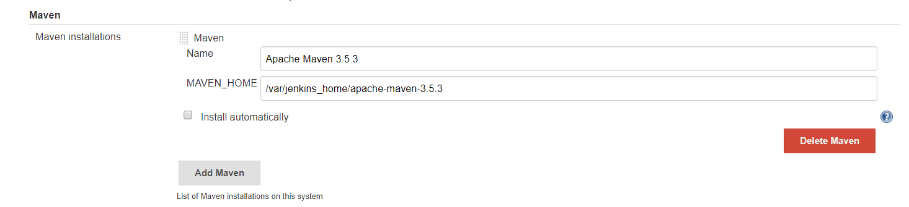
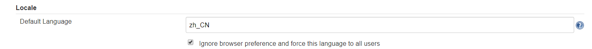

---

title: Jenkins
date: 2019-11-18 11:04:20
tags: 
 - Jenkins
categories: Linux 
---

# 什么是 Jenkins


Jenkins 是一个开源软件项目，是基于 Java 开发的一种持续集成工具，用于监控持续重复的工作，旨在提供一个开放易用的软件平台，使软件的持续集成变成可能。

官方网站：https://jenkins.io/

# 基于 Docker 安装 Jenkins

## docker-compose

Jenkins 是一个简单易用的持续集成软件平台，我们依然采用 Docker 的方式部署，`docker-compose.yml` 配置文件如下：

```text
version: '3.1'
services:
  jenkins:
    restart: always
    image: jenkinsci/jenkins
    container_name: jenkins
    ports:
      # 发布端口
      - 8080:8080
      # 基于 JNLP 的 Jenkins 代理通过 TCP 端口 50000 与 Jenkins master 进行通信
      - 50000:50000
    environment:
      TZ: Asia/Shanghai
    volumes:
      - ./data:/var/jenkins_home
```

安装过程中会出现 `Docker 数据卷` 权限问题，用以下命令解决：

```text
chown -R 1000 /usr/local/docker/jenkins/data
```

## 解锁 Jenkins

Jenkins 第一次启动时需要输入一个初始密码用以解锁安装流程，使用 `docker logs jenkins` 即可方便的查看到初始密码


**注意：** 安装时可能会因为网速等原因导致安装时间比较长，请大家耐心等待。如果长时间停留在安装页没反应，请尝试使用 `F5` 刷新一下。

## 使用自定义插件的方式安装

插件是 Jenkins 的核心，其丰富的插件（截止到 `2018.10.29` 共有 `77350` 个插件）可以满足不同人群的不同需求

插件地址：https://plugins.jenkins.io/


**注意：** 除了默认勾选的插件外，一定要勾选 `Publish over SSH` 插件，这是我们实现持续交付的重点插件。

**开始安装了，根据网络情况，安装时间可能会比较长，请耐心等待**


**很多插件装不上怎么办？不要慌，记住这些插件的名字，咱们稍后可以手动安装**

## 安装成功效果图

- 创建管理员

- 安装完成，进入首页

## 附：Jenkins 手动安装插件

### 使用插件管理器安装

- `Manage Jenkins` -> `Manage Plugins` -> `Avaliable`


- 过滤出想要安装的插件，然后点击 `Download now and install after restart`


### 手动上传 `.hpi` 文件

- 点击进入插件中心

- 点击 `Archives`

- 下载需要的版本ng)

- 在插件管理器中选择 `Advanced`

- 选择上传即可

### 重启 Jenkins

```text
docker-compose down
docker-compose up -d
```


**注意：** 请留意需要下载插件的警告信息，如果不满足安装条件，Jenkins 是会拒绝安装的。如下图：

# 配置Jenkins

## 配置 JDK & Maven

- 上传 JDK 和 Maven 的 tar 包到服务器（容器数据卷目录）
- `Manage Jenkins` -> `Global Tool Configuration`
- 安装 JDK（`JAVA_HOME` **的路径是宿主机目录，切记！不明白的看视频！**）

```text
/var/jenkins_home/jdk1.8.0_152
```


- 安装 Maven（`MAVEN_HOME` **的路径是宿主机目录，切记！不明白的看视频！**）

```text
/var/jenkins_home/apache-maven-3.5.3
```



- 别忘记保存

## 配置本地化（显示中文）

- 安装 `Locale` 插件


- `Manage Jenkins` -> `Configure System` -> `Locale`



- 本地化效果图


## 安装动态参数插件

该插件的主要目的是为了方便我们后面在做项目构建时可以按照版本进行构建（支持一键回滚哦）


# 坑

## 坑一 jenkins页面空白

 安装完成jenkins后，点击【使用admin账号继续】后，页面一片空白的解决办法：

step1:

- Jenkins插件管理-高级设置界面==> http://localhost:8080/pluginManager/advanced
- 把https协议改为http，并点击【提交】

step2:重启jenkins

- 在url地址中输入：localhost:8080/restart
- 点击【是】