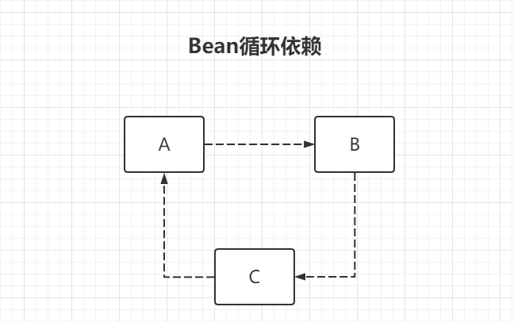
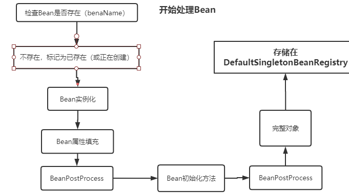
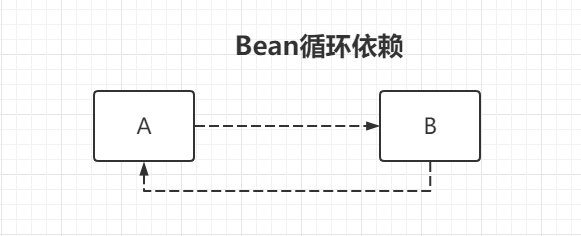
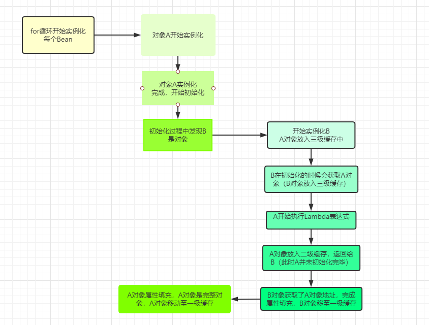

## 产生循环依赖的原因



A调用B,

B又调用C，

C又调用A

## 三级缓存

- Spring只能解决Setter方法注入的单例bean之间的循环依赖

Spring通过引入三级缓存来解决循环依赖的问题

```java
// 从上至下 分表代表这“三级缓存”
//一级缓存
private final Map<String, Object> singletonObjects = new ConcurrentHashMap<>(256); 
// 二级缓存
private final Map<String, Object> earlySingletonObjects = new HashMap<>(16); 
// 三级缓存
private final Map<String, ObjectFactory<?>> singletonFactories = new HashMap<>(16); 
```

回忆Bean的创建过程



一个Bean在创建的过程中有这几个状态

+ 未实例化
+ 实例化未初始化
+ 完整对象

## 创建流程

大致流程如下图所示



大致一A依赖B,B依赖A来演示



步骤

+ 对象A开始实例化，A对象实例化完成后，校验是否是循环依赖，如果是就提前暴露对象。ABean的名称和Lambda表达（（）->{getEarlyBeanReference(beanName,mbd,bena)}）存入三级缓存中。

+ 将为创建完成的A对象赋值给提前暴露对象，A对象开始填充属性，A所需的属性是一个对象【这个对象初始化是-运行时Bean引用（RunTimeBeanReference）】
+ 校验填充的属性值是否是，运行时Bean引用（RunTimeBeanReference），如果是，开始实例化对象B
+ 开始实例化B对象，实例化完成后开始给B对象填充属性，将B对象的名字和Lambda表达式put到三级缓存。
+ 开始给B对象填充A属性，B所需的属性是一个对象【这个对象初始化是-运行时Bean引用（RunTimeBeanReference）】,和填充A对象的时候一致
+ 继续填充B对象，校验B对象所需的属性值A的状态是不是正在创建中，【是】。开始从二级缓存中找，【未找到】，三级缓存中找【找到】，调用A对象的lambda表达式。
+ 对象A从三级缓存中移至二级缓存，此时二级缓存中存储的是一个初始化未完成的对象。
+ 对象B的属性A值填充，B对象属性填充完毕，B是一个完整的对象。B从三级缓存中移动至一级缓存，B对象创建完毕
+ A对象继续填充属性，A对象的属性B填充完毕，从二级缓存中移至一级缓存。
+ A对象是完整的对象了