流程图

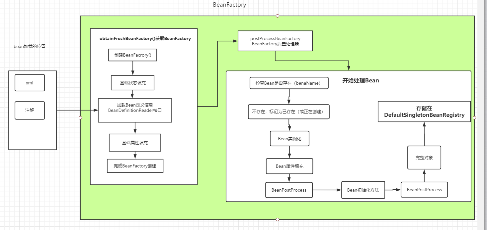

本地声明了一个beans.xml，里面有一个自定义的bean

## 加载过程

### 开始加载Benan信息

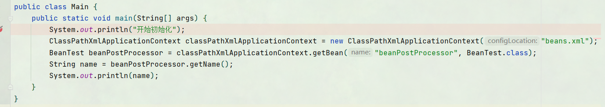

### 初始化一些默认信息

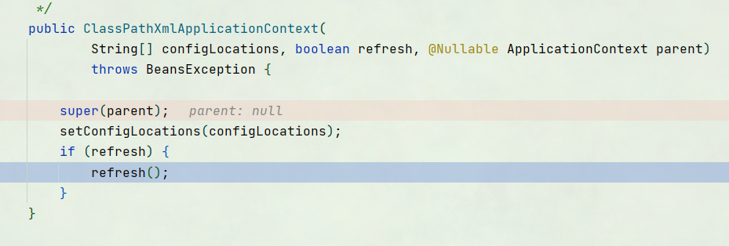

### 进入关键的方法refresh()

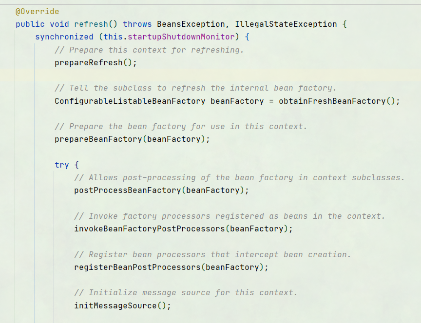

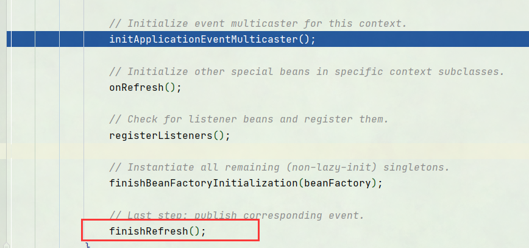

#### prepareRefresh()

 准备上下文刷新工作，记录启动时间，初始化一些属性。

#### obtainFreshBeanFactory()

obtainFreshBeanFactory() 创建新的BeanFactory工厂 

1. 进入刷新工厂方法

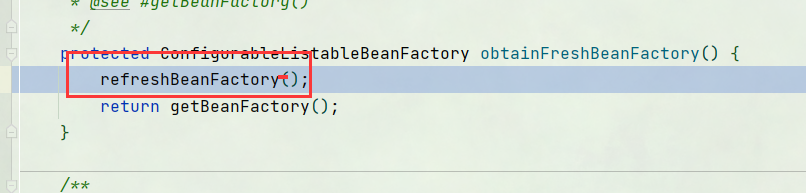

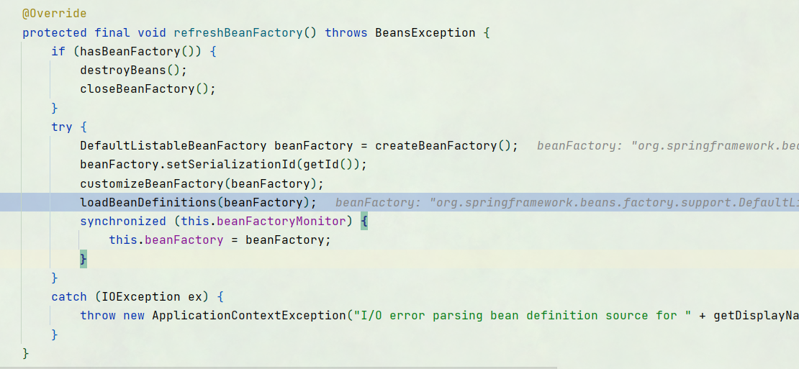

2. 加载Bean定义信息

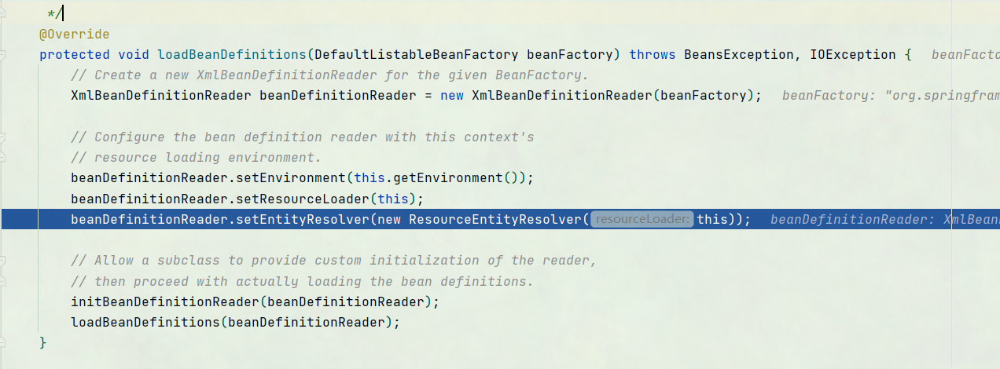

此时创建了XmlBeanDefinitionReader（），这个类实现了

BeanDefinitionReader接口，能够对Bean信息进行加载。

后续进行一些属性填充

最终调用loadBeanDefinitions(beanDefinitionReader);来实现

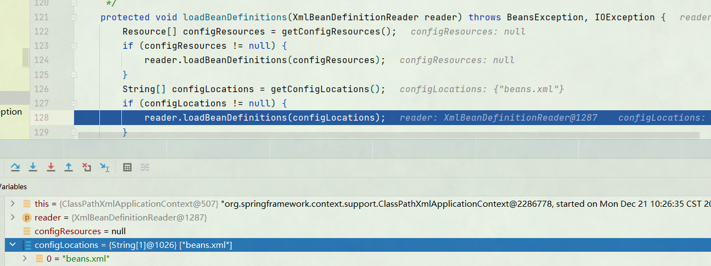

此时完成了对Bean定义信息的加载

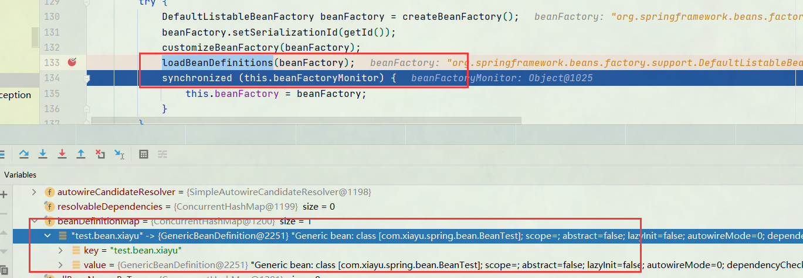

#### prepareBeanFactory(beanFactory)

BeanFactory属性填充

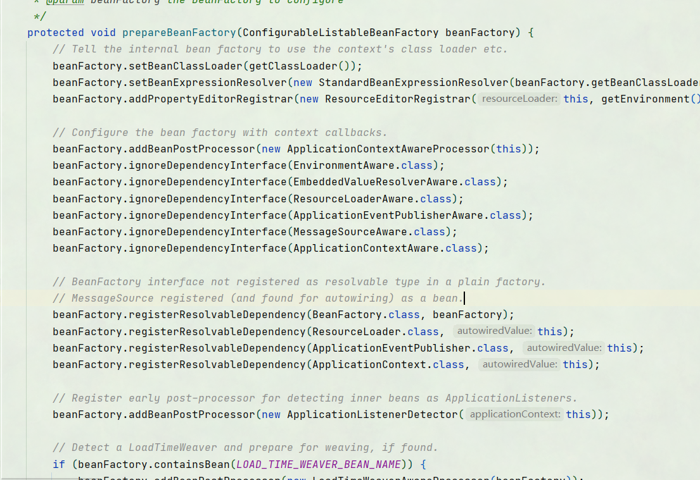

#### postProcessBeanFactory(beanFactory)

BeanFacory后置处理器，可以对BenaFacory进行一些处理。默认没有实现类等待被处理。

后续的几个方法为实例化

invokeBeanFactoryPostProcessors(beanFactory);  实例化并调用后置处理器

registerBeanPostProcessors(beanFactory); 注册后置处理器

#### initMessageSource()

initMessageSource(); 初始化消息源

#### initApplicationEventMulticaster()

initApplicationEventMulticaster();初始化事件多播器

#### onRefresh()

onRefresh(); 初始化特定的Bean 默认为空，后续可自定义

#### registerListeners()

registerListeners(); 检查并注册监听器

#### 重点 finishBeanFactoryInitialization(beanFactory)

finishBeanFactoryInitialization(beanFactory);初始化剩下的默认单例Bean

此为重点，单独类列出来-创建Bean'

#### finishRefresh();

finishRefresh();完成创建，刷新事件。

## 创建Bean

由方法finishBeanFactoryInitialization(ConfigurableListableBeanFactory beanFactory)进入，开始构建bean

preInstantiateSingletons();开始构建所有非延时的bean

循环初始化Bean,循环创建Bean

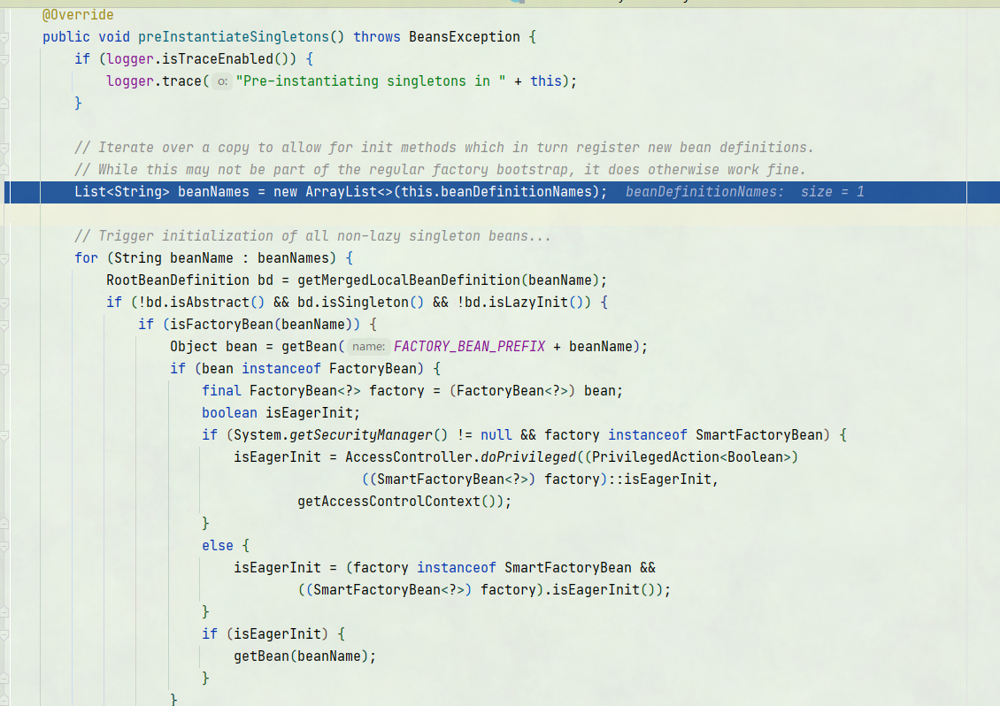

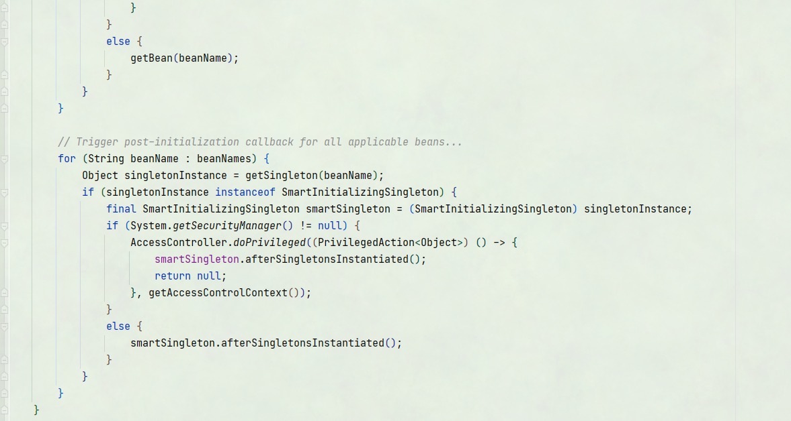

创建Bean

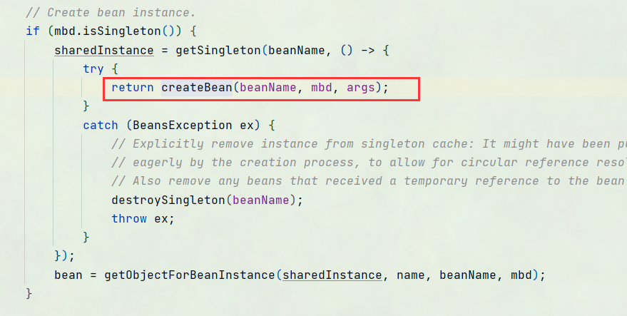

创建好的Bean在DefaultSingletonBeanRegistry中

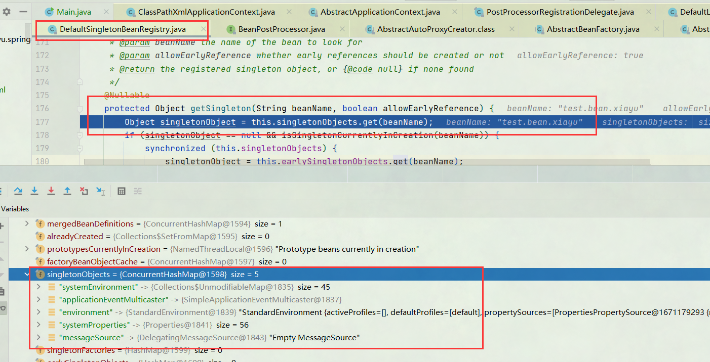

DefaultSingletonBeanRegistry.singletonObjects

