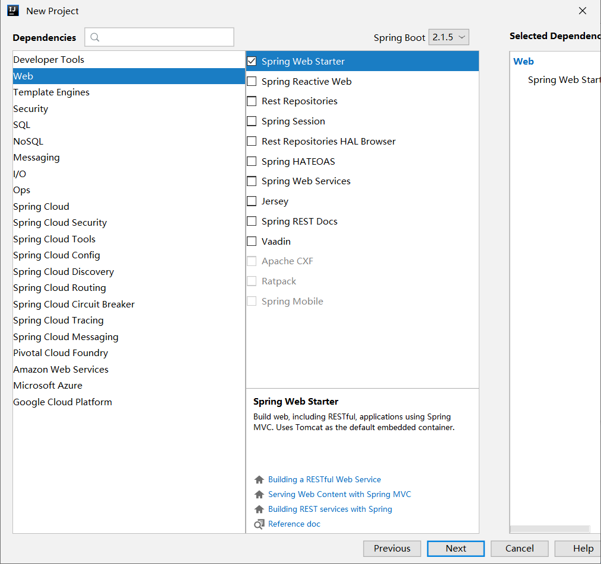
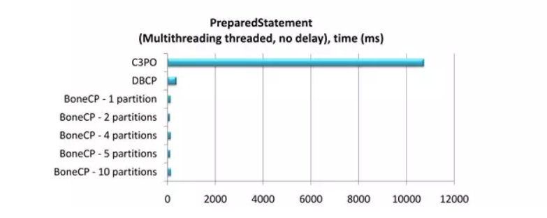

# Spring Boot 简介

## 概述

Spring Boot 可以称之为 **新一代 JavaEE 开发标准**；随着动态语言的流行 (Ruby、Groovy、Scala、Node.js)，Java 的开发显得格外的笨重：繁多的配置、低下的开发效率、复杂的部署流程以及第三方技术集成难度大。

在上述环境下，Spring Boot 应运而生。它使用 “**习惯优于配置**” （项目中存在大量的配置，此外还内置了一个习惯性的配置，让你无需手动进行配置）的理念让你的项目快速的运行起来。使用 Spring Boot 很容易创建一个独立运行（运行 Jar，内嵌 Servlet 容器）准生产级别的基于 Spring 框架的项目，使用 Spring Boot 你可以不用或者只需很少的 Spring 配置。

## Spring 简史

### Spring 1.x 时代

在 Spring1.x 时代，都是通过 xml 文件配置 bean，随着项目的不断扩大，需要将 xml 配置分放到不同的配置文件中，需要频繁的在 java 类和 xml 配置文件中切换。

### Spring 2.x 时代

随着 JDK 1.5 带来的注解支持，Spring2.x 可以使用注解对 Bean 进行申明和注入，大大的减少了 xml 配置文件，同时也大大简化了项目的开发。

那么，问题来了，究竟是应该使用 xml 还是注解呢？

最佳实践：

- 应用的基本配置用 xml，比如：数据源、资源文件等
- 业务开发用注解，比如：Service 中注入 bean 等

### Spring 3.x 时代

从 Spring3.x 开始提供了 Java 配置方式，使用 Java 配置方式可以更好的理解你配置的 Bean，现在我们就处于这个时代，并且 Spring4.x 和 Spring boot 都推荐使用 java 配置的方式。

### Spring 5.x 时代

Spring5.x 是 Java 界首个支持响应式的 Web 框架，是 Spring 的一个重要版本，距离 Spring4.x 差不多四年。在此期间，大多数增强都是在 Spring Boot 项目中完成的，其最大的亮点就是提供了完整的端到端响应式编程的支持（新增 Spring WebFlux 模块）。

Spring WebFlux 同时支持使用旧的 Spring MVC 注解声明 `Reactive Controller`。和传统的 `MVC Controller` 不同，`Reactive Controller` 操作的是 **非阻塞** 的 `ServerHttpRequest` 和 `ServerHttpResponse`，而不再是 Spring MVC 里的 HttpServletRequest 和 HttpServletResponse。

至此也代表着 Java 正式迎来了响应式异步编程的时代。

## Spring Boot 优缺点

### 优点

- 快速构建项目
- 对主流开发框架的无配置集成
- 项目可独立运行，无需外部依赖 Servlet 容器
- 提供运行时的应用监控
- 极大地提高了开发、部署效率
- 与云计算的天然集成

### 缺点

- 版本迭代速度很快，一些模块改动很大
- 由于不用自己做配置，报错时很难定位

# Spring Boot 第一个应用

## 创建项目

这里我们使用 Intellij IDEA 来新建一个 Spring Boot 项目。

### Spring 初始化器


### 填写项目信息


### 选择版本和依赖



### 保存项目到指定目录


### 工程目录结构

创建完成后的工程目录结构如下：

```shell
│  .gitignore
│  pom.xml
│
│
└─src
    ├─main
    │  ├─java
    │  │  └─com
    │  │      └─funtl
    │  │          └─hello
    │  │              └─spring
    │  │                  └─boot
    │  │                          HelloSpringBootApplication.java
    │  │
    │  └─resources
    │      │  application.properties
    │      │
    │      ├─static
    │      └─templates
    └─test
        └─java
            └─com
                └─funtl
                    └─hello
                        └─spring
                            └─boot
                                    HelloSpringBootApplicationTests.java
```

- .gitignore：Git 过滤配置文件
- pom.xml：Maven 的依赖管理配置文件
- HelloSpringBootApplication.java：程序入口
- resources：资源文件目录
  - static: 静态资源文件目录
  - templates：模板资源文件目录
  - application.properties：Spring Boot 的配置文件，实际开发中会替换成 YAML 语言配置（application.yml）

## POM

```xml
<?xml version="1.0" encoding="UTF-8"?>
<project xmlns="http://maven.apache.org/POM/4.0.0" xmlns:xsi="http://www.w3.org/2001/XMLSchema-instance"
         xsi:schemaLocation="http://maven.apache.org/POM/4.0.0 http://maven.apache.org/xsd/maven-4.0.0.xsd">
    <modelVersion>4.0.0</modelVersion>
    <parent>
        <groupId>org.springframework.boot</groupId>
        <artifactId>spring-boot-starter-parent</artifactId>
        <version>2.1.6.RELEASE</version>
        <relativePath/> <!-- lookup parent from repository -->
    </parent>
    <groupId>com.funtl</groupId>
    <artifactId>hello-spring-boot</artifactId>
    <version>0.0.1-SNAPSHOT</version>
    <name>hello-spring-boot</name>
    <description>Demo project for Spring Boot</description>
    <properties>
        <java.version>1.8</java.version>
    </properties>
    <dependencies>
        <dependency>
            <groupId>org.springframework.boot</groupId>
            <artifactId>spring-boot-starter-web</artifactId>
        </dependency>
        <dependency>
            <groupId>org.springframework.boot</groupId>
            <artifactId>spring-boot-starter-test</artifactId>
            <scope>test</scope>
        </dependency>
    </dependencies>
    <build>
        <plugins>
            <plugin>
                <groupId>org.springframework.boot</groupId>
                <artifactId>spring-boot-maven-plugin</artifactId>
                <configuration>
                    <mainClass>com.funtl.hello.spring.boot.HelloSpringBootApplication</mainClass>
                </configuration>
            </plugin>
        </plugins>
    </build>
</project>
```

- parent：继承了 Spring Boot 的 Parent，表示我们是一个 Spring Boot 工程
- `spring-boot-starter-web`：包含了 `spring-boot-starter` 还自动帮我们开启了 Web 支持

## 功能演示

我们创建一个 Controller 来演示一下 Spring Boot 的神奇功能

```java
package com.funtl.hello.spring.boot.controller;
import org.springframework.web.bind.annotation.GetMapping;
import org.springframework.web.bind.annotation.RestController;
@RestController
public class HelloController {
    @GetMapping(value = "/")
    public String sayHi() {
        return "Hello Spring Boot.";
    }
}
```

启动 `HelloSpringBootApplication` 的 `main()` 方法，浏览器访问 [http://localhost:8080](http://www.qfdmy.com/wp-content/themes/quanbaike/go.php?url=aHR0cDovL2xvY2FsaG9zdDo4MDgw) 可以看到：

```te
Hello Spring Boot.
```

## 神奇之处

- 没有配置 web.xml
- 没有配置 application.xml，Spring Boot 帮你配置了
- 没有配置 application-mvc.xml，Spring Boot 帮你配置了
- 没有配置 Tomcat，Spring Boot 内嵌了 Tomcat 容器

# Spring Boot 单元测试

## 概述

主要是通过 `@RunWith` 和 `@SpringBootTest` 注解来开启单元测试功能

```java
package com.funtl.hello.spring.boot;
import org.junit.Before;
import org.junit.Test;
import org.junit.runner.RunWith;
import org.springframework.beans.factory.annotation.Autowired;
import org.springframework.boot.test.context.SpringBootTest;
import org.springframework.boot.test.web.client.TestRestTemplate;
import org.springframework.boot.web.server.LocalServerPort;
import org.springframework.http.ResponseEntity;
import org.springframework.test.context.junit4.SpringRunner;
import java.net.URL;
import static org.hamcrest.CoreMatchers.equalTo;
import static org.junit.Assert.assertThat;
@RunWith(SpringRunner.class)
@SpringBootTest(classes = HelloSpringBootApplication.class, webEnvironment = SpringBootTest.WebEnvironment.RANDOM_PORT)
public class HelloSpringBootApplicationTests {
    @LocalServerPort
    private int port;
    private URL base;
    @Autowired
    private TestRestTemplate template;
    @Before
    public void setUp() throws Exception {
        this.base = new URL("http://localhost:" + port + "/");
    }
    @Test
    public void contextLoads() {
        ResponseEntity<String> response = template.getForEntity(base.toString(), String.class);
        assertThat(response.getBody(), equalTo("Hello Spring Boot"));
    }
}
```

运行它会先启动 Spring Boot 工程，再启动单元测试


# Spring  Boot 常用配置

## 概述

本章节主要介绍一下 Spring Boot 中的一些常用配置，比如：自定义 Banner、配置日志、关闭特定的自动配置等。

## 自定义 Banner

在 Spring Boot 启动的时候会有一个默认的启动图案

```shell
  .   ____          _            __ _ _
 /\\ / ___'_ __ _ _(_)_ __  __ _ \ \ \ \
( ( )\___ | '_ | '_| | '_ \/ _` | \ \ \ \
 \\/  ___)| |_)| | | | | || (_| |  ) ) ) )
  '  |____| .__|_| |_|_| |_\__, | / / / /
 =========|_|==============|___/=/_/_/_/
 :: Spring Boot ::        (v2.1.6.RELEASE)
```

我们在 `src/main/resources` 目录下新建一个 banner.txt

通过 [http://patorjk.com/software/taag](http://www.qfdmy.com/wp-content/themes/quanbaike/go.php?url=aHR0cDovL3BhdG9yamsuY29tL3NvZnR3YXJlL3RhYWc=) 网站生成字符串，将网站生成的字符复制到 banner.txt 中

再次运行这个程序

```shell
${AnsiColor.BRIGHT_RED}
////////////////////////////////////////////////////////////////////
//                          _ooOoo_                               //
//                         o8888888o                              //
//                         88" . "88                              //
//                         (| ^_^ |)                              //
//                         O\  =  /O                              //
//                      ____/`---'\____                           //
//                    .'  \\|     |//  `.                         //
//                   /  \\|||  :  |||//  \                        //
//                  /  _||||| -:- |||||-  \                       //
//                  |   | \\\  -  /// |   |                       //
//                  | \_|  ''\---/''  |   |                       //
//                  \  .-\__  `-`  ___/-. /                       //
//                ___`. .'  /--.--\  `. . ___                     //
//              ."" '<  `.___\_<|>_/___.'  >'"".                  //
//            | | :  `- \`.;`\ _ /`;.`/ - ` : | |                 //
//            \  \ `-.   \_ __\ /__ _/   .-` /  /                 //
//      ========`-.____`-.___\_____/___.-`____.-'========         //
//                           `=---='                              //
//      ^^^^^^^^^^^^^^^^^^^^^^^^^^^^^^^^^^^^^^^^^^^^^^^^^^        //
//            佛祖保佑       永不宕机     永无BUG                  //
////////////////////////////////////////////////////////////////////
```

常用属性设置：

- `${AnsiColor.BRIGHT_RED}`：设置控制台中输出内容的颜色
- `${application.version}`：用来获取 `MANIFEST.MF` 文件中的版本号
- `${application.formatted-version}`：格式化后的 `${application.version}` 版本信息
- `${spring-boot.version}`：Spring Boot 的版本号
- `${spring-boot.formatted-version}`：格式化后的 `${spring-boot.version}` 版本信息

## 配置文件

Spring Boot 项目使用一个全局的配置文件 `application.properties` 或者是 `application.yml`，在 `resources` 目录下或者类路径下的 `/config` 下，一般我们放到 `resources` 下。

修改 Tomcat 的端口为 9090，并将默认的访问路径 "/" 修改为 "boot"，可以在 `application.properties` 中添加：

```properties
server.port=9090
server.context-path=/boot
```

或在 application.yml 中添加：

```properties
server:
  port: 9090
  context-path: /boot
```

[更多配置](https://docs.spring.io/spring-boot/docs/2.0.2.RELEASE/reference/html/common-application-properties.html)

## Starter POM

Spring Boot 为我们提供了简化企业级开发绝大多数场景的 starter pom ，只要使用了应用场景所需要的 starter pom ，相关的技术配置将会消除，就可以得到 Spring Boot 为我们提供的自动配置的 Bean。

[更多 Starter POM](https://docs.spring.io/spring-boot/docs/2.0.2.RELEASE/reference/html/using-boot-build-systems.html#using-boot-starter)

## 日志配置

Spring Boot 对各种日志框架都做了支持，我们可以通过配置来修改默认的日志的配置

默认情况下，Spring Boot 使用 Logback 作为日志框架

```properties
ogging:
  file: ../logs/spring-boot-hello.log
  level.org.springframework.web: DEBUG
```

## 关闭特定的自动配置

关闭特定的自动配置使用 `@SpringBootApplication` 注解的 `exclude` 参数即可，这里以关闭数据源的自动配置为例

```java
@SpringBootApplication(exclude = {DataSourceAutoConfiguration.class})		
```

完成


# Spring Boot 整合HikariCP

## 什么是 HikariCP

HiKariCP 是数据库连接池的一个后起之秀，号称性能最好，可以完美地 PK 掉其他连接池。是一个高性能的 JDBC 连接池，基于 BoneCP 做了不少的改进和优化。超快，快到连 Spring Boot 2 都宣布支持了。

[官方 GitHub 地址](https://github.com/brettwooldridge/HikariCP)

## 什么是 BoneCP

传说中 BoneCP 在快速这个特点上做到了极致，官方数据是 C3P0 等的 25 倍左右，以下为性能测试报告。

### 单线程

- 1,000,000 获取连接/释放连接请求
- 获取/释放连接之间没有延迟
- 连接池范围：20-50
- 增量：5
- 线程：1
- 分区：1


### 多线程

- 500 个线程分别获取释放 100 个连接
- 在获取连接和释放连接之间引入了 10ms 的延迟 `Thread.sleep()`，模拟连接完成工作
- 连接池范围：50-200
- 增量：5
- 线程：5


### Prepared Statement

- 500 个线程分别获取释放 100 个连接
- 无延迟
- 连接池范围：50-200
- 增量：5
- 线程：5



## 为什么需要 HikariCP

BoneCP 作者放弃维护，并在 Github 项目主页推荐大家使用 HikariCP，Hikari（ひかり[shi ga li]） 来自日文，是 **光** 的意思。这个产品的口号是 **快速、简单、可靠**

### 优化

- **字节码精简 ：** 优化代码，直到编译后的字节码最少，这样，CPU 缓存可以加载更多的程序代码
- **优化代理和拦截器 ：** 减少代码，例如 HikariCP 的 Statement proxy 只有 100 行代码，只有 BoneCP 的十分之一
- **自定义数组类型（FastStatementList）代替 ArrayList ：** 避免每次 `get()` 调用都要进行 range check，避免调用 `remove()` 时的从头到尾的扫描
- **自定义集合类型（ConcurrentBag）：** 提高并发读写的效率
- **其他针对 BoneCP 缺陷的优化：** 比如对于耗时超过一个 CPU 时间片的方法调用的研究（但没说具体怎么优化）

### 代码量

几个连接池的代码量对比（代码量越少，一般意味着执行效率越高、发生 BUG 的可能性越低）

| Pool     | Files | Code  |
| :------- | :---- | :---- |
| Vibur    | 34    | 1927  |
| HikariCP | 21    | 2228  |
| Tomcat   | 31    | 6345  |
| BoneCP   | 49    | 7293  |
| C3P0     | 120   | 15550 |

### 速度

别人发推文测试 Hikari 速度


### 稳定性


### 可靠性

另外，关于可靠性方面，也是有实验和数据支持的。对于数据库连接中断的情况，通过测试 `getConnection()`，各种 CP 的不相同处理方法如下（所有 CP 都配置了跟 `connectionTimeout` 类似的参数为 5 秒钟）

- **HikariCP(A)：** 等待 5 秒钟后，如果连接还是没有恢复，则抛出一个 `SQLExceptions` 异常；后续的 `getConnection()` 也是一样处理
- **C3P0(C-)：** 完全没有反应，没有提示，也不会在 `CheckoutTimeout` 配置的时长超时后有任何通知给调用者；然后等待 2 分钟后终于醒来了，返回一个 error
- **Tomcat(F)：** 返回一个 connection，然后调用者如果利用这个无效的 connection 执行 SQL 语句 结果可想而知；大约 55 秒之后终于醒来了，这时候的 `getConnection()` 终于可以返回一个 error，但没有等待参数配置的 5 秒钟，而是立即返回 error
- **BoneCP(C)：** 跟 Tomcat 的处理方法一样；也是大约 55 秒之后才醒来，有了正常的反应，并且终于会等待 5 秒钟之后返回 error 了

## 整合 HikariCP

### POM

```xml
<!-- 主要增加 HikariCP 依赖 -->
<dependency>
    <groupId>com.zaxxer</groupId>
    <artifactId>HikariCP</artifactId>
    <version>${hikaricp.version}</version>
</dependency>
<dependency>
    <groupId>org.springframework.boot</groupId>
    <artifactId>spring-boot-starter-jdbc</artifactId>
    <exclusions>
        <!-- 排除 tomcat-jdbc 以使用 HikariCP -->
        <exclusion>
            <groupId>org.apache.tomcat</groupId>
            <artifactId>tomcat-jdbc</artifactId>
        </exclusion>
    </exclusions>
</dependency>
<!-- MySQL 驱动 -->
<dependency>
    <groupId>mysql</groupId>
    <artifactId>mysql-connector-java</artifactId>
    <version>${mysql.version}</version>
</dependency>
```

### application.yml

```yaml
spring:
  datasource:
    type: com.zaxxer.hikari.HikariDataSource
    driver-class-name: com.mysql.cj.jdbc.Driver
    url: jdbc:mysql://192.168.141.130:3306/myshop?useUnicode=true&characterEncoding=utf-8&useSSL=false
    username: root
    password: 123456
    hikari:
      minimum-idle: 5
      idle-timeout: 600000
      maximum-pool-size: 10
      auto-commit: true
      pool-name: MyHikariCP
      max-lifetime: 1800000
      connection-timeout: 30000
      connection-test-query: SELECT 1
```

> **注意：** 具体使用方法在 **测试 MyBatis 操作数据库** 时进行介绍，此处仅为准备环节

# Spring Boot 整合 TkMyBatis

## 什么是 TkMyBatis

tk.mybatis 是在 MyBatis 框架的基础上提供了很多工具，让开发更加高效

### POM

在 `pom.xml` 文件中引入 `mapper-spring-boot-starter` 依赖，该依赖会自动引入 MyBaits 相关依赖

```xml
<dependency>
    <groupId>tk.mybatis</groupId>
    <artifactId>mapper-spring-boot-starter</artifactId>
    <version>2.1.5</version>
</dependency>
```

### application.yml

```yaml
mybatis:
    # 实体类的存放路径
    type-aliases-package: com.funtl.hello.spring.boot.domain
    mapper-locations: classpath:mapper/*.xml
```

### 创建通用父级接口

主要作用是让 DAO 层的接口继承该接口，以达到使用 tk.mybatis 的目的

```java
package tk.mybatis.mapper;
import tk.mybatis.mapper.common.Mapper;
import tk.mybatis.mapper.common.MySqlMapper;
/**
 * 自己的 Mapper
 * 特别注意，该接口不能被扫描到，否则会出错
 * <p>Title: MyMapper</p>
 * <p>Description: </p>
 *
 * @author Lusifer
 * @version 1.0.0
 * @date 2018/5/29 0:57
 */
public interface MyMapper<T> extends Mapper<T>, MySqlMapper<T> {
}
```

## 什么是 PageHelper

PageHelper 是 Mybatis 的分页插件，支持多数据库、多数据源。可以简化数据库的分页查询操作，整合过程也极其简单，只需引入依赖即可。

### POM

在 `pom.xml` 文件中引入 `pagehelper-spring-boot-starter` 依赖

```xml
<dependency>
    <groupId>com.github.pagehelper</groupId>
    <artifactId>pagehelper-spring-boot-starter</artifactId>
    <version>1.2.12</version>
</dependency>
```

# 代码生成插件

## 概述

我们无需手动编写实体类，DAO，XML配置文件，只需要使用MyBatis提供的一个Maven插件就可以自动生成所需的各种文件便能够满足基本的业务需求，如果业务比较复杂只需要修改相关文件即可。

## 配置插件

在`pom.xml`文件中增加`mybatis-generator-maven-plugin`插件

```xml
<build>
    <plugins>
        <plugin>
            <groupId>org.mybatis.generator</groupId>
            <artifactId>mybatis-generator-maven-plugin</artifactId>
            <version>1.3.7</version>
            <configuration>
                <configurationFile>${basedir}/src/main/resources/generator/generatorConfig.xml</configurationFile>
                <overwrite>true</overwrite>
                <verbose>true</verbose>
            </configuration>
            <dependencies>
                <dependency>
                    <groupId>mysql</groupId>
                    <artifactId>mysql-connector-java</artifactId>
                    <version>${mysql.version}</version>
                </dependency>
                <dependency>
                    <groupId>tk.mybatis</groupId>
                    <artifactId>mapper</artifactId>
                    <version>4.1.5</version>
                </dependency>
            </dependencies>
        </plugin>
    </plugins>
</build>
```

> **注意：** `configurationFile`自动生成所需的配置文件路径

## 自动生成的配置

在`src/main/resources/generator/`目录下创建³³ `generatorConfig.xml`配置文件：

```xml
<?xml version="1.0" encoding="UTF-8"?>
<!DOCTYPE generatorConfiguration
        PUBLIC "-//mybatis.org//DTD MyBatis Generator Configuration 1.0//EN"
        "http://mybatis.org/dtd/mybatis-generator-config_1_0.dtd">
<generatorConfiguration>
    <!-- 引入数据库连接配置 -->
    <properties resource="jdbc.properties"/>
    <context id="Mysql" targetRuntime="MyBatis3Simple" defaultModelType="flat">
        <property name="beginningDelimiter" value="`"/>
        <property name="endingDelimiter" value="`"/>
        <!-- 配置 tk.mybatis 插件 -->
        <plugin type="tk.mybatis.mapper.generator.MapperPlugin">
            <property name="mappers" value="com.funtl.utils.MyMapper"/>
        </plugin>
        <!-- 配置数据库连接 -->
        <jdbcConnection
                driverClass="${jdbc.driverClass}"
                connectionURL="${jdbc.connectionURL}"
                userId="${jdbc.username}"
                password="${jdbc.password}">
        </jdbcConnection>
        <!-- 配置实体类存放路径 -->
        <javaModelGenerator targetPackage="com.funtl.hello.spring.boot.domain" targetProject="src/main/java"/>
        <!-- 配置 XML 存放路径 -->
        <sqlMapGenerator targetPackage="mapper" targetProject="src/main/resources"/>
        <!-- 配置 DAO 存放路径 -->
        <javaClientGenerator
                targetPackage="com.funtl.hello.spring.boot.mapper"
                targetProject="src/main/java"
                type="XMLMAPPER"/>
        <!-- 配置需要指定生成的数据库和表，% 代表所有表 -->
        <table catalog="myshop" tableName="%">
            <!-- 默认为 false，如果设置为 true，在生成的 SQL 中，table 名字不会加上 catalog 或 schema -->
            <property name="ignoreQualifiersAtRuntime" value="true"/>
            <!-- mysql 配置 -->
            <generatedKey column="id" sqlStatement="Mysql" identity="true"/>
        </table>
    </context>
</generatorConfiguration>
```

## 配置数据源

在`src/main/resources`目录下创建³³ `jdbc.properties`数据源配置：

```properties
jdbc.driverClass=com.mysql.cj.jdbc.Driver
jdbc.connectionURL=jdbc:mysql://192.168.141.130:3306/myshop?useUnicode=true&characterEncoding=utf-8&useSSL=false
jdbc.username=root
jdbc.password=123456
```

## 插件自动生成

```xml
mvn mybatis-generator:generate
# 输出如下
"C:\Program Files\Java\jdk1.8.0_181\bin\java.exe" -Dvisualvm.id=757855494303000 -Dmaven.multiModuleProjectDirectory=D:\Workspace\Study\other\hello-spring-boot "-Dmaven.home=C:\Program Files\JetBrains\IntelliJ IDEA 2019.1.3\plugins\maven\lib\maven3" "-Dclassworlds.conf=C:\Program Files\JetBrains\IntelliJ IDEA 2019.1.3\plugins\maven\lib\maven3\bin\m2.conf" "-javaagent:C:\Program Files\JetBrains\IntelliJ IDEA 2019.1.3\lib\idea_rt.jar=64651:C:\Program Files\JetBrains\IntelliJ IDEA 2019.1.3\bin" -Dfile.encoding=UTF-8 -classpath "C:\Program Files\JetBrains\IntelliJ IDEA 2019.1.3\plugins\maven\lib\maven3\boot\plexus-classworlds-2.5.2.jar" org.codehaus.classworlds.Launcher -Didea.version2019.1.3 --update-snapshots -s D:\apache-maven-3.6.1\conf\settings.xml org.mybatis.generator:mybatis-generator-maven-plugin:1.3.7:generate
[INFO] Scanning for projects...
[INFO]                                                                         
[INFO] ------------------------------------------------------------------------
[INFO] Building hello-spring-boot 0.0.1-SNAPSHOT
[INFO] ------------------------------------------------------------------------
[INFO] 
[INFO] --- mybatis-generator-maven-plugin:1.3.7:generate (default-cli) @ hello-spring-boot ---
[INFO] Connecting to the Database
[INFO] Introspecting table myshop..%
[INFO] Generating Record class for table myshop..tb_item_param_item
[INFO] Generating Mapper Interface for table myshop..tb_item_param_item
[INFO] Generating SQL Map for table myshop..tb_item_param_item
[INFO] Generating Record class for table myshop..tb_item_cat
[INFO] Generating Mapper Interface for table myshop..tb_item_cat
[INFO] Generating SQL Map for table myshop..tb_item_cat
[INFO] Generating Record class for table myshop..tb_order
[INFO] Generating Mapper Interface for table myshop..tb_order
[INFO] Generating SQL Map for table myshop..tb_order
[INFO] Generating Record class for table myshop..tb_content
[INFO] Generating Mapper Interface for table myshop..tb_content
[INFO] Generating SQL Map for table myshop..tb_content
[INFO] Generating Record class for table myshop..tb_order_item
[INFO] Generating Mapper Interface for table myshop..tb_order_item
[INFO] Generating SQL Map for table myshop..tb_order_item
[INFO] Generating Record class for table myshop..tb_item
[INFO] Generating Mapper Interface for table myshop..tb_item
[INFO] Generating SQL Map for table myshop..tb_item
[INFO] Generating Record class for table myshop..tb_item_desc
[INFO] Generating Mapper Interface for table myshop..tb_item_desc
[INFO] Generating SQL Map for table myshop..tb_item_desc
[INFO] Generating Record class for table myshop..tb_item_param
[INFO] Generating Mapper Interface for table myshop..tb_item_param
[INFO] Generating SQL Map for table myshop..tb_item_param
[INFO] Generating Record class for table myshop..tb_order_shipping
[INFO] Generating Mapper Interface for table myshop..tb_order_shipping
[INFO] Generating SQL Map for table myshop..tb_order_shipping
[INFO] Generating Record class for table myshop..tb_user
[INFO] Generating Mapper Interface for table myshop..tb_user
[INFO] Generating SQL Map for table myshop..tb_user
[INFO] Generating Record class for table myshop..tb_content_category
[INFO] Generating Mapper Interface for table myshop..tb_content_category
[INFO] Generating SQL Map for table myshop..tb_content_category
[INFO] Saving file TbItemParamItemMapper.xml
[INFO] Saving file TbItemCatMapper.xml
[INFO] Saving file TbOrderMapper.xml
[INFO] Saving file TbContentMapper.xml
[INFO] Saving file TbOrderItemMapper.xml
[INFO] Saving file TbItemMapper.xml
[INFO] Saving file TbItemDescMapper.xml
[INFO] Saving file TbItemParamMapper.xml
[INFO] Saving file TbOrderShippingMapper.xml
[INFO] Saving file TbUserMapper.xml
[INFO] Saving file TbContentCategoryMapper.xml
[INFO] Saving file TbItemParamItem.java
[INFO] Saving file TbItemParamItemMapper.java
[INFO] Saving file TbItemCat.java
[INFO] Saving file TbItemCatMapper.java
[INFO] Saving file TbOrder.java
[INFO] Saving file TbOrderMapper.java
[INFO] Saving file TbContent.java
[INFO] Saving file TbContentMapper.java
[INFO] Saving file TbOrderItem.java
[INFO] Saving file TbOrderItemMapper.java
[INFO] Saving file TbItem.java
[INFO] Saving file TbItemMapper.java
[INFO] Saving file TbItemDesc.java
[INFO] Saving file TbItemDescMapper.java
[INFO] Saving file TbItemParam.java
[INFO] Saving file TbItemParamMapper.java
[INFO] Saving file TbOrderShipping.java
[INFO] Saving file TbOrderShippingMapper.java
[INFO] Saving file TbUser.java
[INFO] Saving file TbUserMapper.java
[INFO] Saving file TbContentCategory.java
[INFO] Saving file TbContentCategoryMapper.java
[WARNING] Column id, specified as an identity column in table myshop..tb_order, does not exist in the table.
[WARNING] Column id, specified as an identity column in table myshop..tb_item_desc, does not exist in the table.
[WARNING] Column id, specified as an identity column in table myshop..tb_order_shipping, does not exist in the table.
[INFO] ------------------------------------------------------------------------
[INFO] BUILD SUCCESS
[INFO] ------------------------------------------------------------------------
[INFO] Total time: 1.892 s
[INFO] Finished at: 2019-06-24T03:40:09+08:00
[INFO] Final Memory: 30M/634M
[INFO] ------------------------------------------------------------------------
Process finished with exit code 0
```

## 附：扩展阅读

### 完整配置案例

```xml
?xml version="1.0" encoding="UTF-8"?>
<!DOCTYPE generatorConfiguration
  PUBLIC "-//mybatis.org//DTD MyBatis Generator Configuration 1.0//EN"
"http://mybatis.org/dtd/mybatis-generator-config_1_0.dtd">
<!-- 配置生成器 -->
<generatorConfiguration>
<!-- 可以用于加载配置项或者配置文件，在整个配置文件中就可以使用${propertyKey}的方式来引用配置项
    resource：配置资源加载地址，使用resource，MBG从classpath开始找，比如com/myproject/generatorConfig.properties        
    url：配置资源加载地质，使用URL的方式，比如file:///C:/myfolder/generatorConfig.properties.
    注意，两个属性只能选址一个;
    另外，如果使用了mybatis-generator-maven-plugin，那么在pom.xml中定义的properties都可以直接在generatorConfig.xml中使用
<properties resource="" url="" />
 -->
 <!-- 在MBG工作的时候，需要额外加载的依赖包
     location属性指明加载jar/zip包的全路径
<classPathEntry location="/Program Files/IBM/SQLLIB/java/db2java.zip" />
  -->
<!-- 
    context:生成一组对象的环境 
    id:必选，上下文id，用于在生成错误时提示
    defaultModelType:指定生成对象的样式
        1，conditional：类似hierarchical；
        2，flat：所有内容（主键，blob）等全部生成在一个对象中；
        3，hierarchical：主键生成一个XXKey对象(key class)，Blob等单独生成一个对象，其他简单属性在一个对象中(record class)
    targetRuntime:
        1，MyBatis3：默认的值，生成基于MyBatis3.x以上版本的内容，包括XXXBySample；
        2，MyBatis3Simple：类似MyBatis3，只是不生成XXXBySample；
    introspectedColumnImpl：类全限定名，用于扩展MBG
-->
<context id="mysql" defaultModelType="hierarchical" targetRuntime="MyBatis3Simple" >
    <!-- 自动识别数据库关键字，默认false，如果设置为true，根据SqlReservedWords中定义的关键字列表；
        一般保留默认值，遇到数据库关键字（Java关键字），使用columnOverride覆盖
     -->
    <property name="autoDelimitKeywords" value="false"/>
    <!-- 生成的Java文件的编码 -->
    <property name="javaFileEncoding" value="UTF-8"/>
    <!-- 格式化java代码 -->
    <property name="javaFormatter" value="org.mybatis.generator.api.dom.DefaultJavaFormatter"/>
    <!-- 格式化XML代码 -->
    <property name="xmlFormatter" value="org.mybatis.generator.api.dom.DefaultXmlFormatter"/>
    <!-- beginningDelimiter和endingDelimiter：指明数据库的用于标记数据库对象名的符号，比如ORACLE就是双引号，MYSQL默认是`反引号； -->
    <property name="beginningDelimiter" value="`"/>
    <property name="endingDelimiter" value="`"/>
    <!-- 必须要有的，使用这个配置链接数据库
        @TODO:是否可以扩展
        # MySQL 8.x: com.mysql.cj.jdbc.Driver
     -->
    <jdbcConnection driverClass="com.mysql.jdbc.Driver" connectionURL="jdbc:mysql:///pss" userId="root" password="admin">
        <!-- 这里面可以设置property属性，每一个property属性都设置到配置的Driver上 -->
    </jdbcConnection>
    <!-- java类型处理器 
        用于处理DB中的类型到Java中的类型，默认使用JavaTypeResolverDefaultImpl；
        注意一点，默认会先尝试使用Integer，Long，Short等来对应DECIMAL和 NUMERIC数据类型； 
    -->
    <javaTypeResolver type="org.mybatis.generator.internal.types.JavaTypeResolverDefaultImpl">
        <!-- 
            true：使用BigDecimal对应DECIMAL和 NUMERIC数据类型
            false：默认,
                scale>0;length>18：使用BigDecimal;
                scale=0;length[10,18]：使用Long；
                scale=0;length[5,9]：使用Integer；
                scale=0;length<5：使用Short；
         -->
        <property name="forceBigDecimals" value="false"/>
    </javaTypeResolver>
    <!-- java模型创建器，是必须要的元素
        负责：1，key类（见context的defaultModelType）；2，java类；3，查询类
        targetPackage：生成的类要放的包，真实的包受enableSubPackages属性控制；
        targetProject：目标项目，指定一个存在的目录下，生成的内容会放到指定目录中，如果目录不存在，MBG不会自动建目录
     -->
    <javaModelGenerator targetPackage="com._520it.mybatis.domain" targetProject="src/main/java">
        <!--  for MyBatis3/MyBatis3Simple
            自动为每一个生成的类创建一个构造方法，构造方法包含了所有的field；而不是使用setter；
         -->
        <property name="constructorBased" value="false"/>
        <!-- 在targetPackage的基础上，根据数据库的schema再生成一层package，最终生成的类放在这个package下，默认为false -->
        <property name="enableSubPackages" value="true"/>
        <!-- for MyBatis3 / MyBatis3Simple
            是否创建一个不可变的类，如果为true，
            那么MBG会创建一个没有setter方法的类，取而代之的是类似constructorBased的类
         -->
        <property name="immutable" value="false"/>
        <!-- 设置一个根对象，
            如果设置了这个根对象，那么生成的keyClass或者recordClass会继承这个类；在Table的rootClass属性中可以覆盖该选项
            注意：如果在key class或者record class中有root class相同的属性，MBG就不会重新生成这些属性了，包括：
                1，属性名相同，类型相同，有相同的getter/setter方法；
         -->
        <property name="rootClass" value="com._520it.mybatis.domain.BaseDomain"/>
        <!-- 设置是否在getter方法中，对String类型字段调用trim()方法 -->
        <property name="trimStrings" value="true"/>
    </javaModelGenerator>
    <!-- 生成SQL map的XML文件生成器，
        注意，在Mybatis3之后，我们可以使用mapper.xml文件+Mapper接口（或者不用mapper接口），
            或者只使用Mapper接口+Annotation，所以，如果 javaClientGenerator配置中配置了需要生成XML的话，这个元素就必须配置
        targetPackage/targetProject:同javaModelGenerator
     -->
    <sqlMapGenerator targetPackage="com._520it.mybatis.mapper" targetProject="src/main/resources">
        <!-- 在targetPackage的基础上，根据数据库的schema再生成一层package，最终生成的类放在这个package下，默认为false -->
        <property name="enableSubPackages" value="true"/>
    </sqlMapGenerator>
    <!-- 对于mybatis来说，即生成Mapper接口，注意，如果没有配置该元素，那么默认不会生成Mapper接口 
        targetPackage/targetProject:同javaModelGenerator
        type：选择怎么生成mapper接口（在MyBatis3/MyBatis3Simple下）：
            1，ANNOTATEDMAPPER：会生成使用Mapper接口+Annotation的方式创建（SQL生成在annotation中），不会生成对应的XML；
            2，MIXEDMAPPER：使用混合配置，会生成Mapper接口，并适当添加合适的Annotation，但是XML会生成在XML中；
            3，XMLMAPPER：会生成Mapper接口，接口完全依赖XML；
        注意，如果context是MyBatis3Simple：只支持ANNOTATEDMAPPER和XMLMAPPER
    -->
    <javaClientGenerator targetPackage="com._520it.mybatis.mapper" type="ANNOTATEDMAPPER" targetProject="src/main/java">
        <!-- 在targetPackage的基础上，根据数据库的schema再生成一层package，最终生成的类放在这个package下，默认为false -->
        <property name="enableSubPackages" value="true"/>
        <!-- 可以为所有生成的接口添加一个父接口，但是MBG只负责生成，不负责检查
        <property name="rootInterface" value=""/>
         -->
    </javaClientGenerator>
    <!-- 选择一个table来生成相关文件，可以有一个或多个table，必须要有table元素
        选择的table会生成一下文件：
        1，SQL map文件
        2，生成一个主键类；
        3，除了BLOB和主键的其他字段的类；
        4，包含BLOB的类；
        5，一个用户生成动态查询的条件类（selectByExample, deleteByExample），可选；
        6，Mapper接口（可选）
        tableName（必要）：要生成对象的表名；
        注意：大小写敏感问题。正常情况下，MBG会自动的去识别数据库标识符的大小写敏感度，在一般情况下，MBG会
            根据设置的schema，catalog或tablename去查询数据表，按照下面的流程：
            1，如果schema，catalog或tablename中有空格，那么设置的是什么格式，就精确的使用指定的大小写格式去查询；
            2，否则，如果数据库的标识符使用大写的，那么MBG自动把表名变成大写再查找；
            3，否则，如果数据库的标识符使用小写的，那么MBG自动把表名变成小写再查找；
            4，否则，使用指定的大小写格式查询；
        另外的，如果在创建表的时候，使用的""把数据库对象规定大小写，就算数据库标识符是使用的大写，在这种情况下也会使用给定的大小写来创建表名；
        这个时候，请设置delimitIdentifiers="true"即可保留大小写格式；
        可选：
        1，schema：数据库的schema；
        2，catalog：数据库的catalog；
        3，alias：为数据表设置的别名，如果设置了alias，那么生成的所有的SELECT SQL语句中，列名会变成：alias_actualColumnName
        4，domainObjectName：生成的domain类的名字，如果不设置，直接使用表名作为domain类的名字；可以设置为somepck.domainName，那么会自动把domainName类再放到somepck包里面；
        5，enableInsert（默认true）：指定是否生成insert语句；
        6，enableSelectByPrimaryKey（默认true）：指定是否生成按照主键查询对象的语句（就是getById或get）；
        7，enableSelectByExample（默认true）：MyBatis3Simple为false，指定是否生成动态查询语句；
        8，enableUpdateByPrimaryKey（默认true）：指定是否生成按照主键修改对象的语句（即update)；
        9，enableDeleteByPrimaryKey（默认true）：指定是否生成按照主键删除对象的语句（即delete）；
        10，enableDeleteByExample（默认true）：MyBatis3Simple为false，指定是否生成动态删除语句；
        11，enableCountByExample（默认true）：MyBatis3Simple为false，指定是否生成动态查询总条数语句（用于分页的总条数查询）；
        12，enableUpdateByExample（默认true）：MyBatis3Simple为false，指定是否生成动态修改语句（只修改对象中不为空的属性）；
        13，modelType：参考context元素的defaultModelType，相当于覆盖；
        14，delimitIdentifiers：参考tableName的解释，注意，默认的delimitIdentifiers是双引号，如果类似MYSQL这样的数据库，使用的是`（反引号，那么还需要设置context的beginningDelimiter和endingDelimiter属性）
        15，delimitAllColumns：设置是否所有生成的SQL中的列名都使用标识符引起来。默认为false，delimitIdentifiers参考context的属性
        注意，table里面很多参数都是对javaModelGenerator，context等元素的默认属性的一个复写；
     -->
    <table tableName="userinfo" >
        <!-- 参考 javaModelGenerator 的 constructorBased属性-->
        <property name="constructorBased" value="false"/>
        <!-- 默认为false，如果设置为true，在生成的SQL中，table名字不会加上catalog或schema； -->
        <property name="ignoreQualifiersAtRuntime" value="false"/>
        <!-- 参考 javaModelGenerator 的 immutable 属性 -->
        <property name="immutable" value="false"/>
        <!-- 指定是否只生成domain类，如果设置为true，只生成domain类，如果还配置了sqlMapGenerator，那么在mapper XML文件中，只生成resultMap元素 -->
        <property name="modelOnly" value="false"/>
        <!-- 参考 javaModelGenerator 的 rootClass 属性 
        <property name="rootClass" value=""/>
         -->
        <!-- 参考javaClientGenerator 的  rootInterface 属性
        <property name="rootInterface" value=""/>
        -->
        <!-- 如果设置了runtimeCatalog，那么在生成的SQL中，使用该指定的catalog，而不是table元素上的catalog 
        <property name="runtimeCatalog" value=""/>
        -->
        <!-- 如果设置了runtimeSchema，那么在生成的SQL中，使用该指定的schema，而不是table元素上的schema 
        <property name="runtimeSchema" value=""/>
        -->
        <!-- 如果设置了runtimeTableName，那么在生成的SQL中，使用该指定的tablename，而不是table元素上的tablename 
        <property name="runtimeTableName" value=""/>
        -->
        <!-- 注意，该属性只针对MyBatis3Simple有用；
            如果选择的runtime是MyBatis3Simple，那么会生成一个SelectAll方法，如果指定了selectAllOrderByClause，那么会在该SQL中添加指定的这个order条件；
         -->
        <property name="selectAllOrderByClause" value="age desc,username asc"/>
        <!-- 如果设置为true，生成的model类会直接使用column本身的名字，而不会再使用驼峰命名方法，比如BORN_DATE，生成的属性名字就是BORN_DATE,而不会是bornDate -->
        <property name="useActualColumnNames" value="false"/>
        <!-- generatedKey用于生成生成主键的方法，
            如果设置了该元素，MBG会在生成的<insert>元素中生成一条正确的<selectKey>元素，该元素可选
            column:主键的列名；
            sqlStatement：要生成的selectKey语句，有以下可选项：
                Cloudscape:相当于selectKey的SQL为： VALUES IDENTITY_VAL_LOCAL()
                DB2       :相当于selectKey的SQL为： VALUES IDENTITY_VAL_LOCAL()
                DB2_MF    :相当于selectKey的SQL为：SELECT IDENTITY_VAL_LOCAL() FROM SYSIBM.SYSDUMMY1
                Derby      :相当于selectKey的SQL为：VALUES IDENTITY_VAL_LOCAL()
                HSQLDB      :相当于selectKey的SQL为：CALL IDENTITY()
                Informix  :相当于selectKey的SQL为：select dbinfo('sqlca.sqlerrd1') from systables where tabid=1
                MySql      :相当于selectKey的SQL为：SELECT LAST_INSERT_ID()
                SqlServer :相当于selectKey的SQL为：SELECT SCOPE_IDENTITY()
                SYBASE      :相当于selectKey的SQL为：SELECT @@IDENTITY
                JDBC      :相当于在生成的insert元素上添加useGeneratedKeys="true"和keyProperty属性
        <generatedKey column="" sqlStatement=""/>
         -->
        <!-- 
            该元素会在根据表中列名计算对象属性名之前先重命名列名，非常适合用于表中的列都有公用的前缀字符串的时候，
            比如列名为：CUST_ID,CUST_NAME,CUST_EMAIL,CUST_ADDRESS等；
            那么就可以设置searchString为"^CUST_"，并使用空白替换，那么生成的Customer对象中的属性名称就不是
            custId,custName等，而是先被替换为ID,NAME,EMAIL,然后变成属性：id，name，email；
            注意，MBG是使用java.util.regex.Matcher.replaceAll来替换searchString和replaceString的，
            如果使用了columnOverride元素，该属性无效；
        <columnRenamingRule searchString="" replaceString=""/>
         -->
         <!-- 用来修改表中某个列的属性，MBG会使用修改后的列来生成domain的属性；
             column:要重新设置的列名；
             注意，一个table元素中可以有多个columnOverride元素哈~
          -->
         <columnOverride column="username">
             <!-- 使用property属性来指定列要生成的属性名称 -->
             <property name="property" value="userName"/>
             <!-- javaType用于指定生成的domain的属性类型，使用类型的全限定名
             <property name="javaType" value=""/>
              -->
             <!-- jdbcType用于指定该列的JDBC类型 
             <property name="jdbcType" value=""/>
              -->
             <!-- typeHandler 用于指定该列使用到的TypeHandler，如果要指定，配置类型处理器的全限定名
                 注意，mybatis中，不会生成到mybatis-config.xml中的typeHandler
                 只会生成类似：where id = #{id,jdbcType=BIGINT,typeHandler=com._520it.mybatis.MyTypeHandler}的参数描述
             <property name="jdbcType" value=""/>
             -->
             <!-- 参考table元素的delimitAllColumns配置，默认为false
             <property name="delimitedColumnName" value=""/>
              -->
         </columnOverride>
         <!-- ignoreColumn设置一个MGB忽略的列，如果设置了改列，那么在生成的domain中，生成的SQL中，都不会有该列出现 
             column:指定要忽略的列的名字；
             delimitedColumnName：参考table元素的delimitAllColumns配置，默认为false
             注意，一个table元素中可以有多个ignoreColumn元素
         <ignoreColumn column="deptId" delimitedColumnName=""/>
         -->
    </table>
</context>
</generatorConfiguration>
```

CRUD操作

```java
package com.funtl.hello.spring.boot;
import java.util.Date;
import com.funtl.hello.spring.boot.domain.TbUser;
import com.funtl.hello.spring.boot.mapper.TbUserMapper;
import com.github.pagehelper.PageHelper;
import com.github.pagehelper.PageInfo;
import org.junit.Test;
import org.junit.runner.RunWith;
import org.springframework.beans.factory.annotation.Autowired;
import org.springframework.boot.test.context.SpringBootTest;
import org.springframework.test.annotation.Rollback;
import org.springframework.test.context.junit4.SpringRunner;
import org.springframework.transaction.annotation.Transactional;
import tk.mybatis.mapper.entity.Example;
import java.util.List;
@RunWith(SpringRunner.class)
@SpringBootTest
@Transactional
@Rollback
public class HelloSpringBootApplicationTests {
    /**
     * 注入 DAO
     */
    @Autowired
    private TbUserMapper tbUserMapper;
    /**
     * 查询
     */
    @Test
    public void testSelectAll() {
        List<TbUser> tbUsers = tbUserMapper.selectAll();
        tbUsers.forEach(tbUser -> {
            System.out.println(tbUser);
        });
    }
    /**
     * 条件查询
     */
    @Test
    public void testSelectCondition() {
        Example example = new Example(TbUser.class);
        example.createCriteria().andEqualTo("username", "zhangsan");
        List<TbUser> tbUsers = tbUserMapper.selectByExample(example);
        tbUsers.forEach(tbUser -> {
            System.out.println(tbUser);
        });
    }
    /**
     * 新增
     */
    @Test
    public void testInsert() {
        TbUser tbUser = new TbUser();
        tbUser.setUsername("Lusifer");
        tbUser.setPassword("123456");
        tbUser.setPhone("15888888888");
        tbUser.setEmail("topsale@vip.qq.com");
        tbUser.setCreated(new Date());
        tbUser.setUpdated(new Date());
        tbUserMapper.insert(tbUser);
    }
    /**
     * 更新
     */
    @Test
    public void testUpdate() {
        TbUser tbUser = tbUserMapper.selectByPrimaryKey(37L);
        tbUser.setUsername("Happy");
        tbUserMapper.updateByPrimaryKey(tbUser);
    }
    /**
     * 修改
     */
    @Test
    public void testDelete() {
        tbUserMapper.deleteByPrimaryKey(37L);
    }
    /**
     * 分页
     */
    @Test
    public void testPage() {
        Example example = new Example(TbUser.class);
        example.createCriteria().andLike("username", "z%");
        PageHelper.startPage(1, 5);
        PageInfo<TbUser> pageInfo = new PageInfo<>(tbUserMapper.selectByExample(example));
        System.out.println(pageInfo.getTotal());
        System.out.println(pageInfo.getPages());
        pageInfo.getList().forEach(tbUser -> {
            System.out.println(tbUser);
        });
    }
}
```

