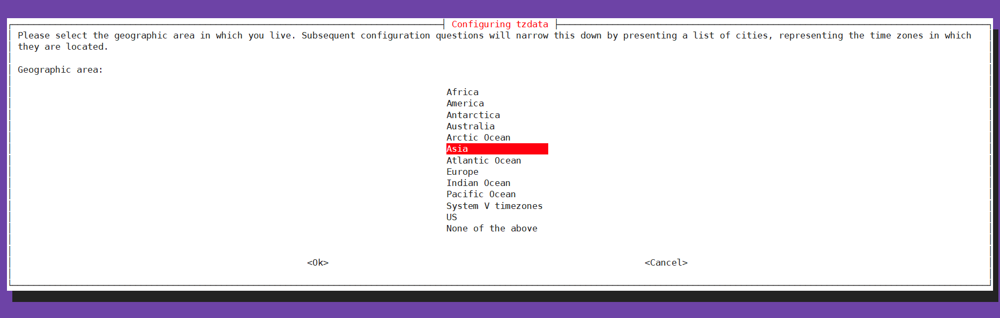
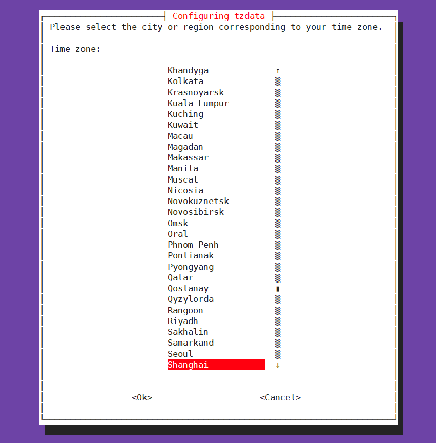
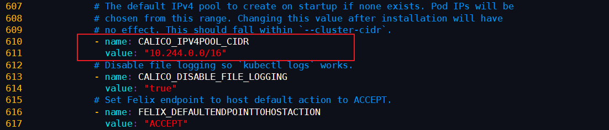
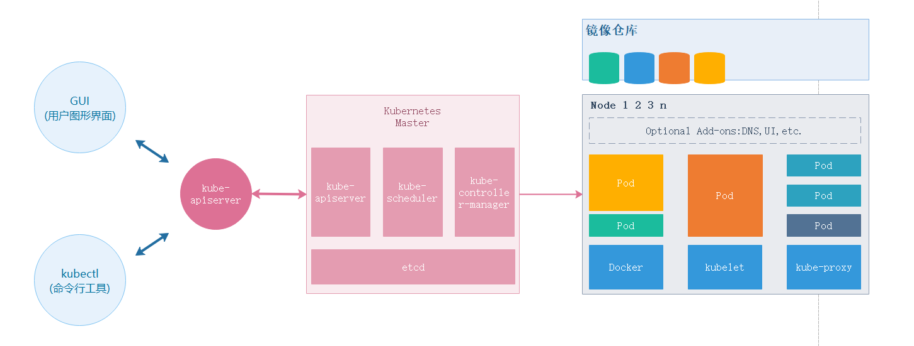
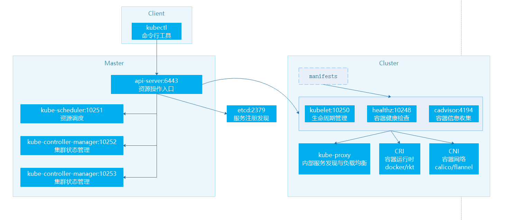
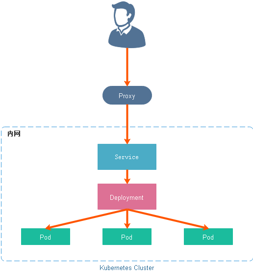
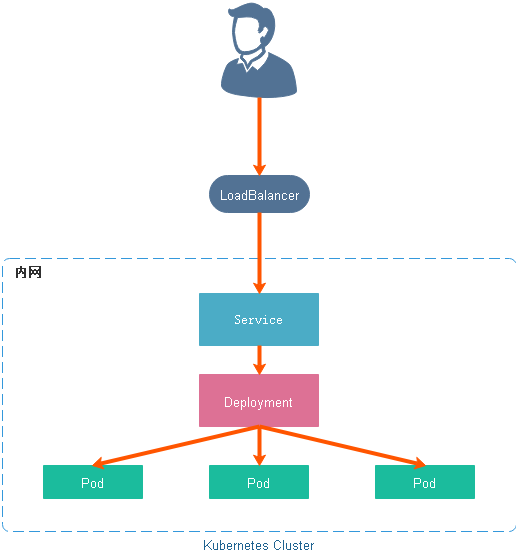
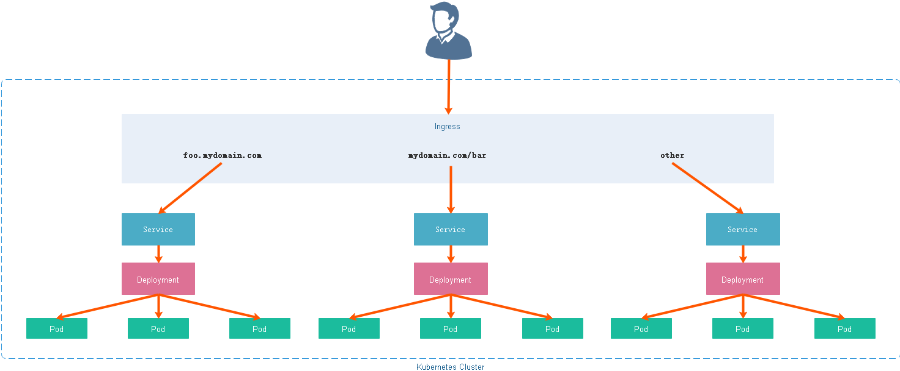

# Kubernetes 介绍

## 概述

Kubernetes 是 **Google 2014 年创建管理的**，是 Google 10 多年大规模容器管理技术 Borg 的开源版本。

Kubernetes 是容器集群管理系统，是一个开源的平台，可以实现容器集群的自动化部署、自动扩缩容、维护等功能。使用 Kubernetes 我们可以：

- 快速部署应用d
- 快速扩展应用
- 无缝对接新的应用功能
- 节省资源，优化硬件资源的使用

Kubernetes 的目标是促进完善组件和工具的生态系统，以减轻应用程序在公有云或私有云中运行的负担。

## 特点

- **可移植：** 支持公有云，私有云，混合云，多重云（多个公共云）
- **可扩展：** 模块化，插件化，可挂载，可组合
- **自动化：** 自动部署，自动重启，自动复制，自动伸缩/扩展

## 从传统到容器化部署

### 传统的部署方式

传统的应用部署方式是通过插件或脚本来安装应用。这样做的缺点是应用的运行、配置、管理、所有生存周期将与当前操作系统绑定，这样做并不利于应用的升级更新/回滚等操作，当然也可以通过创建虚机的方式来实现某些功能，但是虚拟机非常重，并不利于可移植性。

### 容器化部署的优势

- **快速创建/部署应用：** 与虚拟机相比，容器镜像的创建更加容易。
- **持续开发、集成和部署：** 提供可靠且频繁的容器镜像构建/部署，并使用快速和简单的回滚(由于镜像不可变性)。
- **开发和运行相分离：** 在 build 或者 release 阶段创建容器镜像，使得应用和基础设施解耦。
- **开发，测试和生产环境一致性：** 在本地或外网（生产环境）运行的一致性。
- **云平台或其他操作系统：** 可以在 Ubuntu、RHEL、CoreOS、on-prem、Google Container Engine 或其它任何环境中运行。
- **分布式，弹性，微服务化：** 应用程序分为更小的、独立的部件，可以动态部署和管理。
- **资源隔离**
- **资源利用更高效**

## 为什么需要 Kubernetes

可以在物理或虚拟机的 Kubernetes 集群上运行容器化应用，Kubernetes 能提供一个以 **“容器为中心的基础架构”**，满足在生产环境中运行应用的一些常见需求，如：

- 多个进程协同工作
- 存储系统挂载
- 应用健康检查
- 应用实例的复制
- 自动伸缩/扩展
- 注册与发现
- 负载均衡
- 滚动更新
- 资源监控
- 日志访问
- 调试应用程序
- 提供认证和授权

# Kubernetes 安装前的准备

## 概述

本次安装采用 Ubuntu Server X64 18.04 LTS 版本安装 kubernetes 集群环境，集群节点为 1 主 2 从模式，此次对虚拟机会有些基本要求，如下：

- OS：Ubuntu Server X64 18.04 LTS（16.04 版本步骤相同，再之前则不同）
- CPU：最低要求，1 CPU 2 核
- 内存：最低要求，2 GB
- 磁盘：最低要求，20 GB

## 节点配置

| 主机名             | IP              | 角色   | 系统                | CPU/内存 | 磁盘 |
| :----------------- | :-------------- | :----- | :------------------ | :------- | :--- |
| kubernetes-master  | 192.168.141.110 | Master | Ubuntu Server 18.04 | 2 核 2G  | 20G  |
| kubernetes-node-01 | 192.168.141.120 | Node   | Ubuntu Server 18.04 | 2 核 4G  | 20G  |
| kubernetes-node-02 | 192.168.141.121 | Node   | Ubuntu Server 18.04 | 2 核 4G  | 20G  |

## 统一环境配置

> **注意：** 以下步骤请在制作 VMware 镜像时一并完成，避免逐台安装的痛苦

### 关闭交换空间

```shell
swapoff -a
```

### 避免开机启动交换空间

```shell
# 注释 swap 开头的行vi /etc/fstab
```

### 关闭防火墙

```shell
ufw disable
```

### 配置 DNS

```shell
# 取消 DNS 行注释，并增加 DNS 配置如：114.114.114.114，修改后重启下计算机vi /etc/systemd/resolved.conf
```

### 安装 Docker

```shell
# 更新软件源
sudo apt-get update
# 安装所需依赖
sudo apt-get -y install apt-transport-https ca-certificates curl software-properties-common
# 安装 GPG 证书
curl -fsSL http://mirrors.aliyun.com/docker-ce/linux/ubuntu/gpg | sudo apt-key add -
# 新增软件源信息
sudo add-apt-repository "deb [arch=amd64] http://mirrors.aliyun.com/docker-ce/linux/ubuntu $(lsb_release -cs) stable"
# 再次更新软件源
sudo apt-get -y update
# 安装 Docker CE 版
sudo apt-get -y install docker-ce
```

### 配置 Docker 加速器

> **注意：** 国内镜像加速器可能会很卡，请替换成你自己阿里云镜像加速器，地址如：`https://yourself.mirror.aliyuncs.com`，在阿里云控制台的 **容器镜像服务 -> 镜像加速器** 菜单中可以找到

在 `/etc/docker/daemon.json` 中写入如下内容（以下配置修改 `cgroup` 驱动为 `systemd`，满足 K8S 建议）

```json
{
  "exec-opts": ["native.cgroupdriver=systemd"],
  "log-driver": "json-file",
  "log-opts": {
    "max-size": "100m"
  },
  "registry-mirrors": [
    "https://k7da99jp.mirror.aliyuncs.com/",
    "https://dockerhub.azk8s.cn",
    "https://registry.docker-cn.com"
  ],
  "storage-driver": "overlay2"
}
```

### 安装 Kubernetes 必备工具

安装三个 Kubernetes 必备工具，分别为 **kubeadm**，**kubelet**，**kubectl**

```shell
# 安装系统工具
apt-get update && apt-get install -y apt-transport-https
# 安装 GPG 证书
curl https://mirrors.aliyun.com/kubernetes/apt/doc/apt-key.gpg | apt-key add -
# 写入软件源；注意：我们用系统代号为 bionic，但目前阿里云不支持，所以沿用 16.04 的 xenial
cat << EOF >/etc/apt/sources.list.d/kubernetes.list
deb https://mirrors.aliyun.com/kubernetes/apt/ kubernetes-xenial main
EOF
# 安装
apt-get update && apt-get install -y kubelet kubeadm kubectl
```

### 同步时间

- **设置时区**

```
dpkg-reconfigure tzdata
```

- 选择 **Asia（亚洲）**



- 选择 **Shanghai（上海）**



- **时间同步**

```shell
# 安装 ntpdate
apt-get install ntpdate
# 设置系统时间与网络时间同步（cn.pool.ntp.org 位于中国的公共 NTP 服务器）
ntpdate cn.pool.ntp.org
# 将系统时间写入硬件时间
hwclock --systohc
```

- **确认时间**

```shell
date
# 输出如下（自行对照与系统时间是否一致）
Sun Jun  2 22:02:35 CST 2019
```

### 修改 cloud.cfg

主要作用是防止重启后主机名还原

```
vi /etc/cloud/cloud.cfg# 该配置默认为 false，修改为 true 即可preserve_hostname: true
```

## 单独节点配置

> **注意：** 为 Master 和 Node 节点单独配置对应的 **IP** 和 **主机名**

### 配置 IP

编辑 `vi /etc/netplan/50-cloud-init.yaml` 配置文件，修改内容如下

```
network:    ethernets:        ens33:          addresses: [192.168.141.110/24]          gateway4: 192.168.141.2          nameservers:            addresses: [192.168.141.2]    version: 2
```

使用 `netplan apply` 命令让配置生效

### 配置主机名

```yaml
network:
    ethernets:
        ens33:
          addresses: [192.168.141.110/24]
          gateway4: 192.168.141.2
          nameservers:
            addresses: [192.168.141.2]
    version: 2
```

# Kubernetes 安装集群

## 概述

kubeadm 是 kubernetes 的集群安装工具，能够快速安装 kubernetes 集群，安装 kubernetes 主要是安装它的各个镜像，而 kubeadm 已经为我们集成好了运行 kubernetes 所需的基本镜像。但由于国内的网络原因，在搭建环境时，无法拉取到这些镜像。此时我们只需要修改为阿里云提供的镜像服务即可解决该问题。

## 创建并修改配置

```shell
# 导出配置文件
kubeadm config print init-defaults --kubeconfig ClusterConfiguration > kubeadm.yml
```


```yaml
apiVersion: kubeadm.k8s.io/v1beta2
bootstrapTokens:
- groups:
  - system:bootstrappers:kubeadm:default-node-token
  token: abcdef.0123456789abcdef
  ttl: 24h0m0s
  usages:
  - signing
  - authentication
kind: InitConfiguration
localAPIEndpoint:
  # 修改为主节点 IP
  advertiseAddress: 192.168.141.110
  bindPort: 6443
nodeRegistration:
  criSocket: /var/run/dockershim.sock
  name: kubernetes-master
  taints:
  - effect: NoSchedule
    key: node-role.kubernetes.io/master
---
apiServer:
  timeoutForControlPlane: 4m0s
apiVersion: kubeadm.k8s.io/v1beta2
certificatesDir: /etc/kubernetes/pki
clusterName: kubernetes
controllerManager: {}
dns:
  type: CoreDNS
etcd:
  local:
    dataDir: /var/lib/etcd
# 国内不能访问 Google，修改为阿里云
imageRepository: registry.aliyuncs.com/google_containers
kind: ClusterConfiguration
# 修改版本号
kubernetesVersion: v1.15.0
networking:
  dnsDomain: cluster.local
  # 配置 POD 所在网段为我们虚拟机不重叠的网段（这里用的是 Flannel 默认网段）
  podSubnet: "10.244.0.0/16"
  serviceSubnet: 10.96.0.0/12
scheduler: {}
```

## 查看所需镜像

```shell
kubeadm config images list --config kubeadm.yml
# 输出如下
registry.aliyuncs.com/google_containers/kube-apiserver:v1.15.0
registry.aliyuncs.com/google_containers/kube-controller-manager:v1.15.0
registry.aliyuncs.com/google_containers/kube-scheduler:v1.15.0
registry.aliyuncs.com/google_containers/kube-proxy:v1.15.0
registry.aliyuncs.com/google_containers/pause:3.1
registry.aliyuncs.com/google_containers/etcd:3.3.10
registry.aliyuncs.com/google_containers/coredns:1.3.1
```

## 拉取所需镜像

```shell
kubeadm config images pull --config kubeadm.yml
# 输出如下
[config/images] Pulled registry.aliyuncs.com/google_containers/kube-apiserver:v1.15.0
[config/images] Pulled registry.aliyuncs.com/google_containers/kube-controller-manager:v1.15.0
[config/images] Pulled registry.aliyuncs.com/google_containers/kube-scheduler:v1.15.0
[config/images] Pulled registry.aliyuncs.com/google_containers/kube-proxy:v1.15.0
[config/images] Pulled registry.aliyuncs.com/google_containers/pause:3.1
[config/images] Pulled registry.aliyuncs.com/google_containers/etcd:3.3.10
[config/images] Pulled registry.aliyuncs.com/google_containers/coredns:1.3.1
```

## 安装主节点

执行以下命令初始化主节点，该命令指定了初始化时需要使用的配置文件，其中添加 `--upload-certs` 参数可以在后续执行加入节点时自动分发证书文件。追加的 `tee kubeadm-init.log` 用以输出日志。

> **注意：** 如果安装 kubernetes 版本和下载的镜像版本不统一则会出现 `timed out waiting for the condition` 错误。中途失败或是想修改配置可以使用 `kubeadm reset` 命令重置配置，再做初始化操作即可。

```shell
kubeadm init --config=kubeadm.yml --upload-certs | tee kubeadm-init.log
# 输出如下
Flag --experimental-upload-certs has been deprecated, use --upload-certs instead
[init] Using Kubernetes version: v1.15.0
[preflight] Running pre-flight checks
        [WARNING IsDockerSystemdCheck]: detected "cgroupfs" as the Docker cgroup driver. The recommended driver is "systemd". Please follow the guide at https://kubernetes.io/docs/setup/cri/
[preflight] Pulling images required for setting up a Kubernetes cluster
[preflight] This might take a minute or two, depending on the speed of your internet connection
[preflight] You can also perform this action in beforehand using 'kubeadm config images pull'
[kubelet-start] Writing kubelet environment file with flags to file "/var/lib/kubelet/kubeadm-flags.env"
[kubelet-start] Writing kubelet configuration to file "/var/lib/kubelet/config.yaml"
[kubelet-start] Activating the kubelet service
[certs] Using certificateDir folder "/etc/kubernetes/pki"
[certs] Generating "ca" certificate and key
[certs] Generating "apiserver-kubelet-client" certificate and key
[certs] Generating "apiserver" certificate and key
[certs] apiserver serving cert is signed for DNS names [kubernetes-master kubernetes kubernetes.default kubernetes.default.svc kubernetes.default.svc.cluster.local] and IPs [10.96.0.1 192.168.141.110]
[certs] Generating "front-proxy-ca" certificate and key
[certs] Generating "front-proxy-client" certificate and key
[certs] Generating "etcd/ca" certificate and key
[certs] Generating "etcd/server" certificate and key
[certs] etcd/server serving cert is signed for DNS names [kubernetes-master localhost] and IPs [192.168.141.110 127.0.0.1 ::1]
[certs] Generating "apiserver-etcd-client" certificate and key
[certs] Generating "etcd/peer" certificate and key
[certs] etcd/peer serving cert is signed for DNS names [kubernetes-master localhost] and IPs [192.168.141.110 127.0.0.1 ::1]
[certs] Generating "etcd/healthcheck-client" certificate and key
[certs] Generating "sa" key and public key
[kubeconfig] Using kubeconfig folder "/etc/kubernetes"
[kubeconfig] Writing "admin.conf" kubeconfig file
[kubeconfig] Writing "kubelet.conf" kubeconfig file
[kubeconfig] Writing "controller-manager.conf" kubeconfig file
[kubeconfig] Writing "scheduler.conf" kubeconfig file
[control-plane] Using manifest folder "/etc/kubernetes/manifests"
[control-plane] Creating static Pod manifest for "kube-apiserver"
[control-plane] Creating static Pod manifest for "kube-controller-manager"
[control-plane] Creating static Pod manifest for "kube-scheduler"
[etcd] Creating static Pod manifest for local etcd in "/etc/kubernetes/manifests"
[wait-control-plane] Waiting for the kubelet to boot up the control plane as static Pods from directory "/etc/kubernetes/manifests". This can take up to 4m0s
[apiclient] All control plane components are healthy after 23.006217 seconds
[upload-config] Storing the configuration used in ConfigMap "kubeadm-config" in the "kube-system" Namespace
[kubelet] Creating a ConfigMap "kubelet-config-1.15" in namespace kube-system with the configuration for the kubelets in the cluster
[upload-certs] Storing the certificates in Secret "kubeadm-certs" in the "kube-system" Namespace
[upload-certs] Using certificate key:
4a351218cf34c15b04b08b7d916c27a625418145d8d3b281ec125fd2b2ac7ab5
[mark-control-plane] Marking the node kubernetes-master as control-plane by adding the label "node-role.kubernetes.io/master=''"
[mark-control-plane] Marking the node kubernetes-master as control-plane by adding the taints [node-role.kubernetes.io/master:NoSchedule]
[bootstrap-token] Using token: abcdef.0123456789abcdef
[bootstrap-token] Configuring bootstrap tokens, cluster-info ConfigMap, RBAC Roles
[bootstrap-token] configured RBAC rules to allow Node Bootstrap tokens to post CSRs in order for nodes to get long term certificate credentials
[bootstrap-token] configured RBAC rules to allow the csrapprover controller automatically approve CSRs from a Node Bootstrap Token
[bootstrap-token] configured RBAC rules to allow certificate rotation for all node client certificates in the cluster
[bootstrap-token] Creating the "cluster-info" ConfigMap in the "kube-public" namespace
[addons] Applied essential addon: CoreDNS
[addons] Applied essential addon: kube-proxy
Your Kubernetes control-plane has initialized successfully!
To start using your cluster, you need to run the following as a regular user:
  mkdir -p $HOME/.kube
  sudo cp -i /etc/kubernetes/admin.conf $HOME/.kube/config
  sudo chown $(id -u):$(id -g) $HOME/.kube/config
You should now deploy a pod network to the cluster.
Run "kubectl apply -f [podnetwork].yaml" with one of the options listed at:
  https://kubernetes.io/docs/concepts/cluster-administration/addons/
Then you can join any number of worker nodes by running the following on each as root:
kubeadm join 192.168.141.110:6443 --token abcdef.0123456789abcdef \
    --discovery-token-ca-cert-hash sha256:f0759e0d352c1a5de4444782b4a676460b2ea7a2876fa0accab572b8629b72c8 
```

### 配置 kubectl

```shell
mkdir -p $HOME/.kube
cp -i /etc/kubernetes/admin.conf $HOME/.kube/config
# 非 ROOT 用户执行
chown $(id -u):$(id -g) $HOME/.kube/config
```

### 验证是否成功

```shell
kubectl get node
# 输出如下
NAME                STATUS     ROLES    AGE     VERSION
kubernetes-master   NotReady   master   4m38s   v1.15.0
```

## 安装从节点

将 Node 节点加入到集群中很简单，只需要在 Node 服务器上安装 **kubeadm**，**kubectl**，**kubelet** 三个工具，然后使用 `kubeadm join` 命令加入即可

```shell
kubeadm join 192.168.141.110:6443 --token abcdef.0123456789abcdef \
    --discovery-token-ca-cert-hash sha256:f0759e0d352c1a5de4444782b4a676460b2ea7a2876fa0accab572b8629b72c8
# 输出如下
[preflight] Running pre-flight checks
        [WARNING IsDockerSystemdCheck]: detected "cgroupfs" as the Docker cgroup driver. The recommended driver is "systemd". Please follow the guide at https://kubernetes.io/docs/setup/cri/
[preflight] Reading configuration from the cluster...
[preflight] FYI: You can look at this config file with 'kubectl -n kube-system get cm kubeadm-config -oyaml'
[kubelet-start] Downloading configuration for the kubelet from the "kubelet-config-1.15" ConfigMap in the kube-system namespace
[kubelet-start] Writing kubelet configuration to file "/var/lib/kubelet/config.yaml"
[kubelet-start] Writing kubelet environment file with flags to file "/var/lib/kubelet/kubeadm-flags.env"
[kubelet-start] Activating the kubelet service
[kubelet-start] Waiting for the kubelet to perform the TLS Bootstrap...
This node has joined the cluster:
* Certificate signing request was sent to apiserver and a response was received.
* The Kubelet was informed of the new secure connection details.
Run 'kubectl get nodes' on the control-plane to see this node join the cluster.
```

### 验证是否成功

回到 Master 主节点查看是否安装成功

> **注意：** 如果 Node 节点加入 Master 时配置有问题可以在 Node 节点上使用 `kubeadm reset` 重置配置再使用 `kubeadm join` 命令重新加入即可。希望在 master 节点删除 node ，可以使用 `kubectl delete nodes ` 删除。

```shell
kubectl get node
# 输出如下
NAME                 STATUS     ROLES    AGE   VERSION
kubernetes-master    NotReady   master   20m   v1.15.0
kubernetes-node-01   NotReady   <none>   16s   v1.15.0
kubernetes-node-02   NotReady   <none>   6s    v1.15.0
```

### 查看 Pod 状态

coredns 尚未运行，此时我们还需要安装网络插件

```shell
kubectl get pod -n kube-system -o wide
# 输出如下
NAME                                        READY   STATUS    RESTARTS   AGE     IP                NODE                 NOMINATED NODE   READINESS GATES
coredns-bccdc95cf-9s4bm                     0/1     Pending   0          24m     <none>            <none>               <none>           <none>
coredns-bccdc95cf-s8ggd                     0/1     Pending   0          24m     <none>            <none>               <none>           <none>
etcd-kubernetes-master                      1/1     Running   0          24m     192.168.141.110   kubernetes-master    <none>           <none>
kube-apiserver-kubernetes-master            1/1     Running   0          24m     192.168.141.110   kubernetes-master    <none>           <none>
kube-controller-manager-kubernetes-master   1/1     Running   0          23m     192.168.141.110   kubernetes-master    <none>           <none>
kube-proxy-8s87d                            1/1     Running   0          4m56s   192.168.141.120   kubernetes-node-01   <none>           <none>
kube-proxy-cbnlb                            1/1     Running   0          4m46s   192.168.141.121   kubernetes-node-02   <none>           <none>
kube-proxy-vwhxj                            1/1     Running   0          24m     192.168.141.110   kubernetes-master    <none>           <none>
kube-scheduler-kubernetes-master            1/1     Running   0          24m     192.168.141.110   kubernetes-master    <none>           <none>
```

## 附：扩展阅读

### kubeadm init 的执行过程

- **init：** 指定版本进行初始化操作
- **preflight：** 初始化前的检查和下载所需要的 Docker 镜像文件
- **kubelet-start：** 生成 kubelet 的配置文件 `var/lib/kubelet/config.yaml`，没有这个文件 kubelet 无法启动，所以初始化之前的 kubelet 实际上启动不会成功
- **certificates：** 生成 Kubernetes 使用的证书，存放在 `/etc/kubernetes/pki` 目录中
- **kubeconfig：** 生成 KubeConfig 文件，存放在 `/etc/kubernetes` 目录中，组件之间通信需要使用对应文件
- **control-plane：** 使用 `/etc/kubernetes/manifest` 目录下的 YAML 文件，安装 Master 组件
- **etcd：** 使用 `/etc/kubernetes/manifest/etcd.yaml` 安装 Etcd 服务
- **wait-control-plane：** 等待 control-plan 部署的 Master 组件启动
- **apiclient：** 检查 Master 组件服务状态。
- **uploadconfig：** 更新配置
- **kubelet：** 使用 configMap 配置 kubelet
- **patchnode：** 更新 CNI 信息到 Node 上，通过注释的方式记录
- **mark-control-plane：** 为当前节点打标签，打了角色 Master，和不可调度标签，这样默认就不会使用 Master 节点来运行 Pod
- **bootstrap-token：** 生成 token 记录下来，后边使用 `kubeadm join` 往集群中添加节点时会用到
- **addons：** 安装附加组件 CoreDNS 和 kube-proxy

# Kubernetes 配置网络

## 概述

容器网络是容器选择连接到其他容器、主机和外部网络的机制。容器的 runtime 提供了各种网络模式，每种模式都会产生不同的体验。例如，Docker 默认情况下可以为容器配置以下网络：

- **none：** 将容器添加到一个容器专门的网络堆栈中，没有对外连接。
- **host：** 将容器添加到主机的网络堆栈中，没有隔离。
- **default bridge：** 默认网络模式。每个容器可以通过 IP 地址相互连接。
- **自定义网桥：** 用户定义的网桥，具有更多的灵活性、隔离性和其他便利功能。

## 什么是 CNI

CNI(Container Network Interface) 是一个标准的，通用的接口。在容器平台，Docker，Kubernetes，Mesos 容器网络解决方案 flannel，calico，weave。只要提供一个标准的接口，就能为同样满足该协议的所有容器平台提供网络功能，而 CNI 正是这样的一个标准接口协议。

## Kubernetes 中的 CNI 插件

CNI 的初衷是创建一个框架，用于在配置或销毁容器时动态配置适当的网络配置和资源。插件负责为接口配置和管理 IP 地址，并且通常提供与 IP 管理、每个容器的 IP 分配、以及多主机连接相关的功能。容器运行时会调用网络插件，从而在容器启动时分配 IP 地址并配置网络，并在删除容器时再次调用它以清理这些资源。

运行时或协调器决定了容器应该加入哪个网络以及它需要调用哪个插件。然后，插件会将接口添加到容器网络命名空间中，作为一个 veth 对的一侧。接着，它会在主机上进行更改，包括将 veth 的其他部分连接到网桥。再之后，它会通过调用单独的 IPAM（IP地址管理）插件来分配 IP 地址并设置路由。

在 Kubernetes 中，kubelet 可以在适当的时间调用它找到的插件，为通过 kubelet 启动的 pod进行自动的网络配置。

Kubernetes 中可选的 CNI 插件如下：

- Flannel
- Calico
- Canal
- Weave

## 什么是 Calico

Calico 为容器和虚拟机提供了安全的网络连接解决方案，并经过了大规模生产验证（在公有云和跨数千个集群节点中），可与 Kubernetes，OpenShift，Docker，Mesos，DC / OS 和 OpenStack 集成。

Calico 还提供网络安全规则的动态实施。使用 Calico 的简单策略语言，您可以实现对容器，虚拟机工作负载和裸机主机端点之间通信的细粒度控制。

## 下载 Calico 配置文件并修改

```shell
wget https://docs.projectcalico.org/v3.8/manifests/calico.yaml
```

```shell
vi calico.yaml
```

修改第 611 行，将 `192.168.0.0/16` 修改为 `10.244.0.0/16`，可以通过如下命令快速查找

- 显示行号：`:set number`
- 查找字符：`/要查找的字符`，输入小写 `n` 下一个匹配项，输入大写 `N` 上一个匹配项



## 安装网络插件 Calico

> **注意：** 截止到文章发表日期 2019 年 07 月 20 日，Calico 官方版本为 3.8

参考官方文档安装：[文档]( https://docs.projectcalico.org/v3.8/getting-started/kubernetes/ )

```shell
kubectl apply -f calico.yaml
# 输出如下
configmap/calico-config created
customresourcedefinition.apiextensions.k8s.io/felixconfigurations.crd.projectcalico.org created
customresourcedefinition.apiextensions.k8s.io/ipamblocks.crd.projectcalico.org created
customresourcedefinition.apiextensions.k8s.io/blockaffinities.crd.projectcalico.org created
customresourcedefinition.apiextensions.k8s.io/ipamhandles.crd.projectcalico.org created
customresourcedefinition.apiextensions.k8s.io/ipamconfigs.crd.projectcalico.org created
customresourcedefinition.apiextensions.k8s.io/bgppeers.crd.projectcalico.org created
customresourcedefinition.apiextensions.k8s.io/bgpconfigurations.crd.projectcalico.org created
customresourcedefinition.apiextensions.k8s.io/ippools.crd.projectcalico.org created
customresourcedefinition.apiextensions.k8s.io/hostendpoints.crd.projectcalico.org created
customresourcedefinition.apiextensions.k8s.io/clusterinformations.crd.projectcalico.org created
customresourcedefinition.apiextensions.k8s.io/globalnetworkpolicies.crd.projectcalico.org created
customresourcedefinition.apiextensions.k8s.io/globalnetworksets.crd.projectcalico.org created
customresourcedefinition.apiextensions.k8s.io/networkpolicies.crd.projectcalico.org created
customresourcedefinition.apiextensions.k8s.io/networksets.crd.projectcalico.org created
clusterrole.rbac.authorization.k8s.io/calico-kube-controllers created
clusterrolebinding.rbac.authorization.k8s.io/calico-kube-controllers created
clusterrole.rbac.authorization.k8s.io/calico-node created
clusterrolebinding.rbac.authorization.k8s.io/calico-node created
daemonset.extensions/calico-node created
serviceaccount/calico-node created
deployment.extensions/calico-kube-controllers created
serviceaccount/calico-kube-controllers created
```

## 验证安装是否成功

- 查看 Calico 网络插件处于 **Running** 状态即表示安装成功

```shell
watch kubectl get pods --all-namespaces
# 输出如下
NAMESPACE     NAME                                        READY   STATUS    RESTARTS   AGE
kube-system   calico-kube-controllers-658558ddf8-9zzjg    1/1     Running   0          90s
kube-system   calico-node-9cr5f                           1/1     Running   0          91s
kube-system   calico-node-n99mz                           1/1     Running   0          91s
kube-system   calico-node-nl67v                           1/1     Running   0          91s
kube-system   coredns-bccdc95cf-9s4bm                     1/1     Running   0          56m
kube-system   coredns-bccdc95cf-s8ggd                     1/1     Running   0          56m
kube-system   etcd-kubernetes-master                      1/1     Running   0          55m
kube-system   kube-apiserver-kubernetes-master            1/1     Running   0          55m
kube-system   kube-controller-manager-kubernetes-master   1/1     Running   0          55m
kube-system   kube-proxy-8s87d                            1/1     Running   0          36m
kube-system   kube-proxy-cbnlb                            1/1     Running   0          36m
kube-system   kube-proxy-vwhxj                            1/1     Running   0          56m
kube-system   kube-scheduler-kubernetes-master            1/1     Running   0          55m
```

- 查看节点状态处于 **Ready** 即表示安装成功

```shell
kubectl get node
# 输出如下
NAME                 STATUS   ROLES    AGE   VERSION
kubernetes-master    Ready    master   57m   v1.15.0
kubernetes-node-01   Ready    <none>   37m   v1.15.0
kubernetes-node-02   Ready    <none>   36m   v1.15.0
```

# Kubernetes 第一个容器

## 检查组件运行状态

```shell
kubectl get cs
# 输出如下
NAME                 STATUS    MESSAGE             ERROR
# 调度服务，主要作用是将 POD 调度到 Node
scheduler            Healthy   ok
# 自动化修复服务，主要作用是 Node 宕机后自动修复 Node 回到正常的工作状态
controller-manager   Healthy   ok
# 服务注册与发现
etcd-0               Healthy   {"health":"true"}  
```

## 检查 Master 状态

```shell
kubectl cluster-info
# 输出如下
Kubernetes master is running at https://192.168.141.110:6443
KubeDNS is running at https://192.168.141.110:6443/api/v1/namespaces/kube-system/services/kube-dns:dns/proxy
To further debug and diagnose cluster problems, use 'kubectl cluster-info dump'.
```

## 检查 Nodes 状态

```shell
kubectl get nodes
# 输出如下
NAME                 STATUS   ROLES    AGE   VERSION
kubernetes-master    Ready    master   72m   v1.15.0
kubernetes-node-01   Ready    <none>   52m   v1.15.0
kubernetes-node-02   Ready    <none>   51m   v1.15.0
```

## 运行第一个容器实例

```shell
# 使用 kubectl 命令创建两个监听 80 端口的 Nginx Pod（Kubernetes 运行容器的最小单元）
kubectl run nginx --image=nginx --replicas=2 --port=80
# 输出如下
kubectl run --generator=deployment/apps.v1 is DEPRECATED and will be removed in a future version. Use kubectl run --generator=run-pod/v1 or kubectl create instead.
deployment.apps/nginx created
```

## 查看全部 Pods 的状态

```shell
kubectl get pods
# 输出如下
NAME                     READY   STATUS    RESTARTS   AGE
nginx-7c45b84548-mv8n8   1/1     Running   0          36s
nginx-7c45b84548-vp2x6   1/1     Running   0          36s
```

## 查看已部署的服务

```shell
kubectl get deployment
# 输出如下
NAME    READY   UP-TO-DATE   AVAILABLE   AGE
nginx   2/2     2            2           70s
```

## 发布服务

```shell
# 使用负载均衡模式发布服务，让用户可以访问
kubectl expose deployment nginx --port=80 --type=LoadBalancer
# 输出如下
service/nginx exposed
```

## 查看已发布的服务

```shell
kubectl get services
# 输出如下
NAME         TYPE           CLUSTER-IP      EXTERNAL-IP   PORT(S)        AGE
kubernetes   ClusterIP      10.96.0.1       <none>        443/TCP        81m
nginx        LoadBalancer   10.102.37.240   <pending>     80:31406/TCP   115s
```

## 查看服务详情

```shell
kubectl describe service nginx
# 输出如下
Name:                     nginx
Namespace:                default
Labels:                   run=nginx
Annotations:              <none>
Selector:                 run=nginx
Type:                     LoadBalancer
IP:                       10.102.37.240
Port:                     <unset>  80/TCP
TargetPort:               80/TCP
# 发布到外网的服务端口
NodePort:                 <unset>  31406/TCP
Endpoints:                192.168.140.66:80,192.168.141.194:80
Session Affinity:         None
External Traffic Policy:  Cluster
Events:                   <none>
```

## 验证是否成功

通过浏览器访问 Node 服务器，此时 Kubernetes 会以负载均衡的方式访问部署的 Nginx 服务，能够正常看到 Nginx 的欢迎页即表示成功

```
http://192.168.141.120:31406/
```

## 停止服务

- 删除已部署的服务

```shell
kubectl delete deployment nginx
# 输出如下
deployment.extensions "nginx" deleted
```

- 删除已发布的服务

```shell
kubectl delete service nginx
# 输出如下
service "nginx" deleted
```

# Kubernetes 概念总结

## 什么是 Kubernetes

Kubernetes 是一个开源的 Docker 容器编排系统，它可以调度计算集群的节点，动态管理上面的作业，保证它们按用户期望的状态运行。通过使用「labels」和「pods」的概念，Kubernetes 将应用按逻辑单元进行分组，方便管理和服务发现。


- **pods：** 是一组紧密关联的容器集合，它们共享 IPC(进程间通信)、Network(网络) 和 UTS namespace(UTS 命名空间是 Linux 命名空间的一个子系统，主要作用是完成对容器 Hostname 和 Domain 的隔离，同时保存内核名称、版本、以及底层体系结构类型等信息)，是 Kubernetes 调度的基本单位。
- **labels：** 键值对(key/value)标签，可以被关联到如 Pod 这样的对象上，主要作用是给用户一个直观的感受，比如这个 Pod 是用来放置数据库的
- **GUI：** 用户图形界面，可以是 Web 用户界面，比如使用 `kubernetes-dashboard` 组件，用户可以通过 Dashboard 在 Kubernetes 集群中部署容器化的应用，可以查看集群中应用的运行情况，同时也能够基于 Dashboard 创建或修改部署、任务、服务等 Kubernetes 的资源。通过部署向导，用户能够对部署进行扩缩容，进行滚动更新、重启 Pod 和部署新应用。当然，通过 Dashboard 也能够查看 Kubernetes 资源的状态
- **kubectl：** 用于管理 Kubernetes 集群的命令行工具
- **kube-apiserver：** 提供了资源操作的唯一入口，并提供认证、授权、访问控制、API 注册和发现等机制
- **Kubernetes Master：** Kubernetes 集群主节点，主要由 `kube-apiserver`、`kube-scheduler`、`kube-controller-manager`、`etcd` 四个模块组成
- **Kubernetes Node：** Kubernetes 集群子节点，主要由 `kubelet`、`kube-proxy`、`runtime` 三个模块组成
- **Image Registry：** 镜像仓库，比如：Ducker HUB 或 Docker 私服

## Kubernetes Master


- **kube-apiserver：** 提供了资源操作的唯一入口，并提供认证、授权、访问控制、API 注册和发现等机制
- **kube-scheduler：** 负责资源的调度，按照预定的调度策略将 Pod 调度到相应的机器上
- **kube-controller-manager：** 负责维护集群的状态，比如故障检测、自动扩展、滚动更新等
- **etcd：** CoreOS 基于 Raft 开发的分布式 key-value 存储，可用于服务发现、共享配置以及一致性保障（如数据库选主、分布式锁等）

## Kubernetes Node



- **runtime：** 负责镜像管理以及 Pod 和容器的真正运行（CRI，Container Runtime Interface），默认的容器运行时为 Docker，还支持 RKT 容器
- **kubelet：** 负责维持容器的生命周期，同时也负责 Volume（CVI，Container Volume Interface）和网络（CNI，Container Network Interface）的管理
- **kube-proxy：** 负责为 Service 提供 cluster 内部的服务发现和负载均衡

## Kubernetes 架构




# Kubernetes 通过资源配置运行容器

## 概述

我们知道通过 `run` 命令启动容器非常麻烦，Docker 提供了 Compose 为我们解决了这个问题。那 Kubernetes 是如何解决这个问题的呢？其实很简单，使用 `kubectl create` 命令就可以做到和 Compose 一样的效果了，该命令可以通过配置文件快速创建一个集群资源对象。

## 创建 YAML 配置文件

### 部署 Deployment

创建一个名为 `nginx-deployment.yml` 的配置文件

```yaml
# API 版本号
apiVersion: apps/v1
# 类型，如：Pod/ReplicationController/Deployment/Service/Ingress
kind: Deployment
# 元数据
metadata:
  # Kind 的名称
  name: nginx-app
spec:
  selector:
    matchLabels:
      app: nginx
  # 部署的实例数量
  replicas: 2
  template:
    metadata:
      labels:
        # 容器标签的名字，发布 Service 时，selector 需要和这里对应
        app: nginx
    spec:
      # 配置容器，数组类型，说明可以配置多个容器
      containers:
      # 容器名称
      - name: nginx
        # 容器镜像
        image: nginx:1.17
        # 只有镜像不存在时，才会进行镜像拉取
        imagePullPolicy: IfNotPresent
        # 暴露端口
        ports:
        # Pod 端口
        - containerPort: 80
```

```shell
# 部署
kubectl create -f nginx-deployment.yml
# 删除
kubectl delete -f nginx-deployment.yml
```

### 发布 Service

创建一个名为 `nginx-service.yml` 的配置文件

```shell
# API 版本号
apiVersion: v1
# 类型，如：Pod/ReplicationController/Deployment/Service/Ingress
kind: Service
# 元数据
metadata:
  # Kind 的名称
  name: nginx-http
spec:
  # 暴露端口
  ports:
    ## Service 暴露的端口
    - port: 80
      ## Pod 上的端口，这里是将 Service 暴露的端口转发到 Pod 端口上
      targetPort: 80
  # 类型
  type: LoadBalancer
  # 标签选择器
  selector:
    # 需要和上面部署的 Deployment 标签名对应
    app: nginx
```

```shell
# 部署
kubectl create -f nginx-service.yml
# 删除
kubectl delete -f nginx-service.yml
```

### 镜像拉取策略

支持三种 ImagePullPolicy

- **Always：** 不管镜像是否存在都会进行一次拉取
- **Never：** 不管镜像是否存在都不会进行拉取
- **IfNotPresent：** 只有镜像不存在时，才会进行镜像拉取

注意

- 默认为 `IfNotPresent`，但 `:latest` 标签的镜像默认为 `Always`
- 拉取镜像时 Docker 会进行校验，如果镜像中的 MD5 码没有变，则不会拉取镜像数据
- 生产环境中应该尽量避免使用 `:latest` 标签，而开发环境中可以借助 `:latest` 标签自动拉取最新的镜像

## 验证是否生效

### 查看 Pod 列表

```shell
kubectl get pods
# 输出如下
NAME                         READY   STATUS    RESTARTS   AGE
nginx-app-64bb598779-2pplx   1/1     Running   0          25m
nginx-app-64bb598779-824lc   1/1     Running   0          25m
```

### 查看 Deployment 列表

```shell
kubectl get deployment
# 输出如下
NAME        READY   UP-TO-DATE   AVAILABLE   AGE
nginx-app   2/2     2            2           25m
```

### 查看 Service 列表

```shell
kubectl get service
# 输出如下
NAME         TYPE           CLUSTER-IP     EXTERNAL-IP   PORT(S)        AGE
kubernetes   ClusterIP      10.96.0.1      <none>        443/TCP        20h
nginx-http    LoadBalancer   10.98.49.142   <pending>     80:31631/TCP   14m
```

### 查看 Service 详情

```shell
kubectl describe service nginx-app
# 输出如下
Name:                     nginx-http
Namespace:                default
Labels:                   <none>
Annotations:              <none>
Selector:                 name=nginx
Type:                     LoadBalancer
IP:                       10.98.49.142
Port:                     <unset>  80/TCP
TargetPort:               80/TCP
NodePort:                 <unset>  31631/TCP
Endpoints:                10.244.141.205:80,10.244.2.4:80
Session Affinity:         None
External Traffic Policy:  Cluster
Events:                   <none>
```

### 通过浏览器访问

通过浏览器访问 [http://192.168.141.120:31631/]() ，出现 Nginx 欢迎页即表示成功

## 集成环境部署

也可以不区分配置文件，一次性部署 Deployment 和 Service，创建一个名为 `nginx.yml` 的配置文件，配置内容如下：

```yaml
apiVersion: apps/v1
kind: Deployment
metadata:
  name: nginx-app
spec:
  selector:
    matchLabels:
      app: nginx
  replicas: 2
  template:
    metadata:
      labels:
        app: nginx
    spec:
      containers:
      - name: nginx
        image: nginx
        ports:
        - containerPort: 80
---
apiVersion: v1
kind: Service
metadata:
  name: nginx-http
spec:
  ports:
    - port: 80
      targetPort: 80
      # 可以指定 NodePort 端口，默认范围是：30000-32767
      # nodePort: 30080
  type: LoadBalancer
  selector:
    app: nginx
```

```shell
# 部署
kubectl create -f nginx.yml
# 删除
kubectl delete -f nginx.yml
```


## 附：扩展阅读

### 修改默认的端口范围

Kubernetes 服务的 NodePort 默认端口范围是 30000-32767，在某些场合下，这个限制不太适用，我们可以自定义它的端口范围，操作步骤如下：

编辑 `vi /etc/kubernetes/manifests/kube-apiserver.yaml `配置文件，增加配置 `--service-node-port-range=2-65535`

```yaml
apiVersion: v1
kind: Pod
metadata:
  creationTimestamp: null
  labels:
    component: kube-apiserver
    tier: control-plane
  name: kube-apiserver
  namespace: kube-system
spec:
  containers:
  - command:
    - kube-apiserver
    # 在这里增加配置即可
    - --service-node-port-range=2-65535
    - --advertise-address=192.168.141.150
    - --allow-privileged=true
    - --authorization-mode=Node,RBAC
    - --client-ca-file=/etc/kubernetes/pki/ca.crt
    - --enable-admission-plugins=NodeRestriction
    - --enable-bootstrap-token-auth=true
    - --etcd-cafile=/etc/kubernetes/pki/etcd/ca.crt
    - --etcd-certfile=/etc/kubernetes/pki/apiserver-etcd-client.crt
// 以下配置省略...
```

使用 `docker ps` 命令找到 `kube-apiserver` 容器，再使用 `docker restart ` 即可生效。

# Kubernetes Ingress 简介

## 术语

- **节点：** Kubernetes 集群中的服务器
- **集群：** Kubernetes 管理的一组服务器集合
- **边界路由器：** 为局域网和 Internet 路由数据包的路由器，执行防火墙保护局域网络
- **集群网络：** 遵循 Kubernetes 网络模型实现集群内的通信的具体实现，比如 Flannel 和 Calico
- **服务：** Kubernetes 的服务 (Service) 是使用标签选择器标识的一组 Pod Service (Deployment)。 **除非另有说明，否则服务的虚拟 IP 仅可在集群内部访问**

## 内部访问方式 ClusterIP

ClusterIP 服务是 Kubernetes 的默认服务。它给你一个集群内的服务，集群内的其它应用都可以访问该服务。集群外部无法访问它。在某些场景下我们可以使用 Kubernetes 的 Proxy 模式来访问服务，比如调试服务时。



## 三种外部访问方式

### NodePort

NodePort 服务是引导外部流量到你的服务的最原始方式。NodePort，正如这个名字所示，**在所有节点（虚拟机）上开放一个特定端口**，任何发送到该端口的流量都被转发到对应服务。

NodePort 服务特征如下：

- 每个端口只能是一种服务
- 端口范围只能是 30000-32767（可调）
- 不在 YAML 配置文件中指定则会分配一个默认端口

> **建议：** 不要在生产环境中使用这种方式暴露服务，大多数时候我们应该让 Kubernetes 来选择端口


### LoadBalancer

LoadBalancer 服务是暴露服务到 Internet 的标准方式。所有通往你指定的端口的流量都会被转发到对应的服务。它没有过滤条件，没有路由等。这意味着你几乎可以发送任何种类的流量到该服务，像 HTTP，TCP，UDP，WebSocket，gRPC 或其它任意种类。



### Ingress

Ingress 事实上不是一种服务类型。相反，它处于多个服务的前端，扮演着 “智能路由” 或者集群入口的角色。你可以用 Ingress 来做许多不同的事情，各种不同类型的 Ingress 控制器也有不同的能力。它允许你基于路径或者子域名来路由流量到后端服务。

Ingress 可能是暴露服务的最强大方式，但同时也是最复杂的。Ingress 控制器有各种类型，包括 Google Cloud Load Balancer， Nginx，Contour，Istio，等等。它还有各种插件，比如 cert-manager (它可以为你的服务自动提供 SSL 证书)/

如果你想要使用同一个 IP 暴露多个服务，这些服务都是使用相同的七层协议（典型如 HTTP），你还可以获取各种开箱即用的特性（比如 SSL、认证、路由等等）



## 什么是 Ingress

通常情况下，Service 和 Pod 的 IP 仅可在集群内部访问。集群外部的请求需要通过负载均衡转发到 Service 在 Node 上暴露的 NodePort 上，然后再由 kube-proxy 通过边缘路由器 (edge router) 将其转发给相关的 Pod 或者丢弃。而 Ingress 就是为进入集群的请求提供路由规则的集合

Ingress 可以给 Service 提供集群外部访问的 URL、负载均衡、SSL 终止、HTTP 路由等。为了配置这些 Ingress 规则，集群管理员需要部署一个 Ingress Controller，它监听 Ingress 和 Service 的变化，并根据规则配置负载均衡并提供访问入口。