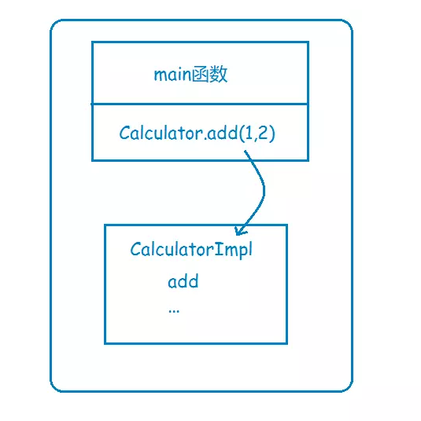
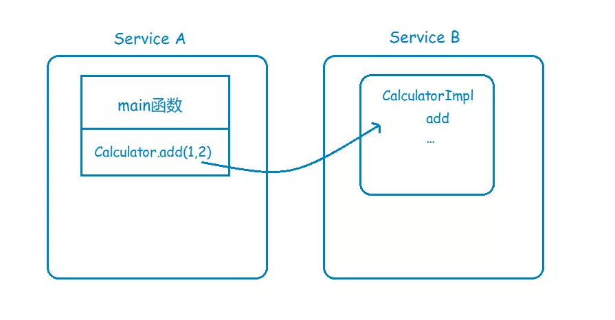
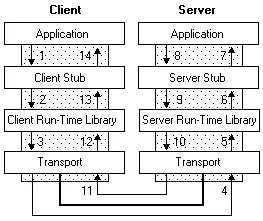
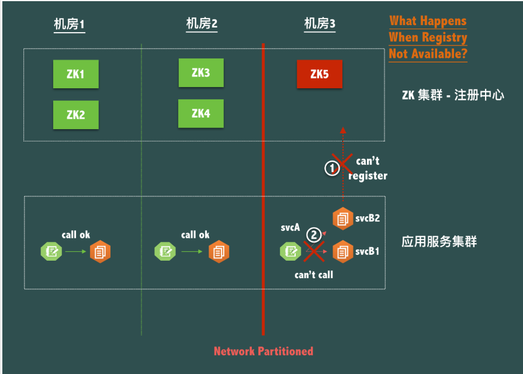
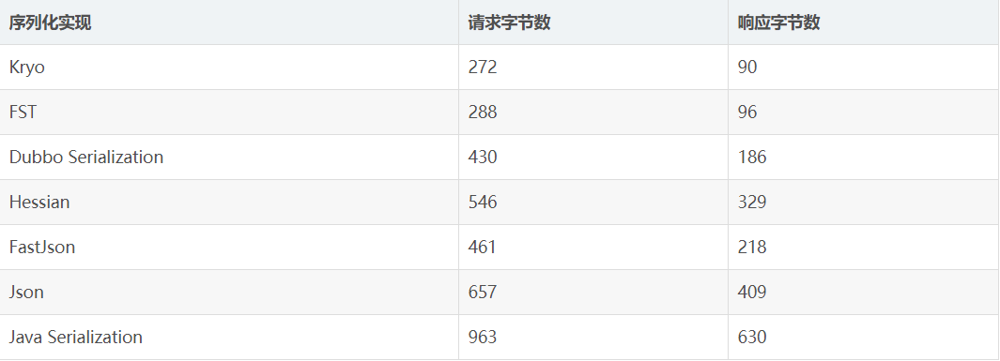
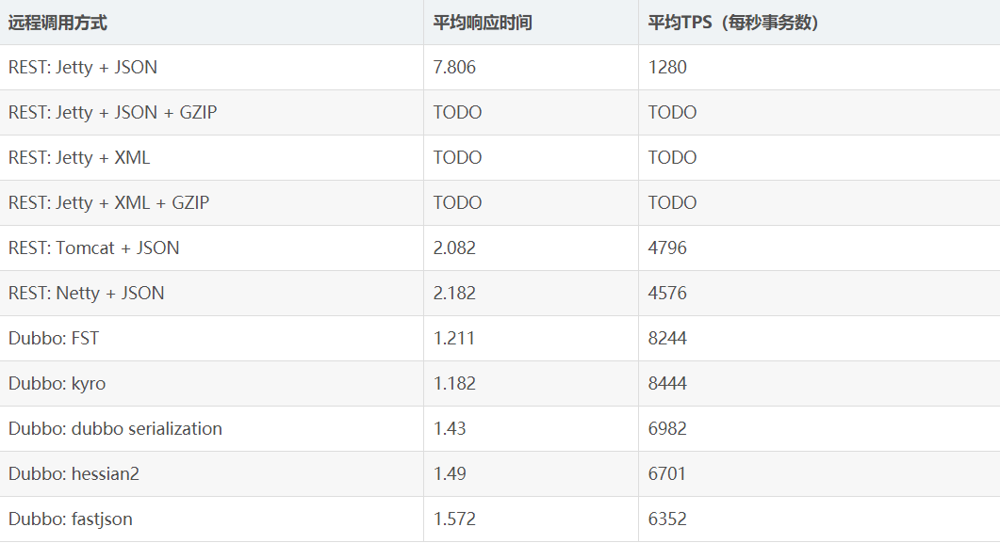
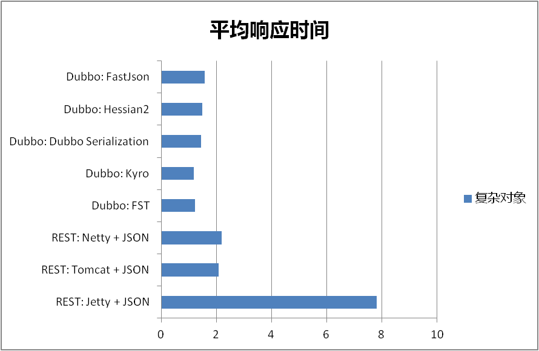
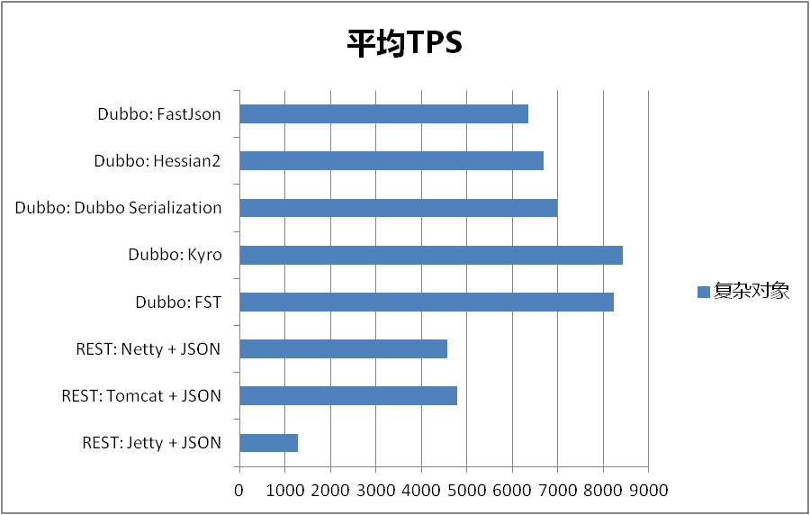
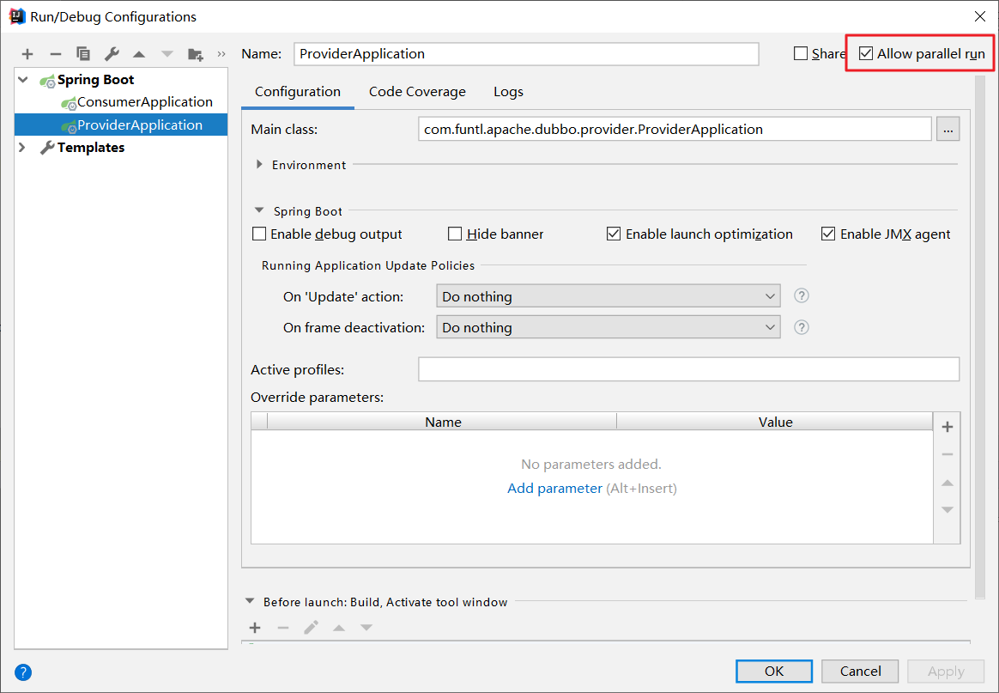

## 什么是 Dubbo

Apache Dubbo (incubating) |ˈdʌbəʊ| 是一款高性能、轻量级的开源 Java RPC 分布式服务框架，它提供了三大核心能力：面向接口的远程方法调用，智能容错和负载均衡，以及服务自动注册和发现。她最大的特点是按照分层的方式来架构，使用这种方式可以使各个层之间解耦合（或者最大限度地松耦合）。从服务模型的角度来看，Dubbo 采用的是一种非常简单的模型，要么是提供方提供服务，要么是消费方消费服务，所以基于这一点可以抽象出服务提供方（Provider）和服务消费方（Consumer）两个角色。

> **备注：** 2019 年 5 月 21 日 Apache 软件基金会发表博文，宣布 Dubbo 在 2019 年 5 月 20 日 这天正式毕业，成为 Apache 的顶级项目。

- [官方网站]( http://dubbo.apache.org/zh-cn/ )
- [官方 GitHub]( https://github.com/apache/dubbo )

## Dubbo 架构


### 节点角色说明

| 节点      | 角色说明                               |
| :-------- | :------------------------------------- |
| Provider  | 暴露服务的服务提供方                   |
| Consumer  | 调用远程服务的服务消费方               |
| Registry  | 服务注册与发现的注册中心               |
| Monitor   | 统计服务的调用次数和调用时间的监控中心 |
| Container | 服务运行容器                           |

### 调用关系说明

- 服务容器负责启动，加载，运行服务提供者
- 服务提供者在启动时，向注册中心注册自己提供的服务
- 服务消费者在启动时，向注册中心订阅自己所需的服务
- 注册中心返回服务提供者地址列表给消费者，如果有变更，注册中心将基于长连接推送变更数据给消费者
- 服务消费者，从提供者地址列表中，基于软负载均衡算法，选一台提供者进行调用，如果调用失败，再选另一台调用
- 服务消费者和提供者，在内存中累计调用次数和调用时间，定时每分钟发送一次统计数据到监控中心

## Dubbo 功能特点

- **面向接口代理的高性能 RPC 调用：** 提供高性能的基于代理的远程调用能力，服务以接口为粒度，为开发者屏蔽远程调用底层细节
- **智能负载均衡：** 内置多种负载均衡策略，智能感知下游节点健康状况，显著减少调用延迟，提高系统吞吐量
- **服务自动注册与发现：** 支持多种注册中心服务，服务实例上下线实时感知
- **高度可扩展能力：** 遵循微内核 + 插件的设计原则，所有核心能力如 Protocol、Transport、Serialization 被设计为扩展点，平等对待内置实现和第三方实现
- **运行期流量调度：** 内置条件、脚本等路由策略，通过配置不同的路由规则，轻松实现灰度发布，同机房优先等功能
- **可视化的服务治理与运维：** 提供丰富服务治理、运维工具：随时查询服务元数据、服务健康状态及调用统计，实时下发路由策略、调整配置参数

## 附：扩展阅读

### 什么是 RPC

分布式是促使 RPC 诞生的领域，**RPC 是一种编程模型，并没有规定你具体要怎样实现**，无论使用 HTTP 或是 RMI 都是可以的。

假设你有一个计算器接口，Calculator，以及它的实现类 CalculatorImpl，那么在系统还是 **单体应用** 时，你要调用 Calculator 的 add 方法来执行一个加运算，直接 new 一个 CalculatorImpl，然后调用 add 方法就行了，这其实就是非常普通的 **本地函数调用**，因为在 **同一个地址空间**，或者说在同一块内存，所以通过方法栈和参数栈就可以实现。



现在，基于高性能和高可靠等因素的考虑，你决定将系统改造为分布式应用，将很多可以共享的功能都单独拎出来，比如上面说到的计算器，你单独把它放到一个服务里头，让别的服务去调用它。



这下问题来了，服务 A 里头并没有 CalculatorImpl 这个类，那它要怎样调用服务 B 的 CalculatorImpl 的 add 方法呢？

**RPC 要解决的两个问题**

- 解决分布式系统中，服务之间的调用问题
- 远程调用时，要能够像本地调用一样方便，让调用者感知不到远程调用的逻辑

### 如何实现一个 RPC

实际情况下，**RPC 很少用到 HTTP 协议来进行数据传输**，毕竟我只是想传输一下数据而已，何必动用到一个文本传输的应用层协议呢，我为什么不直接使用**二进制传输**？比如直接用 Java 的 Socket 协议进行传输？

不管你用何种协议进行数据传输，一个完整的 RPC 过程，都可以用下面这张图来描述



以左边的 Client 端为例，Application 就是 RPC 的调用方，Client Stub 就是我们上面说到的代理对象，也就是那个看起来像是 Calculator 的实现类，其实内部是通过 RPC 方式来进行远程调用的代理对象，至于 Client Run-time Library，则是实现远程调用的工具包，比如 JDK 的 Socket，最后通过底层网络实现实现数据的传输。

这个过程中最重要的就是 **序列化** 和 **反序列化** 了，因为数据传输的数据包必须是二进制的，你直接丢一个 Java 对象过去，人家可不认识，你必须把 Java 对象序列化为二进制格式，传给 Server 端，Server 端接收到之后，再反序列化为 Java 对象。

### RPC vs Restful

**RPC 是面向过程**，**Restful 是面向资源**，并且使用了 HTTP 动词。从这个维度上看，Restful 风格的 URL 在表述的精简性、可读性上都要更好。

### 阿里为何放弃 Zookeeper

**CAP**

有个思考，从 CAP 角度考虑，服务注册中心是 CP 系统还是 AP 系统呢？

- 服务注册中心是为了服务间调用服务的，那么绝对不允许因为服务注册中心出现了问题而导致服务间的调用出问题
- 假如有 node1，node2，node3 集群节点。保存着可用服务列表 ip1，ip2，ip3，试想如果此时不一致，比如 node1 只保存了ip1，ip2，此时服务读取 node1 的节点，那么会造成什么影响？

调用 node1 的服务，顶多就是负载均衡时不会有流量打到 ip3，然后等 node1 同步回 ip3 后，又一致了，这对服务其实没什么太大影响。所以，推测出服务注册中心应该是个 AP 系统。

**Zookeeper 是个 CP 系统，强一致性**

- 场景1，当 master 挂了，此时 Zookeeper 集群需要重新选举，而此时服务需要来读取可用服务，是不可用的。影响到了服务的可用性当然你可以说服务本地有缓存可用列表。然而下面这种方式就更无法处理了。
- 场景2，分区可用。试想，有 3 个机房，如果其中机房 3 和机房 1，2 网络断了，那么机房 3 的注册中心就不能注册新的机器了，这显然也不合理从健康检查角度来看



Zookeeper 是通过 TCP 的心跳判断服务是否可用，但 TCP 的活性并不代表服务是可用的，如：连接池已满，DB 挂了等

**理想的注册中心**

- 服务自动注册发现。最好有新的服务注册上去时还能推送到调用端
- 能对注册上来的机器方便的进行管理，能手动删除（发送信号让服务优雅下线）、恢复机器
- 服务的健康检查，能真正的检测到服务是否可用
- 可以看到是否有其他调用服务正在订阅注册上来的服务
- 能够带上些除了 IP 外的其它信息

## 创建Dubbo项目工程

__pom__

```xml
<?xml version="1.0" encoding="UTF-8"?>
<project xmlns="http://maven.apache.org/POM/4.0.0" xmlns:xsi="http://www.w3.org/2001/XMLSchema-instance"
         xsi:schemaLocation="http://maven.apache.org/POM/4.0.0 http://maven.apache.org/xsd/maven-4.0.0.xsd">
    <modelVersion>4.0.0</modelVersion>
    <parent>
        <groupId>org.springframework.boot</groupId>
        <artifactId>spring-boot-starter-parent</artifactId>
        <version>2.1.6.RELEASE</version>
        <relativePath/> <!-- lookup parent from repository -->
    </parent>
    <groupId>com.xiayu</groupId>
    <artifactId>hello-apache-dubbo</artifactId>
    <version>0.0.1-SNAPSHOT</version>
    <packaging>pom</packaging>

    <modules>
        <module>hello-apache-dubbo-dependencies</module>
        <module>hello-apache-dubbo-provider</module>
        <module>hello-apache-dubbo-consumer</module>
    </modules>
    <properties>
        <java.version>1.8</java.version>
        <maven.compiler.source>${java.version}</maven.compiler.source>
        <maven.compiler.target>${java.version}</maven.compiler.target>
        <project.build.sourceEncoding>UTF-8</project.build.sourceEncoding>
        <project.reporting.outputEncoding>UTF-8</project.reporting.outputEncoding>
    </properties>
    <licenses>
        <license>
            <name>Apache 2.0</name>
            <url>https://www.apache.org/licenses/LICENSE-2.0.txt</url>
        </license>
    </licenses>
    <!--开发者个人信息-->
    <developers>
        <developer>
            <id>xuhongyu</id>
            <name>xiayu</name>
            <email>xiayuxuxu@qq.com</email>
        </developer>
    </developers>

    <dependencyManagement>
        <dependencies>
            <dependency>
                <groupId>com.funtl</groupId>
                <artifactId>hello-apache-dubbo-dependencies</artifactId>
                <version>${project.version}</version>
                <type>pom</type>
                <scope>import</scope>
            </dependency>
        </dependencies>
    </dependencyManagement>
    <profiles>
        <profile>
            <id>default</id>
            <activation>
                <activeByDefault>true</activeByDefault>
            </activation>
            <properties>
                <spring-javaformat.version>0.0.12</spring-javaformat.version>
            </properties>
            <build>
                <plugins>
                    <plugin>
                        <groupId>io.spring.javaformat</groupId>
                        <artifactId>spring-javaformat-maven-plugin</artifactId>
                        <version>${spring-javaformat.version}</version>
                    </plugin>
                    <plugin>
                        <groupId>org.apache.maven.plugins</groupId>
                        <artifactId>maven-surefire-plugin</artifactId>
                        <configuration>
                            <includes>
                                <include>**/*Tests.java</include>
                            </includes>
                            <excludes>
                                <exclude>**/Abstract*.java</exclude>
                            </excludes>
                            <systemPropertyVariables>
                                <java.security.egd>file:/dev/./urandom</java.security.egd>
                                <java.awt.headless>true</java.awt.headless>
                            </systemPropertyVariables>
                        </configuration>
                    </plugin>
                    <plugin>
                        <groupId>org.apache.maven.plugins</groupId>
                        <artifactId>maven-enforcer-plugin</artifactId>
                        <executions>
                            <execution>
                                <id>enforce-rules</id>
                                <goals>
                                    <goal>enforce</goal>
                                </goals>
                                <configuration>
                                    <rules>
                                        <bannedDependencies>
                                            <excludes>
                                                <exclude>commons-logging:*:*</exclude>
                                            </excludes>
                                            <searchTransitive>true</searchTransitive>
                                        </bannedDependencies>
                                    </rules>
                                    <fail>true</fail>
                                </configuration>
                            </execution>
                        </executions>
                    </plugin>
                    <plugin>
                        <groupId>org.apache.maven.plugins</groupId>
                        <artifactId>maven-install-plugin</artifactId>
                        <configuration>
                            <skip>true</skip>
                        </configuration>
                    </plugin>
                    <plugin>
                        <groupId>org.apache.maven.plugins</groupId>
                        <artifactId>maven-javadoc-plugin</artifactId>
                        <configuration>
                            <skip>true</skip>
                        </configuration>
                        <inherited>true</inherited>
                    </plugin>
                </plugins>
            </build>
        </profile>
    </profiles>
    <repositories>
        <repository>
            <id>spring-milestone</id>
            <name>Spring Milestone</name>
            <url>https://repo.spring.io/milestone</url>
            <snapshots>
                <enabled>false</enabled>
            </snapshots>
        </repository>
        <repository>
            <id>spring-snapshot</id>
            <name>Spring Snapshot</name>
            <url>https://repo.spring.io/snapshot</url>
            <snapshots>
                <enabled>true</enabled>
            </snapshots>
        </repository>
    </repositories>
    <pluginRepositories>
        <pluginRepository>
            <id>spring-milestone</id>
            <name>Spring Milestone</name>
            <url>https://repo.spring.io/milestone</url>
            <snapshots>
                <enabled>false</enabled>
            </snapshots>
        </pluginRepository>
        <pluginRepository>
            <id>spring-snapshot</id>
            <name>Spring Snapshot</name>
            <url>https://repo.spring.io/snapshot</url>
            <snapshots>
                <enabled>true</enabled>
            </snapshots>
        </pluginRepository>
    </pluginRepositories>
</project>
```

## 创建Dubbo统一的依赖管理

__pom__

```xml
<?xml version="1.0" encoding="UTF-8"?>
<project xmlns="http://maven.apache.org/POM/4.0.0" xmlns:xsi="http://www.w3.org/2001/XMLSchema-instance"
         xsi:schemaLocation="http://maven.apache.org/POM/4.0.0 http://maven.apache.org/xsd/maven-4.0.0.xsd">
    <modelVersion>4.0.0</modelVersion>
    <groupId>com.funtl</groupId>
    <artifactId>hello-apache-dubbo-dependencies</artifactId>
    <version>0.0.1-SNAPSHOT</version>
    <packaging>pom</packaging>
    <properties>
        <dubbo.version>2.7.2</dubbo.version>
        <dubbo-actuator.version>2.7.1</dubbo-actuator.version>
        <spring-cloud.version>Greenwich.RELEASE</spring-cloud.version>
        <spring-cloud-alibaba.verion>0.9.0.RELEASE</spring-cloud-alibaba.verion>
        <alibaba-spring-context-support.version>1.0.2</alibaba-spring-context-support.version>
    </properties>
    <licenses>
        <license>
            <name>Apache 2.0</name>
            <url>https://www.apache.org/licenses/LICENSE-2.0.txt</url>
        </license>
    </licenses>
    <!--开发者个人信息-->
    <developers>
        <developer>
            <id>xuhongyu</id>
            <name>xiayu</name>
            <email>xiayuxuxu@qq.com</email>
        </developer>
    </developers>
    <dependencyManagement>
        <dependencies>
            <dependency>
                <groupId>org.springframework.cloud</groupId>
                <artifactId>spring-cloud-dependencies</artifactId>
                <version>${spring-cloud.version}</version>
                <type>pom</type>
                <scope>import</scope>
            </dependency>
            <dependency>
                <groupId>org.springframework.cloud</groupId>
                <artifactId>spring-cloud-alibaba-dependencies</artifactId>
                <version>${spring-cloud-alibaba.verion}</version>
                <type>pom</type>
                <scope>import</scope>
            </dependency>
            <dependency>
                <groupId>org.apache.dubbo</groupId>
                <artifactId>dubbo</artifactId>
                <version>${dubbo.version}</version>
                <exclusions>
                    <exclusion>
                        <groupId>org.springframework</groupId>
                        <artifactId>spring</artifactId>
                    </exclusion>
                    <exclusion>
                        <groupId>javax.servlet</groupId>
                        <artifactId>servlet-api</artifactId>
                    </exclusion>
                    <exclusion>
                        <groupId>log4j</groupId>
                        <artifactId>log4j</artifactId>
                    </exclusion>
                </exclusions>
            </dependency>
            <dependency>
                <groupId>org.apache.dubbo</groupId>
                <artifactId>dubbo-spring-boot-actuator</artifactId>
                <version>${dubbo-actuator.version}</version>
            </dependency>
            <dependency>
                <groupId>com.alibaba.spring</groupId>
                <artifactId>spring-context-support</artifactId>
                <version>${alibaba-spring-context-support.version}</version>
            </dependency>
        </dependencies>
    </dependencyManagement>
    <repositories>
        <repository>
            <id>spring-milestone</id>
            <name>Spring Milestone</name>
            <url>https://repo.spring.io/milestone</url>
            <snapshots>
                <enabled>false</enabled>
            </snapshots>
        </repository>
        <repository>
            <id>spring-snapshot</id>
            <name>Spring Snapshot</name>
            <url>https://repo.spring.io/snapshot</url>
            <snapshots>
                <enabled>true</enabled>
            </snapshots>
        </repository>
    </repositories>
    <pluginRepositories>
        <pluginRepository>
            <id>spring-milestone</id>
            <name>Spring Milestone</name>
            <url>https://repo.spring.io/milestone</url>
            <snapshots>
                <enabled>false</enabled>
            </snapshots>
        </pluginRepository>
        <pluginRepository>
            <id>spring-snapshot</id>
            <name>Spring Snapshot</name>
            <url>https://repo.spring.io/snapshot</url>
            <snapshots>
                <enabled>true</enabled>
            </snapshots>
        </pluginRepository>
    </pluginRepositories>
</project>
```

## Dubbo服务注册与发现

概述

由于我们已经有了 Nacos 注册中心，Sentinel 熔断限流控制中心，所以我们不再使用 Zookeeper 和 Dubbo Admin 来管理我们的 Dubbo 应用程序，Dubbo 仅当作我们微服务中的 RPC 通信框架，真正实现对内 RPC，对外 REST

### 创建服务提供者

POM

创建一个名为 `hello-apache-dubbo-provider` 的服务提供者项目，`pom.xml` 配置如下：

```xml
<?xml version="1.0" encoding="UTF-8"?>
<project xmlns="http://maven.apache.org/POM/4.0.0" xmlns:xsi="http://www.w3.org/2001/XMLSchema-instance"
         xsi:schemaLocation="http://maven.apache.org/POM/4.0.0 http://maven.apache.org/xsd/maven-4.0.0.xsd">
    <modelVersion>4.0.0</modelVersion>
    <parent>
        <groupId>com.xiayu</groupId>
        <artifactId>hello-apache-dubbo</artifactId>
        <version>0.0.1-SNAPSHOT</version>
    </parent>
    <artifactId>hello-apache-dubbo-provider</artifactId>
    <packaging>pom</packaging>
    <inceptionYear>2018-Now</inceptionYear>
    <licenses>
        <license>
            <name>Apache 2.0</name>
            <url>https://www.apache.org/licenses/LICENSE-2.0.txt</url>
        </license>
    </licenses>
    <!--开发者个人信息-->
    <developers>
        <developer>
            <id>xuhongyu</id>
            <name>xiayu</name>
            <email>xiayuxuxu@qq.com</email>
        </developer>
    </developers>
    <modules>
        <module>hello-apache-dubbo-provider-api</module>
        <module>hello-apache-dubbo-provider-service</module>
    </modules>
</project>
```

### 创建服务提供者接口模块

POM

创建一个名为 `hello-apache-dubbo-provider-api` 的模块（该模块只负责定义接口），`pom.xml` 配置如下：

```xml
<?xml version="1.0" encoding="UTF-8"?>
<project xmlns="http://maven.apache.org/POM/4.0.0" xmlns:xsi="http://www.w3.org/2001/XMLSchema-instance"
         xsi:schemaLocation="http://maven.apache.org/POM/4.0.0 http://maven.apache.org/xsd/maven-4.0.0.xsd">
    <modelVersion>4.0.0</modelVersion>
    <parent>
        <groupId>com.xiayu</groupId>
        <artifactId>hello-apache-dubbo-provider</artifactId>
        <version>0.0.1-SNAPSHOT</version>
    </parent>
    <artifactId>hello-apache-dubbo-provider-api</artifactId>
    <packaging>jar</packaging>

    <inceptionYear>2018-Now</inceptionYear>
    <licenses>
        <license>
            <name>Apache 2.0</name>
            <url>https://www.apache.org/licenses/LICENSE-2.0.txt</url>
        </license>
    </licenses>
    <!--开发者个人信息-->
    <developers>
        <developer>
            <id>xuhongyu</id>
            <name>xiayu</name>
            <email>xiayuxuxu@qq.com</email>
        </developer>
    </developers>
</project>
```

#### 定义接口

```java
package com.funtl.apache.dubbo.provider.api;
public interface EchoService {
    String echo(String string);
}
```

### 创建服务提供者接口实现

POM

创建一个名为 `hello-apache-dubbo-provider-service` 的模块，`pom.xml` 配置如下：

```java
<?xml version="1.0" encoding="UTF-8"?>
<project xmlns="http://maven.apache.org/POM/4.0.0" xmlns:xsi="http://www.w3.org/2001/XMLSchema-instance"
         xsi:schemaLocation="http://maven.apache.org/POM/4.0.0 http://maven.apache.org/xsd/maven-4.0.0.xsd">
    <modelVersion>4.0.0</modelVersion>
    <parent>
        <groupId>com.xiayu</groupId>
        <artifactId>hello-apache-dubbo-provider</artifactId>
        <version>0.0.1-SNAPSHOT</version>
    </parent>
    <artifactId>hello-apache-dubbo-provider-service</artifactId>
    <packaging>jar</packaging>

    <inceptionYear>2018-Now</inceptionYear>
    <licenses>
        <license>
            <name>Apache 2.0</name>
            <url>https://www.apache.org/licenses/LICENSE-2.0.txt</url>
        </license>
    </licenses>

    <!--开发者个人信息-->
    <developers>
        <developer>
            <id>xuhongyu</id>
            <name>xiayu</name>
            <email>xiayuxuxu@qq.com</email>
        </developer>
    </developers>

    <dependencies>
        <!-- Spring Boot Begin -->
        <dependency>
            <groupId>org.springframework.boot</groupId>
            <artifactId>spring-boot-starter</artifactId>
        </dependency>
        <dependency>
            <groupId>org.springframework.boot</groupId>
            <artifactId>spring-boot-starter-test</artifactId>
            <scope>test</scope>
        </dependency>
        <!-- Spring Boot End -->
        <!-- Apache Dubbo Begin -->
        <dependency>
            <groupId>org.apache.dubbo</groupId>
            <artifactId>dubbo-spring-boot-starter</artifactId>
        </dependency>
        <dependency>
            <groupId>org.apache.dubbo</groupId>
            <artifactId>dubbo</artifactId>
        </dependency>
        <dependency>
            <groupId>com.alibaba</groupId>
            <artifactId>dubbo-registry-nacos</artifactId>
        </dependency>
        <dependency>
            <groupId>com.alibaba.nacos</groupId>
            <artifactId>nacos-client</artifactId>
        </dependency>
        <dependency>
            <groupId>com.alibaba.spring</groupId>
            <artifactId>spring-context-support</artifactId>
        </dependency>
        <!-- Apache Dubbo End -->
        <!-- Projects Begin -->
        <dependency>
            <groupId>com.xiayu</groupId>
            <artifactId>hello-apache-dubbo-provider-api</artifactId>
            <version>${project.parent.version}</version>
        </dependency>
        <!-- Projects End -->
    </dependencies>
    <build>
        <plugins>
            <plugin>
                <groupId>org.springframework.boot</groupId>
                <artifactId>spring-boot-maven-plugin</artifactId>
                <configuration>
                    <mainClass>com.funtl.apache.dubbo.provider.ProviderApplication</mainClass>
                </configuration>
            </plugin>
        </plugins>
    </build>
</project>
```

#### application.yml

主要增加了 Dubbo 包扫描路径和 Nacos Server 配置

```yml
spring:
  application:
    name: dubbo-provider
  main:
    allow-bean-definition-overriding: true

dubbo:
  # 扫描服务
  scan:
    base-packages: com.xiayu.spring.cloud.alibaba.dubbo.provider.service
  protocol:
    name: dubbo
    port: -1     #-1自动分配端口
  registry:
    address: nacos://192.168.10.134:8848
```

#### Application

```java
package com.xiayu.spring.cloud.alibaba.dubbo.provider;
import org.springframework.boot.SpringApplication;
import org.springframework.boot.autoconfigure.SpringBootApplication;
@SpringBootApplication
public class DubboProviderApplication {
    public static void main(String[] args) {
        SpringApplication.run(DubboProviderApplication.class, args);
    }
}

```

#### Service

通过 `org.apache.dubbo` 包下的 `@Service` 注解将服务暴露出去

```java
package com.xiayu.spring.cloud.alibaba.dubbo.provider.service;
import com.xiayu.apache.dubbo.provider.api.EchoService;
import org.apache.dubbo.config.annotation.Service;
import org.springframework.beans.factory.annotation.Value;
@Service(version = "1.0.0")
public class EchoServiceImpl implements EchoService {

    @Value("${dubbo.protocol.port}")
    private String port;
    @Override
    public String echo(String string) {
        return "Hello Dubbo " + string + " port:" + port;
    }
}
```

#### 验证是否成功

通过浏览器访问  http://192.168.141.132:8848/nacos   Nacos Server 网址


你会发现一个服务已经注册在服务中了，服务名为 `providers:com.funtl.apache.dubbo.provider.api.EchoService:1.0.0:`

### 创建服务消费者

POM

创建一个名为 `hello-apache-dubbo-consumer` 的服务消费者项目，`pom.xml` 配置如下：

```xml
<?xml version="1.0" encoding="UTF-8"?>
<project xmlns="http://maven.apache.org/POM/4.0.0" xmlns:xsi="http://www.w3.org/2001/XMLSchema-instance"
         xsi:schemaLocation="http://maven.apache.org/POM/4.0.0 http://maven.apache.org/xsd/maven-4.0.0.xsd">
    <modelVersion>4.0.0</modelVersion>
    <parent>
        <groupId>com.xiayu</groupId>
        <artifactId>hello-apache-dubbo</artifactId>
        <version>0.0.1-SNAPSHOT</version>
    </parent>
    <artifactId>hello-apache-dubbo-consumer</artifactId>
    <packaging>jar</packaging>
    <inceptionYear>2018-Now</inceptionYear>
    <licenses>
        <license>
            <name>Apache 2.0</name>
            <url>https://www.apache.org/licenses/LICENSE-2.0.txt</url>
        </license>
    </licenses>

    <!--开发者个人信息-->
    <developers>
        <developer>
            <id>xuhongyu</id>
            <name>xiayu</name>
            <email>xiayuxuxu@qq.com</email>
        </developer>
    </developers>

    <dependencies>
        <!-- Spring Boot Begin -->
        <dependency>
            <groupId>org.springframework.boot</groupId>
            <artifactId>spring-boot-starter-web</artifactId>
        </dependency>
        <dependency>
            <groupId>org.springframework.boot</groupId>
            <artifactId>spring-boot-starter-actuator</artifactId>
        </dependency>
        <dependency>
            <groupId>org.springframework.boot</groupId>
            <artifactId>spring-boot-starter-test</artifactId>
            <scope>test</scope>
        </dependency>
        <!-- Spring Boot End -->
        <!-- Apache Dubbo Begin -->
        <dependency>
            <groupId>org.apache.dubbo</groupId>
            <artifactId>dubbo-spring-boot-starter</artifactId>
        </dependency>
        <dependency>
            <groupId>org.apache.dubbo</groupId>
            <artifactId>dubbo-spring-boot-actuator</artifactId>
        </dependency>
        <dependency>
            <groupId>org.apache.dubbo</groupId>
            <artifactId>dubbo</artifactId>
        </dependency>
        <dependency>
            <groupId>com.alibaba</groupId>
            <artifactId>dubbo-registry-nacos</artifactId>
        </dependency>
        <dependency>
            <groupId>com.alibaba.nacos</groupId>
            <artifactId>nacos-client</artifactId>
        </dependency>
        <dependency>
            <groupId>com.alibaba.spring</groupId>
            <artifactId>spring-context-support</artifactId>
        </dependency>
        <!-- Apache Dubbo End -->
        <!-- Projects Begin -->
        <dependency>
            <groupId>com.xiayu</groupId>
            <artifactId>hello-apache-dubbo-provider-api</artifactId>
            <version>${project.parent.version}</version>
        </dependency>
        <!-- Projects End -->
    </dependencies>
    <build>
        <plugins>
            <plugin>
                <groupId>org.springframework.boot</groupId>
                <artifactId>spring-boot-maven-plugin</artifactId>
                <configuration>
                    <mainClass>com.xiayu.apache.dubbo.consumer.ConsumerApplication</mainClass>
                </configuration>
            </plugin>
        </plugins>
    </build>
</project>
```

#### application.yml

主要增加了 Dubbo 包扫描路径、健康检查以及 Nacos Server 配置

```yml
spring:
  application:
    name: dubbo-consumer
  main:
    allow-bean-definition-overriding: true
dubbo:
  scan:
    base-packages: com.xiayu.apache.dubbo.consumer.controller
  protocol:
    name: dubbo
    port: -1
  registry:
    address:  nacos://192.168.10.134:8848
server:
  port: 8080
endpoints:
  dubbo:
    enabled: true
management:
  health:
    dubbo:
      status:
        defaults: memory
        extras: threadpool
  endpoints:
    web:
      exposure:
        include: "*"
```

#### Application

```java
package com.funtl.apache.dubbo.consumer;
import org.springframework.boot.SpringApplication;
import org.springframework.boot.autoconfigure.SpringBootApplication;
@SpringBootApplication
public class ConsumerApplication {
    public static void main(String[] args) {
        SpringApplication.run(ConsumerApplication.class, args);
    }
}
```

#### Controller

通过 `org.apache.dubbo` 包下的 `@Reference` 注解像调用本地服务一样调用远程服务，轻松实现透明的远程过程调用

```java
package com.xiayu.apache.dubbo.consumer.controller;
import com.xiayu.apache.dubbo.provider.api.EchoService;
import org.apache.dubbo.config.annotation.Reference;
import org.springframework.beans.factory.annotation.Value;
import org.springframework.web.bind.annotation.GetMapping;
import org.springframework.web.bind.annotation.PathVariable;
import org.springframework.web.bind.annotation.RestController;
@RestController
public class EchController {
    @Reference(version = "1.0.0")
    private EchoService echoService;
    @Value("${user.name}")
    private String username;
    @GetMapping(value = "/echo/{string}")
    public String echo(@PathVariable String string) {
        return echoService.echo(string) + " " ;
    }
}
```

#### 验证是否成功

通过浏览器访问 [http://192.168.141.132:8848/nacos]() Nacos Server 网址


你会发现一个服务已经注册在服务中了，服务名为 `consumers:com.funtl.apache.dubbo.provider.api.EchoService:1.0.0:`，通过浏览器访问 [http://localhost:8080/echo/xxxx]()

```
Echo Hello Dubbo xxxx
```

#### 服务端点检查

通过浏览器访问 [http://localhost:8080/actuator/health]()

```
{    "status": "UP"}
```

## Dubbo 中的序列化

Dubbo RPC 是 Dubbo 体系中最核心的一种高性能、高吞吐量的远程调用方式，可以称之为多路复用的 TCP 长连接调用：

- **长连接：** 避免了每次调用新建 TCP 连接，提高了调用的响应速度
- **多路复用：** 单个 TCP 连接可交替传输多个请求和响应的消息，降低了连接的等待闲置时间，从而减少了同样并发数下的网络连接数，提高了系统吞吐量

Dubbo RPC 主要用于两个 Dubbo 系统之间的远程调用，特别适合高并发、小数据的互联网场景。而序列化对于远程调用的响应速度、吞吐量、网络带宽消耗等同样也起着至关重要的作用，是我们提升分布式系统性能的最关键因素之一。

Dubbo 中支持的序列化方式：

- **dubbo 序列化：** 阿里尚未开发成熟的高效 Java 序列化实现，阿里不建议在生产环境使用它
- **hessian2 序列化：** hessian 是一种跨语言的高效二进制序列化方式。但这里实际不是原生的 hessian2 序列化，而是阿里修改过的 hessian lite，它是 dubbo RPC 默认启用的序列化方式
- **json 序列化：** 目前有两种实现，一种是采用的阿里的 fastjson 库，另一种是采用 dubbo 中自己实现的简单 json 库，但其实现都不是特别成熟，而且 json 这种文本序列化性能一般不如上面两种二进制序列化。
- **java 序列化：** 主要是采用 JDK 自带的 Java 序列化实现，性能很不理想。

在通常情况下，这四种主要序列化方式的性能从上到下依次递减。对于 dubbo RPC 这种追求高性能的远程调用方式来说，实际上只有 1、2 两种高效序列化方式比较般配，而第 1 个 dubbo 序列化由于还不成熟，所以实际只剩下 2 可用，所以 dubbo RPC 默认采用 hessian2 序列化。

但 hessian 是一个比较老的序列化实现了，而且它是跨语言的，所以不是单独针对 Java 进行优化的。而 dubbo RPC 实际上完全是一种 Java to Java 的远程调用，其实没有必要采用跨语言的序列化方式（当然肯定也不排斥跨语言的序列化）。

最近几年，各种新的高效序列化方式层出不穷，不断刷新序列化性能的上限，最典型的包括：

- 专门针对 Java 语言的：**Kryo**，FST 等等
- 跨语言的：Protostuff，ProtoBuf，**Thrift**，Avro，MsgPack 等等

这些序列化方式的性能多数都显著优于 hessian2（甚至包括尚未成熟的 dubbo 序列化），有鉴于此，我们为 dubbo 引入 Kryo 和 FST 这两种高效 Java 序列化实现，来逐步取代 hessian2。

其中，Kryo 是一种非常成熟的序列化实现，已经在 Twitter、Groupon、Yahoo 以及多个著名开源项目（如 Hive、Storm）中广泛的使用。而 FST 是一种较新的序列化实现，目前还缺乏足够多的成熟使用案例。

> **注意：** 在面向生产环境的应用中，目前更优先选择 Kryo

### 启用 Kryo

在 Provider 和 Consumer 项目启用 Kryo 高速序列化功能，两个项目的配置方式相同

POM

增加 `org.apache.dubbo:dubbo-serialization-kryo` 依赖

```xml
<properties>
    <dubbo-kryo.version>2.7.2</dubbo-kryo.version>
</properties>
<dependency>
    <groupId>org.apache.dubbo</groupId>
    <artifactId>dubbo-serialization-kryo</artifactId>
    <version>${dubbo-kryo.version}</version>
</dependency>
```

#### application.yml

增加 `dubbo.protocol.serialization=kryo` 配置

```yml
dubbo:
  protocol:
    serialization: kryo
```

#### 序列化类说明

> **注意：** 想要使用 Kryo 序列化只需要 DTO/Domain/Entity 这类传输对象实现序列化接口即可，无需额外再做配置，如：`public class User implements Serializable{}`

在对一个类做序列化的时候，可能还级联引用到很多类，比如 Java 集合类。针对这种情况，Dubbo 已经自动将 JDK 中的常用类进行了注册，包括：

```
GregorianCalendar
InvocationHandler
BigDecimal
BigInteger
Pattern
BitSet
URI
UUID
HashMap
ArrayList
LinkedList
HashSet
TreeSet
Hashtable
Date
Calendar
ConcurrentHashMap
SimpleDateFormat
Vector
BitSet
StringBuffer
StringBuilder
Object
Object[]
String[]
byte[]
char[]
int[]
float[]
double[]
```

由于注册被序列化的类仅仅是出于性能优化的目的，所以即使你忘记注册某些类也没有关系。事实上，即使不注册任何类，Kryo 和 FST 的性能依然普遍优于 hessian 和 dubbo 序列化。

### 附：扩展阅读

#### 序列化性能分析与测试

##### 测试环境

- 两台独立服务器
- 4 核 Intel(R) Xeon(R) CPU E5-2603 0 @ 1.80GHz
- 8G 内存
- 虚拟机之间网络通过百兆交换机
- CentOS 5
- JDK 7
- Tomcat 7
- JVM 参数 `-server -Xms1g -Xmx1g -XX:PermSize=64M -XX:+UseConcMarkSweepGC`

> **注意：** 当然这个测试环境较有局限，故当前测试结果未必有非常权威的代表性

##### 测试脚本

和 dubbo 自身的基准测试保持接近，10 个并发客户端持续不断发出请求：

- 传入嵌套复杂对象（但单个数据量很小），不做任何处理，原样返回
- 传入 50K 字符串，不做任何处理，原样返回（TODO：结果尚未列出）

进行 5 分钟性能测试。（引用 dubbo 自身测试的考虑：“主要考察序列化和网络 IO 的性能，因此服务端无任何业务逻辑。**取 10 并发是考虑到 HTTP 协议在高并发下对 CPU 的使用率较高可能会先达到瓶颈。**”）

##### Dubbo RPC 中不同序列化生成字节大小比较

序列化生成字节码的大小是一个比较有确定性的指标，它决定了远程调用的网络传输时间和带宽占用。针对复杂对象的结果如下（数值越小越好）：




##### Dubbo RPC 中不同序列化响应时间和吞吐量对比







##### 结论

就目前结果而言，我们可以看到不管从生成字节的大小，还是平均响应时间和平均 TPS，Kryo 和 FST 相比 Dubbo RPC 中原有的序列化方式都有非常显著的改进。

## Dubbo 负载均衡

概述

在集群负载均衡时，Dubbo 提供了多种均衡策略，缺省为 `random` 随机调用。

### 负载均衡策略

#### 随机

**Random LoadBalance：** 按权重设置随机概率，在一个截面上碰撞的概率高，但调用量越大分布越均匀，而且按概率使用权重后也比较均匀，有利于动态调整提供者权重。

#### 轮循

**RoundRobin LoadBalance：** 按公约后的权重设置轮询比率，存在慢的提供者累积请求的问题，比如：第二台机器很慢，但没挂，当请求调到第二台时就卡在那，久而久之，所有请求都卡在调到第二台上。

#### 最少活跃调用数

**LeastActive LoadBalance：** 相同活跃数的随机，活跃数指调用前后计数差，使慢的提供者收到更少请求，因为越慢的提供者的调用前后计数差会越大。

####一致性 Hash

**ConsistentHash LoadBalance：** 相同参数的请求总是发到同一提供者。当某一台提供者挂时，原本发往该提供者的请求，基于虚拟节点，平摊到其它提供者，不会引起剧烈变动。

算法参见：[http://en.wikipedia.org/wiki/Consistent_hashing](http://en.wikipedia.org/wiki/Consistent_hashing) ，缺省只对第一个参数 Hash，如果要修改，请配置 ``，缺省用 160 份虚拟节点，如果要修改，请配置 ``

### 配置负载均衡

- 修改 `dubbo-provider` 项目的负载均衡策略，默认的负载均衡策略是 **随机**，我们修改为 **轮循**，可配置的值分别是：`random`，`roundrobin`，`leastactive`，`consistenthash`

```yml
dubbo:
  provider:
    loadbalance: roundrobin
```

- 修改 `dubbo-provider` 的协议端口为 20880 和 20881，并启动多个实例，IDEA 中依次点击 **Run** -> **Edit Configurations** 并勾选 **Allow parallel run** 以允许 IDEA 多实例运行项目



- Nacos Server 控制台可以看到 `dubbo-provider` 有 2 个实例


- 修改 `dubbo-provider` 项目的 `EchoServiceImpl` 中的测试方法

```java
package com.funtl.apache.dubbo.provider.service;
import com.funtl.apache.dubbo.provider.api.EchoService;
import org.apache.dubbo.config.annotation.Service;
import org.springframework.beans.factory.annotation.Value;
@Service(version = "1.0.0")
public class EchoServiceImpl implements EchoService {
    @Value("${dubbo.protocol.port}")
    private String port;
    @Override
    public String echo(String string) {
        return "Echo Hello Dubbo " + string + " i am from port: " + port;
    }
}
```

- 重启服务，通过浏览器访问 [http://localhost:8080/echo/hi](http://localhost:8080/echo/hi) ，反复刷新浏览器，浏览器交替显示

```
Echo Hello Dubbo hi i am from port: 20880
Echo Hello Dubbo hi i am from port: 20881
```

## Dubbo 外部化部署

概述

由于我们已经使用了 Nacos Server 作为我们的注册中心，所以此处依然使用 Nacos Config 实现 Dubbo 的外部化配置

### 接入配置中心

POM

我们以 `dubbo-consumer` 项目为例，修改 `pom.xml` ，引入 **Nacos Config Starter**

```xml
<dependency>
    <groupId>org.springframework.cloud</groupId>
    <artifactId>spring-cloud-starter-alibaba-nacos-config</artifactId>
</dependency>
```

#### Controller

完成上述两步后，应用会从 Nacos Config 中获取相应的配置，并添加在 Spring Environment 的 PropertySources 中。这里我们使用 `@Value` 注解来将对应的配置注入到 `EchoController` 的 `username`字段，并添加 `@RefreshScope` 打开动态刷新功能

```java
package com.funtl.apache.dubbo.consumer.controller;
import com.funtl.apache.dubbo.provider.api.EchoService;
import org.apache.dubbo.config.annotation.Reference;
import org.springframework.beans.factory.annotation.Value;
import org.springframework.cloud.context.config.annotation.RefreshScope;
import org.springframework.web.bind.annotation.GetMapping;
import org.springframework.web.bind.annotation.PathVariable;
import org.springframework.web.bind.annotation.RestController;
@RefreshScope
@RestController
public class EchoController {
    @Reference(version = "1.0.0")
    private EchoService echoService;
    @Value("${user.name}")
    private String username;
    @GetMapping(value = "/echo/{string}")
    public String echo(@PathVariable String string) {
        return echoService.echo(string) + " " + username;
    }
}
```

#### 使用控制台发布配置

> **注意：** Data ID 的默认扩展名为 `.properties` ，希望使用 YAML 配置，此处必须指明是 `.yaml`

```yml
spring:
  application:
    name: dubbo-consumer
  main:
    allow-bean-definition-overriding: true
dubbo:
  scan:
    base-packages: com.funtl.apache.dubbo.consumer.controller
  protocol:
    name: dubbo
    port: -1
    serialization: kryo
  registry:
    address: nacos://192.168.141.132:8848
server:
  port: 8080
endpoints:
  dubbo:
    enabled: true
management:
  health:
    dubbo:
      status:
        defaults: memory
        extras: threadpool
  endpoints:
    web:
      exposure:
        include: "*"
user:
  name: "唯我成幸"
```

#### 修改客户端配置

创建名为 `bootstrap.properties` 的配置文件并删除之前创建的 `application.yml` 配置文件

```yml
spring.application.name=dubbo-consumer-config
spring.cloud.nacos.config.server-addr=192.168.141.132:8848
spring.cloud.nacos.config.file-extension=yaml
```

通过浏览器访问 [http://localhost:8080/echo/hi](http://localhost:8080/echo/hi) ，浏览器输出如下

```
Echo Hello Dubbo hi i am from port: -1 唯我成幸
```

#### 动态刷新配置

在 Nacos Server 控制台修改配置文件，将 `user.name` 属性修改为 `桐须真冬`，此时观察控制台日志，你会发现我们已经成功刷新了配置


#### 验证是否成功

通过浏览器访问 [http://localhost:8080/echo/hi](http://localhost:8080/echo/hi) ，浏览器输出如下

```tes
Echo Hello Dubbo hi i am from port: -1 桐须真冬
```

> **提示：** 你可以使用 `spring.cloud.nacos.config.refresh.enabled=false` 来关闭动态刷新


