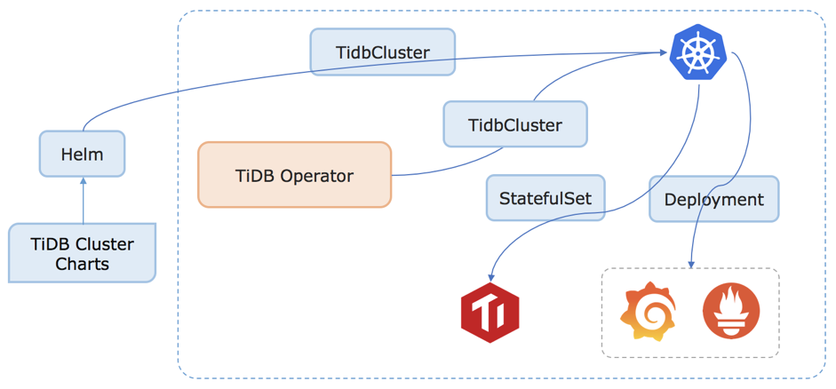
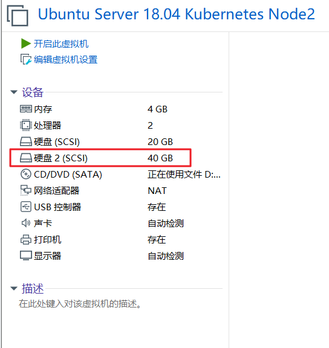
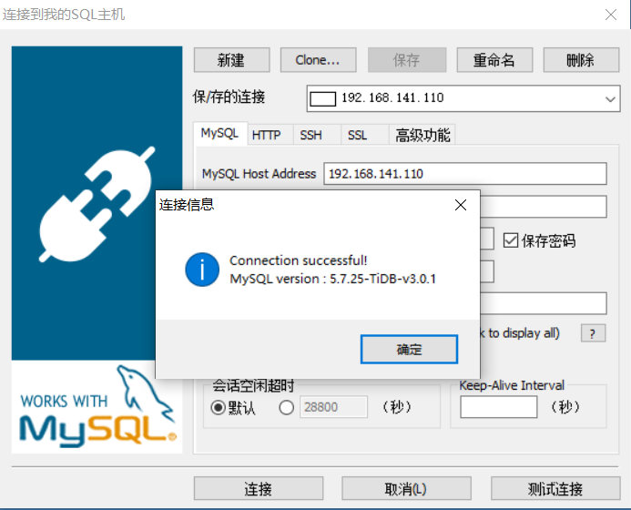
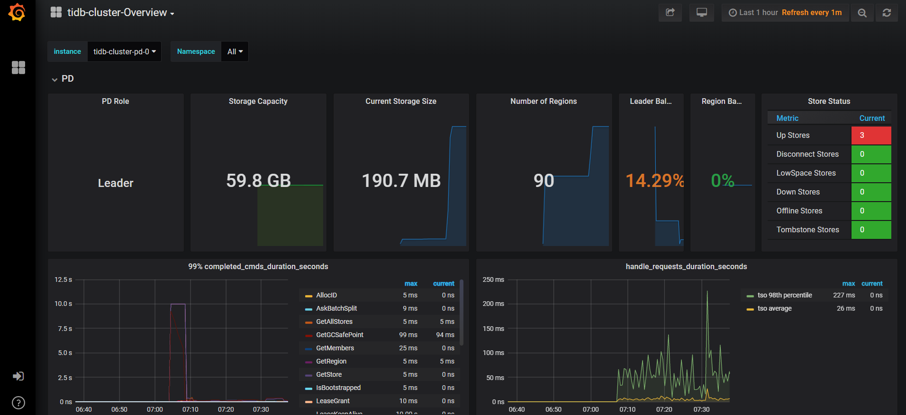

# TiDB 简介

## 什么是 TiDB

TiDB 是 PingCAP 公司受 Google Spanner / F1 论文启发而设计的开源分布式 HTAP (Hybrid Transactional and Analytical Processing) 数据库，结合了传统的 RDBMS 和 NoSQL 的最佳特性。TiDB 兼容 MySQL，支持无限的水平扩展，具备强一致性和高可用性。TiDB 的目标是为 OLTP (Online Transactional Processing) 和 OLAP (Online Analytical Processing) 场景提供一站式的解决方案

[TiDB 官方网站]( https://pingcap.com/ )

## 核心特点

### 高度兼容 MySQL

大多数情况下，无需修改代码即可从 MySQL 轻松迁移至 TiDB，分库分表后的 MySQL 集群亦可通过 TiDB 工具进行实时迁移

### 水平弹性扩展

通过简单地增加新节点即可实现 TiDB 的水平扩展，按需扩展吞吐或存储，轻松应对高并发、海量数据场景

### 分布式事务

TiDB 100% 支持标准的 ACID 事务

### 真正金融级高可用

相比于传统主从 (M-S) 复制方案，基于 Raft 的多数派选举协议可以提供金融级的 100% 数据强一致性保证，且在不丢失大多数副本的前提下，可以实现故障的自动恢复 (auto-failover)，无需人工介入

### 一站式 HTAP 解决方案

TiDB 作为典型的 OLTP 行存数据库，同时兼具强大的 OLAP 性能，配合 TiSpark，可提供一站式 HTAP 解决方案，一份存储同时处理 OLTP & OLAP 无需传统繁琐的 ETL 过程

### 云原生 SQL 数据库

TiDB 是为云而设计的数据库，同 Kubernetes 深度耦合，支持公有云、私有云和混合云，使部署、配置和维护变得十分简单。TiDB 的设计目标是 100% 的 OLTP 场景和 80% 的 OLAP 场景，更复杂的 OLAP 分析可以通过 TiSpark 项目来完成。 TiDB 对业务没有任何侵入性，能优雅的替换传统的数据库中间件、数据库分库分表等 Sharding 方案。同时它也让开发运维人员不用关注数据库 Scale 的细节问题，专注于业务开发，极大的提升研发的生产力

## 整体架构

要深入了解 TiDB 的水平扩展和高可用特点，首先需要了解 TiDB 的整体架构。TiDB 集群主要包括三个核心组件：TiDB Server，PD Server 和 TiKV Server。此外，还有用于解决用户复杂 OLAP 需求的 TiSpark 组件。


### TiDB Server

TiDB Server 负责接收 SQL 请求，处理 SQL 相关的逻辑，并通过 PD 找到存储计算所需数据的 TiKV 地址，与 TiKV 交互获取数据，最终返回结果。TiDB Server 是无状态的，其本身并不存储数据，只负责计算，可以无限水平扩展，可以通过负载均衡组件（如 LVS、HAProxy 或 F5）对外提供统一的接入地址。

### PD Server

Placement Driver (简称 PD) 是整个集群的管理模块，其主要工作有三个：一是存储集群的元信息（某个 Key 存储在哪个 TiKV 节点）；二是对 TiKV 集群进行调度和负载均衡（如数据的迁移、Raft group leader 的迁移等）；三是分配全局唯一且递增的事务 ID。

PD 通过 Raft 协议保证数据的安全性。Raft 的 leader server 负责处理所有操作，其余的 PD server 仅用于保证高可用。建议部署奇数个 PD 节点。

### TiKV Server

TiKV Server 负责存储数据，从外部看 TiKV 是一个分布式的提供事务的 Key-Value 存储引擎。存储数据的基本单位是 Region，每个 Region 负责存储一个 Key Range（从 StartKey 到 EndKey 的左闭右开区间）的数据，每个 TiKV 节点会负责多个 Region。TiKV 使用 Raft 协议做复制，保持数据的一致性和容灾。副本以 Region 为单位进行管理，不同节点上的多个 Region 构成一个 Raft Group，互为副本。数据在多个 TiKV 之间的负载均衡由 PD 调度，这里也是以 Region 为单位进行调度。

### TiSpark

TiSpark 作为 TiDB 中解决用户复杂 OLAP 需求的主要组件，将 Spark SQL 直接运行在 TiDB 存储层上，同时融合 TiKV 分布式集群的优势，并融入大数据社区生态。至此，TiDB 可以通过一套系统，同时支持 OLTP 与 OLAP，免除用户数据同步的烦恼。

## 技术内幕

- [保存数据]( https://pingcap.com/blog-cn/tidb-internal-1/ )
- [计算-如何做 SQL 运算]( https://pingcap.com/blog-cn/tidb-internal-2/ )
- [调度-TiDB 集群管理]( https://pingcap.com/blog-cn/tidb-internal-3/ )

## 附：扩展阅读

### OLTP

- **基本含义：** OLTP(Online Transactional Processing)，OLTP 是传统的关系型数据库的主要应用，主要是基本的、日常的事务处理，记录即时的增、删、改、查，比如在银行存取一笔款，就是一个事务交易
- **实时性：** OLTP 实时性要求高，OLTP 数据库旨在使事务应用程序仅写入所需的数据，以便尽快处理单个事务
- **数据量：** OLTP 数据量不是很大，一般只读 / 写数十条记录，处理简单的事务
- **用户和系统的面向性：** OLTP 是面向顾客的，用于事务和查询处理
- **数据库设计：** OLTP 采用实体 - 联系 ER 模型和面向应用的数据库设计

### OLAP

- **基本含义：** OLAP(Online Analytical Processing) 即联机分析处理，是数据仓库的核心部心，支持复杂的分析操作，侧重决策支持，并且提供直观易懂的查询结果。典型的应用就是复杂的动态报表系统
- **实时性：** OLAP 的实时性要求不是很高，很多应用顶多是每天更新一下数据
- **数据量：** OLAP 数据量大，因为 OLAP 支持的是动态查询，所以用户也许要通过将很多数据的统计后才能得到想要知道的信息，例如时间序列分析等等，所以处理的数据量很大
- **用户和系统的面向性：** OLAP 是面向市场的，用于数据分析
- **数据库设计：** OLAP 采用星型或雪花模型和面向主题的数据库设计

|          | OLTP                               | OLAP                               |
| :------- | :--------------------------------- | :--------------------------------- |
| 用户     | 操作人员，低层管理人员             | 决策人员，高级管理人员             |
| 功能     | 日常操作处理                       | 分析决策                           |
| DB 设计  | 面向应用                           | 面向主题                           |
| 数据     | 当前的，最新的细节，二维的，分立的 | 历史的，聚集的，多维集成的，统一的 |
| 存取     | 读/写数十条记录                    | 读上百万条记录                     |
| 工作单位 | 简单的事务                         | 复杂的查询                         |
| 用户数   | 上千个                             | 上百个                             |
| DB 大小  | 100MB-GB                           | 100GB-TB                           |

# TiDB Operator

## 什么是 TiDB Operator

TiDB Operator 是 TiDB 在 Kubernetes 平台上的自动化部署运维工具。目前，TiDB Operator 已正式开源（[pingcap/tidb-operator](http://www.qfdmy.com/wp-content/themes/quanbaike/go.php?url=aHR0cHM6Ly9naXRodWIuY29tL3BpbmdjYXAvdGlkYi1vcGVyYXRvci8=)）。借助 TiDB Operator，TiDB 可以无缝运行在公有云厂商提供的 Kubernetes 平台上，让 TiDB 成为真正的 Cloud-Native 数据库

## 为什么 TiDB Operator

### 运维成本高

使用传统的自动化工具带来了很高的部署和运维成本。TiDB 的分层架构对于分布式系统是比较常见的，各个组件都可以根据业务需求独立水平伸缩，并且 TiKV 和 TiDB 都可以独立使用。比如，在 TiKV 之上可以构建兼容 Redis 协议的 KV 数据库，而 TiDB 也可以对接 LevelDB 这样的 KV 存储引擎。

但是，这种多组件的分布式系统增加了手工部署和运维的成本。一些传统的自动化部署和运维工具如 Puppet/Chef/SaltStack/Ansible，由于缺乏全局状态管理，不能及时对各种异常情况做自动故障转移，并且很难发挥分布式系统的弹性伸缩能力。其中有些还需要写大量的 DSL 甚至与 Shell 脚本一起混合使用，可移植性较差，维护成本比较高。

### 为云而生

在云时代，容器成为应用分发部署的基本单位，而谷歌基于内部使用数十年的容器编排系统 Borg 经验推出的开源容器编排系统 Kubernetes 成为当前容器编排技术事实上的标准。如今各大云厂商都开始提供托管的 Kubernetes 集群，部署在 Kubernetes 平台的应用可以不用绑定在特定云平台，轻松实现在各种云平台之间的迁移，其容器化打包和发布方式也解决了对操作系统环境的依赖。

### 有状态的

Kubernetes 项目最早期只支持无状态服务（Stateless Service）的管理。无状态服务通过 ReplicationController 定义多个副本，由 Kubernetes 调度器来决定在不同节点上启动多个 Pod，实现负载均衡和故障转移。对于无状态服务，多个副本对应的 Pod 是等价的，所以在节点出现故障时，在新节点上启动一个 Pod 与失效的 Pod 是等价的，不会涉及状态迁移问题，因而管理非常简单。

但是对于有状态服务（Stateful Service），由于需要将数据持久化到磁盘，使得不同 Pod 之间不能再认为成等价，也就不能再像无状态服务那样随意进行调度迁移。

Kubernetes v1.3 版本提出 PetSet 的概念，用来管理有状态服务并于 v1.5 将其更名为 StatefulSet。StatefulSet 明确定义一组 Pod 中每个的身份，启动和升级都按特定顺序来操作。另外使用持久化卷存储（PersistentVolume）来作为存储数据的载体，当节点失效 Pod 需要迁移时，对应的 PV 也会重新挂载，而 PV 的底层依托于分布式文件系统，所以 Pod 仍然能访问到之前的数据。同时 Pod 在发生迁移时，其网络身份例如 IP 地址是会发生变化的，很多分布式系统不能接受这种情况。所以 StatefulSet 在迁移 Pod 时可以通过绑定域名的方式来保证 Pod 在集群中网络身份不发生变化。

但是由于有状态服务的特殊性，当节点出现异常时，出于数据安全性考虑，Kubernetes 并不会像无状态服务那样自动做故障转移。尽管网络存储能挂载到不同的节点上供其上的 Pod 使用，但是如果出现节点故障时，简单粗暴地将网络 PV 挂载到其它节点上是比较危险的。

Kubernetes 判断节点故障是基于部署在每个节点上的 Kubelet 服务是否能正常上报节点状态，Kubelet 能否正常工作与用户应用并没有必然联系，在一些特殊情况下，Kubelet 服务进程可能无法正常启动，但是节点上的业务容器还在运行，将 PV 再挂载到其它节点可能会出现双写问题。

为了在 Kubernetes 上部署和管理 TiDB 这种有状态的服务，我们需要扩展 StatefulSet 的功能。TiDB Operator 正是基于 Kubernetes 内置的 StatefulSet 开发的 TiDB 集群管理和运维工具。

Kubernetes 直到 v1.7 才试验性引入本地 PV，在这之前只有网络 PV，TiKV 自身在存储数据时就是多副本的，网络 PV 的多副本会增加数据冗余，降低 TiDB 的性能。在这之前我们基于 Kubernetes 内置的 hostPath volume 实现了本地 PV 满足 TiKV 对磁盘 IO 的要求。官方本地 PV 方案直到最近的 Kubernetes v1.10 才相对稳定地支持调度功能，满足用户对本地 PV 的需求。为了降低用户的使用和管理成本并且拥抱 Kubernetes 开源社区，我们又重新基于官方的本地 PV 方案实现了对数据的管理。

## 原理解析

Operator 本质上是 Kubernetes 的控制器（Controller），其核心思想是用户给定一个 Spec 描述文件，Controller 根据 Spec 的变化，在 Kubernetes 集群中创建对应资源，并且不断调整资源使其状态满足用户预期的 Spec。



上图是 TiDB Operator 工作流程原理图，其中 TidbCluster 是通过 CRD（Custom Resource Definition）扩展的内置资源类型：

- 用户通过 Helm 往 Kubernetes API Server 创建或更新 TidbCluster 对象
- TiDB Operator 通过 watch API Server 中的 TidbCluster 对象创建更新或删除，维护 PD/TiKV/TiDB StatefulSet, Service 和 Deployment 对象更新
- Kubernetes 根据 StatefulSet, Service 和 Deployment 对象创建更新或删除对应的容器和服务

在第 2 步中，TiDB Operator 在更新 StatefulSet 等对象时会参考 PD API 给出的集群状态来做出 TiDB 集群的运维处理。通过 TiDB Operator 和 Kubernetes 的动态调度处理，创建出符合用户预期的 TiDB 集群

## 安装 TiDB Operator

TiDB Operator 需要运行在 Kubernetes v1.10 及以上版本。TiDB Operator 和 TiDB 集群的部署和管理是通过 Kubernetes 平台上的包管理工具 Helm 实现的。运行 TiDB Operator 前请确保 Helm 已经正确安装在 Kubernetes 集群里

### 要求

- Kubernetes v1.10 或更高版本
- DNS 插件，如 Calico
- PersistentVolume
- 开启 RBAC (可选)
- Helm version >= v2.8.2 and < v3.0.0

> **注意：** TiDB 可以使用网络卷存储 TiDB 数据，但存在冗余复制操作，导致性能降低。强烈建议设置本地卷获得更好的性能。
> **注意：** 网络卷做备份设置需要 Kubernetes v1.12 或更高版本

### 克隆项目到本地

```shell
git clone https://github.com/pingcap/tidb-operator.git
cd tidb-operator
```

### 部署本地卷

> **注意：**
>
> - 如果你的 Kubernetes 版本为 1.16.x，请将资源配置中的 DaemonSet 对象的 apiVersion 由 extensions/v1beta1 改为 apps/v1
> - 请将资源配置中的 quay.io 源修改为 quay.azk8s.cn，以解决无法下载镜像的问题

```shell
kubectl apply -f manifests/local-dind/local-volume-provisioner.yaml
kubectl get po -n kube-system -l app=local-volume-provisioner
kubectl get pv | grep local-storage
```

### 安装

- 安装 CRD

```shell
kubectl apply -f manifests/crd.yaml
kubectl get crd tidbclusters.pingcap.com
```

- 安装完 TidbCluster 后再在 Kubernetes 集群中安装 Operator，

```shell
# 修改 tidb-operator/charts/tidb-operator/values.yaml 配置
kubeSchedulerImageName: registry.aliyuncs.com/google_containers/kube-scheduler
```

```shell
helm install charts/tidb-operator --name=tidb-operator --namespace=tidb-admin
kubectl get po -n tidb-admin -l app.kubernetes.io/name=tidb-operator
```

### 卸载

- 查看 Helm 资源

```shell
helm ls -a
# 输出如下
NAME            REVISION        UPDATED                         STATUS          CHART                   APP VERSION     NAMESPACE 
tidb-operator   1               Tue Jul 23 07:22:22 2019        DEPLOYED        tidb-operator-dev                       tidb-admin
```

- 卸载 Helm 资源

```shell
helm delete tidb-operator --purge
# 输出如下
release "tidb-operator" deleted
```

# TiDB Cluster

## 环境准备

部署前，请确认软件、资源等满足如下需求：

- 资源需求 CPU 2+，Memory 4G+
- Docker：>= 17.03
- Helm Client： 版本 >= 2.9.0 并且 < 3.0.0
- Kubectl：至少 1.10，建议 1.13 或更高版本
- 对于 Linux 用户， 如果使用 5.x 或者更高版本内核，安装过程中 `kubeadm` 可能会打印警告信息。集群可能仍然能正常工作，但是为保证更好的兼容性，建议使用 3.10+ 或者 4.x 版本内核。
- 需要 `root` 权限操作 Docker 进程

## 部署 TiDB Operator

> **注意：** ${chartVersion} 在后续文档中代表 chart 版本，例如 v1.0.0-rc.1

如果 K8s 集群启动并正常运行，可以通过 `helm` 添加 chart 仓库并安装 TiDB Operator。

- 添加 Helm chart 仓库

```shell
helm repo add pingcap http://charts.pingcap.org/ && \
helm repo list && \
helm repo update && \
helm search tidb-cluster -l && \
helm search tidb-operator -l
```

- 安装 TiDB Operator

> **注意：**
>
> - 如果你的 Kubernetes 版本为 1.16.x，需要修改两个文件
>   - `vi charts/tidb-operator/templates/controller-manager-deployment.yaml`
>   - `vi charts/tidb-operator/templates/scheduler-deployment.yaml`
> - 将资源配置中的 Deployment 对象的 apiVersion 修改为 apps/v1

```shell
helm install charts/tidb-operator --name=tidb-operator --namespace=tidb-admin --set scheduler.kubeSchedulerImageName=registry.aliyuncs.com/google_containers/kube-scheduler --version=v1.0.1
```

- 等待几分钟确保 TiDB Operator 正常运行

```shell
kubectl get pods --namespace tidb-admin -l app.kubernetes.io/instance=tidb-operator
# 输出如下
NAME                                      READY   STATUS    RESTARTS   AGE
tidb-controller-manager-97dc98b6c-hmlp5   1/1     Running   0          118s
tidb-scheduler-648f7bc6c8-qdss5           2/2     Running   0          119s
```

## 部署本地卷

- 由于上一章节并没有真正部署 PV，我们先卸载 TiDB `local-volume-provisioner.yaml`

```shell
kubectl delete -f manifests/local-dind/local-volume-provisioner.yaml
```

> **注意：** 以下步骤需要在所有 Node 节点分别执行

- 为虚拟机添加新的磁盘



- 查看新磁盘

```shell
fdisk -l
# 可以看到磁盘路径为 /dev/sdb
Disk /dev/sdb: 40 GiB, 42949672960 bytes, 83886080 sectors
Units: sectors of 1 * 512 = 512 bytes
Sector size (logical/physical): 512 bytes / 512 bytes
I/O size (minimum/optimal): 512 bytes / 512 bytes
```

- 参考 [operations guide in sig-storage-local-static-provisioner]( https://github.com/kubernetes-sigs/sig-storage-local-static-provisioner/blob/master/docs/operations.md )，`tidb-operator` 启动会为 `pd` 和 `tikv` 绑定 `pv`，需要在 `discovery directory` 下创建多个目录
- 格式化磁盘

```shell
sudo mkfs.ext4 /dev/sdb
# 输出如下
mke2fs 1.44.1 (24-Mar-2018)
Creating filesystem with 10485760 4k blocks and 2621440 inodes
Filesystem UUID: 5ace0751-6870-4115-89d4-91e007d8b055
Superblock backups stored on blocks: 
        32768, 98304, 163840, 229376, 294912, 819200, 884736, 1605632, 2654208, 
        4096000, 7962624
Allocating group tables: done                            
Writing inode tables: done                            
Creating journal (65536 blocks): done
Writing superblocks and filesystem accounting information: done
```

- 挂载磁盘

```shell
DISK_UUID=$(blkid -s UUID -o value /dev/sdb)
sudo mkdir -p /mnt/$DISK_UUID
sudo mount -t ext4 /dev/sdb /mnt/$DISK_UUID
```

- `/etc/fstab` 持久化 `mount`

```shell
echo UUID=`sudo blkid -s UUID -o value /dev/sdb` /mnt/$DISK_UUID ext4 defaults 0 2 | sudo tee -a /etc/fstab
# 输出如下
UUID=58759186-ffab-42a3-96ce-f9d3c355d4d1 /mnt/58759186-ffab-42a3-96ce-f9d3c355d4d1 ext4 defaults 0 2
```

- 创建多个目录并 `mount` 到 `discovery directory`

```shell
for i in $(seq 1 10); do
  sudo mkdir -p /mnt/${DISK_UUID}/vol${i} /mnt/disks/${DISK_UUID}_vol${i}
  sudo mount --bind /mnt/${DISK_UUID}/vol${i} /mnt/disks/${DISK_UUID}_vol${i}
done
```

- `/etc/fstab` 自动挂载

```shell
for i in $(seq 1 10); do
  echo /mnt/${DISK_UUID}/vol${i} /mnt/disks/${DISK_UUID}_vol${i} none bind 0 0 | sudo tee -a /etc/fstab
done
# 输出如下
/mnt/58759186-ffab-42a3-96ce-f9d3c355d4d1/vol1 /mnt/disks/58759186-ffab-42a3-96ce-f9d3c355d4d1_vol1 none bind 0 0
/mnt/58759186-ffab-42a3-96ce-f9d3c355d4d1/vol2 /mnt/disks/58759186-ffab-42a3-96ce-f9d3c355d4d1_vol2 none bind 0 0
/mnt/58759186-ffab-42a3-96ce-f9d3c355d4d1/vol3 /mnt/disks/58759186-ffab-42a3-96ce-f9d3c355d4d1_vol3 none bind 0 0
/mnt/58759186-ffab-42a3-96ce-f9d3c355d4d1/vol4 /mnt/disks/58759186-ffab-42a3-96ce-f9d3c355d4d1_vol4 none bind 0 0
/mnt/58759186-ffab-42a3-96ce-f9d3c355d4d1/vol5 /mnt/disks/58759186-ffab-42a3-96ce-f9d3c355d4d1_vol5 none bind 0 0
/mnt/58759186-ffab-42a3-96ce-f9d3c355d4d1/vol6 /mnt/disks/58759186-ffab-42a3-96ce-f9d3c355d4d1_vol6 none bind 0 0
/mnt/58759186-ffab-42a3-96ce-f9d3c355d4d1/vol7 /mnt/disks/58759186-ffab-42a3-96ce-f9d3c355d4d1_vol7 none bind 0 0
/mnt/58759186-ffab-42a3-96ce-f9d3c355d4d1/vol8 /mnt/disks/58759186-ffab-42a3-96ce-f9d3c355d4d1_vol8 none bind 0 0
/mnt/58759186-ffab-42a3-96ce-f9d3c355d4d1/vol9 /mnt/disks/58759186-ffab-42a3-96ce-f9d3c355d4d1_vol9 none bind 0 0
/mnt/58759186-ffab-42a3-96ce-f9d3c355d4d1/vol10 /mnt/disks/58759186-ffab-42a3-96ce-f9d3c355d4d1_vol10 none bind 0 0
```

- 为 `tidb-operator` 创建 `local-volume-provisioner`

```shell
kubectl apply -f manifests/local-dind/local-volume-provisioner.yaml
kubectl get po -n kube-system -l app=local-volume-provisioner
kubectl get pv --all-namespaces | grep local-storage
# 输出如下
local-pv-105327f3   39Gi       RWO            Delete           Available                                   local-storage            91s
local-pv-137dd513   39Gi       RWO            Delete           Available                                   local-storage            91s
local-pv-198df81a   39Gi       RWO            Delete           Available                                   local-storage            92s
local-pv-1ccfc7b8   39Gi       RWO            Delete           Available                                   local-storage            92s
local-pv-1eedfd0c   39Gi       RWO            Delete           Available                                   local-storage            92s
local-pv-21ebe8d3   39Gi       RWO            Delete           Available                                   local-storage            92s
local-pv-26700c8c   39Gi       RWO            Delete           Available                                   local-storage            91s
local-pv-2c866a2b   39Gi       RWO            Delete           Bound       tidb/tikv-tidb-cluster-tikv-1   local-storage            90s
local-pv-332165f7   39Gi       RWO            Delete           Available                                   local-storage            91s
local-pv-337dc036   39Gi       RWO            Delete           Available                                   local-storage            91s
local-pv-5160f51f   39Gi       RWO            Delete           Available                                   local-storage            92s
local-pv-67727d25   39Gi       RWO            Delete           Available                                   local-storage            91s
local-pv-68796375   39Gi       RWO            Delete           Available                                   local-storage            92s
local-pv-6a58a870   39Gi       RWO            Delete           Available                                   local-storage            91s
local-pv-6e6794e6   39Gi       RWO            Delete           Available                                   local-storage            92s
local-pv-794165b7   39Gi       RWO            Delete           Available                                   local-storage            91s
local-pv-7f623e89   39Gi       RWO            Delete           Available                                   local-storage            91s
local-pv-81dad462   39Gi       RWO            Delete           Available                                   local-storage            92s
local-pv-9af9c126   39Gi       RWO            Delete           Available                                   local-storage            91s
local-pv-a3786a90   39Gi       RWO            Retain           Bound       tidb/pd-tidb-cluster-pd-2       local-storage            92s
local-pv-b974816a   39Gi       RWO            Retain           Bound       tidb/tikv-tidb-cluster-tikv-0   local-storage            92s
local-pv-bc37b3dd   39Gi       RWO            Delete           Available                                   local-storage            91s
local-pv-c975c109   39Gi       RWO            Delete           Available                                   local-storage            91s
local-pv-db3102fc   39Gi       RWO            Delete           Available                                   local-storage            91s
local-pv-e1afde46   39Gi       RWO            Retain           Bound       tidb/pd-tidb-cluster-pd-1       local-storage            91s
local-pv-e2f4bb4d   39Gi       RWO            Delete           Available                                   local-storage            91s
local-pv-e59e55a8   39Gi       RWO            Retain           Bound       tidb/pd-tidb-cluster-pd-0       local-storage            91s
local-pv-ece22d2    39Gi       RWO            Delete           Available                                   local-storage            90s
local-pv-ecf4dd59   39Gi       RWO            Delete           Available                                   local-storage            91s
local-pv-f1c0babe   39Gi       RWO            Delete           Available                                   local-storage            92s
```

## 部署 TiDB Cluster

- 通过 `helm` 和 TiDB Operator，我们可以很轻松的部署一套 TiDB 集群

> **注意：**
>
> - 如果你的 Kubernetes 版本为 1.16.x，需要修改两个文件
>   - `vi charts/tidb-cluster/templates/discovery-deployment.yaml`
>   - `vi charts/tidb-cluster/templates/monitor-deployment.yaml`
> - 将资源配置中的 Deployment 对象的 apiVersion 修改为 apps/v1

```shell
helm install charts/tidb-cluster --name=tidb-cluster --namespace=tidb --version=v1.0.1
```

- 等待几分钟，确保 TiDB 所有组件正常创建并进入 `ready` 状态，可以通过下面命令持续观察

```shell
watch kubectl get pods --namespace tidb -l app.kubernetes.io/instance=tidb-cluster -o wide
# 输出如下
tidb-cluster-discovery-d7498f865-mmjnc   1/1     Running   0          39s   10.244.2.3       kubernetes-node-03   <none>           <none>
tidb-cluster-monitor-76f98d655d-rv8kf    2/2     Running   0          39s   10.244.140.69    kubernetes-node-02   <none>           <none>
tidb-cluster-pd-0                        1/1     Running   0          36s   10.244.2.4       kubernetes-node-03   <none>           <none>
tidb-cluster-pd-1                        1/1     Running   0          36s   10.244.140.70    kubernetes-node-02   <none>           <none>
tidb-cluster-pd-2                        1/1     Running   0          36s   10.244.141.195   kubernetes-node-01   <none>           <none>
```

- 获取集群信息

```shell
kubectl get tidbcluster -n tidb
# 输出如下
NAME           PD                  STORAGE   READY   DESIRE   TIKV                  STORAGE   READY   DESIRE   TIDB                  READY   DESIRE
tidb-cluster   pingcap/pd:v3.0.1   1Gi       3       3        pingcap/tikv:v3.0.1   10Gi      3       3        pingcap/tidb:v3.0.1   2       2
```

```shell
kubectl get statefulset -n tidb
# 输出如下
NAME                READY   AGE
tidb-cluster-pd     3/3     15m
tidb-cluster-tidb   2/2     11m
tidb-cluster-tikv   3/3     14m
```

```shell
kubectl get service -n tidb
# 输出如下
NAME                      TYPE        CLUSTER-IP       EXTERNAL-IP   PORT(S)                          AGE
tidb-cluster-discovery    ClusterIP   10.98.237.230    <none>        10261/TCP                        16m
tidb-cluster-grafana      NodePort    10.108.6.182     <none>        3000:31671/TCP                   16m
tidb-cluster-pd           ClusterIP   10.106.96.125    <none>        2379/TCP                         16m
tidb-cluster-pd-peer      ClusterIP   None             <none>        2380/TCP                         16m
tidb-cluster-prometheus   NodePort    10.104.16.19     <none>        9090:31392/TCP                   16m
tidb-cluster-tidb         NodePort    10.100.103.145   <none>        4000:31652/TCP,10080:30100/TCP   16m
tidb-cluster-tidb-peer    ClusterIP   None             <none>        10080/TCP                        12m
tidb-cluster-tikv-peer    ClusterIP   None             <none>        20160/TCP                        14m
```

```shell
kubectl get configmap -n tidb
# 输出如下
NAME                                      DATA   AGE
tidb-cluster-monitor                      5      17m
tidb-cluster-monitor-dashboard-extra-v3   2      17m
tidb-cluster-monitor-dashboard-v2         5      17m
tidb-cluster-monitor-dashboard-v3         5      17m
tidb-cluster-pd-aa6df71f                  2      17m
tidb-cluster-tidb                         2      17m
tidb-cluster-tidb-a4c4bb14                2      17m
tidb-cluster-tikv-e0d21970                2      17m
```

```shell
kubectl get pod -n tidb
# 输出如下
NAME                                     READY   STATUS    RESTARTS   AGE
tidb-cluster-discovery-d7498f865-zmqj8   1/1     Running   0          18m
tidb-cluster-monitor-76f98d655d-x2drs    2/2     Running   0          18m
tidb-cluster-pd-0                        1/1     Running   0          18m
tidb-cluster-pd-1                        1/1     Running   0          17m
tidb-cluster-pd-2                        1/1     Running   1          17m
tidb-cluster-tidb-0                      2/2     Running   0          14m
tidb-cluster-tidb-1                      2/2     Running   0          14m
tidb-cluster-tikv-0                      1/1     Running   0          16m
tidb-cluster-tikv-1                      1/1     Running   0          16m
tidb-cluster-tikv-2                      1/1     Running   0          16m
```

### 访问数据库

通过 `kubectl port-forward` 暴露服务到主机，可以访问 TiDB 集群。命令中的端口格式为：`<主机端口>:`

> **注意：** 如果你不是在本地 PC 而是在远程主机上部署的 DinD 环境，可能无法通过 localhost 访问远程主机的服务。如果使用 `kubectl` 1.13 或者更高版本，可以在执行 `kubectl port-forward` 命令时添加 `--address 0.0.0.0` 选项，在 `0.0.0.0` 暴露端口而不是默认的 `127.0.0.1`

```shell
kubectl port-forward svc/tidb-cluster-tidb 4000:4000 --namespace=tidb --address 0.0.0.0
```



- 版本：MySQL 5.7.25
- 账号：root
- 密码：空

> **注意：** 目前 TiDB 只支持 MySQL5.7 版本客户端 8.0 会报 `ERROR 1105 (HY000): Unknown charset id 255`

### 查看监控面板

使用 `kubectl` 暴露 Grafana 服务端口

```shell
kubectl port-forward svc/tidb-cluster-grafana 3000:3000 --namespace=tidb --address 0.0.0.0
```

在浏览器中打开 `http://192.168.141.110:3000` 访问 Grafana 监控面板

- 账号：admin
- 密码：admin



## 销毁 TiDB Cluster

测试结束后，使用如下命令销毁 TiDB 集群

```shell
helm delete tidb-cluster --purge
```

> **注意：** 上述命令只是删除运行的 Pod，数据仍然会保留。

如果你不再需要那些数据，可以通过下面命令清除数据（**这将永久删除数据**）

```shell
kubectl get pv -l app.kubernetes.io/namespace=tidb -o name | xargs -I {} kubectl patch {} -p '{"spec":{"persistentVolumeReclaimPolicy":"Delete"}}' && \
kubectl delete pvc --namespace tidb --all
```

## 其它小记

- `1 node(s) had taints that the pod didn't tolerate`：默认 k8s 不允许往 master 节点装东西，强行设置下允许（下面的 `kubernetes-master` 是主节点的名称）

```shell
# 允许 Master 节点部署 Pod
kubectl taint nodes --all node-role.kubernetes.io/master-
# 禁止 Master 节点部署 Pod
kubectl taint nodes kubernetes-master node-role.kubernetes.io/master=true:NoSchedule
```

- 删除全部 PV

```shell
kubectl delete pv --all
```

- 卸载挂载目录

```shell
DISK_UUID=$(blkid -s UUID -o value /dev/sdb)
for i in $(seq 1 10); do
  sudo umount /mnt/disks/${DISK_UUID}_vol${i}
done
rm -fr /mnt
```

- 删除 `/etc/fstab` 配置中挂载的目录

```shell
UUID=062815c7-b202-41ef-a5fb-77c783792737 / ext4 defaults 0 0
UUID=e8717c59-6d9b-4709-9303-b2161a57912b /boot ext4 defaults 0 0
#/swap.img      none    swap    sw      0       0
# 卸载挂载目录后需要删除如下内容
UUID=58759186-ffab-42a3-96ce-f9d3c355d4d1 /mnt/58759186-ffab-42a3-96ce-f9d3c355d4d1 ext4 defaults 0 2
/mnt/58759186-ffab-42a3-96ce-f9d3c355d4d1/vol1 /mnt/disks/58759186-ffab-42a3-96ce-f9d3c355d4d1_vol1 none bind 0 0
/mnt/58759186-ffab-42a3-96ce-f9d3c355d4d1/vol2 /mnt/disks/58759186-ffab-42a3-96ce-f9d3c355d4d1_vol2 none bind 0 0
/mnt/58759186-ffab-42a3-96ce-f9d3c355d4d1/vol3 /mnt/disks/58759186-ffab-42a3-96ce-f9d3c355d4d1_vol3 none bind 0 0
/mnt/58759186-ffab-42a3-96ce-f9d3c355d4d1/vol4 /mnt/disks/58759186-ffab-42a3-96ce-f9d3c355d4d1_vol4 none bind 0 0
/mnt/58759186-ffab-42a3-96ce-f9d3c355d4d1/vol5 /mnt/disks/58759186-ffab-42a3-96ce-f9d3c355d4d1_vol5 none bind 0 0
/mnt/58759186-ffab-42a3-96ce-f9d3c355d4d1/vol6 /mnt/disks/58759186-ffab-42a3-96ce-f9d3c355d4d1_vol6 none bind 0 0
/mnt/58759186-ffab-42a3-96ce-f9d3c355d4d1/vol7 /mnt/disks/58759186-ffab-42a3-96ce-f9d3c355d4d1_vol7 none bind 0 0
/mnt/58759186-ffab-42a3-96ce-f9d3c355d4d1/vol8 /mnt/disks/58759186-ffab-42a3-96ce-f9d3c355d4d1_vol8 none bind 0 0
/mnt/58759186-ffab-42a3-96ce-f9d3c355d4d1/vol9 /mnt/disks/58759186-ffab-42a3-96ce-f9d3c355d4d1_vol9 none bind 0 0
/mnt/58759186-ffab-42a3-96ce-f9d3c355d4d1/vol10 /mnt/disks/58759186-ffab-42a3-96ce-f9d3c355d4d1_vol10 none bind 0 0
```

完成