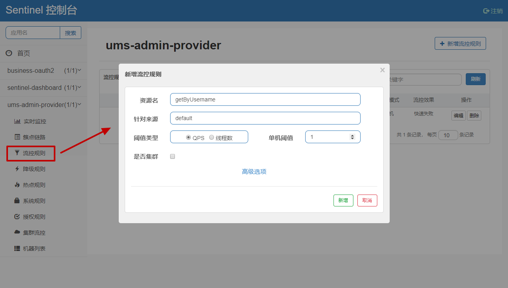

# 创建路由网关

## Spring Cloud Gateway

Spring Cloud Gateway 是 Spring 官方基于 Spring 5.0，Spring Boot 2.0 和 Project Reactor 等技术开发的网关，Spring Cloud Gateway 旨在为微服务架构提供一种简单而有效的统一的 API 路由管理方式。**Spring Cloud Gateway 作为 Spring Cloud 生态系中的网关，目标是替代 Netflix Zuul**，其不仅提供统一的路由方式，并且基于 Filter 链的方式提供了网关基本的功能，例如：安全，监控 / 埋点，和限流等。


## 功能特征

- 基于 Spring Framework 5，Project Reactor 和 Spring Boot 2.0
- 动态路由
- Predicates 和 Filters 作用于特定路由
- 集成 Hystrix 断路器
- 集成 Spring Cloud DiscoveryClient
- 易于编写的 Predicates 和 Filters
- 限流
- 路径重写

## 工程流程


客户端向 Spring Cloud Gateway 发出请求。然后在 Gateway Handler Mapping 中找到与请求相匹配的路由，将其发送到 Gateway Web Handler。Handler 再通过指定的过滤器链来将请求发送到我们实际的服务执行业务逻辑，然后返回。

过滤器之间用虚线分开是因为过滤器可能会在发送代理请求之前（`pre`）或之后（`post`）执行业务逻辑。

## 创建网关服务

创建一个名为 `gateway` 的服务，专门提供路由网关功能

### POM

主要增加了 `org.springframework.cloud:spring-cloud-starter-gateway` 依赖

```xml
<?xml version="1.0" encoding="UTF-8"?>
<project xmlns="http://maven.apache.org/POM/4.0.0" xmlns:xsi="http://www.w3.org/2001/XMLSchema-instance"
         xsi:schemaLocation="http://maven.apache.org/POM/4.0.0 http://maven.apache.org/xsd/maven-4.0.0.xsd">
    <modelVersion>4.0.0</modelVersion>
    <parent>
        <groupId>com.funtl.myshop.plus</groupId>
        <artifactId>parent</artifactId>
        <version>0.0.1-SNAPSHOT</version>
    </parent>
    <artifactId>gateway</artifactId>
    <packaging>jar</packaging>
    <url>http://www.funtl.com</url>
    <inceptionYear>2018-Now</inceptionYear>
    <licenses>
        <license>
            <name>Apache 2.0</name>
            <url>https://www.apache.org/licenses/LICENSE-2.0.txt</url>
        </license>
    </licenses>
    <developers>
        <developer>
            <id>liwemin</id>
            <name>Lusifer Lee</name>
            <email>lee.lusifer@gmail.com</email>
        </developer>
    </developers>
    <dependencies>
        <!-- Spring Boot Begin -->
        <dependency>
            <groupId>org.springframework.boot</groupId>
            <artifactId>spring-boot-starter-actuator</artifactId>
        </dependency>
        <dependency>
            <groupId>org.springframework.boot</groupId>
            <artifactId>spring-boot-starter-test</artifactId>
            <scope>test</scope>
        </dependency>
        <!-- Spring Boot End -->
        <!-- Spring Cloud Begin -->
        <dependency>
            <groupId>org.springframework.cloud</groupId>
            <artifactId>spring-cloud-starter-alibaba-nacos-discovery</artifactId>
        </dependency>
        <dependency>
            <groupId>org.springframework.cloud</groupId>
            <artifactId>spring-cloud-starter-gateway</artifactId>
        </dependency>
        <!-- Spring Cloud End -->
        <!-- Commons Begin -->
        <dependency>
            <groupId>javax.servlet</groupId>
            <artifactId>javax.servlet-api</artifactId>
        </dependency>
        <!-- Commons Begin -->
    </dependencies>
    <build>
        <plugins>
            <plugin>
                <groupId>org.springframework.boot</groupId>
                <artifactId>spring-boot-maven-plugin</artifactId>
                <configuration>
                    <mainClass>com.funtl.myshop.plus.gateway.GatewayApplication</mainClass>
                </configuration>
            </plugin>
        </plugins>
    </build>
</project>
```

> **注意：** Spring Cloud Gateway 不使用 Web 作为服务器，而是 **使用 WebFlux 作为服务器** ，Gateway 项目已经依赖了 `starter-webflux`，所以这里 千万不要依赖 `starter-web`
>
> **注意：** 由于过滤器等功能依然需要 Servlet 支持，故这里还需要依赖 `javax.servlet:javax.servlet-api`

### Application

```java
package com.funtl.myshop.plus.gateway;
import org.springframework.boot.SpringApplication;
import org.springframework.boot.autoconfigure.SpringBootApplication;
import org.springframework.cloud.client.discovery.DiscoveryClient;
import org.springframework.cloud.client.discovery.EnableDiscoveryClient;
import org.springframework.cloud.gateway.discovery.DiscoveryClientRouteDefinitionLocator;
import org.springframework.cloud.gateway.discovery.DiscoveryLocatorProperties;
import org.springframework.cloud.gateway.route.RouteDefinitionLocator;
import org.springframework.context.annotation.Bean;
import org.springframework.http.HttpHeaders;
import org.springframework.http.HttpMethod;
import org.springframework.http.HttpStatus;
import org.springframework.http.codec.ServerCodecConfigurer;
import org.springframework.http.codec.support.DefaultServerCodecConfigurer;
import org.springframework.http.server.reactive.ServerHttpRequest;
import org.springframework.http.server.reactive.ServerHttpResponse;
import org.springframework.web.cors.reactive.CorsUtils;
import org.springframework.web.server.ServerWebExchange;
import org.springframework.web.server.WebFilter;
import org.springframework.web.server.WebFilterChain;
import reactor.core.publisher.Mono;
/**
 * Spring Cloud Gateway
 * <p>
 * Description:
 * </p>
 *
 * @author Lusifer
 * @version v1.0.0
 * @date 2019-08-01 11:14:35
 * @see com.funtl.myshop.plus.gateway
 */
@SpringBootApplication
@EnableDiscoveryClient
public class GatewayApplication {
    // ----------------------------- 解决跨域 Begin -----------------------------
    private static final String ALL = "*";
    private static final String MAX_AGE = "3600L";
    @Bean
    public RouteDefinitionLocator discoveryClientRouteDefinitionLocator(DiscoveryClient discoveryClient, DiscoveryLocatorProperties properties) {
        return new DiscoveryClientRouteDefinitionLocator(discoveryClient, properties);
    }
    @Bean
    public ServerCodecConfigurer serverCodecConfigurer() {
        return new DefaultServerCodecConfigurer();
    }
    @Bean
    public WebFilter corsFilter() {
        return (ServerWebExchange ctx, WebFilterChain chain) -> {
            ServerHttpRequest request = ctx.getRequest();
            if (!CorsUtils.isCorsRequest(request)) {
                return chain.filter(ctx);
            }
            HttpHeaders requestHeaders = request.getHeaders();
            ServerHttpResponse response = ctx.getResponse();
            HttpMethod requestMethod = requestHeaders.getAccessControlRequestMethod();
            HttpHeaders headers = response.getHeaders();
            headers.add(HttpHeaders.ACCESS_CONTROL_ALLOW_ORIGIN, requestHeaders.getOrigin());
            headers.addAll(HttpHeaders.ACCESS_CONTROL_ALLOW_HEADERS, requestHeaders.getAccessControlRequestHeaders());
            if (requestMethod != null) {
                headers.add(HttpHeaders.ACCESS_CONTROL_ALLOW_METHODS, requestMethod.name());
            }
            headers.add(HttpHeaders.ACCESS_CONTROL_ALLOW_CREDENTIALS, "true");
            headers.add(HttpHeaders.ACCESS_CONTROL_EXPOSE_HEADERS, ALL);
            headers.add(HttpHeaders.ACCESS_CONTROL_MAX_AGE, MAX_AGE);
            if (request.getMethod() == HttpMethod.OPTIONS) {
                response.setStatusCode(HttpStatus.OK);
                return Mono.empty();
            }
            return chain.filter(ctx);
        };
    }
    // ----------------------------- 解决跨域 End -----------------------------
    public static void main(String[] args) {
        SpringApplication.run(GatewayApplication.class, args);
    }
}
```

### application.yml

```yaml
base:
  config:
    nacos:
      hostname: nacos.funtl.com
      port: 80
spring:
  application:
    # 应用名称
    name: gateway
  main:
    allow-bean-definition-overriding: true
  cloud:
    # 使用 Nacos 作为服务注册发现
    nacos:
      discovery:
        server-addr: ${base.config.nacos.hostname}:${base.config.nacos.port}
    # 路由网关配置
    gateway:
      # 设置与服务注册发现组件结合，这样可以采用服务名的路由策略
      discovery:
        locator:
          enabled: true
      # 配置路由规则
      routes:
        # 采用自定义路由 ID（有固定用法，不同的 id 有不同的功能，详见：https://cloud.spring.io/spring-cloud-gateway/2.0.x/single/spring-cloud-gateway.html#gateway-route-filters）
        - id: BUSINESS-OAUTH2
          # 采用 LoadBalanceClient 方式请求，以 lb:// 开头，后面的是注册在 Nacos 上的服务名
          uri: lb://business-oauth2
          # Predicate 翻译过来是“谓词”的意思，必须，主要作用是匹配用户的请求，有很多种用法
          predicates:
            # 路径匹配，以 api 开头，直接配置是不生效的，看 filters 配置
            - Path=/api/user/**
          filters:
            # 前缀过滤，默认配置下，我们的请求路径是 http://localhost:8888/business-oauth2/** 这时会路由到指定的服务
            # 此处配置去掉 1 个路径前缀，再配置上面的 Path=/api/**，就能按照 http://localhost:8888/api/** 的方式访问了
            - StripPrefix=1
        - id: BUSINESS-PROFILE
          uri: lb://business-profile
          predicates:
            - Path=/api/profile/**
          filters:
            - StripPrefix=1
server:
  port: 8888
# 配置日志级别，方别调试
logging:
  level:
    org.springframework.cloud.gateway: debug
```

此时网关请求登录接口路径如：[http://localhost:8888/api/user/login]()

> **注意：** 由于之前的 `RestController` 代码中使用了 `@CrossOrigin(value = "*", maxAge = 3600)` 注解解决跨域问题，此时我们的网关已经一并处理了跨域请将之前的注解删除，否则会报 `The 'Access-Control-Allow-Origin' header contains multiple values '*, *', but only one is allowed.` 错误，表示配置了多个跨域

完成

# 更新版本号

[地址连接]([http://www.qfdmy.com/%E8%AF%BE%E7%A8%8B/%e5%be%ae%e6%9c%8d%e5%8a%a1%e6%9e%b6%e6%9e%84-2-0/lessons/myshopplus-%e7%95%aa%e5%a4%96-%e6%9b%b4%e6%96%b0%e7%89%88%e6%9c%ac%e5%8f%b7/](http://www.qfdmy.com/课程/微服务架构-2-0/lessons/myshopplus-番外-更新版本号/))


# 服务熔断Feign

## 概述

接上节内容，为了增加服务熔断功能，本次更新有较大改动，主要是将项目提取至上一层以便于使用相对通用的 POM，做好依赖传递

> **注意：** 本节实现的效果仅仅是 Feign 客户端熔断并不具备 **服务限流** 的能力

## 增加依赖

如果要在您的项目中引入 Sentinel，需要增加 `org.springframework.cloud:spring-cloud-starter-alibaba-sentinel` Starter POM

```xml
<dependency>
    <groupId>com.alibaba.cloud</groupId>
    <artifactId>spring-cloud-starter-alibaba-sentinel</artifactId>
</dependency>
```

## 配置熔断类

以 `business-profile-feign` 项目为例，编写一个 Feign 接口的实现类并增加 `@Component` 注解

```java
package com.funtl.myshop.plus.business.feign.fallback;
import com.funtl.myshop.plus.business.dto.params.IconParam;
import com.funtl.myshop.plus.business.dto.params.PasswordParam;
import com.funtl.myshop.plus.business.dto.params.ProfileParam;
import com.funtl.myshop.plus.business.feign.ProfileFeign;
import com.funtl.myshop.plus.commons.dto.ResponseResult;
import com.funtl.myshop.plus.commons.utils.MapperUtils;
import org.springframework.stereotype.Component;
/**
 * 个人信息服务熔断器
 * <p>
 * Description:
 * </p>
 *
 * @author Lusifer
 * @version v1.0.0
 * @date 2019-08-27 23:50:08
 * @see com.funtl.myshop.plus.business.feign.fallback
 */
@Component
public class ProfileFeignFallback implements ProfileFeign {
    private static final String BREAKING_MESSAGE = "请求失败了，请检查您的网络";
    @Override
    public String info(String username) {
        try {
            return MapperUtils.obj2json(new ResponseResult<Void>(ResponseResult.CodeStatus.BREAKING, BREAKING_MESSAGE));
        } catch (Exception e) {
            e.printStackTrace();
        }
        return null;
    }
    @Override
    public String update(ProfileParam profileParam) {
        try {
            return MapperUtils.obj2json(new ResponseResult<Void>(ResponseResult.CodeStatus.BREAKING, BREAKING_MESSAGE));
        } catch (Exception e) {
            e.printStackTrace();
        }
        return null;
    }
    @Override
    public String modifyPassword(PasswordParam passwordParam) {
        try {
            return MapperUtils.obj2json(new ResponseResult<Void>(ResponseResult.CodeStatus.BREAKING, BREAKING_MESSAGE));
        } catch (Exception e) {
            e.printStackTrace();
        }
        return null;
    }
    @Override
    public String modifyIcon(IconParam iconParam) {
        try {
            return MapperUtils.obj2json(new ResponseResult<Void>(ResponseResult.CodeStatus.BREAKING, BREAKING_MESSAGE));
        } catch (Exception e) {
            e.printStackTrace();
        }
        return null;
    }
}
```

## 修改 Feign 接口

以 `business-profile-feign` 项目为例，在 `@FeignClient` 注解上增加 `fallback` 属性指定熔断类即可

```java
package com.funtl.myshop.plus.business.feign;
import com.funtl.myshop.plus.business.dto.params.IconParam;
import com.funtl.myshop.plus.business.dto.params.PasswordParam;
import com.funtl.myshop.plus.business.dto.params.ProfileParam;
import com.funtl.myshop.plus.business.feign.fallback.ProfileFeignFallback;
import com.funtl.myshop.plus.configuration.FeignRequestConfiguration;
import org.springframework.cloud.openfeign.FeignClient;
import org.springframework.web.bind.annotation.GetMapping;
import org.springframework.web.bind.annotation.PathVariable;
import org.springframework.web.bind.annotation.PostMapping;
import org.springframework.web.bind.annotation.RequestBody;
/**
 * 个人信息管理
 * <p>
 * Description:
 * </p>
 *
 * @author Lusifer
 * @version v1.0.0
 * @date 2019-07-31 00:47:14
 * @see com.funtl.myshop.plus.business.feign
 */
@FeignClient(value = "business-profile", path = "profile", configuration = FeignRequestConfiguration.class, fallback = ProfileFeignFallback.class)
public interface ProfileFeign {
    /**
     * 获取个人信息
     *
     * @param username {@code String} 用户名
     * @return {@code String} JSON
     */
    @GetMapping(value = "info/{username}")
    String info(@PathVariable String username);
    /**
     * 更新个人信息
     *
     * @param profileParam {@link ProfileParam}
     * @return {@code String} JSON
     */
    @PostMapping(value = "update")
    String update(@RequestBody ProfileParam profileParam);
    /**
     * 修改密码
     *
     * @param passwordParam {@link PasswordParam}
     * @return {@code String} JSON
     */
    @PostMapping(value = "modify/password")
    String modifyPassword(@RequestBody PasswordParam passwordParam);
    /**
     * 修改头像
     *
     * @param iconParam {@link IconParam}
     * @return {@code String} JSON
     */
    @PostMapping(value = "modify/icon")
    String modifyIcon(@RequestBody IconParam iconParam);
}
```

## 开启 Feign 对 Sentinel 的支持

在 `application.yml` 配置文件中增加如下配置，用以开启 Feign 对 Sentinel 的支持

```yaml
feign:
  sentinel:
    enabled: true
```

## 测试熔断

- 对熔断的处理

使用 Feign 熔断后会返回一个固定的结果，此时我们需要手动处理这个结果，以 `business-oauth2-service` 项目中的 `LoginController` 为例

```java
/**
     * 获取用户信息
     *
     * @return {@link ResponseResult}
     */
    @PreAuthorize("hasAuthority('USER')")
    @GetMapping(value = "/user/info")
    public ResponseResult<LoginInfo> info() throws Exception {
        Authentication authentication = SecurityContextHolder.getContext().getAuthentication();
        // 注意这一步，如果触发熔断会返回上面我定义好的固定结果
        String jsonString = profileFeign.info(authentication.getName());
        UmsAdmin umsAdmin = MapperUtils.json2pojoByTree(jsonString, "data", UmsAdmin.class);
        // 按照熔断器给到的结果，此时 umsAdmin 为空，我们需要直接将熔断结果返回给客户端
        if (umsAdmin == null) {
            return MapperUtils.json2pojo(jsonString, ResponseResult.class);
        }
        LoginInfo loginInfo = new LoginInfo();
        loginInfo.setName(umsAdmin.getUsername());
        loginInfo.setAvatar(umsAdmin.getIcon());
        loginInfo.setNickName(umsAdmin.getNickName());
        return new ResponseResult<LoginInfo>(ResponseResult.CodeStatus.OK, "获取用户信息", loginInfo);
    }

```

- 成功的请求


- 熔断的请求


## 附：扩展阅读

### 截至本节的 POM 结构

```
cloud` 项目同 `business
```

#### business

以 `business` 项目为例

```yaml
<?xml version="1.0" encoding="UTF-8"?>
<project xmlns="http://maven.apache.org/POM/4.0.0" xmlns:xsi="http://www.w3.org/2001/XMLSchema-instance"
         xsi:schemaLocation="http://maven.apache.org/POM/4.0.0 http://maven.apache.org/xsd/maven-4.0.0.xsd">
    <modelVersion>4.0.0</modelVersion>
    <parent>
        <groupId>com.funtl.myshop.plus</groupId>
        <artifactId>parent</artifactId>
        <version>0.0.1-SNAPSHOT</version>
    </parent>
    <artifactId>business</artifactId>
    <packaging>pom</packaging>
    <url>http://www.funtl.com</url>
    <inceptionYear>2018-Now</inceptionYear>
    <licenses>
        <license>
            <name>Apache 2.0</name>
            <url>https://www.apache.org/licenses/LICENSE-2.0.txt</url>
        </license>
    </licenses>
    <developers>
        <developer>
            <id>liwemin</id>
            <name>Lusifer Lee</name>
            <email>lee.lusifer@gmail.com</email>
        </developer>
    </developers>
    <dependencies>
        <!-- Spring Cloud -->
        <dependency>
            <groupId>org.springframework.cloud</groupId>
            <artifactId>spring-cloud-starter-openfeign</artifactId>
        </dependency>
        <!-- Spring Cloud Alibaba -->
        <dependency>
            <groupId>com.alibaba.cloud</groupId>
            <artifactId>spring-cloud-starter-alibaba-sentinel</artifactId>
        </dependency>
        <!-- Commons -->
        <dependency>
            <groupId>org.projectlombok</groupId>
            <artifactId>lombok</artifactId>
        </dependency>
        <dependency>
            <groupId>com.squareup.okhttp3</groupId>
            <artifactId>okhttp</artifactId>
        </dependency>
        <dependency>
            <groupId>io.github.openfeign</groupId>
            <artifactId>feign-okhttp</artifactId>
        </dependency>
        <!-- Projects -->
        <dependency>
            <groupId>com.funtl.myshop.plus</groupId>
            <artifactId>commons-dto</artifactId>
            <version>${project.parent.version}</version>
        </dependency>
        <dependency>
            <groupId>com.funtl.myshop.plus</groupId>
            <artifactId>commons-utils</artifactId>
            <version>${project.parent.version}</version>
        </dependency>
        <dependency>
            <groupId>com.funtl.myshop.plus</groupId>
            <artifactId>configuration-feign</artifactId>
            <version>${project.parent.version}</version>
        </dependency>
    </dependencies>
    <modules>
        <module>business-reg-feign</module>
        <module>business-reg-service</module>
        <module>business-oauth2-feign</module>
        <module>business-oauth2-service</module>
        <module>business-profile-feign</module>
        <module>business-profile-service</module>
    </modules>
</project>
```

#### business-feign

以 `business-profile-feign` 项目为例

```xaml
<?xml version="1.0" encoding="UTF-8"?>
<project xmlns="http://maven.apache.org/POM/4.0.0" xmlns:xsi="http://www.w3.org/2001/XMLSchema-instance"
         xsi:schemaLocation="http://maven.apache.org/POM/4.0.0 http://maven.apache.org/xsd/maven-4.0.0.xsd">
    <modelVersion>4.0.0</modelVersion>
    <parent>
        <groupId>com.funtl.myshop.plus</groupId>
        <artifactId>business</artifactId>
        <version>0.0.1-SNAPSHOT</version>
    </parent>
    <artifactId>business-profile-feign</artifactId>
    <packaging>jar</packaging>
    <url>http://www.funtl.com</url>
    <inceptionYear>2018-Now</inceptionYear>
    <licenses>
        <license>
            <name>Apache 2.0</name>
            <url>https://www.apache.org/licenses/LICENSE-2.0.txt</url>
        </license>
    </licenses>
    <developers>
        <developer>
            <id>liwemin</id>
            <name>Lusifer Lee</name>
            <email>lee.lusifer@gmail.com</email>
        </developer>
    </developers>
</project>
```

#### business-service

以 `business-profile-service` 项目为例

```xaml
<?xml version="1.0" encoding="UTF-8"?>
<project xmlns="http://maven.apache.org/POM/4.0.0" xmlns:xsi="http://www.w3.org/2001/XMLSchema-instance"
         xsi:schemaLocation="http://maven.apache.org/POM/4.0.0 http://maven.apache.org/xsd/maven-4.0.0.xsd">
    <modelVersion>4.0.0</modelVersion>
    <parent>
        <groupId>com.funtl.myshop.plus</groupId>
        <artifactId>business</artifactId>
        <version>0.0.1-SNAPSHOT</version>
    </parent>
    <artifactId>business-profile-service</artifactId>
    <packaging>jar</packaging>
    <url>http://www.funtl.com</url>
    <inceptionYear>2018-Now</inceptionYear>
    <licenses>
        <license>
            <name>Apache 2.0</name>
            <url>https://www.apache.org/licenses/LICENSE-2.0.txt</url>
        </license>
    </licenses>
    <developers>
        <developer>
            <id>liwemin</id>
            <name>Lusifer Lee</name>
            <email>lee.lusifer@gmail.com</email>
        </developer>
    </developers>
    <dependencies>
        <!-- Spring Boot -->
        <dependency>
            <groupId>org.springframework.boot</groupId>
            <artifactId>spring-boot-starter-web</artifactId>
        </dependency>
        <dependency>
            <groupId>org.springframework.boot</groupId>
            <artifactId>spring-boot-starter-actuator</artifactId>
        </dependency>
        <dependency>
            <groupId>org.springframework.boot</groupId>
            <artifactId>spring-boot-starter-test</artifactId>
            <scope>test</scope>
        </dependency>
        <!-- Spring Cloud -->
        <dependency>
            <groupId>org.springframework.cloud</groupId>
            <artifactId>spring-cloud-starter-oauth2</artifactId>
        </dependency>
        <!-- Spring Cloud Alibaba -->
        <dependency>
            <groupId>com.alibaba.cloud</groupId>
            <artifactId>spring-cloud-starter-alibaba-nacos-discovery</artifactId>
        </dependency>
        <!-- Apache Dubbo -->
        <dependency>
            <groupId>com.alibaba.nacos</groupId>
            <artifactId>nacos-client</artifactId>
        </dependency>
        <dependency>
            <groupId>org.apache.dubbo</groupId>
            <artifactId>dubbo-registry-nacos</artifactId>
        </dependency>
        <dependency>
            <groupId>org.apache.dubbo</groupId>
            <artifactId>dubbo-spring-boot-starter</artifactId>
        </dependency>
        <dependency>
            <groupId>org.apache.dubbo</groupId>
            <artifactId>dubbo-spring-boot-actuator</artifactId>
        </dependency>
        <dependency>
            <groupId>org.apache.dubbo</groupId>
            <artifactId>dubbo</artifactId>
            <exclusions>
                <exclusion>
                    <groupId>org.springframework</groupId>
                    <artifactId>spring</artifactId>
                </exclusion>
                <exclusion>
                    <groupId>javax.servlet</groupId>
                    <artifactId>servlet-api</artifactId>
                </exclusion>
                <exclusion>
                    <groupId>log4j</groupId>
                    <artifactId>log4j</artifactId>
                </exclusion>
            </exclusions>
        </dependency>
        <dependency>
            <groupId>org.apache.dubbo</groupId>
            <artifactId>dubbo-serialization-kryo</artifactId>
            <exclusions>
                <exclusion>
                    <groupId>log4j</groupId>
                    <artifactId>log4j</artifactId>
                </exclusion>
                <exclusion>
                    <groupId>org.apache.dubbo</groupId>
                    <artifactId>dubbo-common</artifactId>
                </exclusion>
            </exclusions>
        </dependency>
        <dependency>
            <groupId>com.alibaba.spring</groupId>
            <artifactId>spring-context-support</artifactId>
        </dependency>
        <!-- Projects -->
        <dependency>
            <groupId>com.funtl.myshop.plus</groupId>
            <artifactId>business-profile-feign</artifactId>
            <version>${project.parent.version}</version>
        </dependency>
        <dependency>
            <groupId>com.funtl.myshop.plus</groupId>
            <artifactId>ums-admin-provider-api</artifactId>
            <version>${project.parent.version}</version>
        </dependency>
    </dependencies>
    <build>
        <plugins>
            <plugin>
                <groupId>org.springframework.boot</groupId>
                <artifactId>spring-boot-maven-plugin</artifactId>
                <configuration>
                    <mainClass>com.funtl.myshop.plus.business.BusinessProfileApplication</mainClass>
                </configuration>
            </plugin>
        </plugins>
    </build>
</project>
```

# 服务限流-Dubbo Sentinel

## 概述

本章节的主要目标是实现 Dubbo 的熔断降级和限流功能并附带一并实现 Spring Cloud Alibaba 的限流功能，限流功能可以配合 Sentinel 控制台使用，简单方便；由于之前的课程已经介绍过什么是 Sentinel ，此处便不在赘述，具体可参考我之前的视频或移步至 [官方 GitHub](https://github.com/alibaba/Sentinel)

## 启动控制台

### 获取

您可以从 [官方 GitHub Release 页面](https://github.com/alibaba/Sentinel/releases) 页面下载最新版本的控制台 JAR 包。

### 启动

> **注意：** 启动 Sentinel 控制台需要 JDK 版本为 1.8 及以上版本

```
java -Dserver.port=8080 -Dcsp.sentinel.dashboard.server=localhost:8080 -Dproject.name=sentinel-dashboard -jar sentinel-dashboard.jar
```

其中 `-Dserver.port=8080` 用于指定 Sentinel 控制台端口为 `8080`

> **注意：** 从 Sentinel 1.6.0 起，Sentinel 控制台引入基本的 **登录** 功能，**默认用户名和密码都是 sentinel**

### 鉴权

用户可以通过如下参数进行配置

- `-Dsentinel.dashboard.auth.username=sentinel` 用于指定控制台的登录用户名为 sentinel
- `-Dsentinel.dashboard.auth.password=123456` 用于指定控制台的登录密码为 123456；如果省略这两个参数，默认用户和密码均为 sentinel
- `-Dserver.servlet.session.timeout=7200` 用于指定 Spring Boot 服务端 session 的过期时间，如 7200 表示 7200 秒；60m 表示 60 分钟，默认为 30 分钟

## Dubbo 集成 Sentinel

### 引入依赖

使用时需要引入 3 个依赖

```xaml
<dependency>
    <groupId>com.alibaba.csp</groupId>
    <artifactId>sentinel-apache-dubbo-adapter</artifactId>
</dependency>
<dependency>
    <groupId>com.alibaba.csp</groupId>
    <artifactId>sentinel-transport-simple-http</artifactId>
</dependency>
<dependency>
    <groupId>com.alibaba.csp</groupId>
    <artifactId>sentinel-annotation-aspectj</artifactId>
</dependency>
```

### 依赖说明

- `sentinel-apache-dubbo-adapter`：Sentinel 提供的 Apache Dubbo 适配模块 (注意：`sentinel-dubbo-adapter` 是未毕业版本的 Dubbo 适配模块)
- `sentinel-transport-simple-http`： 用于暴露一个特定的端口，Sentinel Dashboard 通过 HTTP 的形式进行数据推送，客户端接收后将规则保存在本地内存中
- `sentinel-annotation-aspectj`：Sentinel 提供了 `@SentinelResource` 注解用于定义资源，并提供了 AspectJ 的扩展用于自动定义资源、处理 `BlockException` 等

### 配置启动参数

- 在启动时，需要在 JVM 中添加以下启动参数

```shell
-Djava.net.preferIPv4Stack=true
-Dcsp.sentinel.api.port=8720
-Dproject.name=ums-admin-provider
-Dcsp.sentinel.dashboard.server=127.0.0.1:8080
```

- IDEA 配置

**Run** -> **Edit Configurations...**


- 参数说明

```shell
-Dcsp.sentinel.api.port=客户端端口，用于上报信息，默认 8720 即可，Sentinel 发现端口冲突会自动递增
-Dproject.name=显示在控制台上的应用名称
-Dcsp.sentinel.dashboard.server=控制台地址
```

## Dubbo 配置 Sentinel

### 注入 Bean

我们需要使用 Spring AOP 的方式显示的注册 `SentinelResourceAspect` 为一个 Bean

```java
package com.funtl.myshop.plus.configuration;
import com.alibaba.csp.sentinel.annotation.aspectj.SentinelResourceAspect;
import org.springframework.context.annotation.Bean;
import org.springframework.context.annotation.Configuration;
/**
 * Dubbo Sentinel AOP
 * <p>
 * Description: 仅 Dubbo 服务需要该配置，Spring Cloud Alibaba 无需加载该配置
 * </p>

 */
@Configuration
public class DubboSentinelConfiguration {
    @Bean
    public SentinelResourceAspect sentinelResourceAspect() {
        return new SentinelResourceAspect();
    }
}
```

### 加载配置

结合本案例，我将该配置单独封装至 `configuration-sentinel` 项目中，方便其它 Dubbo 服务依赖，所有 Dubbo 服务提供者都需要调用该模块并指定加载配置类，修改 `Application` 代码如下

```java
package com.funtl.myshop.plus.provider.service.fallback;
import com.funtl.myshop.plus.provider.domain.UmsAdmin;
import org.slf4j.Logger;
import org.slf4j.LoggerFactory;
/**
 * 用户服务提供者熔断器
 * <p>
 * Description:
 * </p>
 *
 */
public class UmsAdminServiceFallback {
    private static final Logger logger = LoggerFactory.getLogger(UmsAdminServiceFallback.class);
    /**
     * 熔断方法
     *
     * @param username {@code String} 用户名
     * @param ex       {@code Throwable} 异常信息
     * @return {@link UmsAdmin} 熔断后的固定结果
     */
    public static UmsAdmin getByUsernameFallback(String username, Throwable ex) {
        logger.warn("Invoke getByUsernameFallback: " + ex.getClass().getTypeName());
        ex.printStackTrace();
        return null;
    }
}
```

### 配置熔断类

可以为需要熔断降级和限流的方法创建一个专门的熔断类，在需要使用熔断和限流的方法上使用 `@SentinelResource` 注解指定该类中的方法即可实现熔断降级功能

> **注意：** 熔断方法必须是 `static` 函数

```java
package com.funtl.myshop.plus.provider.service.fallback;
import com.funtl.myshop.plus.provider.domain.UmsAdmin;
import org.slf4j.Logger;
import org.slf4j.LoggerFactory;
/**
 * 用户服务提供者熔断器
 * <p>
 * Description:
 * </p>
 *
 * @author Lusifer
 * @version v1.0.0
 * @date 2019-08-31 01:59:55
 * @see com.funtl.myshop.plus.provider.service.fallback
 */
public class UmsAdminServiceFallback {
    private static final Logger logger = LoggerFactory.getLogger(UmsAdminServiceFallback.class);
    /**
     * 熔断方法
     *
     * @param username {@code String} 用户名
     * @param ex       {@code Throwable} 异常信息
     * @return {@link UmsAdmin} 熔断后的固定结果
     */
    public static UmsAdmin getByUsernameFallback(String username, Throwable ex) {
        logger.warn("Invoke getByUsernameFallback: " + ex.getClass().getTypeName());
        ex.printStackTrace();
        return null;
    }
}
```

### 配置熔断方法

在 Dubbo 接口的服务提供者实现方法上配置 `@SentinelResource` 注解指定该类中的方法即可实现熔断降级功能

```java
/**
 * 熔断器的使用
 *
 * <p>
 * 1.  {@link SentinelResource#value()} 对应的是 Sentinel 控制台中的资源，可用作控制台设置【流控】和【降级】操作 <br>
 * 2.  {@link SentinelResource#fallback()} 对应的是 {@link UmsAdminServiceFallback#getByUsernameFallback(String, Throwable)}，并且必须为 `static` <br>
 * 3. 如果不设置 {@link SentinelResource#fallbackClass()}，则需要在当前类中创建一个 `Fallback` 函数，函数签名与原函数一致或加一个 {@link Throwable} 类型的参数
 * </p>
 *
 * @param username {@code String} 用户名
 * @return {@link UmsAdmin}
 */
@Override
@SentinelResource(value = "getByUsername", fallback = "getByUsernameFallback", fallbackClass = UmsAdminServiceFallback.class)
public UmsAdmin get(String username) {
    Example example = new Example(UmsAdmin.class);
    example.createCriteria().andEqualTo("username", username);
    return umsAdminMapper.selectOneByExample(example);
}
```

## 测试熔断限流

### 配置流控规则

在 Sentinel 控制台配置流控规则



> **注意：** 需要至少调用一次服务，才能在控制台看到监控效果

### 流控规则说明

- **资源名：** 对应 `@SentinelResource` 注解中的 `value` 属性
- **QPS**：平均每秒的请求响应数
- **单机阈值：** 为方便测试这里设置为 1，就是每秒钟中只允许一个响应请求，如果设置为 5，则代表请求每 200 ms 才能通过一个，多出的请求将排队等待通过。超时时间代表最大排队时间，超出最大排队时间的请求将会直接被拒绝

> **注意：** 排队等待模式下 QPS 不要超过 1000（请求间隔 1 ms）

### 测试熔断效果

在出现异常时会自动启动熔断，增加测试代码如下

```java
@Override
@SentinelResource(value = "getByUsername", fallback = "getByUsernameFallback", fallbackClass = UmsAdminServiceFallback.class)
public UmsAdmin get(String username) {
    // 增加一段异常代码，用于测试熔断
    if ("admin".equals(username)) {
        throw new IllegalArgumentException("invalid arg");
    }
    Example example = new Example(UmsAdmin.class);
    example.createCriteria().andEqualTo("username", username);
    return umsAdminMapper.selectOneByExample(example);
}
```

触发异常时，控制台 (`ums-admin-provider`) 打印日志如下

```shell
2019-08-31 04:51:57.762  WARN 25096 --- [:20880-thread-2] c.f.m.p.p.s.f.UmsAdminServiceFallback    : Invoke getByUsernameFallback: java.lang.IllegalArgumentException
java.lang.IllegalArgumentException: invalid arg
    at com.funtl.myshop.plus.provider.service.UmsAdminServiceImpl.get(UmsAdminServiceImpl.java:58)
    at com.funtl.myshop.plus.provider.service.UmsAdminServiceImpl$$FastClassBySpringCGLIB$$2b0b4eb7.invoke(<generated>)
    at org.springframework.cglib.proxy.MethodProxy.invoke(MethodProxy.java:218)
    at org.springframework.aop.framework.CglibAopProxy$CglibMethodInvocation.invokeJoinpoint(CglibAopProxy.java:749)
    at org.springframework.aop.framework.ReflectiveMethodInvocation.proceed(ReflectiveMethodInvocation.java:163)
    at org.springframework.aop.aspectj.MethodInvocationProceedingJoinPoint.proceed(MethodInvocationProceedingJoinPoint.java:88)
    at com.alibaba.csp.sentinel.annotation.aspectj.SentinelResourceAspect.invokeResourceWithSentinel(SentinelResourceAspect.java:57)
    at sun.reflect.NativeMethodAccessorImpl.invoke0(Native Method)
    at sun.reflect.NativeMethodAccessorImpl.invoke(NativeMethodAccessorImpl.java:62)
    at sun.reflect.DelegatingMethodAccessorImpl.invoke(DelegatingMethodAccessorImpl.java:43)
    at java.lang.reflect.Method.invoke(Method.java:498)
    at org.springframework.aop.aspectj.AbstractAspectJAdvice.invokeAdviceMethodWithGivenArgs(AbstractAspectJAdvice.java:644)
    at org.springframework.aop.aspectj.AbstractAspectJAdvice.invokeAdviceMethod(AbstractAspectJAdvice.java:633)
    at org.springframework.aop.aspectj.AspectJAroundAdvice.invoke(AspectJAroundAdvice.java:70)
    at org.springframework.aop.framework.ReflectiveMethodInvocation.proceed(ReflectiveMethodInvocation.java:175)
    at org.springframework.aop.interceptor.ExposeInvocationInterceptor.invoke(ExposeInvocationInterceptor.java:93)
    at org.springframework.aop.framework.ReflectiveMethodInvocation.proceed(ReflectiveMethodInvocation.java:186)
    at org.springframework.aop.framework.CglibAopProxy$DynamicAdvisedInterceptor.intercept(CglibAopProxy.java:688)
    at com.funtl.myshop.plus.provider.service.UmsAdminServiceImpl$$EnhancerBySpringCGLIB$$1198434f.get(<generated>)
    at org.apache.dubbo.common.bytecode.Wrapper2.invokeMethod(Wrapper2.java)
    at org.apache.dubbo.rpc.proxy.javassist.JavassistProxyFactory$1.doInvoke(JavassistProxyFactory.java:47)
    at org.apache.dubbo.rpc.proxy.AbstractProxyInvoker.invoke(AbstractProxyInvoker.java:84)
    at org.apache.dubbo.config.invoker.DelegateProviderMetaDataInvoker.invoke(DelegateProviderMetaDataInvoker.java:56)
    at org.apache.dubbo.rpc.protocol.InvokerWrapper.invoke(InvokerWrapper.java:56)
    at org.apache.dubbo.rpc.filter.ExceptionFilter.invoke(ExceptionFilter.java:55)
    at org.apache.dubbo.rpc.protocol.ProtocolFilterWrapper$1.invoke(ProtocolFilterWrapper.java:82)
    at com.alibaba.csp.sentinel.adapter.dubbo.SentinelDubboProviderFilter.invoke(SentinelDubboProviderFilter.java:71)
    at org.apache.dubbo.rpc.protocol.ProtocolFilterWrapper$1.invoke(ProtocolFilterWrapper.java:82)
    at org.apache.dubbo.monitor.support.MonitorFilter.invoke(MonitorFilter.java:92)
    at org.apache.dubbo.rpc.protocol.ProtocolFilterWrapper$1.invoke(ProtocolFilterWrapper.java:82)
    at org.apache.dubbo.rpc.filter.TimeoutFilter.invoke(TimeoutFilter.java:48)
    at org.apache.dubbo.rpc.protocol.ProtocolFilterWrapper$1.invoke(ProtocolFilterWrapper.java:82)
    at org.apache.dubbo.rpc.protocol.dubbo.filter.TraceFilter.invoke(TraceFilter.java:81)
    at org.apache.dubbo.rpc.protocol.ProtocolFilterWrapper$1.invoke(ProtocolFilterWrapper.java:82)
    at org.apache.dubbo.rpc.filter.ContextFilter.invoke(ContextFilter.java:96)
    at org.apache.dubbo.rpc.protocol.ProtocolFilterWrapper$1.invoke(ProtocolFilterWrapper.java:82)
    at org.apache.dubbo.rpc.filter.GenericFilter.invoke(GenericFilter.java:148)
    at org.apache.dubbo.rpc.protocol.ProtocolFilterWrapper$1.invoke(ProtocolFilterWrapper.java:82)
    at org.apache.dubbo.rpc.filter.ClassLoaderFilter.invoke(ClassLoaderFilter.java:38)
    at org.apache.dubbo.rpc.protocol.ProtocolFilterWrapper$1.invoke(ProtocolFilterWrapper.java:82)
    at org.apache.dubbo.rpc.filter.EchoFilter.invoke(EchoFilter.java:41)
    at org.apache.dubbo.rpc.protocol.ProtocolFilterWrapper$1.invoke(ProtocolFilterWrapper.java:82)
    at org.apache.dubbo.rpc.protocol.ProtocolFilterWrapper$CallbackRegistrationInvoker.invoke(ProtocolFilterWrapper.java:157)
    at org.apache.dubbo.rpc.protocol.dubbo.DubboProtocol$1.reply(DubboProtocol.java:152)
    at org.apache.dubbo.remoting.exchange.support.header.HeaderExchangeHandler.handleRequest(HeaderExchangeHandler.java:102)
    at org.apache.dubbo.remoting.exchange.support.header.HeaderExchangeHandler.received(HeaderExchangeHandler.java:193)
    at org.apache.dubbo.remoting.transport.DecodeHandler.received(DecodeHandler.java:51)
    at org.apache.dubbo.remoting.transport.dispatcher.ChannelEventRunnable.run(ChannelEventRunnable.java:57)
    at java.util.concurrent.ThreadPoolExecutor.runWorker(ThreadPoolExecutor.java:1149)
    at java.util.concurrent.ThreadPoolExecutor$Worker.run(ThreadPoolExecutor.java:624)
    at java.lang.Thread.run(Thread.java:748)
```

### 测试流控效果

触发流控时，控制台 (`ums-admin-provider`) 打印日志如下

```shell
2019-08-31 04:55:51.933com.alibaba.csp.sentinel.slots.block.flow.FlowException
  WARN 25096 --- [20880-thread-15] c.f.m.p.p.s.f.UmsAdminServiceFallback    : Invoke getByUsernameFallback: com.alibaba.csp.sentinel.slots.block.flow.FlowException
```

## 附：Alibaba 配置 Sentinel

### 配置熔断类

```java
package com.funtl.myshop.plus.business.controller.fallback;
import com.funtl.myshop.plus.business.dto.UmsAdminDTO;
import com.funtl.myshop.plus.business.feign.fallback.ProfileFeignFallback;
import com.funtl.myshop.plus.commons.dto.ResponseResult;
import org.slf4j.Logger;
import org.slf4j.LoggerFactory;
/**
 * 用户管理服务熔断器
 * <p>
 * Description:
 * </p>
 */
public class ProfileControllerFallback {
    private static final Logger logger = LoggerFactory.getLogger(ProfileControllerFallback.class);
    /**
     * 熔断方法
     *
     * @param username {@code String} 用户名
     * @return {@link ResponseResult<UmsAdminDTO>}
     */
    public static ResponseResult<UmsAdminDTO> infoFallback(String username, Throwable ex) {
        logger.warn("Invoke infoFallback: " + ex.getClass().getTypeName());
        ex.printStackTrace();
        return new ResponseResult<UmsAdminDTO>(ResponseResult.CodeStatus.BREAKING, ProfileFeignFallback.BREAKING_MESSAGE);
    }
}
```

### 配置熔断方法

```java
@GetMapping(value = "info/{username}")
@SentinelResource(value = "info", fallback = "infoFallback", fallbackClass = ProfileControllerFallback.class)
public ResponseResult<UmsAdminDTO> info(@PathVariable String username) {
    UmsAdmin umsAdmin = umsAdminService.get(username);
    UmsAdminDTO dto = new UmsAdminDTO();
    BeanUtils.copyProperties(umsAdmin, dto);
    return new ResponseResult<UmsAdminDTO>(ResponseResult.CodeStatus.OK, "获取个人信息", dto);
}
```


# 日志的引入

为了方便日志引入的是Springboot自带的日志 slf4j

```xml
        <!--日志注入-->
        <dependency>
            <groupId>org.springframework.boot</groupId>
            <artifactId>spring-boot-starter-logging</artifactId>
        </dependency>
```

```java
Logger logger = LoggerFactory.getLogger(getClass());

logger.info("用户登录成功",loginParam.getUsername());
```


# 消息队列RocketMQ

## 什么是消息队列

MQ (Message Queue)，消息队列可以理解为一种在 TCP 协议之上构建的一个 **简单的协议**，但它又不是具体的通信协议，而是更高层次的 **通信模型** 即 **生产者 / 消费者模型**，通过定义自己的生产者和消费者实现消息通信从而屏蔽复杂的底层通信协议；它为分布式应用系统提供异步解耦和削峰填谷的能力，同时也具备互联网应用所需的海量消息堆积、高吞吐、可靠重试等特性

## 核心概念

- **Topic**：消息主题，一级消息类型，生产者向其发送消息
- **生产者**：也称为消息发布者，负责生产并发送消息至 Topic
- **消费者**：也称为消息订阅者，负责从 Topic 接收并消费消息
- **消息**：生产者向 Topic 发送并最终传送给消费者的数据和（可选）属性的组合
- **消息属性**：生产者可以为消息定义的属性，包含 Message Key 和 Tag
- **Group**：一类生产者或消费者，这类生产者或消费者通常生产或消费同一类消息，且消息发布或订阅的逻辑一致

## 消息队列的数据结构

消息队列采用 **FIFO** 的方式，即 **先进先出** 的数据结构


## 消息队列的两大流派

### 有 Broker

这个流派通常有一台服务器作为 Broker，所有的消息都通过它中转。生产者把消息发送给它就结束自己的任务了，Broker 则把消息主动推送给消费者（或者消费者主动轮询）

#### 重 Topic

kafka、RocketMQ (前身是 ActiveMQ) 就属于这个流派，生产者会发送 KEY 和数据到 Broker，由 Broker 比较 KEY 之后决定给哪个消费者（推送消息给消费者）


#### 轻 Topic

这种的代表是 RabbitMQ（或者说是 AMQP），生产者发送 KEY 和数据，消费者定义订阅的队列，Broker 收到数据之后会通过一定的逻辑计算出 KEY 对应的队列，然后把数据交给队列


这种模式下解耦了 KEY 和 Queue，在这种架构中 Queue 是非常轻量级的（在 RabbitMQ 中它的上限取决于你的内存），消费者关心的只是自己的 Queue；生产者不必关心数据最终给谁只要指定 KEY 就行了，中间的那层映射在 AMQP 中叫 Exchange

### 无 Broker

无 Broker 的 MQ 的代表是 ZeroMQ。该作者非常睿智，他非常敏锐的意识到 MQ 是更高级的 Socket，它是解决通讯问题的。所以 ZeroMQ 被设计成了一个 “库” 而不是一个中间件


节点之间通讯的消息都是发送到彼此的队列中，每个节点都既是生产者又是消费者。ZeroMQ 做的事情就是封装出一套类似于 Socket 的 API 可以完成发送和读取数据

## RocketMQ 功能特点

消息队列 MQ 支持发布 / 订阅模型，消息生产者应用创建 Topic 并将消息发送到 Topic。消费者应用创建对 Topic 的订阅以便从其接收消息。通信可以是一对多、多对一和多对多


### 消息类型

- **普通消息：** 消息队列 MQ 中无特性的消息，区别于有特性的延时消息、顺序消息和事务消息
- **事务消息：** 分布事务功能（两阶段提交，多方事务），能够达到事务最终一致性状态
- **延时消息：** 允许消息生产者对指定消息进行定时（延时）投递
- **顺序消息：** 允许消息消费者按照消息发送的顺序对消息进行消费

### 特色功能

- **消息查询：** 消息队列 MQ 提供了三种消息查询的方式，分别是按 Message ID、Message Key 以及 Topic 查询
- **消息轨迹：** 通过消息轨迹，能清晰定位消息从生产者发出，经由消息队列 MQ 服务端，投递给消息消费者的完整链路，方便定位排查问题
- **集群消费：** 一个 Group ID 所标识的所有 Consumer 平均分摊消费消息。例如某个 Topic 有 9 条消息，一个 Group ID 有 3 个 Consumer 实例，那么在集群消费模式下每个实例平均分摊，只消费其中的 3 条消息
- **广播消费：** 一个 Group ID 所标识的所有 Consumer 都会各自消费某条消息一次。例如某个 Topic 有 9 条消息，一个 Group ID 有 3 个 Consumer 实例，那么在广播消费模式下每个实例都会各自消费 9 条消息
- **重置消费位点：** 根据时间或位点重置消费进度，允许用户进行消息回溯或者丢弃堆积消息
- **死信队列：** 将无法正常消费的消息储存到特殊的死信队列供后续处理
- **全球消息路由：** 用于全球不同地域之间的消息同步，保证地域之间的数据一致性
- **资源报表：** 消息生产和消费数据的统计功能。通过该功能，您可查询在一段时间范围内发送至某 Topic 的消息总量或者 TPS（消息生产数据），也可查询在一个时间段内某 Topic 投递给某 Group ID 的消息总量或 TPS（消息消费数据）
- **监控报警：** 您可使用消息队列 MQ 提供的监控报警功能，监控某 Group ID 订阅的某 Topic 的消息消费状态并接收报警短信，帮助您实时掌握消息消费状态，以便及时处理消费异常

### 功能优势

目前主流的 MQ 主要是 RocketMQ、Kafka、RabbitMQ，其主要优势有：

- 支持事务型消息（消息发送和 DB 操作保持两方的最终一致性，RabbitMQ 和 Kafka 不支持）
- 支持结合 RocketMQ 的多个系统之间数据最终一致性（多方事务，二方事务是前提）
- 支持 18 个级别的延迟消息（**延迟队列** RabbitMQ 和 Kafka 不支持）
- 支持指定次数和时间间隔的失败消息重发（**死信队列** Kafka 不支持，RabbitMQ 需要手动确认）
- 支持 Consumer 端 Tag 过滤，减少不必要的网络传输（RabbitMQ 和 Kafka 不支持）
- 支持重复消费（RabbitMQ 不支持，Kafka 支持）

### 应用场景

- **削峰填谷**：诸如秒杀、抢红包、企业开门红等大型活动时皆会带来较高的流量脉冲，或因没做相应的保护而导致系统超负荷甚至崩溃，或因限制太过导致请求大量失败而影响用户体验，消息队列 MQ 可提供削峰填谷的服务来解决该问题
- **异步解耦：** 交易系统作为淘宝 / 天猫主站最核心的系统，每笔交易订单数据的产生会引起几百个下游业务系统的关注，包括物流、购物车、积分、流计算分析等等，整体业务系统庞大而且复杂，消息队列 MQ 可实现异步通信和应用解耦，确保主站业务的连续性
- **顺序收发：** 细数日常中需要保证顺序的应用场景非常多，比如证券交易过程时间优先原则，交易系统中的订单创建、支付、退款等流程，航班中的旅客登机消息处理等等。与先进先出（First In First Out，缩写 FIFO）原理类似，消息队列 MQ 提供的顺序消息即保证消息 FIFO
- **分布式事务一致性：** 交易系统、支付红包等场景需要确保数据的最终一致性，大量引入消息队列 MQ 的分布式事务，既可以实现系统之间的解耦，又可以保证最终的数据一致性
- **大数据分析：** 数据在 “流动” 中产生价值，传统数据分析大多是基于批量计算模型，而无法做到实时的数据分析，利用阿里云消息队列 MQ 与流式计算引擎相结合，可以很方便的实现将业务数据进行实时分析
- **分布式缓存同步：** 天猫双 11 大促，各个分会场琳琅满目的商品需要实时感知价格变化，大量并发访问数据库导致会场页面响应时间长，集中式缓存因为带宽瓶颈限制商品变更的访问流量，通过消息队列 MQ 构建分布式缓存，实时通知商品数据的变化

###  安装RocktMQ

docker-compose.yml

```yaml
version: '3.5'
services:
  rmqnamesrv:
    image: foxiswho/rocketmq:server
    container_name: rmqnamesrv
    ports:
      - 9876:9876
    volumes:
      - ./data/logs:/opt/logs
      - ./data/store:/opt/store
    networks:
        rmq:
          aliases:
            - rmqnamesrv

  rmqbroker:
    image: foxiswho/rocketmq:broker
    container_name: rmqbroker
    ports:
      - 10909:10909
      - 10911:10911
    volumes:
      - ./data/logs:/opt/logs
      - ./data/store:/opt/store
      - ./data/brokerconf/broker.conf:/etc/rocketmq/broker.conf
    environment:
        NAMESRV_ADDR: "rmqnamesrv:9876"
        JAVA_OPTS: " -Duser.home=/opt"
        JAVA_OPT_EXT: "-server -Xms128m -Xmx128m -Xmn128m"
    command: mqbroker -c /etc/rocketmq/broker.conf
    depends_on:
      - rmqnamesrv
    networks:
      rmq:
        aliases:
          - rmqbroker

  rmqconsole:
    image: styletang/rocketmq-console-ng
    container_name: rmqconsole
    ports:
      - 8080:8080
    environment:
        JAVA_OPTS: "-Drocketmq.namesrv.addr=rmqnamesrv:9876 -Dcom.rocketmq.sendMessageWithVIPChannel=false"
    depends_on:
      - rmqnamesrv
    networks:
      rmq:
        aliases:
          - rmqconsole

networks:
  rmq:
    name: rmq
    driver: bridge
```

broker.conf

RocketMQ Broker 需要一个配置文件，按照上面的 Compose 配置，我们需要在 `./data/brokerconf/` 目录下创建一个名为 `broker.conf` 的配置文件，内容如下：

```conf
# Licensed to the Apache Software Foundation (ASF) under one or more
# contributor license agreements.  See the NOTICE file distributed with
# this work for additional information regarding copyright ownership.
# The ASF licenses this file to You under the Apache License, Version 2.0
# (the "License"); you may not use this file except in compliance with
# the License.  You may obtain a copy of the License at
#
#     http://www.apache.org/licenses/LICENSE-2.0
#
#  Unless required by applicable law or agreed to in writing, software
#  distributed under the License is distributed on an "AS IS" BASIS,
#  WITHOUT WARRANTIES OR CONDITIONS OF ANY KIND, either express or implied.
#  See the License for the specific language governing permissions and
#  limitations under the License.


# 所属集群名字
brokerClusterName=DefaultCluster

# broker 名字，注意此处不同的配置文件填写的不一样，如果在 broker-a.properties 使用: broker-a,
# 在 broker-b.properties 使用: broker-b
brokerName=broker-a

# 0 表示 Master，> 0 表示 Slave
brokerId=0

# nameServer地址，分号分割
# namesrvAddr=rocketmq-nameserver1:9876;rocketmq-nameserver2:9876

# 启动IP,如果 docker 报 com.alibaba.rocketmq.remoting.exception.RemotingConnectException: connect to <192.168.0.120:10909> failed
# 解决方式1 加上一句 producer.setVipChannelEnabled(false);，解决方式2 brokerIP1 设置宿主机IP，不要使用docker 内部IP
# brokerIP1=192.168.0.253

# 在发送消息时，自动创建服务器不存在的topic，默认创建的队列数
defaultTopicQueueNums=4

# 是否允许 Broker 自动创建 Topic，建议线下开启，线上关闭 ！！！这里仔细看是 false，false，false
autoCreateTopicEnable=true

# 是否允许 Broker 自动创建订阅组，建议线下开启，线上关闭
autoCreateSubscriptionGroup=true

# Broker 对外服务的监听端口
listenPort=10911

# 删除文件时间点，默认凌晨4点
deleteWhen=04

# 文件保留时间，默认48小时
fileReservedTime=120

# commitLog 每个文件的大小默认1G
mapedFileSizeCommitLog=1073741824

# ConsumeQueue 每个文件默认存 30W 条，根据业务情况调整
mapedFileSizeConsumeQueue=300000

# destroyMapedFileIntervalForcibly=120000
# redeleteHangedFileInterval=120000
# 检测物理文件磁盘空间
diskMaxUsedSpaceRatio=88
# 存储路径
# storePathRootDir=/home/ztztdata/rocketmq-all-4.1.0-incubating/store
# commitLog 存储路径
# storePathCommitLog=/home/ztztdata/rocketmq-all-4.1.0-incubating/store/commitlog
# 消费队列存储
# storePathConsumeQueue=/home/ztztdata/rocketmq-all-4.1.0-incubating/store/consumequeue
# 消息索引存储路径
# storePathIndex=/home/ztztdata/rocketmq-all-4.1.0-incubating/store/index
# checkpoint 文件存储路径
# storeCheckpoint=/home/ztztdata/rocketmq-all-4.1.0-incubating/store/checkpoint
# abort 文件存储路径
# abortFile=/home/ztztdata/rocketmq-all-4.1.0-incubating/store/abort
# 限制的消息大小
maxMessageSize=65536

# flushCommitLogLeastPages=4
# flushConsumeQueueLeastPages=2
# flushCommitLogThoroughInterval=10000
# flushConsumeQueueThoroughInterval=60000

# Broker 的角色
# - ASYNC_MASTER 异步复制Master
# - SYNC_MASTER 同步双写Master
# - SLAVE
brokerRole=ASYNC_MASTER

# 刷盘方式
# - ASYNC_FLUSH 异步刷盘
# - SYNC_FLUSH 同步刷盘
flushDiskType=ASYNC_FLUSH

# 发消息线程池数量
# sendMessageThreadPoolNums=128
# 拉消息线程池数量
# pullMessageThreadPoolNums=128
```

RocketMQ 控制台

访问 [http://rmqIP:8080](http://rmqip:8080/) 登入控制台

# 全局异常处理

## 概述

在实际开发过程中可能需要用到全局异常处理的功能，该功能的主要目的是为了能统一异常编码和消息来方便调用者做出不同的响应；在实现功能前，我们只需明白全局异常又分两大类：

- **全局系统异常：** 比如 404，500 等就属于系统异常，通常在网关层实现
- **全局业务异常：** 比如 `用户名密码不正确` 之类就属于业务异常，通常可以封装成自定义的 `RuntimeException` ，当出现业务异常时直接抛出

> **注意：** 由于代码量较大，以下仅列出部分关键代码，具体请参考我 [GitHub](http://www.qfdmy.com/wp-content/themes/quanbaike/go.php?url=aHR0cHM6Ly9naXRodWIuY29tL2Z1bnRsL015U2hvcFBsdXM=)

## 全局系统异常

在网关层创建两个类就可以了

- `JsonExceptionHandler`

```java
package com.funtl.myshop.plus.gateway.exception;
import org.slf4j.Logger;
import org.slf4j.LoggerFactory;
import org.springframework.boot.web.reactive.error.ErrorWebExceptionHandler;
import org.springframework.cloud.gateway.support.NotFoundException;
import org.springframework.http.HttpStatus;
import org.springframework.http.MediaType;
import org.springframework.http.codec.HttpMessageReader;
import org.springframework.http.codec.HttpMessageWriter;
import org.springframework.http.server.reactive.ServerHttpRequest;
import org.springframework.util.Assert;
import org.springframework.web.reactive.function.BodyInserters;
import org.springframework.web.reactive.function.server.RequestPredicates;
import org.springframework.web.reactive.function.server.RouterFunctions;
import org.springframework.web.reactive.function.server.ServerRequest;
import org.springframework.web.reactive.function.server.ServerResponse;
import org.springframework.web.reactive.result.view.ViewResolver;
import org.springframework.web.server.ResponseStatusException;
import org.springframework.web.server.ServerWebExchange;
import reactor.core.publisher.Mono;
import java.util.Collections;
import java.util.HashMap;
import java.util.List;
import java.util.Map;
/**
 * 全局系统异常处理
 * <p>
 * Description:
 * </p>
 *
 * @author Lusifer
 * @version v1.0.0
 * @date 2019-10-23 17:11:57
 * @see com.funtl.myshop.plus.gateway.exception
 */
public class JsonExceptionHandler implements ErrorWebExceptionHandler {
    private static final Logger log = LoggerFactory.getLogger(JsonExceptionHandler.class);
    private List<HttpMessageReader<?>> messageReaders = Collections.emptyList();
    private List<HttpMessageWriter<?>> messageWriters = Collections.emptyList();
    private List<ViewResolver> viewResolvers = Collections.emptyList();
    private ThreadLocal<Map<String, Object>> exceptionHandlerResult = new ThreadLocal<>();
    public void setMessageReaders(List<HttpMessageReader<?>> messageReaders) {
        Assert.notNull(messageReaders, "'messageReaders' must not be null");
        this.messageReaders = messageReaders;
    }
    public void setViewResolvers(List<ViewResolver> viewResolvers) {
        this.viewResolvers = viewResolvers;
    }
    public void setMessageWriters(List<HttpMessageWriter<?>> messageWriters) {
        Assert.notNull(messageWriters, "'messageWriters' must not be null");
        this.messageWriters = messageWriters;
    }
    protected Mono<ServerResponse> renderErrorResponse(ServerRequest request) {
        Map<String, Object> result = exceptionHandlerResult.get();
        return ServerResponse.status((HttpStatus) result.get("httpStatus"))
                .contentType(MediaType.APPLICATION_JSON_UTF8)
                .body(BodyInserters.fromObject(result.get("body")));
    }
    private Mono<? extends Void> write(ServerWebExchange exchange, ServerResponse response) {
        exchange.getResponse().getHeaders().setContentType(response.headers().getContentType());
        return response.writeTo(exchange, new ResponseContext());
    }
    private class ResponseContext implements ServerResponse.Context {
        @Override
        public List<HttpMessageWriter<?>> messageWriters() {
            return JsonExceptionHandler.this.messageWriters;
        }
        @Override
        public List<ViewResolver> viewResolvers() {
            return JsonExceptionHandler.this.viewResolvers;
        }
    }
    @Override
    public Mono<Void> handle(ServerWebExchange serverWebExchange, Throwable throwable) {
        // 按照异常类型进行处理
        HttpStatus httpStatus;
        String body;
        if (throwable instanceof NotFoundException) {
            httpStatus = HttpStatus.NOT_FOUND;
            body = "Service Not Found";
        } else if (throwable instanceof ResponseStatusException) {
            ResponseStatusException responseStatusException = (ResponseStatusException) throwable;
            httpStatus = responseStatusException.getStatus();
            body = responseStatusException.getMessage();
        } else {
            httpStatus = HttpStatus.INTERNAL_SERVER_ERROR;
            body = "Internal Server Error";
        }
        // 封装响应结果
        Map<String, Object> result = new HashMap<>(2, 1);
        result.put("httpStatus", httpStatus);
        String msg = "{\"code\":" + httpStatus.value() + ",\"message\": \"" + body + "\"}";
        result.put("body", msg);
        // 错误日志
        ServerHttpRequest request = serverWebExchange.getRequest();
        log.error("[全局系统异常]\r\n请求路径：{}\r\n异常记录：{}", request.getPath(), throwable.getMessage());
        if (serverWebExchange.getResponse().isCommitted()) {
            return Mono.error(throwable);
        }
        exceptionHandlerResult.set(result);
        ServerRequest newRequest = ServerRequest.create(serverWebExchange, this.messageReaders);
        return RouterFunctions.route(RequestPredicates.all(), this::renderErrorResponse).route(newRequest)
                .switchIfEmpty(Mono.error(throwable))
                .flatMap((handler) -> handler.handle(newRequest))
                .flatMap((response) -> write(serverWebExchange, response));
    }
}
```

+ ExceptionConfiguration

```java
package com.funtl.myshop.plus.gateway.exception;
import org.springframework.beans.factory.ObjectProvider;
import org.springframework.boot.web.reactive.error.ErrorWebExceptionHandler;
import org.springframework.context.annotation.Bean;
import org.springframework.context.annotation.Configuration;
import org.springframework.context.annotation.Primary;
import org.springframework.core.Ordered;
import org.springframework.core.annotation.Order;
import org.springframework.http.codec.ServerCodecConfigurer;
import org.springframework.web.reactive.result.view.ViewResolver;
import java.util.Collections;
import java.util.List;
/**
 * 全局系统异常配置
 * <p>
 * Description:
 * </p>
 *
 * @author Lusifer
 * @version v1.0.0
 * @date 2019-10-23 17:05:31
 * @see com.funtl.myshop.plus.gateway.exception
 */
@Configuration
public class ExceptionConfiguration {
    @Primary
    @Bean
    @Order(Ordered.HIGHEST_PRECEDENCE)
    public ErrorWebExceptionHandler errorWebExceptionHandler(ObjectProvider<List<ViewResolver>> viewResolversProvider, ServerCodecConfigurer serverCodecConfigurer) {
        JsonExceptionHandler jsonExceptionHandler = new JsonExceptionHandler();
        jsonExceptionHandler.setViewResolvers(viewResolversProvider.getIfAvailable(Collections::emptyList));
        jsonExceptionHandler.setMessageWriters(serverCodecConfigurer.getWriters());
        jsonExceptionHandler.setMessageReaders(serverCodecConfigurer.getReaders());
        return jsonExceptionHandler;
    }
}
```

## 全局业务异常

- 创建全局业务状态码的枚举对象

```java
package com.funtl.myshop.plus.business;
/**
 * 全局业务状态码
 * <p>
 * Description:
 * </p>
 *
 * @author Lusifer
 * @version v1.0.0
 * @date 2019-10-24 01:20:16
 * @see com.funtl.myshop.plus.business
 */
public enum BusinessStatus {
    /**
     * 管理员 - 账号密码错误
     */
    ADMIN_PASSWORD(100101, "管理员账号密码错误"),
    /**
     * 未知错误
     */
    UNKNOWN(-1, "未知错误"),
    /**
     * 请求成功
     */
    OK(20000, "成功"),
    /**
     * 请求失败
     */
    FAIL(20001, "失败"),
    /**
     * 熔断请求
     */
    BREAKING(20002, "熔断"),
    /**
     * 非法请求
     */
    ILLEGAL_REQUEST(50000, "非法请求"),
    /**
     * 非法令牌
     */
    ILLEGAL_TOKEN(50008, "非法令牌"),
    /**
     * 其他客户登录
     */
    OTHER_CLIENTS_LOGGED_IN(50012, "其他客户登录"),
    /**
     * 令牌已过期
     */
    TOKEN_EXPIRED(50014, "令牌已过期");
    private Integer code;
    private String message;
    BusinessStatus(Integer code, String message) {
        this.code = code;
        this.message = message;
    }
    public Integer getCode() {
        return code;
    }
    public String getMessage() {
        return message;
    }
    public static String getMessage(int code) {
        for (BusinessStatus status : values()) {
            if (status.getCode().equals(code)) {
                return status.getMessage();
            }
        }
        return null;
    }
}
```

+ 自定义 `RuntimeException`

```java
package com.funtl.myshop.plus.business;
/**
 * 全局业务异常
 * <p>
 * Description:
 * </p>
 *
 * @author Lusifer
 * @version v1.0.0
 * @date 2019-10-24 01:21:25
 * @see com.funtl.myshop.plus.business
 */
public class BusinessException extends RuntimeException {
    private static final long serialVersionUID = 3034121940056795549L;
    private Integer code;
    public Integer getCode() {
        return code;
    }
    public void setCode(Integer code) {
        this.code = code;
    }
    public BusinessException() {
    }
    public BusinessException(BusinessStatus status) {
        super(status.getMessage());
        this.code = status.getCode();
    }
}
```

+ 创建全局异常处理类

```java
package com.funtl.myshop.plus.business;
import com.funtl.myshop.plus.commons.dto.ResponseResult;
import lombok.extern.slf4j.Slf4j;
import org.springframework.http.HttpStatus;
import org.springframework.http.ResponseEntity;
import org.springframework.web.bind.annotation.ControllerAdvice;
import org.springframework.web.bind.annotation.ExceptionHandler;
import javax.servlet.http.HttpServletRequest;
/**
 * 全局业务异常处理
 * <p>
 * Description:
 * </p>
 *
 * @author Lusifer
 * @version v1.0.0
 * @date 2019-10-24 01:25:33
 * @see com.funtl.myshop.plus.business
 */
@Slf4j
@ControllerAdvice
public class BusinessExceptionHandler {
    @ExceptionHandler(BusinessException.class)
    public ResponseEntity<?> handlerException(HttpServletRequest request, Exception ex) {
        ResponseResult error = new ResponseResult();
        // 业务异常
        if (ex instanceof BusinessException) {
            error.setCode(((BusinessException) ex).getCode());
            error.setMessage(ex.getMessage());
            log.warn("[全局业务异常]\r\n业务编码：{}\r\n异常记录：{}", error.getCode(), error.getMessage());
        }
        // 未知错误
        else {
            error.setCode(BusinessStatus.UNKNOWN.getCode());
            error.setMessage(BusinessStatus.UNKNOWN.getMessage());
        }
        return new ResponseEntity<>(error, HttpStatus.OK);
    }
}
```


## 调用业务异常

调用时直接抛自定义异常即可

```
// 验证密码是否正确UserDetails userDetails = userDetailsService.loadUserByUsername(loginParam.getUsername());if (userDetails == null || !passwordEncoder.matches(loginParam.getPassword(), userDetails.getPassword())) {    throw new BusinessException(BusinessStatus.ADMIN_PASSWORD);}
```

完成