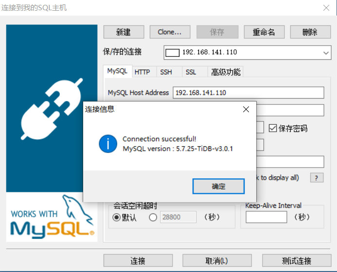
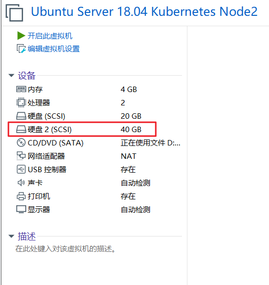

# Kubernetes v1.15 安装 TiDB v1.0.1

## 安装 Helm

### 安装客户端 Helm

```shell
# 下载
wget https://get.helm.sh/helm-v2.14.3-linux-amd64.tar.gz
# 解压
tar -zxvf helm-v2.14.3-linux-amd64.tar.gz
# 复制客户端执行文件到 bin 目录下
cp linux-amd64/helm /usr/local/bin/
```

### 安装服务端 Tiller

```shell
helm init --upgrade --tiller-image registry.cn-hangzhou.aliyuncs.com/google_containers/tiller:v2.14.3 --stable-repo-url http://mirror.azure.cn/kubernetes/charts/
# 输出如下
Creating /root/.helm 
Creating /root/.helm/repository 
Creating /root/.helm/repository/cache 
Creating /root/.helm/repository/local 
Creating /root/.helm/plugins 
Creating /root/.helm/starters 
Creating /root/.helm/cache/archive 
Creating /root/.helm/repository/repositories.yaml 
Adding stable repo with URL: http://mirror.azure.cn/kubernetes/charts/ 
Adding local repo with URL: http://127.0.0.1:8879/charts 
$HELM_HOME has been configured at /root/.helm.
Tiller (the Helm server-side component) has been installed into your Kubernetes Cluster.
Please note: by default, Tiller is deployed with an insecure 'allow unauthenticated users' policy.
To prevent this, run `helm init` with the --tiller-tls-verify flag.
For more information on securing your installation see: https://docs.helm.sh/using_helm/#securing-your-helm-installation
```

### 给 Tiller 授权

- 创建一个名为 `tiller-adminuser.yaml` 的配置文件，为 Tiller 创建服务帐号和绑定角色

```yaml
apiVersion: v1
kind: ServiceAccount
metadata:
  name: tiller
  namespace: kube-system
---
apiVersion: rbac.authorization.k8s.io/v1
kind: ClusterRoleBinding
metadata:
  name: tiller-cluster-rule
roleRef:
  apiGroup: rbac.authorization.k8s.io
  kind: ClusterRole
  name: cluster-admin
subjects:
- kind: ServiceAccount
  name: tiller
  namespace: kube-system
```

```shell
kubectl apply -f tiller-adminuser.yaml
```

- 为 Tiller 设置帐号

```shell
kubectl patch deploy --namespace kube-system tiller-deploy -p '{"spec":{"template":{"spec":{"serviceAccount":"tiller"}}}}'
# 输出如下
deployment.extensions/tiller-deploy patched
```

- 查看是否授权成功

```shell
kubectl get deploy --namespace kube-system tiller-deploy --output yaml|grep  serviceAccount
# 输出如下
serviceAccount: tiller
serviceAccountName: tiller
```

### 验证安装是否成功

```shell
kubectl -n kube-system get pods|grep tiller
# 输出如下
tiller-deploy-7c7b67c9fd-w66c5              1/1     Running   3          13h
```

```
helm version
# 输出如下
Client: &version.Version{SemVer:"v2.14.3", GitCommit:"0e7f3b6637f7af8fcfddb3d2941fcc7cbebb0085", GitTreeState:"clean"}
Server: &version.Version{SemVer:"v2.14.3", GitCommit:"0e7f3b6637f7af8fcfddb3d2941fcc7cbebb0085", GitTreeState:"clean"}
```

### 安装 PingCap 官方 chart 仓库

```yaml
helm repo add pingcap http://charts.pingcap.org/ && \
helm repo list && \
helm repo update && \
helm search tidb-cluster -l && \
helm search tidb-operator -l
# 输出如下
NAME    URL                                      
stable  http://mirror.azure.cn/kubernetes/charts/
local   http://127.0.0.1:8879/charts             
pingcap http://charts.pingcap.org/               
Hang tight while we grab the latest from your chart repositories...
...Skip local chart repository
...Successfully got an update from the "pingcap" chart repository
...Successfully got an update from the "stable" chart repository
Update Complete.
NAME                    CHART VERSION   APP VERSION     DESCRIPTION                  
pingcap/tidb-cluster    v1.1.0-alpha.3                  A Helm chart for TiDB Cluster
pingcap/tidb-cluster    v1.1.0-alpha.2                  A Helm chart for TiDB Cluster
pingcap/tidb-cluster    v1.1.0-alpha.1                  A Helm chart for TiDB Cluster
pingcap/tidb-cluster    v1.1.0-alpha.0                  A Helm chart for TiDB Cluster
pingcap/tidb-cluster    v1.0.1                          A Helm chart for TiDB Cluster
pingcap/tidb-cluster    v1.0.0                          A Helm chart for TiDB Cluster
pingcap/tidb-cluster    v1.0.0-rc.1                     A Helm chart for TiDB Cluster
pingcap/tidb-cluster    v1.0.0-beta.3                   A Helm chart for TiDB Cluster
pingcap/tidb-cluster    v1.0.0-beta.2                   A Helm chart for TiDB Cluster
NAME                    CHART VERSION   APP VERSION     DESCRIPTION                            
pingcap/tidb-operator   v1.1.0-alpha.3                  tidb-operator Helm chart for Kubernetes
pingcap/tidb-operator   v1.1.0-alpha.2                  tidb-operator Helm chart for Kubernetes
pingcap/tidb-operator   v1.1.0-alpha.1                  tidb-operator Helm chart for Kubernetes
pingcap/tidb-operator   v1.1.0-alpha.0                  tidb-operator Helm chart for Kubernetes
pingcap/tidb-operator   v1.0.1                          tidb-operator Helm chart for Kubernetes
pingcap/tidb-operator   v1.0.0                          tidb-operator Helm chart for Kubernetes
pingcap/tidb-operator   v1.0.0-rc.1                     tidb-operator Helm chart for Kubernetes
pingcap/tidb-operator   v1.0.0-beta.3                   tidb-operator Helm chart for Kubernetes
pingcap/tidb-operator   v1.0.0-beta.2                   tidb-operator Helm chart for Kubernetes
```

### 卸载 Tiller

如果希望卸载 Tiller ，请使用如下命令

```shell
helm reset
```

## 配置本地持久化卷

> **注意：** 以下步骤需要在所有 Node 节点分别执行

### 为虚拟机添加新的磁盘

### 查看新磁盘

```shell
fdisk -l
# 可以看到磁盘路径为 /dev/sdb
Disk /dev/sdb: 40 GiB, 42949672960 bytes, 83886080 sectors
Units: sectors of 1 * 512 = 512 bytes
Sector size (logical/physical): 512 bytes / 512 bytes
I/O size (minimum/optimal): 512 bytes / 512 bytes
```

### 格式化磁盘

```shell
sudo mkfs.ext4 /dev/sdb
# 输出如下
mke2fs 1.44.1 (24-Mar-2018)
Creating filesystem with 10485760 4k blocks and 2621440 inodes
Filesystem UUID: 5ace0751-6870-4115-89d4-91e007d8b055
Superblock backups stored on blocks: 
        32768, 98304, 163840, 229376, 294912, 819200, 884736, 1605632, 2654208, 
        4096000, 7962624
Allocating group tables: done                            
Writing inode tables: done                            
Creating journal (65536 blocks): done
Writing superblocks and filesystem accounting information: done
```

### 挂载磁盘

- 挂载 `/dev/sdb`

```shell
DISK_UUID=$(blkid -s UUID -o value /dev/sdb)
sudo mkdir -p /mnt/$DISK_UUID
sudo mount -t ext4 /dev/sdb /mnt/$DISK_UUID
```

- `/etc/fstab` 持久化 `mount`

```shell
echo UUID=`sudo blkid -s UUID -o value /dev/sdb` /mnt/$DISK_UUID ext4 defaults 0 2 | sudo tee -a /etc/fstab
# 输出如下
UUID=58759186-ffab-42a3-96ce-f9d3c355d4d1 /mnt/58759186-ffab-42a3-96ce-f9d3c355d4d1 ext4 defaults 0 2
```

- 创建多个目录并 `mount` 到 `discovery directory`

```shell
for i in $(seq 1 10); do
  sudo mkdir -p /mnt/${DISK_UUID}/vol${i} /mnt/disks/${DISK_UUID}_vol${i}
  sudo mount --bind /mnt/${DISK_UUID}/vol${i} /mnt/disks/${DISK_UUID}_vol${i}
done
```

- `/etc/fstab` 自动挂载

```shell
for i in $(seq 1 10); do
  echo /mnt/${DISK_UUID}/vol${i} /mnt/disks/${DISK_UUID}_vol${i} none bind 0 0 | sudo tee -a /etc/fstab
done
# 输出如下
/mnt/58759186-ffab-42a3-96ce-f9d3c355d4d1/vol1 /mnt/disks/58759186-ffab-42a3-96ce-f9d3c355d4d1_vol1 none bind 0 0
/mnt/58759186-ffab-42a3-96ce-f9d3c355d4d1/vol2 /mnt/disks/58759186-ffab-42a3-96ce-f9d3c355d4d1_vol2 none bind 0 0
/mnt/58759186-ffab-42a3-96ce-f9d3c355d4d1/vol3 /mnt/disks/58759186-ffab-42a3-96ce-f9d3c355d4d1_vol3 none bind 0 0
/mnt/58759186-ffab-42a3-96ce-f9d3c355d4d1/vol4 /mnt/disks/58759186-ffab-42a3-96ce-f9d3c355d4d1_vol4 none bind 0 0
/mnt/58759186-ffab-42a3-96ce-f9d3c355d4d1/vol5 /mnt/disks/58759186-ffab-42a3-96ce-f9d3c355d4d1_vol5 none bind 0 0
/mnt/58759186-ffab-42a3-96ce-f9d3c355d4d1/vol6 /mnt/disks/58759186-ffab-42a3-96ce-f9d3c355d4d1_vol6 none bind 0 0
/mnt/58759186-ffab-42a3-96ce-f9d3c355d4d1/vol7 /mnt/disks/58759186-ffab-42a3-96ce-f9d3c355d4d1_vol7 none bind 0 0
/mnt/58759186-ffab-42a3-96ce-f9d3c355d4d1/vol8 /mnt/disks/58759186-ffab-42a3-96ce-f9d3c355d4d1_vol8 none bind 0 0
/mnt/58759186-ffab-42a3-96ce-f9d3c355d4d1/vol9 /mnt/disks/58759186-ffab-42a3-96ce-f9d3c355d4d1_vol9 none bind 0 0
/mnt/58759186-ffab-42a3-96ce-f9d3c355d4d1/vol10 /mnt/disks/58759186-ffab-42a3-96ce-f9d3c355d4d1_vol10 none bind 0 0
```

## 准备本地卷

- 下载并修改配置文件

```shell
# 下载配置文件
wget https://raw.githubusercontent.com/pingcap/tidb-operator/master/manifests/local-dind/local-volume-provisioner.yaml
# 修改配置文件
vi local-volume-provisioner.yaml
## 找到第 41 行，修改 quay.io 为 quay.azk8s.cn
image: "quay.azk8s.cn/external_storage/local-volume-provisioner:v2.3.2"
## 找到第 55 行，修改 quay.io 为 quay.azk8s.cn
value: "quay.azk8s.cn/external_storage/local-volume-provisioner:v2.3.2"
```

- 部署 `local-volume-provisioner` 程序

```shell
kubectl apply -f local-volume-provisioner.yaml
# 输出如下
storageclass.storage.k8s.io/local-storage created
configmap/local-provisioner-config created
daemonset.extensions/local-volume-provisioner created
serviceaccount/local-storage-admin created
clusterrolebinding.rbac.authorization.k8s.io/local-storage-provisioner-pv-binding created
clusterrole.rbac.authorization.k8s.io/local-storage-provisioner-node-clusterrole created
clusterrolebinding.rbac.authorization.k8s.io/local-storage-provisioner-node-binding created
```

- 查看 Pod 和 PV 状态

```shell
kubectl get po -n kube-system -l app=local-volume-provisioner && \
kubectl get pv | grep local-storage
# 输出如下
NAME                             READY   STATUS    RESTARTS   AGE
local-volume-provisioner-fjbg4   1/1     Running   0          4m48s
local-volume-provisioner-l4568   1/1     Running   0          4m48s
local-volume-provisioner-vktfx   1/1     Running   0          4m48s
local-pv-1259baaf   39Gi       RWO            Delete           Available           local-storage            41s
local-pv-13b23035   39Gi       RWO            Delete           Available           local-storage            23s
local-pv-18b8b5e1   39Gi       RWO            Delete           Available           local-storage            4m29s
local-pv-251106de   39Gi       RWO            Delete           Available           local-storage            4m29s
local-pv-2b286509   39Gi       RWO            Delete           Available           local-storage            40s
local-pv-2cd32b41   39Gi       RWO            Delete           Available           local-storage            4m29s
local-pv-391470b4   39Gi       RWO            Delete           Available           local-storage            40s
...
```

## 安装 TiDB Operator

### 安装 CRD

```shell
kubectl apply -f https://raw.githubusercontent.com/pingcap/tidb-operator/master/manifests/crd.yaml && \
kubectl get crd tidbclusters.pingcap.com
# 输出如下
customresourcedefinition.apiextensions.k8s.io/tidbclusters.pingcap.com created
customresourcedefinition.apiextensions.k8s.io/backups.pingcap.com created
customresourcedefinition.apiextensions.k8s.io/restores.pingcap.com created
customresourcedefinition.apiextensions.k8s.io/backupschedules.pingcap.com created
NAME                       CREATED AT
tidbclusters.pingcap.com   2019-10-12T11:54:24Z
```

### 获取并修改配置文件

```shell
# 获取配置文件
mkdir -p /usr/local/kubernetes/tidb-operator && \
helm inspect values pingcap/tidb-operator --version=v1.0.1 > /usr/local/kubernetes/tidb-operator/values-operator.yaml
# 修改配置文件
vi values-operator.yaml
## 找到第 75 行，k8s.gcr.io/kube-scheduler 修改为如下内容
kubeSchedulerImageName: registry.cn-hangzhou.aliyuncs.com/google_containers/kube-scheduler
```

### 安装 Operator

```shell
helm install pingcap/tidb-operator --name=tidb-operator --namespace=tidb-admin --version=v1.0.1 -f /usr/local/kubernetes/tidb-operator/values-operator.yaml && \
kubectl get po -n tidb-admin -l app.kubernetes.io/name=tidb-operator
# 输出如下
NAME:   tidb-operator
LAST DEPLOYED: Sun Oct 13 02:06:29 2019
NAMESPACE: tidb-admin
STATUS: DEPLOYED
RESOURCES:
==> v1/ConfigMap
NAME                   DATA  AGE
tidb-scheduler-policy  1     0s
==> v1/Pod(related)
NAME                                      READY  STATUS             RESTARTS  AGE
tidb-controller-manager-74478968df-tpd9s  0/1    ContainerCreating  0         0s
tidb-scheduler-78c5df4b67-rbb55           0/2    ContainerCreating  0         0s
==> v1/ServiceAccount
NAME                     SECRETS  AGE
tidb-controller-manager  1        0s
tidb-scheduler           1        0s
==> v1beta1/ClusterRole
NAME                                   AGE
tidb-operator:tidb-controller-manager  0s
tidb-operator:tidb-scheduler           0s
==> v1beta1/ClusterRoleBinding
NAME                                   AGE
tidb-operator:tidb-controller-manager  0s
tidb-operator:tidb-scheduler           0s
==> v1beta1/Deployment
NAME                     READY  UP-TO-DATE  AVAILABLE  AGE
tidb-controller-manager  0/1    1           0          0s
tidb-scheduler           0/1    1           0          0s
NOTES:
1. Make sure tidb-operator components are running
   kubectl get pods --namespace tidb-admin -l app.kubernetes.io/instance=tidb-operator
2. Install CRD
   kubectl apply -f https://raw.githubusercontent.com/pingcap/tidb-operator/master/manifests/crd.yaml
   kubectl get customresourcedefinitions
3. Modify tidb-cluster/values.yaml and create a TiDB cluster by installing tidb-cluster charts
   helm install tidb-cluster
NAME                                       READY   STATUS              RESTARTS   AGE
tidb-controller-manager-74478968df-tpd9s   0/1     ContainerCreating   0          0s
tidb-scheduler-78c5df4b67-rbb55            0/2     ContainerCreating   0          0s
```

## 安装 TiDB Cluster

### 获取配置文件

```shell
mkdir -p /usr/local/kubernetes/tidb-operator && \
helm inspect values pingcap/tidb-cluster --version=v1.0.1 > /usr/local/kubernetes/tidb-operator/values-cluster.yaml
```

### 安装 Cluster

```shell
helm install pingcap/tidb-cluster --name=tidb-cluster --namespace=tidb --version=v1.0.1 -f /usr/local/kubernetes/tidb-operator/values-cluster.yaml
# 输出如下
NAME:   tidb-cluster
LAST DEPLOYED: Sun Oct 13 02:13:27 2019
NAMESPACE: tidb
STATUS: DEPLOYED
RESOURCES:
==> v1/ConfigMap
NAME                        DATA  AGE
tidb-cluster-monitor        3     2s
tidb-cluster-pd-aa6df71f    2     2s
tidb-cluster-tidb           2     2s
tidb-cluster-tidb-a4c4bb14  2     2s
tidb-cluster-tikv-9504381e  2     2s
==> v1/Pod(related)
NAME                                    READY  STATUS             RESTARTS  AGE
tidb-cluster-discovery-d984745c5-cm42t  0/1    ContainerCreating  0         2s
tidb-cluster-monitor-6f67f8b68-v9d9x    0/3    Init:0/1           0         2s
==> v1/Secret
NAME                  TYPE    DATA  AGE
tidb-cluster-monitor  Opaque  2     2s
==> v1/Service
NAME                           TYPE       CLUSTER-IP      EXTERNAL-IP  PORT(S)                         AGE
tidb-cluster-discovery         ClusterIP  10.107.88.145   <none>       10261/TCP                       2s
tidb-cluster-grafana           NodePort   10.101.237.180  <none>       3000:31443/TCP                  2s
tidb-cluster-monitor-reloader  NodePort   10.101.51.196   <none>       9089:31189/TCP                  2s
tidb-cluster-prometheus        NodePort   10.98.26.239    <none>       9090:31440/TCP                  2s
tidb-cluster-tidb              NodePort   10.101.100.241  <none>       4000:32098/TCP,10080:31643/TCP  2s
==> v1/ServiceAccount
NAME                    SECRETS  AGE
tidb-cluster-discovery  1        2s
tidb-cluster-monitor    1        2s
==> v1alpha1/TidbCluster
NAME          AGE
tidb-cluster  2s
==> v1beta1/Deployment
NAME                    READY  UP-TO-DATE  AVAILABLE  AGE
tidb-cluster-discovery  0/1    1           0          2s
tidb-cluster-monitor    0/1    1           0          2s
==> v1beta1/Role
NAME                    AGE
tidb-cluster-discovery  2s
tidb-cluster-monitor    2s
==> v1beta1/RoleBinding
NAME                    AGE
tidb-cluster-discovery  2s
tidb-cluster-monitor    2s
NOTES:
Cluster Startup
1. Watch tidb-cluster up and running
     watch kubectl get pods --namespace tidb -l app.kubernetes.io/instance=tidb-cluster -o wide
2. List services in the tidb-cluster
     kubectl get services --namespace tidb -l app.kubernetes.io/instance=tidb-cluster
Cluster access
* Access tidb-cluster using the MySQL client
    kubectl port-forward -n tidb svc/tidb-cluster-tidb 4000:4000 &
    mysql -h 127.0.0.1 -P 4000 -u root -D test
  Set a password for your user
    SET PASSWORD FOR 'root'@'%' = '9vidP9kW7e'; FLUSH PRIVILEGES;
* View monitor dashboard for TiDB cluster
   kubectl port-forward -n tidb svc/tidb-cluster-grafana 3000:3000
   Open browser at http://localhost:3000. The default username and password is admin/admin.
   If you are running this from a remote machine, you must specify the server's external IP address.
```

### 查看 Pod 状态

```shell
kubectl get po -n tidb -l app.kubernetes.io/instance=tidb-cluster
# 输出如下
NAME                                     READY   STATUS    RESTARTS   AGE
tidb-cluster-discovery-d984745c5-cm42t   1/1     Running   0          3m9s
tidb-cluster-monitor-6f67f8b68-v9d9x     3/3     Running   0          3m9s
tidb-cluster-pd-0                        1/1     Running   0          3m8s
tidb-cluster-pd-1                        1/1     Running   0          3m8s
tidb-cluster-pd-2                        1/1     Running   1          3m8s
tidb-cluster-tikv-0                      1/1     Running   0          109s
tidb-cluster-tikv-1                      1/1     Running   0          109s
tidb-cluster-tikv-2                      1/1     Running   0          109s
```

## 访问数据库

通过 `kubectl port-forward` 暴露服务到主机，可以访问 TiDB 集群。命令中的端口格式为：`<主机端口>:`

> **注意：**
>
> - 如果你不是在本地 PC 而是在远程主机上部署的 DinD 环境，可能无法通过 localhost 访问远程主机的服务。如果使用 `kubectl` 1.13 或者更高版本，可以在执行 `kubectl port-forward` 命令时添加 `--address 0.0.0.0` 选项，在 `0.0.0.0` 暴露端口而不是默认的 `127.0.0.1`
> - 在实际生产环境中数据库是不会暴露到公网的，所以没必要永久映射，映射的目的只是用于调试而已

```shell
kubectl port-forward svc/tidb-cluster-tidb 4000:4000 --namespace=tidb --address 0.0.0.0
```



- 账号：root
- 密码：空

# Kubernetes v1.16 安装 TiDB v1.0.x

## 概述

由于 Kubernetes v1.16 版本对部分 API 做了更新和修改，导致无法顺利部署 TiDB v1.0.x 版本到集群，本章节仅作部署流程的参考，个人感觉当前版本在 K8S 上存在些许问题，我们还是等待官方修复吧

## 安装 Helm

### 安装客户端 Helm

```shell
# 下载
wget https://get.helm.sh/helm-v2.14.3-linux-amd64.tar.gz
# 解压
tar -zxvf helm-v2.14.3-linux-amd64.tar.gz
# 复制客户端执行文件到 bin 目录下
cp linux-amd64/helm /usr/local/bin/
```

### 安装服务端 Tiller

```shell
helm init --upgrade --tiller-image registry.cn-hangzhou.aliyuncs.com/google_containers/tiller:v2.14.3 --stable-repo-url http://mirror.azure.cn/kubernetes/charts/ --service-account tiller --override spec.selector.matchLabels.'name'='tiller',spec.selector.matchLabels.'app'='helm' --output yaml | sed 's@apiVersion: extensions/v1beta1@apiVersion: apps/v1@' | kubectl apply -f -
```

### 给 Tiller 授权

- 创建一个名为 `tiller-adminuser.yaml` 的配置文件，为 Tiller 创建服务帐号和绑定角色

```yaml
apiVersion: v1
kind: ServiceAccount
metadata:
  name: tiller
  namespace: kube-system
---
apiVersion: rbac.authorization.k8s.io/v1
kind: ClusterRoleBinding
metadata:
  name: tiller-cluster-rule
roleRef:
  apiGroup: rbac.authorization.k8s.io
  kind: ClusterRole
  name: cluster-admin
subjects:
- kind: ServiceAccount
  name: tiller
  namespace: kube-system
```

```shell
kubectl apply -f tiller-adminuser.yaml
```

- 为 Tiller 设置帐号

```shell
kubectl patch deploy --namespace kube-system tiller-deploy -p '{"spec":{"template":{"spec":{"serviceAccount":"tiller"}}}}'
# 输出如下
deployment.extensions/tiller-deploy patched
```

- 查看是否授权成功

```shell
kubectl get deploy --namespace kube-system tiller-deploy --output yaml|grep  serviceAccount
# 输出如下
serviceAccount: tiller
serviceAccountName: tiller
```

### 验证安装是否成功

```shell
kubectl -n kube-system get pods|grep tiller
# 输出如下
tiller-deploy-7c7b67c9fd-w66c5              1/1     Running   3          13h
```

```shell
helm version
# 输出如下
Client: &version.Version{SemVer:"v2.14.3", GitCommit:"0e7f3b6637f7af8fcfddb3d2941fcc7cbebb0085", GitTreeState:"clean"}
Server: &version.Version{SemVer:"v2.14.3", GitCommit:"0e7f3b6637f7af8fcfddb3d2941fcc7cbebb0085", GitTreeState:"clean"}
```

### 安装 PingCap 官方 chart 仓库

```shell
helm repo add pingcap http://charts.pingcap.org/ && \
helm repo list && \
helm repo update && \
helm search tidb-cluster -l && \
helm search tidb-operator -l
# 输出如下
NAME    URL                                      
stable  http://mirror.azure.cn/kubernetes/charts/
local   http://127.0.0.1:8879/charts             
pingcap http://charts.pingcap.org/               
Hang tight while we grab the latest from your chart repositories...
...Skip local chart repository
...Successfully got an update from the "pingcap" chart repository
...Successfully got an update from the "stable" chart repository
Update Complete.
NAME                    CHART VERSION   APP VERSION     DESCRIPTION                  
pingcap/tidb-cluster    v1.1.0-alpha.3                  A Helm chart for TiDB Cluster
pingcap/tidb-cluster    v1.1.0-alpha.2                  A Helm chart for TiDB Cluster
pingcap/tidb-cluster    v1.1.0-alpha.1                  A Helm chart for TiDB Cluster
pingcap/tidb-cluster    v1.1.0-alpha.0                  A Helm chart for TiDB Cluster
pingcap/tidb-cluster    v1.0.1                          A Helm chart for TiDB Cluster
pingcap/tidb-cluster    v1.0.0                          A Helm chart for TiDB Cluster
pingcap/tidb-cluster    v1.0.0-rc.1                     A Helm chart for TiDB Cluster
pingcap/tidb-cluster    v1.0.0-beta.3                   A Helm chart for TiDB Cluster
pingcap/tidb-cluster    v1.0.0-beta.2                   A Helm chart for TiDB Cluster
NAME                    CHART VERSION   APP VERSION     DESCRIPTION                            
pingcap/tidb-operator   v1.1.0-alpha.3                  tidb-operator Helm chart for Kubernetes
pingcap/tidb-operator   v1.1.0-alpha.2                  tidb-operator Helm chart for Kubernetes
pingcap/tidb-operator   v1.1.0-alpha.1                  tidb-operator Helm chart for Kubernetes
pingcap/tidb-operator   v1.1.0-alpha.0                  tidb-operator Helm chart for Kubernetes
pingcap/tidb-operator   v1.0.1                          tidb-operator Helm chart for Kubernetes
pingcap/tidb-operator   v1.0.0                          tidb-operator Helm chart for Kubernetes
pingcap/tidb-operator   v1.0.0-rc.1                     tidb-operator Helm chart for Kubernetes
pingcap/tidb-operator   v1.0.0-beta.3                   tidb-operator Helm chart for Kubernetes
pingcap/tidb-operator   v1.0.0-beta.2                   tidb-operator Helm chart for Kubernetes
```

### 卸载 Tiller

```shell
helm reset
```

## 配置本地持久化卷

> **注意：** 以下步骤需要在所有 Node 节点分别执行

### 为虚拟机添加新的磁盘



### 查看新磁盘

```shell
fdisk -l
# 可以看到磁盘路径为 /dev/sdb
Disk /dev/sdb: 40 GiB, 42949672960 bytes, 83886080 sectors
Units: sectors of 1 * 512 = 512 bytes
Sector size (logical/physical): 512 bytes / 512 bytes
I/O size (minimum/optimal): 512 bytes / 512 bytes
```

### 格式化磁盘

```shell
sudo mkfs.ext4 /dev/sdb
# 输出如下
mke2fs 1.44.1 (24-Mar-2018)
Creating filesystem with 10485760 4k blocks and 2621440 inodes
Filesystem UUID: 5ace0751-6870-4115-89d4-91e007d8b055
Superblock backups stored on blocks: 
        32768, 98304, 163840, 229376, 294912, 819200, 884736, 1605632, 2654208, 
        4096000, 7962624
Allocating group tables: done                            
Writing inode tables: done                            
Creating journal (65536 blocks): done
Writing superblocks and filesystem accounting information: done
```

### 挂载磁盘

- 挂载 `/dev/sdb`

```shell
DISK_UUID=$(blkid -s UUID -o value /dev/sdb)
sudo mkdir -p /mnt/$DISK_UUID
sudo mount -t ext4 /dev/sdb /mnt/$DISK_UUID
```

- `/etc/fstab` 持久化 `mount`

```shell
echo UUID=`sudo blkid -s UUID -o value /dev/sdb` /mnt/$DISK_UUID ext4 defaults 0 2 | sudo tee -a /etc/fstab
# 输出如下
UUID=58759186-ffab-42a3-96ce-f9d3c355d4d1 /mnt/58759186-ffab-42a3-96ce-f9d3c355d4d1 ext4 defaults 0 2
```

- 创建多个目录并 `mount` 到 `discovery directory`

```shell
for i in $(seq 1 10); do
  sudo mkdir -p /mnt/${DISK_UUID}/vol${i} /mnt/disks/${DISK_UUID}_vol${i}
  sudo mount --bind /mnt/${DISK_UUID}/vol${i} /mnt/disks/${DISK_UUID}_vol${i}
done
```

- `/etc/fstab` 自动挂载

```shell
for i in $(seq 1 10); do
  echo /mnt/${DISK_UUID}/vol${i} /mnt/disks/${DISK_UUID}_vol${i} none bind 0 0 | sudo tee -a /etc/fstab
done
# 输出如下
/mnt/58759186-ffab-42a3-96ce-f9d3c355d4d1/vol1 /mnt/disks/58759186-ffab-42a3-96ce-f9d3c355d4d1_vol1 none bind 0 0
/mnt/58759186-ffab-42a3-96ce-f9d3c355d4d1/vol2 /mnt/disks/58759186-ffab-42a3-96ce-f9d3c355d4d1_vol2 none bind 0 0
/mnt/58759186-ffab-42a3-96ce-f9d3c355d4d1/vol3 /mnt/disks/58759186-ffab-42a3-96ce-f9d3c355d4d1_vol3 none bind 0 0
/mnt/58759186-ffab-42a3-96ce-f9d3c355d4d1/vol4 /mnt/disks/58759186-ffab-42a3-96ce-f9d3c355d4d1_vol4 none bind 0 0
/mnt/58759186-ffab-42a3-96ce-f9d3c355d4d1/vol5 /mnt/disks/58759186-ffab-42a3-96ce-f9d3c355d4d1_vol5 none bind 0 0
/mnt/58759186-ffab-42a3-96ce-f9d3c355d4d1/vol6 /mnt/disks/58759186-ffab-42a3-96ce-f9d3c355d4d1_vol6 none bind 0 0
/mnt/58759186-ffab-42a3-96ce-f9d3c355d4d1/vol7 /mnt/disks/58759186-ffab-42a3-96ce-f9d3c355d4d1_vol7 none bind 0 0
/mnt/58759186-ffab-42a3-96ce-f9d3c355d4d1/vol8 /mnt/disks/58759186-ffab-42a3-96ce-f9d3c355d4d1_vol8 none bind 0 0
/mnt/58759186-ffab-42a3-96ce-f9d3c355d4d1/vol9 /mnt/disks/58759186-ffab-42a3-96ce-f9d3c355d4d1_vol9 none bind 0 0
/mnt/58759186-ffab-42a3-96ce-f9d3c355d4d1/vol10 /mnt/disks/58759186-ffab-42a3-96ce-f9d3c355d4d1_vol10 none bind 0 0
```

## 克隆 TiDB Operator 到本地

```shell
git clone https://github.com/pingcap/tidb-operator.git
cd tidb-operator
```

## 准备本地卷

- 修改本地 PV 配置文件

```shell
vi manifests/local-dind/local-volume-provisioner.yaml
# 找到第 23 行，修改 apiVersion 为 apps/v1
apiVersion: apps/v1
kind: DaemonSet
metadata:
  name: local-volume-provisioner
  namespace: kube-system
  labels:
    app: local-volume-provisioner
# 找到第 41 行，修改 quay.io 为 quay.azk8s.cn
image: "quay.azk8s.cn/external_storage/local-volume-provisioner:v2.3.2"
# 找到第 55 行，修改 quay.io 为 quay.azk8s.cn
value: "quay.azk8s.cn/external_storage/local-volume-provisioner:v2.3.2"
```

- 部署 `local-volume-provisioner` 程序

```shell
kubectl apply -f manifests/local-dind/local-volume-provisioner.yaml
# 输出如下
serviceaccount/local-storage-admin created
clusterrolebinding.rbac.authorization.k8s.io/local-storage-provisioner-pv-binding created
clusterrole.rbac.authorization.k8s.io/local-storage-provisioner-node-clusterrole created
clusterrolebinding.rbac.authorization.k8s.io/local-storage-provisioner-node-binding created
```

- 查看 POD 状态

```shell
kubectl get po -n kube-system -l app=local-volume-provisioner
# 输出如下
NAME                             READY   STATUS    RESTARTS   AGE
local-volume-provisioner-dkhtd   1/1     Running   0          89s
local-volume-provisioner-gppff   1/1     Running   0          89s
local-volume-provisioner-hs2jl   1/1     Running   0          89s
```

- 查看 PV 状态

```yaml
kubectl get pv | grep local-storage
# 输出如下
local-pv-3b22445d   39Gi       RWO            Delete           Available           local-storage            47m
local-pv-3e2569c    39Gi       RWO            Delete           Available           local-storage            47m
local-pv-45b107ed   39Gi       RWO            Delete           Available           local-storage            47m
local-pv-4750aca1   39Gi       RWO            Delete           Available           local-storage            47m
local-pv-48c85c14   39Gi       RWO            Delete           Available           local-storage            47m
local-pv-4c5691d8   39Gi       RWO            Delete           Available           local-storage            47m
local-pv-57e90e1a   39Gi       RWO            Delete           Available           local-storage            47m
local-pv-582af376   39Gi       RWO            Delete           Available           local-storage            47m
local-pv-5ae8f15b   39Gi       RWO            Delete           Available           local-storage            47m
local-pv-630f7363   39Gi       RWO            Delete           Available           local-storage            47m
local-pv-648b05e0   39Gi       RWO            Delete           Available           local-storage            47m
local-pv-6660203e   39Gi       RWO            Delete           Available           local-storage            47m
local-pv-6dd84bcd   39Gi       RWO            Delete           Available           local-storage            47m
local-pv-6e81399    39Gi       RWO            Delete           Available           local-storage            47m
local-pv-7a2a55cd   39Gi       RWO            Delete           Available           local-storage            47m
local-pv-7dc1b612   39Gi       RWO            Delete           Available           local-storage            47m
local-pv-80c827fb   39Gi       RWO            Delete           Available           local-storage            47m
local-pv-859c1302   39Gi       RWO            Delete           Available           local-storage            47m
local-pv-9b2c8dd8   39Gi       RWO            Delete           Available           local-storage            47m
local-pv-aa5c20dc   39Gi       RWO            Delete           Available           local-storage            47m
local-pv-adf5f776   39Gi       RWO            Delete           Available           local-storage            47m
local-pv-af5c73b    39Gi       RWO            Delete           Available           local-storage            47m
local-pv-cd7a2cfa   39Gi       RWO            Delete           Available           local-storage            47m
local-pv-d29e01e4   39Gi       RWO            Delete           Available           local-storage            47m
local-pv-d4dd1095   39Gi       RWO            Delete           Available           local-storage            47m
local-pv-d97212ff   39Gi       RWO            Delete           Available           local-storage            47m
local-pv-dbeda53f   39Gi       RWO            Delete           Available           local-storage            47m
local-pv-e91434ff   39Gi       RWO            Delete           Available           local-storage            47m
local-pv-f3e461c5   39Gi       RWO            Delete           Available           local-storage            47m
local-pv-f53e519    39Gi       RWO            Delete           Available           local-storage            47m
```

## 安装 TiDB Operator

### 安装 CRD

```shell
kubectl apply -f manifests/crd.yaml && \
kubectl get crd tidbclusters.pingcap.com
# 输出如下
customresourcedefinition.apiextensions.k8s.io/tidbclusters.pingcap.com created
customresourcedefinition.apiextensions.k8s.io/backups.pingcap.com created
customresourcedefinition.apiextensions.k8s.io/restores.pingcap.com created
customresourcedefinition.apiextensions.k8s.io/backupschedules.pingcap.com created
NAME                       CREATED AT
tidbclusters.pingcap.com   2019-10-12T11:54:24Z
```

### 修改相关配置文件

- `vi charts/tidb-operator/values.yaml`

```yaml
# 找到第 75 行，k8s.gcr.io/kube-scheduler 修改为如下内容
kubeSchedulerImageName: registry.cn-hangzhou.aliyuncs.com/google_containers/kube-scheduler
```

- `vi charts/tidb-operator/templates/controller-manager-deployment.yaml`

```yaml
# 修改 apiVersion 为 apps/v1
apiVersion: apps/v1
```

- `vi charts/tidb-operator/templates/scheduler-deployment.yaml`

```yaml
# 修改 apiVersion 为 apps/v1
apiVersion: apps/v1
```

### 安装 Operator

```yaml
helm install charts/tidb-operator --name=tidb-operator --namespace=tidb-admin --version=v1.0.1 && \
kubectl get po -n tidb-admin -l app.kubernetes.io/name=tidb-operator
# 输出如下
NAME:   tidb-operator
LAST DEPLOYED: Sat Oct 12 20:23:46 2019
NAMESPACE: tidb-admin
STATUS: DEPLOYED
RESOURCES:
==> v1/ConfigMap
NAME                   DATA  AGE
tidb-scheduler-policy  1     0s
==> v1/Deployment
NAME                     READY  UP-TO-DATE  AVAILABLE  AGE
tidb-controller-manager  0/1    1           0          0s
tidb-scheduler           0/1    1           0          0s
==> v1/Pod(related)
NAME                                      READY  STATUS             RESTARTS  AGE
tidb-controller-manager-8585475787-lnbcw  0/1    ContainerCreating  0         0s
tidb-scheduler-758cbd668c-tk2hv           0/2    ContainerCreating  0         0s
==> v1/ServiceAccount
NAME                     SECRETS  AGE
tidb-controller-manager  1        0s
tidb-scheduler           1        0s
==> v1beta1/ClusterRole
NAME                                   AGE
tidb-operator:tidb-controller-manager  0s
tidb-operator:tidb-scheduler           0s
==> v1beta1/ClusterRoleBinding
NAME                                   AGE
tidb-operator:tidb-controller-manager  0s
tidb-operator:tidb-scheduler           0s
NOTES:
1. Make sure tidb-operator components are running
   kubectl get pods --namespace tidb-admin -l app.kubernetes.io/instance=tidb-operator
2. Install CRD
   kubectl apply -f https://raw.githubusercontent.com/pingcap/tidb-operator/master/manifests/crd.yaml
   kubectl get customresourcedefinitions
3. Modify tidb-cluster/values.yaml and create a TiDB cluster by installing tidb-cluster charts
   helm install tidb-cluster
NAME                                       READY   STATUS              RESTARTS   AGE
tidb-controller-manager-8585475787-lnbcw   0/1     ContainerCreating   0          1s
tidb-scheduler-758cbd668c-tk2hv            0/2     ContainerCreating   0          1s
```

## 安装 TiDB Cluster

### 修改相关配置文件

- `vi charts/tidb-cluster/templates/discovery-deployment.yaml`

```shell
# 修改 apiVersion 为 apps/v1
apiVersion: apps/v1
```

- `vi charts/tidb-cluster/templates/monitor-deployment.yaml`

```shell
# 修改 apiVersion 为 apps/v1
apiVersion: apps/v1
```

### 安装 Cluster

```shell
helm install charts/tidb-cluster --name=tidb-cluster --namespace=tidb --version=v1.0.1 && \
kubectl get po -n tidb -l app.kubernetes.io/instance=tidb-cluster
# 输出如下
NAME:   tidb-cluster
LAST DEPLOYED: Sat Oct 12 20:28:52 2019
NAMESPACE: tidb
STATUS: DEPLOYED
RESOURCES:
==> v1/ConfigMap
NAME                        DATA  AGE
tidb-cluster-monitor        2     1s
tidb-cluster-pd-e7e2884d    2     1s
tidb-cluster-tidb           2     1s
tidb-cluster-tidb-a4c4bb14  2     1s
tidb-cluster-tikv-3ad7c4dd  2     1s
==> v1/Deployment
NAME                    READY  UP-TO-DATE  AVAILABLE  AGE
tidb-cluster-discovery  0/1    1           0          0s
tidb-cluster-monitor    0/1    1           0          0s
==> v1/Pod(related)
NAME                                     READY  STATUS             RESTARTS  AGE
tidb-cluster-discovery-5dc984f8ff-jdx25  0/1    ContainerCreating  0         0s
tidb-cluster-monitor-f9c856fc6-5rdlr     0/3    Init:0/1           0         0s
==> v1/Secret
NAME                  TYPE    DATA  AGE
tidb-cluster-monitor  Opaque  2     1s
==> v1/Service
NAME                           TYPE       CLUSTER-IP      EXTERNAL-IP  PORT(S)                         AGE
tidb-cluster-discovery         ClusterIP  10.108.183.223  <none>       10261/TCP                       1s
tidb-cluster-grafana           NodePort   10.96.88.60     <none>       3000:30415/TCP                  1s
tidb-cluster-monitor-reloader  NodePort   10.101.64.23    <none>       9089:31990/TCP                  1s
tidb-cluster-prometheus        NodePort   10.108.98.8     <none>       9090:32348/TCP                  1s
tidb-cluster-tidb              NodePort   10.103.103.154  <none>       4000:30941/TCP,10080:30070/TCP  1s
==> v1/ServiceAccount
NAME                    SECRETS  AGE
tidb-cluster-discovery  1        1s
tidb-cluster-monitor    1        1s
==> v1alpha1/TidbCluster
NAME          AGE
tidb-cluster  0s
==> v1beta1/Role
NAME                    AGE
tidb-cluster-discovery  1s
tidb-cluster-monitor    1s
==> v1beta1/RoleBinding
NAME                    AGE
tidb-cluster-discovery  1s
tidb-cluster-monitor    1s
NOTES:
Cluster Startup
1. Watch tidb-cluster up and running
     watch kubectl get pods --namespace tidb -l app.kubernetes.io/instance=tidb-cluster -o wide
2. List services in the tidb-cluster
     kubectl get services --namespace tidb -l app.kubernetes.io/instance=tidb-cluster
Cluster access
* Access tidb-cluster using the MySQL client
    kubectl port-forward -n tidb svc/tidb-cluster-tidb 4000:4000 &
    mysql -h 127.0.0.1 -P 4000 -u root -D test
  Set a password for your user
    SET PASSWORD FOR 'root'@'%' = 'LeROGe2FNO'; FLUSH PRIVILEGES;
* View monitor dashboard for TiDB cluster
   kubectl port-forward -n tidb svc/tidb-cluster-grafana 3000:3000
   Open browser at http://localhost:3000. The default username and password is admin/admin.
   If you are running this from a remote machine, you must specify the server's external IP address.
NAME                                      READY   STATUS              RESTARTS   AGE
tidb-cluster-discovery-5dc984f8ff-jdx25   0/1     ContainerCreating   0          0s
tidb-cluster-monitor-f9c856fc6-5rdlr      0/3     Init:0/1            0          0s
```

完成