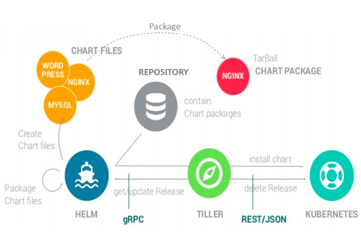

# 所用技术

| 技术                       | 说明                                                     |
| :------------------------- | :------------------------------------------------------- |
| Spring Boot                | 新一代 JavaEE 开发标准                                   |
| Spring Cloud Alibaba       | 阿里巴巴基于 Spring Cloud 编程模型的微服务生态           |
| Spring Cloud Alibaba Dubbo | 与 Spring Cloud Alibaba 生态相结合的高性能 Java RPC 框架 |
| Spring Security oAuth2     | 安全认证和授权框架                                       |
| Spring Social              | 第三方登录接入框架                                       |
| TkMyBatis                  | 基于 MyBatis 二次开发的轻量级框架，用于简化 MyBatis 操作 |
| MyBatisGenerator           | Maven 插件，用于 MyBatis 相关代码生成                    |
| MybatisCodeHelper          | Intellij IDEA 插件，用于 MyBatis 相关代码生成            |
| PageHelper                 | MyBatis 分页插件                                         |
| Swagger                    | API 文档生成工具                                         |
| HikariCP                   | 数据库连接池                                             |
| Docker                     | 容器化引擎                                               |
| Docker Compose             | 容器编排工具                                             |
| Kubernetes                 | 容器编排系统                                             |
| TiDB                       | 分布式数据库                                             |
| OKHttp3                    | 轻量级网络框架                                           |

# 框架集成

| 集成                       | 完成 |
| :------------------------- | :--- |
| Spring Boot                | ✔    |
| Spring Cloud Alibaba       | ✔    |
| Spring Cloud Alibaba Dubbo | ✔    |
| Spring Security oAuth2     | ✔    |
| TkMyBatis                  | ✔    |
| HikariCP                   | ✔    |
| OKHttp3                    | ✔    |
| Feign 传递 Token           | ✔    |

# Helm

## 什么是 Helm

Helm 是 Deis 开发的一个用于 Kubernetes 应用的包管理工具，主要用来管理 Charts。**有点类似于 Ubuntu 中的 APT 或 CentOS 中的 YUM**。

Helm Chart 是用来封装 Kubernetes 原生应用程序的一系列 YAML 文件。可以在你部署应用的时候自定义应用程序的一些 Metadata，以便于应用程序的分发。

对于应用发布者而言，可以通过 Helm 打包应用、管理应用依赖关系、管理应用版本并发布应用到软件仓库。

对于使用者而言，使用 Helm 后不用需要编写复杂的应用部署文件，**可以以简单的方式在 Kubernetes 上查找、安装、升级、回滚、卸载应用程序**。

## 组件及相关术语

- **Helm：** 是一个命令行下的客户端工具。主要用于 Kubernetes 应用程序 Chart 的创建、打包、发布以及创建和管理本地和远程的 Chart 仓库
- **Tiller：** 是 Helm 的服务端，部署在 Kubernetes 集群中。Tiller 用于接收 Helm 的请求，并根据 Chart 生成 Kubernetes 的部署文件（ Helm 称为 Release ），然后提交给 Kubernetes 创建应用。Tiller 还提供了 Release 的升级、删除、回滚等一系列功能
- **Chart：** Helm 的软件包，采用 TAR 格式。类似于 APT 的 DEB 包或者 YUM 的 RPM 包，其包含了一组定义 Kubernetes 资源相关的 YAML 文件
- **Repoistory：** Helm 的软件仓库，Repository 本质上是一个 Web 服务器，该服务器保存了一系列的 Chart 软件包以供用户下载，并且提供了一个该 Repository 的 Chart 包的清单文件以供查询。Helm 可以同时管理多个不同的 Repository
- **Release：** 使用 `helm install` 命令在 Kubernetes 集群中部署的 Chart 称为 Release

> **注意：** Helm 中提到的 Release 和我们通常概念中的版本有所不同，这里的 Release 可以理解为 Helm 使用 Chart 包部署的一个应用实例。

## 工作原理

下图描述了 Helm 的几个关键组件 Helm（客户端）、Tiller（服务器）、Repository（Chart 软件仓库）、Chart（软件包）之间的关系。



### Chart Install 安装过程

- Helm 从指定的目录或者 TAR 文件中解析出 Chart 结构信息
- Helm 将指定的 Chart 结构和 Values 信息通过 gRPC 传递给 Tiller
- Tiller 根据 Chart 和 Values 生成一个 Release
- Tiller 将 Release 发送给 Kubernetes 用于生成 Release

### Chart Update 更新过程

- Helm 从指定的目录或者 TAR 文件中解析出 Chart 结构信息
- Helm 将需要更新的 Release 的名称、Chart 结构和 Values 信息传递给 Tiller
- Tiller 生成 Release 并更新指定名称的 Release 的 History
- Tiller 将 Release 发送给 Kubernetes 用于更新 Release

### Chart Rollback 回滚过程

- Helm 将要回滚的 Release 的名称传递给 Tiller
- Tiller 根据 Release 的名称查找 History
- Tiller 从 History 中获取上一个 Release
- Tiller 将上一个 Release 发送给 Kubernetes 用于替换当前 Release

### Chart 处理依赖

Tiller 在处理 Chart 时，直接将 Chart 以及其依赖的所有 Charts 合并为一个 Release，同时传递给 Kubernetes。因此 Tiller 并不负责管理依赖之间的启动顺序。Chart 中的应用需要能够自行处理依赖关系。

## 安装 Helm

### 安装客户端 Helm

Helm 的安装方式很多，这里采用二进制的方式安装。更多安装方法可以参考 Helm 的 [官方帮助文档]( https://helm.sh/docs/intro/ )

```shell
# 下载
wget https://get.helm.sh/helm-v2.14.3-linux-amd64.tar.gz
# 解压
tar -zxvf helm-v2.14.3-linux-amd64.tar.gz
# 复制客户端执行文件到 bin 目录下
cp linux-amd64/helm /usr/local/bin/
```

### 安装服务端 Tiller

Tiller 是以 Deployment 方式部署在 Kubernetes 集群中的，只需使用以下指令便可简单的完成安装

```shell
 该语句已废弃
helm init --upgrade --tiller-image registry.cn-hangzhou.aliyuncs.com/google_containers/tiller:v2.14.3 --stable-repo-url https://kubernetes.oss-cn-hangzhou.aliyuncs.com/charts
# 由于阿里云的 Helm Repo 已经不再更新，我们使用微软提供的 Helm 源
helm init --upgrade --tiller-image registry.cn-hangzhou.aliyuncs.com/google_containers/tiller:v2.14.3 --stable-repo-url http://mirror.azure.cn/kubernetes/charts/
# 注意：如果你使用的是 Kubernetes v1.16.x 版本的话，tiller 2.15 之前的版本是不兼容的
# 解决方案原文地址：https://github.com/helm/helm/issues/6374
helm init --upgrade --tiller-image registry.cn-hangzhou.aliyuncs.com/google_containers/tiller:v2.14.3 --stable-repo-url http://mirror.azure.cn/kubernetes/charts/ --service-account tiller --override spec.selector.matchLabels.'name'='tiller',spec.selector.matchLabels.'app'='helm' --output yaml | sed 's@apiVersion: extensions/v1beta1@apiVersion: apps/v1@' | kubectl apply -f -
```

### 给 Tiller 授权

Helm 的服务端 Tiller 是一个部署在 Kubernetes 中 `Kube-system` Namespace 下的 Deployment，它会去连接 `kube-api` 在 Kubernetes 里创建和删除应用。

从 Kubernetes 1.6 版本开始，API Server 启用了 RBAC 授权。目前的 Tiller 部署时默认没有定义授权的 ServiceAccount，这会导致访问 API Server 时被拒绝。所以我们需要明确为 Tiller 部署添加授权

- 创建一个名为 `tiller-adminuser.yaml` 的配置文件，为 Tiller 创建服务帐号和绑定角色

```yaml
apiVersion: v1
kind: ServiceAccount
metadata:
  name: tiller
  namespace: kube-system
---
apiVersion: rbac.authorization.k8s.io/v1
kind: ClusterRoleBinding
metadata:
  name: tiller-cluster-rule
roleRef:
  apiGroup: rbac.authorization.k8s.io
  kind: ClusterRole
  name: cluster-admin
subjects:
- kind: ServiceAccount
  name: tiller
  namespace: kube-system
```

```shell
kubectl apply -f tiller-adminuser.yaml
```

- 为 Tiller 设置帐号

```shell
# 使用 kubectl patch 更新 API 对象
kubectl patch deploy --namespace kube-system tiller-deploy -p '{"spec":{"template":{"spec":{"serviceAccount":"tiller"}}}}'
# 输出如下
deployment.extensions/tiller-deploy patched
```

- 查看是否授权成功

```shell
kubectl get deploy --namespace kube-system tiller-deploy --output yaml|grep  serviceAccount
# 输出如下
serviceAccount: tiller
serviceAccountName: tiller
```

### 验证安装是否成功

```shell
kubectl -n kube-system get pods|grep tiller
# 输出如下
tiller-deploy-6d74cd8c9d-v6zg4              1/1     Running   0          10m
```

```shell
helm version
# 输出如下
Client: &version.Version{SemVer:"v2.11.0", GitCommit:"2e55dbe1fdb5fdb96b75ff144a339489417b146b", GitTreeState:"clean"}
Server: &version.Version{SemVer:"v2.11.0", GitCommit:"2e55dbe1fdb5fdb96b75ff144a339489417b146b", GitTreeState:"clean"}
```


## 卸载 Tiller

如果你需要在 Kubernetes 中卸载已部署的 Tiller，可使用以下命令完成卸载

```shell
helm reset
```