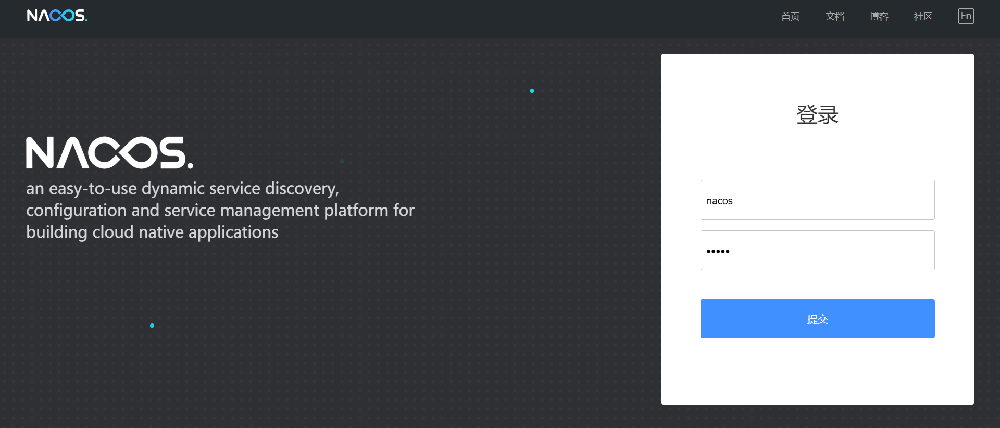
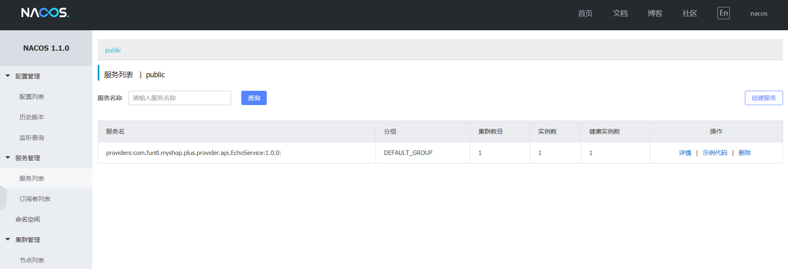
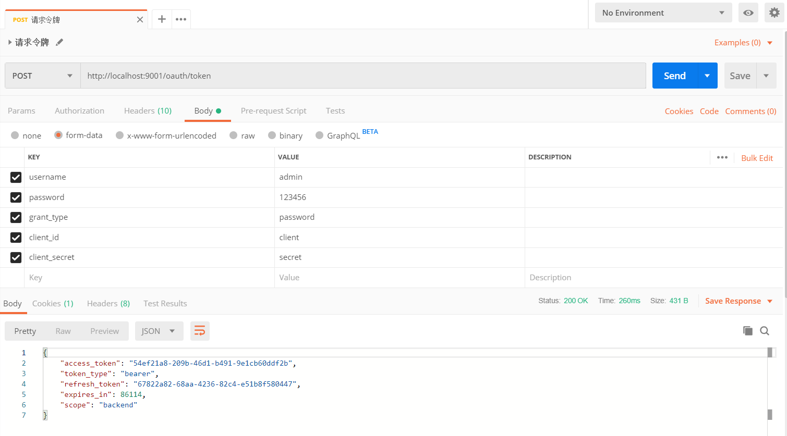

#  创建项目工程

## 工程 POM

```xml
<?xml version="1.0" encoding="UTF-8"?>
<project xmlns="http://maven.apache.org/POM/4.0.0" xmlns:xsi="http://www.w3.org/2001/XMLSchema-instance"
         xsi:schemaLocation="http://maven.apache.org/POM/4.0.0 http://maven.apache.org/xsd/maven-4.0.0.xsd">
    <modelVersion>4.0.0</modelVersion>
    <parent>
        <groupId>org.springframework.boot</groupId>
        <artifactId>spring-boot-starter-parent</artifactId>
        <version>2.1.6.RELEASE</version>
        <relativePath/> <!-- lookup parent from repository -->
    </parent>
    <groupId>com.funtl.myshop.plus</groupId>
    <artifactId>parent</artifactId>
    <version>0.0.1-SNAPSHOT</version>
    <packaging>pom</packaging>
    <url>http://www.funtl.com</url>
    <modules>
        <module>dependencies</module>
    </modules>
    <properties>
        <java.version>1.8</java.version>
        <maven.compiler.source>${java.version}</maven.compiler.source>
        <maven.compiler.target>${java.version}</maven.compiler.target>
        <project.build.sourceEncoding>UTF-8</project.build.sourceEncoding>
        <project.reporting.outputEncoding>UTF-8</project.reporting.outputEncoding>
    </properties>
    <licenses>
        <license>
            <name>Apache 2.0</name>
            <url>https://www.apache.org/licenses/LICENSE-2.0.txt</url>
        </license>
    </licenses>
    <developers>
        <developer>
            <id>liwemin</id>
            <name>Lusifer Lee</name>
            <email>lee.lusifer@gmail.com</email>
        </developer>
    </developers>
    <dependencyManagement>
        <dependencies>
            <dependency>
                <groupId>com.funtl.myshop.plus</groupId>
                <artifactId>dependencies</artifactId>
                <version>${project.version}</version>
                <type>pom</type>
                <scope>import</scope>
            </dependency>
        </dependencies>
    </dependencyManagement>
    <profiles>
        <profile>
            <id>default</id>
            <activation>
                <activeByDefault>true</activeByDefault>
            </activation>
            <properties>
                <spring-javaformat.version>0.0.12</spring-javaformat.version>
            </properties>
            <build>
                <plugins>
                    <plugin>
                        <groupId>io.spring.javaformat</groupId>
                        <artifactId>spring-javaformat-maven-plugin</artifactId>
                        <version>${spring-javaformat.version}</version>
                    </plugin>
                    <plugin>
                        <groupId>org.apache.maven.plugins</groupId>
                        <artifactId>maven-surefire-plugin</artifactId>
                        <configuration>
                            <includes>
                                <include>**/*Tests.java</include>
                            </includes>
                            <excludes>
                                <exclude>**/Abstract*.java</exclude>
                            </excludes>
                            <systemPropertyVariables>
                                <java.security.egd>file:/dev/./urandom</java.security.egd>
                                <java.awt.headless>true</java.awt.headless>
                            </systemPropertyVariables>
                        </configuration>
                    </plugin>
                    <plugin>
                        <groupId>org.apache.maven.plugins</groupId>
                        <artifactId>maven-enforcer-plugin</artifactId>
                        <executions>
                            <execution>
                                <id>enforce-rules</id>
                                <goals>
                                    <goal>enforce</goal>
                                </goals>
                                <configuration>
                                    <rules>
                                        <bannedDependencies>
                                            <excludes>
                                                <exclude>commons-logging:*:*</exclude>
                                            </excludes>
                                            <searchTransitive>true</searchTransitive>
                                        </bannedDependencies>
                                    </rules>
                                    <fail>true</fail>
                                </configuration>
                            </execution>
                        </executions>
                    </plugin>
                    <plugin>
                        <groupId>org.apache.maven.plugins</groupId>
                        <artifactId>maven-install-plugin</artifactId>
                        <configuration>
                            <skip>true</skip>
                        </configuration>
                    </plugin>
                    <plugin>
                        <groupId>org.apache.maven.plugins</groupId>
                        <artifactId>maven-javadoc-plugin</artifactId>
                        <configuration>
                            <skip>true</skip>
                        </configuration>
                        <inherited>true</inherited>
                    </plugin>
                </plugins>
            </build>
        </profile>
    </profiles>
    <repositories>
        <repository>
            <id>spring-milestone</id>
            <name>Spring Milestone</name>
            <url>https://repo.spring.io/milestone</url>
            <snapshots>
                <enabled>false</enabled>
            </snapshots>
        </repository>
        <repository>
            <id>spring-snapshot</id>
            <name>Spring Snapshot</name>
            <url>https://repo.spring.io/snapshot</url>
            <snapshots>
                <enabled>true</enabled>
            </snapshots>
        </repository>
    </repositories>
    <pluginRepositories>
        <pluginRepository>
            <id>spring-milestone</id>
            <name>Spring Milestone</name>
            <url>https://repo.spring.io/milestone</url>
            <snapshots>
                <enabled>false</enabled>
            </snapshots>
        </pluginRepository>
        <pluginRepository>
            <id>spring-snapshot</id>
            <name>Spring Snapshot</name>
            <url>https://repo.spring.io/snapshot</url>
            <snapshots>
                <enabled>true</enabled>
            </snapshots>
        </pluginRepository>
    </pluginRepositories>
</project>
```

## 依赖管理 POM

```xml
<?xml version="1.0" encoding="UTF-8"?>
<project xmlns="http://maven.apache.org/POM/4.0.0" xmlns:xsi="http://www.w3.org/2001/XMLSchema-instance"
         xsi:schemaLocation="http://maven.apache.org/POM/4.0.0 http://maven.apache.org/xsd/maven-4.0.0.xsd">
    <modelVersion>4.0.0</modelVersion>
    <groupId>com.funtl.myshop.plus</groupId>
    <artifactId>dependencies</artifactId>
    <version>0.0.1-SNAPSHOT</version>
    <packaging>pom</packaging>
    <url>http://www.funtl.com</url>
    <properties>
        <dubbo.version>2.7.2</dubbo.version>
        <dubbo-kryo.version>2.7.2</dubbo-kryo.version>
        <dubbo-actuator.version>2.7.1</dubbo-actuator.version>
        <spring-boot-mapper.version>2.1.5</spring-boot-mapper.version>
        <spring-cloud.version>Greenwich.RELEASE</spring-cloud.version>
        <spring-cloud-alibaba.verion>0.9.0.RELEASE</spring-cloud-alibaba.verion>
        <alibaba-spring-context-support.version>1.0.2</alibaba-spring-context-support.version>
    </properties>
    <licenses>
        <license>
            <name>Apache 2.0</name>
            <url>https://www.apache.org/licenses/LICENSE-2.0.txt</url>
        </license>
    </licenses>
    <developers>
        <developer>
            <id>liwemin</id>
            <name>Lusifer Lee</name>
            <email>lee.lusifer@gmail.com</email>
        </developer>
    </developers>
    <dependencyManagement>
        <dependencies>
            <!-- Spring Cloud -->
            <dependency>
                <groupId>org.springframework.cloud</groupId>
                <artifactId>spring-cloud-dependencies</artifactId>
                <version>${spring-cloud.version}</version>
                <type>pom</type>
                <scope>import</scope>
            </dependency>
            <dependency>
                <groupId>org.springframework.cloud</groupId>
                <artifactId>spring-cloud-alibaba-dependencies</artifactId>
                <version>${spring-cloud-alibaba.verion}</version>
                <type>pom</type>
                <scope>import</scope>
            </dependency>
            <!-- Apache Dubbo -->
            <dependency>
                <groupId>org.apache.dubbo</groupId>
                <artifactId>dubbo</artifactId>
                <version>${dubbo.version}</version>
                <exclusions>
                    <exclusion>
                        <groupId>org.springframework</groupId>
                        <artifactId>spring</artifactId>
                    </exclusion>
                    <exclusion>
                        <groupId>javax.servlet</groupId>
                        <artifactId>servlet-api</artifactId>
                    </exclusion>
                    <exclusion>
                        <groupId>log4j</groupId>
                        <artifactId>log4j</artifactId>
                    </exclusion>
                </exclusions>
            </dependency>
            <dependency>
                <groupId>org.apache.dubbo</groupId>
                <artifactId>dubbo-spring-boot-actuator</artifactId>
                <version>${dubbo-actuator.version}</version>
            </dependency>
            <dependency>
                <groupId>org.apache.dubbo</groupId>
                <artifactId>dubbo-serialization-kryo</artifactId>
                <version>${dubbo-kryo.version}</version>
                <exclusions>
                    <exclusion>
                        <groupId>log4j</groupId>
                        <artifactId>log4j</artifactId>
                    </exclusion>
                    <exclusion>
                        <groupId>org.apache.dubbo</groupId>
                        <artifactId>dubbo-common</artifactId>
                    </exclusion>
                </exclusions>
            </dependency>
            <dependency>
                <groupId>com.alibaba.spring</groupId>
                <artifactId>spring-context-support</artifactId>
                <version>${alibaba-spring-context-support.version}</version>
            </dependency>
            <!-- DataSource -->
            <dependency>
                <groupId>com.zaxxer</groupId>
                <artifactId>HikariCP</artifactId>
                <version>${hikaricp.version}</version>
            </dependency>
            <dependency>
                <groupId>org.springframework.boot</groupId>
                <artifactId>spring-boot-starter-jdbc</artifactId>
                <exclusions>
                    <!-- 排除 tomcat-jdbc 以使用 HikariCP -->
                    <exclusion>
                        <groupId>org.apache.tomcat</groupId>
                        <artifactId>tomcat-jdbc</artifactId>
                    </exclusion>
                </exclusions>
            </dependency>
            <dependency>
                <groupId>tk.mybatis</groupId>
                <artifactId>mapper-spring-boot-starter</artifactId>
                <version>${spring-boot-mapper.version}</version>
            </dependency>
        </dependencies>
    </dependencyManagement>
    <repositories>
        <repository>
            <id>spring-milestone</id>
            <name>Spring Milestone</name>
            <url>https://repo.spring.io/milestone</url>
            <snapshots>
                <enabled>false</enabled>
            </snapshots>
        </repository>
        <repository>
            <id>spring-snapshot</id>
            <name>Spring Snapshot</name>
            <url>https://repo.spring.io/snapshot</url>
            <snapshots>
                <enabled>true</enabled>
            </snapshots>
        </repository>
    </repositories>
    <pluginRepositories>
        <pluginRepository>
            <id>spring-milestone</id>
            <name>Spring Milestone</name>
            <url>https://repo.spring.io/milestone</url>
            <snapshots>
                <enabled>false</enabled>
            </snapshots>
        </pluginRepository>
        <pluginRepository>
            <id>spring-snapshot</id>
            <name>Spring Snapshot</name>
            <url>https://repo.spring.io/snapshot</url>
            <snapshots>
                <enabled>true</enabled>
            </snapshots>
        </pluginRepository>
    </pluginRepositories>
</project>
```

# 部署注册中心

## 准备 NFS

> **注意：** 以下步骤需要在 NFS 服务端操作

- 创建 Nacos 所需共享目录

```shell
mkdir -p /data/nfs-sharemkdir -p /data/mysql-mastermkdir -p /data/mysql-slave
```

- 给目录增加读写权限

```shell
chmod a+rw /data/nfs-sharechmod a+rw /data/mysql-masterchmod a+rw /data/mysql-slave
```

- 配置 NFS 服务目录

```powershell
vi /etc/exports# 底部增加/data/nfs-share *(rw,sync,no_subtree_check,no_root_squash)/data/mysql-master *(rw,sync,no_subtree_check,no_root_squash)/data/mysql-slave *(rw,sync,no_subtree_check,no_root_squash)
```

- 重启服务，使配置生效

```shell
/etc/init.d/nfs-kernel-server restart
```

## 克隆 Nacos

```shell
git clone https://github.com/nacos-group/nacos-k8s.git
```

## 部署 NFS

- 创建角色

```shell
kubectl create -f deploy/nfs/rbac.yaml
```

- 创建 `ServiceAccount` 和部署 `NFS-Client Provisioner`

```yaml
vi deploy/nfs/deployment.yaml
# 进行如下修改
apiVersion: v1
kind: ServiceAccount
metadata:
  name: nfs-client-provisioner
---
kind: Deployment
apiVersion: extensions/v1beta1
metadata:
  name: nfs-client-provisioner
spec:
  replicas: 1
  strategy:
    type: Recreate
  template:
    metadata:
      labels:
        app: nfs-client-provisioner
    spec:
      serviceAccount: nfs-client-provisioner
      containers:
      - name: nfs-client-provisioner
        image: quay.io/external_storage/nfs-client-provisioner:latest
        volumeMounts:
        - name: nfs-client-root
          mountPath: /persistentvolumes
        env:
        - name: PROVISIONER_NAME
          value: fuseim.pri/ifs
        - name: NFS_SERVER
          # 修改为 NFS 服务端 IP
          value: 192.168.141.130
        - name: NFS_PATH
          # 修改为 NFS 服务端共享目录
          value: /data/nfs-share
      volumes:
      - name: nfs-client-root
        nfs:
          # 修改为 NFS 服务端 IP
          server: 192.168.141.130
          # 修改为 NFS 服务端共享目录
          path: /data/nfs-share
```

```shell
kubectl create -f deploy/nfs/deployment.yaml
```

- 创建 `NFS StorageClass`

```shell
kubectl create -f deploy/nfs/class.yaml
```

- 验证 NFS 部署成功

```shell
kubectl get pod -l app=nfs-client-provisioner
# 输出如下
NAME                                      READY   STATUS    RESTARTS   AGE
nfs-client-provisioner-5f9f96c4dc-mrzr6   1/1     Running   0          177m
```

## 部署数据库

- 部署主库

```yaml
vi deploy/mysql/mysql-master-nfs.yaml
# 进行如下修改
apiVersion: v1
kind: ReplicationController
metadata:
  name: mysql-master
  labels:
    name: mysql-master
spec:
  replicas: 1
  selector:
    name: mysql-master
  template:
    metadata:
      labels:
        name: mysql-master
    spec:
      containers:
      - name: master
        image: nacos/nacos-mysql-master:latest
        ports:
        - containerPort: 3306
        volumeMounts:
        - name: mysql-master-data
          mountPath: /var/lib/mysql
        env:
        - name: MYSQL_ROOT_PASSWORD
          value: "root"
        - name: MYSQL_DATABASE
          value: "nacos_devtest"
        - name: MYSQL_USER
          value: "nacos"
        - name: MYSQL_PASSWORD
          value: "nacos"
        - name: MYSQL_REPLICATION_USER
          value: 'nacos_ru'
        - name: MYSQL_REPLICATION_PASSWORD
          value: 'nacos_ru'
      volumes:
      - name: mysql-master-data
        nfs:
          # 修改为 NFS 服务端 IP
          server: 192.168.141.130
          # 修改为 NFS 服务端共享目录
          path: /data/mysql-master
---
apiVersion: v1
kind: Service
metadata:
  name: mysql-master
  labels:
    name: mysql-master
spec:
  ports:
  - port: 3306
    targetPort: 3306
  selector:
    name: mysql-master
```

```shell
kubectl create -f deploy/mysql/mysql-master-nfs.yaml
```

- 部署从库

```yaml
vi deploy/mysql/mysql-slave-nfs.yaml
# 进行如下修改
apiVersion: v1
kind: ReplicationController
metadata:
  name: mysql-slave
  labels:
    name: mysql-slave
spec:
  replicas: 1
  selector:
    name: mysql-slave
  template:
    metadata:
      labels:
        name: mysql-slave
    spec:
      containers:
      - name: slave
        image: nacos/nacos-mysql-slave:latest
        ports:
        - containerPort: 3306
        volumeMounts:
        - name: mysql-slave-data
          mountPath: /var/lib/mysql
        env:
        - name: MYSQL_ROOT_PASSWORD
          value: "root"
        - name: MYSQL_REPLICATION_USER
          value: 'nacos_ru'
        - name: MYSQL_REPLICATION_PASSWORD
          value: 'nacos_ru'
      volumes:
      - name: mysql-slave-data
        nfs:
          # 修改为 NFS 服务端 IP
          server: 192.168.141.130
          # 修改为 NFS 服务端共享目录
          path: /data/mysql-slave
---
apiVersion: v1
kind: Service
metadata:
  name: mysql-slave
  labels:
    name: mysql-slave
spec:
  ports:
  - port: 3306
    targetPort: 3306
  selector:
    name: mysql-slave
```

```shell
kubectl create -f deploy/mysql/mysql-slave-nfs.yaml
```

- 验证数据库是否正常工作

```shell
kubectl get pod
# 输出如下
NAME                                      READY   STATUS    RESTARTS   AGE
mysql-master-82tk4                        1/1     Running   1          176m
mysql-slave-2pbkk                         1/1     Running   0          174m
```

## 部署 Nacos

- 创建 Nacos

```shell
kubectl create -f deploy/nacos/nacos-pvc-nfs.yaml
```

- 验证 Nacos 节点启动成功

```shell
kubectl get pod -l app=nacos
# 输出如下
NAME      READY   STATUS    RESTARTS   AGE
nacos-0   1/1     Running   0          174m
nacos-1   1/1     Running   0          171m
```

## 路由 Nacos

- 创建一个名为 `nacos.yml` 的 Ingress 配置文件

```yaml
apiVersion: networking.k8s.io/v1beta1
kind: Ingress
metadata:
  name: nacos-web
  annotations:
    kubernetes.io/ingress.class: "nginx"
    nginx.ingress.kubernetes.io/use-regex: "true"
    nginx.ingress.kubernetes.io/proxy-connect-timeout: "600"
    nginx.ingress.kubernetes.io/proxy-send-timeout: "600"
    nginx.ingress.kubernetes.io/proxy-read-timeout: "600"
    nginx.ingress.kubernetes.io/proxy-body-size: "10m"
    nginx.ingress.kubernetes.io/rewrite-target: /
spec:
  rules:
  - host: nacos.funtl.com
    http:
      paths:
      - path:
        backend:
          serviceName: nacos-headless
          servicePort: 8848
```

- 部署 Ingress

```shell
kubectl apply -f nacos.yml
```

- 验证是否成功（**别忘记修改 Hosts**）

打开浏览器访问 [http://nacos.funtl.com/nacos/#/login]()



## 扩容选举 Leader

> **注意：** StatefulSet 控制器根据其序数索引为每个 Pod 提供唯一的主机名。 主机名采用 `-` 的形式。 因为 nacos StatefulSet 的副本字段设置为 2，所以当前集群文件中只有两个 Nacos 节点地址，故无法选举出 Leader，此时我们就需要手动扩容了

- 在扩容前，使用 `kubectl exec` 获取在 pod 中的 Nacos 集群配置文件信息

```shell
for i in 0 1; do echo nacos-$i; kubectl exec nacos-$i cat conf/cluster.conf; done
```

- 使用 `kubectl scale` 对 Nacos 动态扩容

```shell
kubectl scale sts nacos --replicas=3
```

- 在扩容后，使用 `kubectl exec` 获取在 pod 中的 Nacos 集群配置文件信息

```shell
for i in 0 1 2; do echo nacos-$i; kubectl exec nacos-$i cat conf/cluster.conf; done
```

- 使用 `kubectl exec` 执行 Nacos API 在每台节点上获取当前 Leader 是否一致

```shell
for i in 0 1 2; do echo nacos-$i; kubectl exec nacos-$i curl GET "http://localhost:8848/nacos/v1/ns/raft/state"; done
```

> **注意：** 扩容后可能依然无法正确选举出 Leader，使用 `kubectl delete pods nacos-$i` 的形式手动删除 Pod ，让 k8s 自动恢复，再观察 `naming-raft.log` 日志

## 附：其它小记

### 限制

必须要使用持久卷，否则会出现数据丢失的情况

### 项目目录

| 目录     | 描述                                              |
| :------- | :------------------------------------------------ |
| `plugin` | 帮助 Nacos 集群进行动态扩容的插件 Docker 镜像源码 |
| `deploy` | K8s 部署文件                                      |

### 配置属性

- `nacos-pvc-nfs.yaml` or `nacos-quick-start.yaml`

| 名称                    | 必要 | 描述                                                         |
| :---------------------- | :--- | :----------------------------------------------------------- |
| `mysql.master.db.name`  | Y    | 主库名称                                                     |
| `mysql.master.port`     | N    | 主库端口                                                     |
| `mysql.slave.port`      | N    | 从库端口                                                     |
| `mysql.master.user`     | Y    | 主库用户名                                                   |
| `mysql.master.password` | Y    | 主库密码                                                     |
| `NACOS_REPLICAS`        | N    | 确定执行 Nacos 启动节点数量，如果不适用动态扩容插件，就必须配置这个属性，否则使用扩容插件后不会生效 |
| `NACOS_SERVER_PORT`     | N    | Nacos 端口                                                   |
| `PREFER_HOST_MODE`      | Y    | 启动 Nacos 集群按域名解析                                    |

- nfs `deployment.yaml`

| 名称         | 必要 | 描述           |
| :----------- | :--- | :------------- |
| `NFS_SERVER` | Y    | NFS 服务端地址 |
| `NFS_PATH`   | Y    | NFS 共享目录   |
| `server`     | Y    | NFS 服务端地址 |
| `path`       | Y    | NFS 共享目录   |

- mysql

| 名称                         | 必要 | 描述                                       |
| :--------------------------- | :--- | :----------------------------------------- |
| `MYSQL_ROOT_PASSWORD`        | N    | ROOT 密码                                  |
| `MYSQL_DATABASE`             | Y    | 数据库名称                                 |
| `MYSQL_USER`                 | Y    | 数据库用户名                               |
| `MYSQL_PASSWORD`             | Y    | 数据库密码                                 |
| `MYSQL_REPLICATION_USER`     | Y    | 数据库复制用户                             |
| `MYSQL_REPLICATION_PASSWORD` | Y    | 数据库复制用户密码                         |
| `Nfs:server`                 | N    | NFS 服务端地址，如果使用本地部署不需要配置 |
| `Nfs:path`                   | N    | NFS 共享目录，如果使用本地部署不需要配置   |

# 用户服务提供者

## 概述

通常，提供者服务是直接和数据库打交道的，可以理解成三层架构中的数据访问层

## 创建提供者模块

创建一个名为 `provider` 的模块，POM 配置如下

```xml
<?xml version="1.0" encoding="UTF-8"?>
<project xmlns="http://maven.apache.org/POM/4.0.0" xmlns:xsi="http://www.w3.org/2001/XMLSchema-instance"
         xsi:schemaLocation="http://maven.apache.org/POM/4.0.0 http://maven.apache.org/xsd/maven-4.0.0.xsd">
    <modelVersion>4.0.0</modelVersion>
    <parent>
        <groupId>com.funtl.myshop.plus</groupId>
        <artifactId>parent</artifactId>
        <version>0.0.1-SNAPSHOT</version>
    </parent>
    <artifactId>provider</artifactId>
    <packaging>pom</packaging>
    <url>http://www.funtl.com</url>
    <inceptionYear>2018-Now</inceptionYear>
    <licenses>
        <license>
            <name>Apache 2.0</name>
            <url>https://www.apache.org/licenses/LICENSE-2.0.txt</url>
        </license>
    </licenses>
    <developers>
        <developer>
            <id>liwemin</id>
            <name>Lusifer Lee</name>
            <email>lee.lusifer@gmail.com</email>
        </developer>
    </developers>
</project>
```

## 创建用户服务接口

由于本次是第一次在 k8s 中注册，所以先测试是否能够成功注册到 Naocs，成功后再进行后续编码工作

### POM

```xml
<?xml version="1.0" encoding="UTF-8"?>
<project xmlns="http://maven.apache.org/POM/4.0.0" xmlns:xsi="http://www.w3.org/2001/XMLSchema-instance"
         xsi:schemaLocation="http://maven.apache.org/POM/4.0.0 http://maven.apache.org/xsd/maven-4.0.0.xsd">
    <modelVersion>4.0.0</modelVersion>
    <parent>
        <groupId>com.funtl.myshop.plus</groupId>
        <artifactId>provider</artifactId>
        <version>0.0.1-SNAPSHOT</version>
    </parent>
    <artifactId>ums-admin-provider-api</artifactId>
    <packaging>jar</packaging>
    <url>http://www.funtl.com</url>
    <inceptionYear>2018-Now</inceptionYear>
    <licenses>
        <license>
            <name>Apache 2.0</name>
            <url>https://www.apache.org/licenses/LICENSE-2.0.txt</url>
        </license>
    </licenses>
    <developers>
        <developer>
            <id>liwemin</id>
            <name>Lusifer Lee</name>
            <email>lee.lusifer@gmail.com</email>
        </developer>
    </developers>
</project>
```

### 定义接口

```java
package com.funtl.myshop.plus.provider.api;
public interface EchoService {
    String echo(String string);
}
```

## 创建用户服务实现

### POM

```xml
<?xml version="1.0" encoding="UTF-8"?>
<project xmlns="http://maven.apache.org/POM/4.0.0" xmlns:xsi="http://www.w3.org/2001/XMLSchema-instance"
         xsi:schemaLocation="http://maven.apache.org/POM/4.0.0 http://maven.apache.org/xsd/maven-4.0.0.xsd">
    <modelVersion>4.0.0</modelVersion>
    <parent>
        <groupId>com.funtl.myshop.plus</groupId>
        <artifactId>provider</artifactId>
        <version>0.0.1-SNAPSHOT</version>
    </parent>
    <artifactId>ums-admin-provider-service</artifactId>
    <packaging>jar</packaging>
    <url>http://www.funtl.com</url>
    <inceptionYear>2018-Now</inceptionYear>
    <licenses>
        <license>
            <name>Apache 2.0</name>
            <url>https://www.apache.org/licenses/LICENSE-2.0.txt</url>
        </license>
    </licenses>
    <developers>
        <developer>
            <id>liwemin</id>
            <name>Lusifer Lee</name>
            <email>lee.lusifer@gmail.com</email>
        </developer>
    </developers>
    <dependencies>
        <!-- Spring Boot Begin -->
        <dependency>
            <groupId>org.springframework.boot</groupId>
            <artifactId>spring-boot-starter</artifactId>
        </dependency>
        <dependency>
            <groupId>org.springframework.boot</groupId>
            <artifactId>spring-boot-starter-test</artifactId>
            <scope>test</scope>
        </dependency>
        <!-- Spring Boot End -->
        <!-- Spring Cloud Begin -->
        <dependency>
            <groupId>org.springframework.cloud</groupId>
            <artifactId>spring-cloud-starter-oauth2</artifactId>
        </dependency>
        <!-- Spring Cloud End -->
        <!-- Apache Dubbo Begin -->
        <dependency>
            <groupId>org.apache.dubbo</groupId>
            <artifactId>dubbo-spring-boot-starter</artifactId>
        </dependency>
        <dependency>
            <groupId>org.apache.dubbo</groupId>
            <artifactId>dubbo</artifactId>
            <exclusions>
                <exclusion>
                    <groupId>org.springframework</groupId>
                    <artifactId>spring</artifactId>
                </exclusion>
                <exclusion>
                    <groupId>javax.servlet</groupId>
                    <artifactId>servlet-api</artifactId>
                </exclusion>
                <exclusion>
                    <groupId>log4j</groupId>
                    <artifactId>log4j</artifactId>
                </exclusion>
            </exclusions>
        </dependency>
        <dependency>
            <groupId>com.alibaba</groupId>
            <artifactId>dubbo-registry-nacos</artifactId>
        </dependency>
        <dependency>
            <groupId>com.alibaba.nacos</groupId>
            <artifactId>nacos-client</artifactId>
        </dependency>
        <dependency>
            <groupId>com.alibaba.spring</groupId>
            <artifactId>spring-context-support</artifactId>
        </dependency>
        <dependency>
            <groupId>org.apache.dubbo</groupId>
            <artifactId>dubbo-serialization-kryo</artifactId>
            <exclusions>
                <exclusion>
                    <groupId>log4j</groupId>
                    <artifactId>log4j</artifactId>
                </exclusion>
                <exclusion>
                    <groupId>org.apache.dubbo</groupId>
                    <artifactId>dubbo-common</artifactId>
                </exclusion>
            </exclusions>
        </dependency>
        <!-- Apache Dubbo End -->
        <!-- DataSource Begin -->
        <dependency>
            <groupId>com.zaxxer</groupId>
            <artifactId>HikariCP</artifactId>
        </dependency>
        <dependency>
            <groupId>org.springframework.boot</groupId>
            <artifactId>spring-boot-starter-jdbc</artifactId>
            <exclusions>
                <!-- 排除 tomcat-jdbc 以使用 HikariCP -->
                <exclusion>
                    <groupId>org.apache.tomcat</groupId>
                    <artifactId>tomcat-jdbc</artifactId>
                </exclusion>
            </exclusions>
        </dependency>
        <dependency>
            <groupId>mysql</groupId>
            <artifactId>mysql-connector-java</artifactId>
        </dependency>
        <dependency>
            <groupId>tk.mybatis</groupId>
            <artifactId>mapper-spring-boot-starter</artifactId>
        </dependency>
        <!-- DataSource End -->
        <!-- Projects Begin -->
        <dependency>
            <groupId>com.funtl.myshop.plus</groupId>
            <artifactId>ums-admin-provider-api</artifactId>
            <version>${project.parent.version}</version>
        </dependency>
        <!-- Projects End -->
    </dependencies>
    <build>
        <plugins>
            <plugin>
                <groupId>org.springframework.boot</groupId>
                <artifactId>spring-boot-maven-plugin</artifactId>
                <configuration>
                    <mainClass>com.funtl.myshop.plus.provider.UmsAdminProviderApplication</mainClass>
                </configuration>
            </plugin>
        </plugins>
    </build>
</project>
```

### application.yml

```yml
spring:
  application:
    name: ums-admin-provider
  main:
    allow-bean-definition-overriding: true
  datasource:
    type: com.zaxxer.hikari.HikariDataSource
    driver-class-name: com.mysql.cj.jdbc.Driver
    url: jdbc:mysql://192.168.141.110:4000/mplus_ums_admin?useUnicode=true&characterEncoding=utf-8&useSSL=false
    username: root
    password:
    hikari:
      minimum-idle: 5
      idle-timeout: 600000
      maximum-pool-size: 10
      auto-commit: true
      pool-name: MyHikariCP
      max-lifetime: 1800000
      connection-timeout: 30000
      connection-test-query: SELECT 1
dubbo:
  scan:
    base-packages: com.funtl.myshop.plus.provider.service
  protocol:
    name: dubbo
    port: -1
    serialization: kryo
  registry:
    address: nacos://nacos.funtl.com
    port: 80
mybatis:
  type-aliases-package: com.funtl.myshop.plus.provider.domain
  mapper-locations: classpath:mapper/*.xml
```

### Application

```java
package com.funtl.myshop.plus.provider;
import org.springframework.boot.SpringApplication;
import org.springframework.boot.autoconfigure.SpringBootApplication;
import tk.mybatis.spring.annotation.MapperScan;
@SpringBootApplication
@MapperScan(basePackages = "com.funtl.myshop.plus.provider.mapper")
public class UmsAdminProviderApplication {
    public static void main(String[] args) {
        SpringApplication.run(UmsAdminProviderApplication.class, args);
    }
}
```

### Service

```java
package com.funtl.myshop.plus.provider.service;
import com.funtl.myshop.plus.provider.api.EchoService;
import org.apache.dubbo.config.annotation.Service;
@Service(version = "1.0.0")
public class EchoServiceImpl implements EchoService {
    @Override
    public String echo(String string) {
        return "Echo Hello Dubbo " + string;
    }
}
```

### 验证是否成功

通过浏览器访问：[http://nacos.funtl.com/nacos]() ，你会发现一个服务已经注册在服务中了，服务名为：`providers:com.funtl.myshop.plus.provider.api.EchoService:1.0.0:`



完成

# 用户注册服务

## 概述

服务本身既可以是提供者也可以是消费者，DUBBO 的服务提供者我们当成数据访问层，新创建的业务服务既是 DUBBO 的服务消费者又提供 RESTful 服务，此时可以理解成三层架构中的业务逻辑层

## 创建业务服务模块

创建一个名为 `business` 的模块，POM 配置如下

```xml
<?xml version="1.0" encoding="UTF-8"?>
<project xmlns="http://maven.apache.org/POM/4.0.0" xmlns:xsi="http://www.w3.org/2001/XMLSchema-instance"
         xsi:schemaLocation="http://maven.apache.org/POM/4.0.0 http://maven.apache.org/xsd/maven-4.0.0.xsd">
    <modelVersion>4.0.0</modelVersion>
    <parent>
        <groupId>com.funtl.myshop.plus</groupId>
        <artifactId>parent</artifactId>
        <version>0.0.1-SNAPSHOT</version>
    </parent>
    <artifactId>business</artifactId>
    <packaging>pom</packaging>
    <url>http://www.funtl.com</url>
    <inceptionYear>2018-Now</inceptionYear>
    <licenses>
        <license>
            <name>Apache 2.0</name>
            <url>https://www.apache.org/licenses/LICENSE-2.0.txt</url>
        </license>
    </licenses>
    <developers>
        <developer>
            <id>liwemin</id>
            <name>Lusifer Lee</name>
            <email>lee.lusifer@gmail.com</email>
        </developer>
    </developers>
    <modules>
        <module>business-reg</module>
    </modules>
</project>
```

## 修改用户服务提供者

由于代码量较大，此处仅列出关键代码

### 创建资源配置类

目前该类的主要作用是注入 `BCryptPasswordEncoder` 用户注册时的密码加密

```java
package com.funtl.myshop.plus.provider.configure;
import org.springframework.context.annotation.Bean;
import org.springframework.context.annotation.Configuration;
import org.springframework.security.crypto.bcrypt.BCryptPasswordEncoder;
/**
 * 资源配置服务器
 * <p>
 * Description:
 * </p>
 *
 * @author Lusifer
 * @version v1.0.0
 * @date 2019-07-26 04:27:07
 * @see com.funtl.myshop.plus.provider.configure
 */
@Configuration
public class UmsAdminResourceConfiguration {
    @Bean
    public BCryptPasswordEncoder passwordEncoder() {
        return new BCryptPasswordEncoder();
    }
}
```

## 创建通用类模块

创建一个名为 `commons` 的模块，POM 配置如下

```yaml
<?xml version="1.0" encoding="UTF-8"?>
<project xmlns="http://maven.apache.org/POM/4.0.0" xmlns:xsi="http://www.w3.org/2001/XMLSchema-instance"
         xsi:schemaLocation="http://maven.apache.org/POM/4.0.0 http://maven.apache.org/xsd/maven-4.0.0.xsd">
    <modelVersion>4.0.0</modelVersion>
    <parent>
        <groupId>com.funtl.myshop.plus</groupId>
        <artifactId>parent</artifactId>
        <version>0.0.1-SNAPSHOT</version>
    </parent>
    <artifactId>commons</artifactId>
    <packaging>pom</packaging>
    <url>http://www.funtl.com</url>
    <inceptionYear>2018-Now</inceptionYear>
    <licenses>
        <license>
            <name>Apache 2.0</name>
            <url>https://www.apache.org/licenses/LICENSE-2.0.txt</url>
        </license>
    </licenses>
    <developers>
        <developer>
            <id>liwemin</id>
            <name>Lusifer Lee</name>
            <email>lee.lusifer@gmail.com</email>
        </developer>
    </developers>
    <modules>
        <module>commons-dto</module>
    </modules>
</project>
```

## 创建通用传输对象模块

### POM

```xml
<?xml version="1.0" encoding="UTF-8"?>
<project xmlns="http://maven.apache.org/POM/4.0.0" xmlns:xsi="http://www.w3.org/2001/XMLSchema-instance"
         xsi:schemaLocation="http://maven.apache.org/POM/4.0.0 http://maven.apache.org/xsd/maven-4.0.0.xsd">
    <modelVersion>4.0.0</modelVersion>
    <parent>
        <groupId>com.funtl.myshop.plus</groupId>
        <artifactId>commons</artifactId>
        <version>0.0.1-SNAPSHOT</version>
    </parent>
    <artifactId>commons-dto</artifactId>
    <packaging>jar</packaging>
    <url>http://www.funtl.com</url>
    <inceptionYear>2018-Now</inceptionYear>
    <licenses>
        <license>
            <name>Apache 2.0</name>
            <url>https://www.apache.org/licenses/LICENSE-2.0.txt</url>
        </license>
    </licenses>
    <developers>
        <developer>
            <id>liwemin</id>
            <name>Lusifer Lee</name>
            <email>lee.lusifer@gmail.com</email>
        </developer>
    </developers>
    <dependencies>
        <dependency>
            <groupId>org.projectlombok</groupId>
            <artifactId>lombok</artifactId>
        </dependency>
    </dependencies>
</project>
```

### ResponseResult

```java
package com.funtl.myshop.plus.commons.dto;
import lombok.Data;
import java.io.Serializable;
/**
 * 通用数据传输对象
 * <p>
 * Description:
 * </p>
 *
 * @author Lusifer
 * @version v1.0.0
 * @date 2019-07-26 04:43:54
 * @see com.funtl.myshop.plus.commons.dto
 *
 */
@Data
public class ResponseResult<T> implements Serializable {
    private static final long serialVersionUID = 3468352004150968551L;
    /**
     * 状态码
     */
    private Integer state;
    /**
     * 消息
     */
    private String message;
    /**
     * 返回对象
     */
    private T data;
    public ResponseResult() {
        super();
    }
    public ResponseResult(Integer state) {
        super();
        this.state = state;
    }
    public ResponseResult(Integer state, String message) {
        super();
        this.state = state;
        this.message = message;
    }
    public ResponseResult(Integer state, Throwable throwable) {
        super();
        this.state = state;
        this.message = throwable.getMessage();
    }
    public ResponseResult(Integer state, T data) {
        super();
        this.state = state;
        this.data = data;
    }
    public ResponseResult(Integer state, String message, T data) {
        super();
        this.state = state;
        this.message = message;
        this.data = data;
    }
    public Integer getState() {
        return state;
    }
    public void setState(Integer state) {
        this.state = state;
    }
    public String getMessage() {
        return message;
    }
    public void setMessage(String message) {
        this.message = message;
    }
    public T getData() {
        return data;
    }
    public void setData(T data) {
        this.data = data;
    }
    @Override
    public int hashCode() {
        final int prime = 31;
        int result = 1;
        result = prime * result + ((data == null) ? 0 : data.hashCode());
        result = prime * result + ((message == null) ? 0 : message.hashCode());
        result = prime * result + ((state == null) ? 0 : state.hashCode());
        return result;
    }
    @Override
    public boolean equals(Object obj) {
        if (this == obj) {
            return true;
        }
        if (obj == null) {
            return false;
        }
        if (getClass() != obj.getClass()) {
            return false;
        }
        ResponseResult<?> other = (ResponseResult<?>) obj;
        if (data == null) {
            if (other.data != null) {
                return false;
            }
        } else if (!data.equals(other.data)) {
            return false;
        }
        if (message == null) {
            if (other.message != null) {
                return false;
            }
        } else if (!message.equals(other.message)) {
            return false;
        }
        if (state == null) {
            if (other.state != null) {
                return false;
            }
        } else if (!state.equals(other.state)) {
            return false;
        }
        return true;
    }
}
```

## 创建用户注册服务

### POM

```xml
<?xml version="1.0" encoding="UTF-8"?>
<project xmlns="http://maven.apache.org/POM/4.0.0" xmlns:xsi="http://www.w3.org/2001/XMLSchema-instance"
         xsi:schemaLocation="http://maven.apache.org/POM/4.0.0 http://maven.apache.org/xsd/maven-4.0.0.xsd">
    <modelVersion>4.0.0</modelVersion>
    <parent>
        <groupId>com.funtl.myshop.plus</groupId>
        <artifactId>business</artifactId>
        <version>0.0.1-SNAPSHOT</version>
    </parent>
    <artifactId>business-reg</artifactId>
    <packaging>jar</packaging>
    <url>http://www.funtl.com</url>
    <inceptionYear>2018-Now</inceptionYear>
    <licenses>
        <license>
            <name>Apache 2.0</name>
            <url>https://www.apache.org/licenses/LICENSE-2.0.txt</url>
        </license>
    </licenses>
    <developers>
        <developer>
            <id>liwemin</id>
            <name>Lusifer Lee</name>
            <email>lee.lusifer@gmail.com</email>
        </developer>
    </developers>
    <dependencies>
        <!-- Spring Boot Begin -->
        <dependency>
            <groupId>org.springframework.boot</groupId>
            <artifactId>spring-boot-starter-web</artifactId>
        </dependency>
        <dependency>
            <groupId>org.springframework.boot</groupId>
            <artifactId>spring-boot-starter-actuator</artifactId>
        </dependency>
        <dependency>
            <groupId>org.springframework.boot</groupId>
            <artifactId>spring-boot-starter-test</artifactId>
            <scope>test</scope>
        </dependency>
        <!-- Spring Boot End -->
        <!-- Spring Cloud Begin -->
        <dependency>
            <groupId>org.springframework.cloud</groupId>
            <artifactId>spring-cloud-starter-alibaba-nacos-discovery</artifactId>
        </dependency>
        <!-- Spring Cloud End -->
        <!-- Apache Dubbo Begin -->
        <dependency>
            <groupId>org.apache.dubbo</groupId>
            <artifactId>dubbo-spring-boot-starter</artifactId>
        </dependency>
        <dependency>
            <groupId>org.apache.dubbo</groupId>
            <artifactId>dubbo</artifactId>
            <exclusions>
                <exclusion>
                    <groupId>org.springframework</groupId>
                    <artifactId>spring</artifactId>
                </exclusion>
                <exclusion>
                    <groupId>javax.servlet</groupId>
                    <artifactId>servlet-api</artifactId>
                </exclusion>
                <exclusion>
                    <groupId>log4j</groupId>
                    <artifactId>log4j</artifactId>
                </exclusion>
            </exclusions>
        </dependency>
        <dependency>
            <groupId>com.alibaba</groupId>
            <artifactId>dubbo-registry-nacos</artifactId>
        </dependency>
        <dependency>
            <groupId>com.alibaba.nacos</groupId>
            <artifactId>nacos-client</artifactId>
        </dependency>
        <dependency>
            <groupId>com.alibaba.spring</groupId>
            <artifactId>spring-context-support</artifactId>
        </dependency>
        <dependency>
            <groupId>org.apache.dubbo</groupId>
            <artifactId>dubbo-serialization-kryo</artifactId>
            <exclusions>
                <exclusion>
                    <groupId>log4j</groupId>
                    <artifactId>log4j</artifactId>
                </exclusion>
                <exclusion>
                    <groupId>org.apache.dubbo</groupId>
                    <artifactId>dubbo-common</artifactId>
                </exclusion>
            </exclusions>
        </dependency>
        <!-- Apache Dubbo End -->
        <!-- Projects Begin -->
        <dependency>
            <groupId>com.funtl.myshop.plus</groupId>
            <artifactId>commons-dto</artifactId>
            <version>${project.parent.version}</version>
        </dependency>
        <dependency>
            <groupId>com.funtl.myshop.plus</groupId>
            <artifactId>ums-admin-provider-api</artifactId>
            <version>${project.parent.version}</version>
        </dependency>
        <!-- Projects End -->
    </dependencies>
    <build>
        <plugins>
            <plugin>
                <groupId>org.springframework.boot</groupId>
                <artifactId>spring-boot-maven-plugin</artifactId>
                <configuration>
                    <mainClass>com.funtl.myshop.plus.business.BusinessRegApplication</mainClass>
                </configuration>
            </plugin>
        </plugins>
    </build>
</project>
```

### application.yml

```yaml
spring:
  application:
    name: business-reg
  main:
    allow-bean-definition-overriding: true
  jackson:
    time-zone: GMT+8
    date-format: yyyy-MM-dd HH:mm:ss
  cloud:
    nacos:
      discovery:
        server-addr: nacos.funtl.com:80
dubbo:
  scan:
    base-packages: com.funtl.myshop.plus.business.controller
  protocol:
    name: dubbo
    port: -1
    serialization: kryo
  registry:
    address: nacos://nacos.funtl.com
    port: 80
server:
  # ${random.int[9000,9999]} 随机端口
  port: 9000
management:
  endpoints:
    web:
      exposure:
        include: "*"
```

### Application

```java
package com.funtl.myshop.plus.business;
import org.springframework.boot.SpringApplication;
import org.springframework.boot.autoconfigure.SpringBootApplication;
@SpringBootApplication
public class BusinessRegApplication {
    public static void main(String[] args) {
        SpringApplication.run(BusinessRegApplication.class, args);
    }
}
```

### Controller

```java
package com.funtl.myshop.plus.business.controller;
import com.funtl.myshop.plus.commons.dto.ResponseResult;
import com.funtl.myshop.plus.provider.api.UmsAdminService;
import com.funtl.myshop.plus.provider.domain.UmsAdmin;
import org.apache.dubbo.config.annotation.Reference;
import org.springframework.http.HttpStatus;
import org.springframework.web.bind.annotation.CrossOrigin;
import org.springframework.web.bind.annotation.PostMapping;
import org.springframework.web.bind.annotation.RequestBody;
import org.springframework.web.bind.annotation.RequestMapping;
import org.springframework.web.bind.annotation.RestController;
/**
 * 用户注册
 * <p>
 * Description:
 * </p>
 *
 * @author Lusifer
 * @version v1.0.0
 * @date 2019-07-26 04:38:50
 * @see com.funtl.myshop.plus.business.controller
 */
@CrossOrigin(origins = "*", maxAge = 3600)
@RestController
@RequestMapping(value = "reg")
public class RegController {
    @Reference(version = "1.0.0")
    private UmsAdminService umsAdminService;
    /**
     * 用户注册
     *
     * @param umsAdmin {@link UmsAdmin}
     * @return 成功则返回新注册用户信息
     */
    @PostMapping(value = "")
    public ResponseResult<UmsAdmin> reg(@RequestBody UmsAdmin umsAdmin) {
        String message = validateReg(umsAdmin);
        // 验证通过
        if (message == null) {
            int result = umsAdminService.insert(umsAdmin);
            // 注册成功
            if (result > 0) {
                UmsAdmin admin = umsAdminService.get(umsAdmin.getUsername());
                return new ResponseResult<UmsAdmin>(HttpStatus.OK.value(), "新用户注册成功", admin);
            }
        }
        return new ResponseResult<UmsAdmin>(HttpStatus.NOT_ACCEPTABLE.value(), message != null ? message : "新用户注册失败");
    }
    /**
     * 验证注册信息
     * @param umsAdmin {@link UmsAdmin}
     * @return 错误信息
     */
    private String validateReg(UmsAdmin umsAdmin) {
        UmsAdmin admin = umsAdminService.get(umsAdmin.getUsername());
        if (admin != null) {
            return "用户名已存在，请重新输入";
        }
        return null;
    }
}
```

# 创建认证服务

## 概述

之前的课程中我们介绍过 Spring Security oAuth2 的四种授权模式（简单模式、密码模式、授权码模式、客户端模式），一般情况下相同产品线我们采用密码模式

> **注意：** 当前案例采用内存模式以便快速演示效果

## POM

在 `business` 模块下创建一个名为 `business-oauth2` 的服务模块，POM 配置如下

```xml
<?xml version="1.0" encoding="UTF-8"?>
<project xmlns="http://maven.apache.org/POM/4.0.0" xmlns:xsi="http://www.w3.org/2001/XMLSchema-instance"
         xsi:schemaLocation="http://maven.apache.org/POM/4.0.0 http://maven.apache.org/xsd/maven-4.0.0.xsd">
    <modelVersion>4.0.0</modelVersion>
    <parent>
        <groupId>com.funtl.myshop.plus</groupId>
        <artifactId>business</artifactId>
        <version>0.0.1-SNAPSHOT</version>
    </parent>
    <artifactId>business-oauth2</artifactId>
    <packaging>jar</packaging>
    <url>http://www.funtl.com</url>
    <inceptionYear>2018-Now</inceptionYear>
    <licenses>
        <license>
            <name>Apache 2.0</name>
            <url>https://www.apache.org/licenses/LICENSE-2.0.txt</url>
        </license>
    </licenses>
    <developers>
        <developer>
            <id>liwemin</id>
            <name>Lusifer Lee</name>
            <email>lee.lusifer@gmail.com</email>
        </developer>
    </developers>
    <dependencies>
        <!-- Spring Boot Begin -->
        <dependency>
            <groupId>org.springframework.boot</groupId>
            <artifactId>spring-boot-starter-web</artifactId>
        </dependency>
        <dependency>
            <groupId>org.springframework.boot</groupId>
            <artifactId>spring-boot-starter-actuator</artifactId>
        </dependency>
        <dependency>
            <groupId>org.springframework.boot</groupId>
            <artifactId>spring-boot-starter-test</artifactId>
            <scope>test</scope>
        </dependency>
        <!-- Spring Boot End -->
        <!-- Spring Cloud Begin -->
        <dependency>
            <groupId>org.springframework.cloud</groupId>
            <artifactId>spring-cloud-starter-oauth2</artifactId>
        </dependency>
        <dependency>
            <groupId>org.springframework.cloud</groupId>
            <artifactId>spring-cloud-starter-alibaba-nacos-discovery</artifactId>
        </dependency>
        <!-- Spring Cloud End -->
        <!-- Apache Dubbo Begin -->
        <dependency>
            <groupId>org.apache.dubbo</groupId>
            <artifactId>dubbo-spring-boot-starter</artifactId>
        </dependency>
        <dependency>
            <groupId>org.apache.dubbo</groupId>
            <artifactId>dubbo</artifactId>
            <exclusions>
                <exclusion>
                    <groupId>org.springframework</groupId>
                    <artifactId>spring</artifactId>
                </exclusion>
                <exclusion>
                    <groupId>javax.servlet</groupId>
                    <artifactId>servlet-api</artifactId>
                </exclusion>
                <exclusion>
                    <groupId>log4j</groupId>
                    <artifactId>log4j</artifactId>
                </exclusion>
            </exclusions>
        </dependency>
        <dependency>
            <groupId>com.alibaba</groupId>
            <artifactId>dubbo-registry-nacos</artifactId>
        </dependency>
        <dependency>
            <groupId>com.alibaba.nacos</groupId>
            <artifactId>nacos-client</artifactId>
        </dependency>
        <dependency>
            <groupId>com.alibaba.spring</groupId>
            <artifactId>spring-context-support</artifactId>
        </dependency>
        <dependency>
            <groupId>org.apache.dubbo</groupId>
            <artifactId>dubbo-serialization-kryo</artifactId>
            <exclusions>
                <exclusion>
                    <groupId>log4j</groupId>
                    <artifactId>log4j</artifactId>
                </exclusion>
                <exclusion>
                    <groupId>org.apache.dubbo</groupId>
                    <artifactId>dubbo-common</artifactId>
                </exclusion>
            </exclusions>
        </dependency>
        <!-- Apache Dubbo End -->
        <!-- Projects Begin -->
        <dependency>
            <groupId>com.funtl.myshop.plus</groupId>
            <artifactId>commons-dto</artifactId>
            <version>${project.parent.version}</version>
        </dependency>
        <dependency>
            <groupId>com.funtl.myshop.plus</groupId>
            <artifactId>ums-admin-provider-api</artifactId>
            <version>${project.parent.version}</version>
        </dependency>
        <!-- Projects End -->
    </dependencies>
    <build>
        <plugins>
            <plugin>
                <groupId>org.springframework.boot</groupId>
                <artifactId>spring-boot-maven-plugin</artifactId>
                <configuration>
                    <mainClass>com.funtl.myshop.plus.business.BusinessOAuth2Application</mainClass>
                </configuration>
            </plugin>
        </plugins>
    </build>
</project>
```

## application.yml

```yaml
spring:  application:    name: business-oauth2  main:    allow-bean-definition-overriding: true  jaspring:
  application:
    name: business-oauth2
  main:
    allow-bean-definition-overriding: true
  jackson:
    time-zone: GMT+8
    date-format: yyyy-MM-dd HH:mm:ss
  cloud:
    nacos:
      discovery:
        server-addr: nacos.funtl.com:80
dubbo:
  scan:
    base-packages: com.funtl.myshop.plus.business.controller
  protocol:
    name: dubbo
    port: -1
    serialization: kryo
  registry:
    address: nacos://nacos.funtl.com
    port: 80
server:
  port: 9001
management:
  endpoints:
    web:
      exposure:
        include: "*"ckson:    time-zone: GMT+8    date-format: yyyy-MM-dd HH:mm:ss  cloud:    nacos:      discovery:        server-addr: nacos.funtl.com:80dubbo:  scan:    base-packages: com.funtl.myshop.plus.business.controller  protocol:    name: dubbo    port: -1    serialization: kryo  registry:    address: nacos://nacos.funtl.com    port: 80server:  port: 9001management:  endpoints:    web:      exposure:        include: "*"
```

## Application

```java
package com.funtl.myshop.plus.business;
import org.springframework.boot.SpringApplication;
import org.springframework.boot.autoconfigure.SpringBootApplication;
@SpringBootApplication
public class BusinessOAuth2Application {
    public static void main(String[] args) {
        SpringApplication.run(BusinessOAuth2Application.class, args);
    }
}
```

## 自定义认证授权

```java
package com.funtl.myshop.plus.business.service;
import com.google.common.collect.Lists;
import org.springframework.security.core.GrantedAuthority;
import org.springframework.security.core.userdetails.User;
import org.springframework.security.core.userdetails.UserDetails;
import org.springframework.security.core.userdetails.UserDetailsService;
import org.springframework.security.core.userdetails.UsernameNotFoundException;
import org.springframework.stereotype.Service;
import java.util.List;
/**
 * 自定义认证授权
 * <p>
 * Description:
 * </p>
 *
 * @author Lusifer
 * @version v1.0.0
 * @date 2019-07-28 17:57:14
 * @see com.funtl.myshop.plus.business.service
 *
 */
@Service
public class UserDetailsServiceImpl implements UserDetailsService {
    private static final String USERNAME = "admin";
    private static final String PASSWORD = "$2a$10$WhCuqmyCsYdqtJvM0/J4seCU.xZQHe2snNE5VFUuBGUZWPbtdl3GG";
    @Override
    public UserDetails loadUserByUsername(String s) throws UsernameNotFoundException {
        List<GrantedAuthority> grantedAuthorities = Lists.newArrayList();
        return new User(USERNAME, PASSWORD, grantedAuthorities);
    }
}
```

## 服务器安全配置

```java
package com.funtl.myshop.plus.business.configure;
import com.funtl.myshop.plus.business.service.UserDetailsServiceImpl;
import org.springframework.context.annotation.Bean;
import org.springframework.context.annotation.Configuration;
import org.springframework.security.authentication.AuthenticationManager;
import org.springframework.security.config.annotation.authentication.builders.AuthenticationManagerBuilder;
import org.springframework.security.config.annotation.method.configuration.EnableGlobalMethodSecurity;
import org.springframework.security.config.annotation.web.configuration.EnableWebSecurity;
import org.springframework.security.config.annotation.web.configuration.WebSecurityConfigurerAdapter;
import org.springframework.security.core.userdetails.UserDetailsService;
import org.springframework.security.crypto.bcrypt.BCryptPasswordEncoder;
/**
 * 认证服务器安全配置
 * <p>
 * Description:
 * </p>
 *
 * @author Lusifer
 * @version v1.0.0
 * @date 2019-07-28 17:56:56
 * @see com.funtl.myshop.plus.business.configure
 */
@Configuration
@EnableWebSecurity
@EnableGlobalMethodSecurity(prePostEnabled = true, securedEnabled = true, jsr250Enabled = true)
public class WebSecurityConfiguration extends WebSecurityConfigurerAdapter {
    @Bean
    public BCryptPasswordEncoder passwordEncoder() {
        // 配置默认的加密方式
        return new BCryptPasswordEncoder();
    }
    @Bean
    @Override
    protected UserDetailsService userDetailsService() {
        return new UserDetailsServiceImpl();
    }
    @Override
    protected void configure(AuthenticationManagerBuilder auth) throws Exception {
        auth.userDetailsService(userDetailsService());
    }
    /**
     * 用于支持 password 模式
     *
     * @return
     * @throws Exception
     */
    @Bean
    @Override
    public AuthenticationManager authenticationManagerBean() throws Exception {
        return super.authenticationManagerBean();
    }
}
```

## 认证服务器配置

```java
package com.funtl.myshop.plus.business.configure;
import org.springframework.beans.factory.annotation.Autowired;
import org.springframework.context.annotation.Configuration;
import org.springframework.security.authentication.AuthenticationManager;
import org.springframework.security.crypto.bcrypt.BCryptPasswordEncoder;
import org.springframework.security.oauth2.config.annotation.configurers.ClientDetailsServiceConfigurer;
import org.springframework.security.oauth2.config.annotation.web.configuration.AuthorizationServerConfigurerAdapter;
import org.springframework.security.oauth2.config.annotation.web.configuration.EnableAuthorizationServer;
import org.springframework.security.oauth2.config.annotation.web.configurers.AuthorizationServerEndpointsConfigurer;
import org.springframework.security.oauth2.config.annotation.web.configurers.AuthorizationServerSecurityConfigurer;
/**
 * 配置认证服务器
 * <p>
 * Description:
 * </p>
 *
 * @author Lusifer
 * @version v1.0.0
 * @date 2019-07-28 17:55:49
 * @see com.funtl.myshop.plus.business.configure
 *
 */
@Configuration
@EnableAuthorizationServer
public class AuthorizationServerConfiguration extends AuthorizationServerConfigurerAdapter {
    @Autowired
    private BCryptPasswordEncoder passwordEncoder;
    /**
     * 注入用于支持 password 模式
     */
    @Autowired
    private AuthenticationManager authenticationManager;
    @Override
    public void configure(AuthorizationServerEndpointsConfigurer endpoints) throws Exception {
        // 用于支持密码模式
        endpoints.authenticationManager(authenticationManager);
    }
    @Override
    public void configure(AuthorizationServerSecurityConfigurer security) throws Exception {
        security
                // 允许客户端访问 /oauth/check_token 检查 token
                .checkTokenAccess("isAuthenticated()")
                .allowFormAuthenticationForClients();
    }
    /**
     * 配置客户端
     * @param clients
     * @throws Exception
     */
    @Override
    public void configure(ClientDetailsServiceConfigurer clients) throws Exception {
        clients
                // 使用内存设置
                .inMemory()
                // client_id
                .withClient("client")
                // client_secret
                .secret(passwordEncoder.encode("secret"))
                // 授权类型，密码模式和刷新令牌
                .authorizedGrantTypes("password", "refresh_token")
                // 授权范围
                .scopes("backend")
                // 可以设置对哪些资源有访问权限，不设置则全部资源都可以访问
                .resourceIds("backend-resources")
                // 设置访问令牌的有效期，这里是 1 天
                .accessTokenValiditySeconds(60 * 60 * 24)
                // 设置刷新令牌的有效期，这里是 30 天
                .refreshTokenValiditySeconds(60 * 60 * 24 * 30);
    }
}
```

## 登录获取令牌

- 通过 CURL 或是 Postman 请求

```shell
curl -i -X POST -d "username=admin&password=123456&grant_type=password&client_id=client&client_secret=secret" http://localhost:9001/oauth/token
```



- 得到响应结果如下

```json
{
    "access_token": "54ef21a8-209b-46d1-b491-9e1cb60ddf2b",
    "token_type": "bearer",
    "refresh_token": "67822a82-68aa-4236-82c4-e51b8f580447",
    "expires_in": 86114,
    "scope": "backend"
}
```

完成