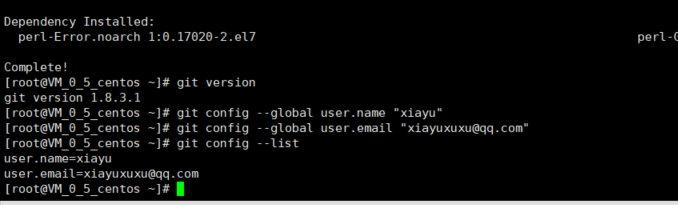

## 环境搭建

### 1. 安装Node.js

[node.js下载](http://nodejs.cn/download)__

+ windows一直下一步就行。

* Linux Ubuntu

  ```xml
  # wget https://nodejs.org/dist/v10.9.0/node-v10.9.0-linux-x64.tar.xz    // 下载
  # tar xf  node-v10.9.0-linux-x64.tar.xz       // 解压
  # cd node-v10.9.0-linux-x64/                  // 进入解压目录
  # ./bin/node -v                               // 执行node命令 查看版本
  //设置软连接
  ln -s /usr/software/nodejs/bin/npm   /usr/local/bin/ 
  ln -s /usr/software/nodejs/bin/node   /usr/local/bin/
  ```

* Linux Centos

1.首先安装wget

yum install -y wget

如果已经安装了可以跳过该步

2.下载nodejs最新的bin包

可以在下载页面https://nodejs.org/en/download/中找到下载地址。然后执行指令

wget https://nodejs.org/dist/v9.3.0/node-v9.3.0-linux-x64.tar.xz

然后就是等着下载完毕。

另外你也可以在你喜欢的任意系统上下载最新的bin包，然后通过FTP上传到CentOS上。

3.解压包

依次执行

xz -d node-v9.3.0-linux-x64.tar.xz
tar -xf node-v9.3.0-linux-x64.tar

1. 部署bin文件

先确认你nodejs的路径，我这里的路径为~/node-v9.3.0-linux-x64/bin。确认后依次执行

ln -s ~/node-v9.3.0-linux-x64/bin/node /usr/bin/node
ln -s ~/node-v9.3.0-linux-x64/bin/npm /usr/bin/npm

注意ln指令用于创建关联（类似与Windows的快捷方式）必须给全路径，否则可能关联错误。

5.测试

node -v
npm

如果正确输出版本号，则部署OK

这种安装的方法好处是比较干净，安装也比较快速。个人认为比较适合新手。但是如果遇到nodejs插件全局安装时，需要自行去创建关联，参考第4步。


### 2. 安装git

[git下载](https://git-scm.com/downloads)

+ windows一直下一步即可，如果嫌弃命令行麻烦可以下载TortoiseGit视图化工具[下载](https://pan.baidu.com/s/15_VnHkLpR7ihf_8pPB9KNg)提取码 i28g 。

+ linux

  ```xml
  yum install git     //下载安装
  git --version      //查看安装版本
  yum remove git    //卸载
  ```

上一个安装方法版本过旧

其他的自行百度

## hexo搭建

### hexo安装

打开git bash，为了避免出现错误后面的操作在git bash进行
首先新建一个存放hexo文件的目录，例如在D盘根目录新建`hexo`文件夹，然后cd到该目录下，开始安装

```bash
$ cd D:hexo/    #换成你的目录
$ npm install -g hexo-cli  #安装hexo脚手架
$ hexo init     #Hexo自动在当前文件夹下下载搭建网站所需的所有文件
$ npm install   #安装依赖包

$ hexo g        #完整命令为hexo generate，生成静态文件
$ hexo s        #完整命令为hexo server，启动服务器，用来本地预览
```

用浏览器访问`http://localhost:4000/`，这时就可以看到了一个比较漂亮的博客了，这个是hexo的默认主题landscape，而我们会使用的是NexT主题，这个在后面会说到如何配置。

### 更换主题

__[主题](https://hexo.io/zh-cn/docs/themes)__

  下载后将themes文件夹内

修改配置文件

_config

```yml
# Hexo Configuration
## Docs: https://hexo.io/docs/configuration.html
## Source: https://github.com/hexojs/hexo/

# Site
title: 夏雨の博客
subtitle:
description:
keywords:
author: xiayu
language: zh-CN
timezone: bj

# URL
## If your site is put in a subdirectory, set url as 'http://yoursite.com/child' and root as '/child/'
url: http://yoursite.com
root: /
permalink: :year/:month/:day/:title/
permalink_defaults:

# Directory
source_dir: source
public_dir: public
tag_dir: tags
archive_dir: archives
category_dir: categories
code_dir: downloads/code
i18n_dir: :lang
skip_render:

# Writing
new_post_name: :title.md # File name of new posts
default_layout: post
titlecase: false # Transform title into titlecase
external_link: true # Open external links in new tab
filename_case: 0
render_drafts: false
post_asset_folder: false
relative_link: false
future: true
highlight:
  enable: true
  line_number: true
  auto_detect: false
  tab_replace:
  
# Home page setting
# path: Root path for your blogs index page. (default = '')
# per_page: Posts displayed per page. (0 = disable pagination)
# order_by: Posts order. (Order by date descending by default)
index_generator:
  path: ''
  per_page: 10
  order_by: -date
  
# Category & Tag
default_category: uncategorized
category_map:
tag_map:

# Date / Time format
## Hexo uses Moment.js to parse and display date
## You can customize the date format as defined in
## http://momentjs.com/docs/#/displaying/format/
date_format: YYYY-MM-DD
time_format: HH:mm:ss

# Pagination
## Set per_page to 0 to disable pagination
per_page: 10
pagination_dir: page

# Extensions
## Plugins: https://hexo.io/plugins/
## Themes: https://hexo.io/themes/


theme: hexo-theme-next

# Deployment
## Docs: https://hexo.io/docs/deployment.html

#deploy:
 # type: git
 # repo: https://github.com/xuhongyux/xuhongyux.github.io.git
 # branch: hexo

```

### 利用TravisCI实现持续化部署

__Github账号登陆TravisCI__

1. 添配置仓库
2. Github上面添加Access Token
3. 在TravisCI设置中添加token
4. 在本地博客上添加。travis.yml

```shell
language: node_js
node_js: lts/*
install:
- npm install
before_script:
script:
- hexo clean
- hexo g
after_script:
- cd ./public
- git init
- git config user.name "xuhongyux" # 你的Git名字
- git config user.email "xiayuxuxu@qq.com" # 你的Git邮箱
- git add .
- git commit -m "Update docs with TRAVIS-CI" # conmmit信息
- git push --force --quiet "https://${myblog}@${GH_REF}" master:master

branches:
  only:
  - hexo # 监听hexo分支变化，具体把源文件提交到分支，请左转度娘
env:
  global:
  - GH_REF: github.com/xuhongyux/xuhongyux.github.io
cache:
  yarn: true
  directories:
  - node_modules
before_install:
after_success:

#addons:
 # ssh_known_hosts: # 给Travis服务器添加你的VPS ip地址，以跳过询问

```

###  添加照片

1. 首先确认`_config.yml` 中有 `post_asset_folder:true`。
   Hexo 提供了一种更方便管理 Asset 的设定：`post_asset_folder`
2. 在hexo的目录下执行`npm install https://github.com/CodeFalling/hexo-asset-image --save`（需要等待一段时间）。
3. 文件名，和放图片的文件夹的名称需要一致，并且在同一目录下。
4. 路径的斜杠前面要注意 是 / 

### 搜索

cnpm install hexo-generator-searchdb --save

```shell
search:
  path: search.xml
  field: post
  format: html
  limit: 10000
	
```


## 部署到cos

安装插件

```shell
 cnpm install hexo-deployer-cos --save
```

配置文件


```shell
deploy: 
  type: cos
  appId: 1259671659linux 查看日
  secretId: AKIDJyVnqirFe9RfgUwNOAk7h6ZyIWUVtaHs
  secretKey: kfT9g50mS1MZds1eCculT2XtxuhLhQ2A
  bucket: test-1259671659
  region: ap-nanjing
```


## SSH

1、ssh是什么，为什么需要ssh，ssh用在哪里

1）ssh是一种协议标准，也叫做安全外壳协议，主要为远程登录会话和其他网络服务提供安全性的协议。全称为Secure SHell，本质上是进行加密的shell。它既可以代替telnet，又可以为ftp、pop、甚至ppp提供一个安全的“通道”。

2）利用 SSH 协议，可以有效防止远程管理过程中的信息泄露问题，而且也能够防止DNS欺骗和IP欺骗，因为传输过程中对数据进行压缩，也提高了传输效率。

3）几乎所有UNIX平台—包括[HP-UX](https://baike.baidu.com/item/HP-UX)、[Linux](https://baike.baidu.com/item/Linux)、[AIX](https://baike.baidu.com/item/AIX)、[Solaris](https://baike.baidu.com/item/Solaris/3517)、[Digital](https://baike.baidu.com/item/Digital) [UNIX](https://baike.baidu.com/item/UNIX)、[Irix](https://baike.baidu.com/item/Irix)，以及其他平台，都能 运行SSH。现在主流的开源实现是openssh，当然也有很多商业实现。

2、两种加密方式，ssh的使用方式，ssh支持的两种级别的安全验证

  1）加密方式分为两种 对称加密和非对称加密。对称加密顾名思义，数据加密和解密使用同一个密钥，优点是加密强度高，但是缺点是密钥丢失很容易造成安全问题。


 

ssh是使用非对称加密对数据传输过程进行处理，分为私钥和公钥，在进行数据加密处理的时候通常使用公钥对数据进行加密，私钥进行解密（这里注意仅限于数据加密的时候，签名的时候刚好相反，使用私钥进行签名，公钥进行验签）。且基本不存在通过公钥推导出私钥的可能

a、第一种方式为密码登录。在整个过程中，客户端本身不存有任何密钥。


 

第一步，客户端输入用户名密码，发出登陆请求。

第二步，服务端接收到请求并返回给客户端公钥以及公钥指纹（公钥指纹是为了防止中间人攻击的产物，是由于公钥本身过长（1024位）而对其hash之后产生的128位的指纹，方便在第一次连接服务端的时候，用户对服务端身份的对比确认。用户确认通过后，该host会被加入到known_hosts。第二次连接时，不需要再次确认服务端身份了。感兴趣可以搜索中间人攻击，如下图）


 

第三步，客户端收到服务端发送的公钥，对密码进行加密然后将密文发送给服务端

第四步，服务端收到密文，使用私钥将密文进行解密，得到密码并对比确认

第五步，服务端返回给客户端，登陆结果。

 b、 第二种方式为公钥登陆，也就是免密登陆。


第一步，客户端生成一对密钥，手动将公钥添加到服务端的authorized_keys中。

第二步，客户端直接发起登陆请求到服务端

第三步，服务端收到请求后，生成随机数R，并使用公钥对随机数R进行加密，得到密文并返回给客户端

第四步，客户端收到密文后，使用私钥对密文解密，得到随机数R。然后用MD5对随机数R和SessionKey进行生成摘要A1，并发送给服务端

第五步，服务端同样用MD5对随机数R和SessionKey进行生成摘要A2，然后对比A1和A2，完成登录确认。

**扩展**

ssh-keygen是用于生产密钥的工具。

- -t：指定生成密钥类型（rsa、dsa、ecdsa等）
- -P：指定passphrase，用于确保私钥的安全
- -f：指定存放密钥的文件（公钥文件默认和私钥同目录下，不同的是，存放公钥的文件名需要加上后缀.pub）

 部分内容和全部图片是从网上拿来用的，如有侵权，联系删除

## 部署到服务器（centos）

***

### 安装配置git  并配置ssh

#### 安装git

```shell
yum install git
# 查看版本
git version
```


#### 配置账户密码

```shell
git config --global user.name "Your Name"
git config --global user.email "email@example.com"
#查看配置是否生效
git config --list
```



#### 配置SSH

在本地生成公钥和私钥

```shell
ssh-keygen -t rsa -C "your_email@youremail.com"
```

确实路径按1次回车，提示：Enter passphrase（输入密码），不用输密码再按2次回车即可。生成的密钥存放路径 /root/.ssh/id_rsa


#### 配置github

登录github选择Settings  选择SSH and GPG keys


复制刚才生成的 id_rsa.pub 公钥，Add SSH key.

其他代码托管如gitlab等类似

测试一下即可

```shell
git clone ****************************
```

### 搭建git服务器并且实现ssh登录

__在客户端上__

首先在客户端生成密钥

```shell
$ ssh-keygen -t rsa -C
```

此时 C:\Users\用户名\.ssh 下会多出两个文件 id_rsa 和 id_rsa.pub

id_rsa 是私钥

id_rsa.pub 是公钥


__在服务器__

以root管理权限生成一个git用户 用来访问属于git用户的文件

```shell
useradd git
passwd git
```

设置git用户的仓库 在 home/git目录下面


```shell
mkdir /git
cd /git
git init --bare sample.git # 创建 git 仓库，仓库名一般以 .git 结尾 ( git 仓库上没有工作区，看不
chown -R git:git sample.git # 指定运行用户
mkdir /home/git/.ssh; cd /home/git/.ssh
vim authorized_keys # 将客户端生成的公钥写入，一行一个 ( id_rsa.pub )
```

进入 /etc/ssh 目录，编辑 sshd_config，打开以下三个配置的注释：

```xml
RSAAuthentication yes     #这个注解可能在 ssh_config
PubkeyAuthentication yes
AuthorizedKeysFile .ssh/authorized_keys
```

保存成功后重启 切记

重启ssh

> 装手工启：
> /etc/init.d/sshd start
> 自启：
> chkconfig sshd on

返回管理员权限

```shell
exit
```

修改 .ssh 目录的权限为 700

修改 .ssh/authorized_keys 文件的权限为 600

```shell
[root@localhost git]``# chmod 700 .ssh
[root@localhost git]``# cd .ssh
[root@localhost .``ssh``]``# chmod 600 authorized_keys`
```

测试

```shell
git clone git@192.168.56.101:/home/data/gittest.git
git clone ssh://git@139.155.87.157:/home/git/test.git
#测试是否能够链接
ssh git@139.155.87.157
```


[参考博客](https://www.cnblogs.com/wangxiaoqiangs/p/5336388.html)                 [参考博客](https://www.cnblogs.com/dwj97/p/6559056.html)   [参考博客](https://www.cnblogs.com/dwj97/p/6559056.html)       [参考](https://www.liaoxuefeng.com/wiki/896043488029600/899998870925664)

### 服务器安装Nginx 

自行[百度](www.baidu.com)    [参照](https://www.cnblogs.com/jackyzm/p/9600738.html)


启动

```shell
$ /usr/local/nginx/sbin/nginx
#或者设置别名
alias nginx='/usr/local/nginx/sbin/nginx' // 为 nginx 取别名，后面可直接用
```

重启：

```shell 
$ /usr/local/nginx/sbin/nginx –s reload
```

停止：

```shell 
$ /usr/local/nginx/sbin/nginx –s stop
```

强制关闭：

```shell 
$ pkill nginx
```

配置

```shell
 server {
        listen       80;
    #    server_name  localhost;  #  域名

    #    ssl_certificate      cert.pem;
    #    ssl_certificate_key  cert.key;

    #    ssl_session_cache    shared:SSL:1m;
    #    ssl_session_timeout  5m;

    #    ssl_ciphers  HIGH:!aNULL:!MD5;
    #    ssl_prefer_server_ciphers  on;

        location / {  # 指向博客的所在目录
            root   /home/git/xuhongyux.github.io;
            index  index.html index.htm;
        }
    }

```


待续

## 遇到的问题

+ Hexo server报错TypeError: Cannot read property 'utcOffset' of null解决方法

  _config.yml中的时区timezone改成了beijing哭笑不得。解决办法就是把timezone改成 Asia/Shanghai 就好。
  
+ 在git用户下面没成功的下载代码

出现了这种情况

```shell
fatal: could not create work tree dir 'xuhongyux.github.io'.: Permission denied
```

是因为这个目录下面是root的权限，git用户没有这个权限

## 创建博客

```yaml
title: YAML
date: 2019-09-15 15:04:20
tags:
	- YAML
	-  配置语言
categories: YAML 
```

## 杂记

hexo s 启动
hexo clean 清理
hexo g 生成
hexo d 部署到远端


修改配置文件

安装部署插件
cnpm install --save hexo-deployer-git

设置github的路径

deploy:
  type: git
  repo: https://github.com/xuhongyux/xuhongyux.github.io.git
  branch: master

在部署的时候项目名称必须与用户名称相同 xuhongyux.github.io


自动部署
travis CI

在上传的时候
git add .  保存更改
git  commit -m "添加描述"
git  push -f 部署


删除用户

userdel -rf git

重启ssh

> 装手工启：
> /etc/init.d/sshd start
> 自启：
> chkconfig sshd on

__切换到su__

```shell
su 用户名
exit #推出当前用户  用于返回root
```


出现这个错误时候

```shell
 ERROR:  Error installing bluecloth:  
  ERROR: Failed to build gem native extension.  
  
/System/Library/Frameworks/Ruby.framework/Versions/2.1/usr/bin/ruby  
extconf.rb  
mkmf.rb can't find header files for ruby at  
/System/Library/Frameworks/Ruby.framework/Versions/2.1/usr/lib/ruby/ruby.h 
```

  如果是在centos等系统下面，执行命令：yum  install   ruby-devel 

  如果是在Ubuntu等系统下面，执行命令:apt-get  isntall   ruby-dev


--------------------------------------------------------

