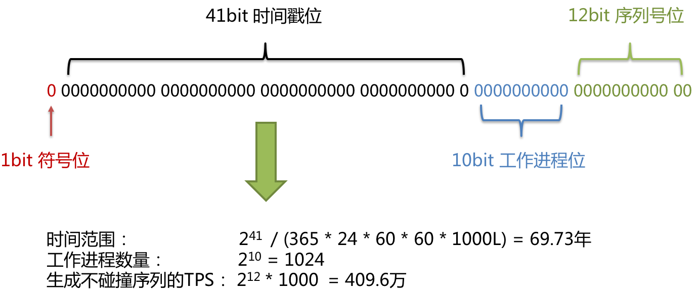
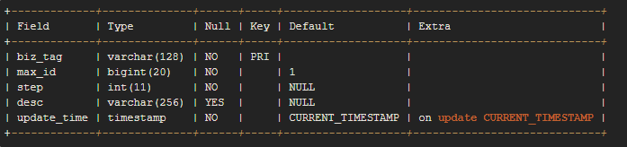

## SNOWFLAKE

[引用地址]([http://www.qfdmy.com/2020/01/16/%e5%88%86%e5%b8%83%e5%bc%8f%e4%b8%bb%e9%94%ae%e8%a7%a3%e5%86%b3%e6%96%b9%e6%a1%88%e4%b9%8b%e7%be%8e%e5%9b%a2-leaf/](http://www.qfdmy.com/2020/01/16/分布式主键解决方案之美团-leaf/))

雪花算法是由 Twitter 公布的分布式主键生成算法，它能够保证不同进程主键的不重复性，以及相同进程主键的有序性。在同一个进程中，它首先是通过时间位保证不重复，如果时间相同则是通过序列位保证。 同时由于 **时间位是单调递增的**，且各个服务器如果大体做了时间同步，那么生成的主键在分布式环境可以认为是总体有序的，这就保证了对索引字段的插入的高效性。例如 MySQL 的 Innodb 存储引擎的主键。

使用雪花算法生成的主键，**二进制表示形式** 包含 4 部分，从高位到低位分表为：1bit 符号位、41bit 时间戳位、10bit 工作进程位以及 12bit 序列号位。



- **符号位 (1bit)**

预留的符号位，恒为零。

- **时间戳位 (41bit)**

41 位的时间戳可以容纳的毫秒数是 2 的 41 次幂，一年所使用的毫秒数是：`365 * 24 * 60 * 60 * 1000`。通过计算可知：

```
Math.pow(2, 41) / (365 * 24 * 60 * 60 * 1000L);
```

结果约等于 69.73 年。ShardingSphere 的雪花算法的时间纪元从 2016 年 11 月 1 日零点开始，可以使用到 2086 年，相信能满足绝大部分系统的要求。

- **工作进程位 (10bit)**

该标志在 Java 进程内是唯一的，如果是分布式应用部署应保证每个工作进程的 id 是不同的。该值默认为 0，可通过属性设置。

- **序列号位 (12bit)**

该序列是用来在同一个毫秒内生成不同的 ID。如果在这个毫秒内生成的数量超过 4096 (2 的 12 次幂)，那么生成器会等待到下个毫秒继续生成。

> **注意：** 该算法存在 **时钟回拨** 问题，服务器时钟回拨会导致产生重复序列，因此默认分布式主键生成器提供了一个最大容忍的时钟回拨毫秒数。 如果时钟回拨的时间超过最大容忍的毫秒数阈值，则程序报错；如果在可容忍的范围内，默认分布式主键生成器会等待时钟同步到最后一次主键生成的时间后再继续工作。 最大容忍的时钟回拨毫秒数的默认值为 0，可通过属性设置。


## UUID

UUID (Universally Unique Identifier) 的标准型式包含 32 个 16 进制数字，以连字号分为五段，形式为 8-4-4-4-12 的 36 个字符，示例：550e8400-e29b-41d4-a716-446655440000，到目前为止业界一共有 5 种方式生成 UUID

- 优点：
  - 性能非常高：本地生成，没有网络消耗。
- 缺点：
  - 不易于存储：UUID 太长，16 字节 128 位，通常以 36 长度的字符串表示，很多场景不适用。
  - 信息不安全：基于 MAC 地址生成 UUID 的算法可能会造成 MAC 地址泄露，这个漏洞曾被用于寻找梅丽莎病毒的制作者位置。
  - ID 作为主键时在特定的环境会存在一些问题，比如做 DB 主键的场景下，UUID 就非常不适用：

> **注意：**
>
> - MySQL 官方有明确的建议主键要尽量越短越好 [4]，36 个字符长度的 UUID 不符合要求
> - 对 MySQL 索引不利：如果作为数据库主键，在 InnoDB 引擎下，UUID 的无序性可能会引起数据位置频繁变动，严重影响性能

## Leaf 分布式主键方案

### 什么是 Leaf

Leaf 是美团开源的分布式 ID 生成系统，最早期需求是各个业务线的订单 ID 生成需求。在美团早期，有的业务直接通过 DB 自增的方式生成 ID，有的业务通过 Redis 缓存来生成 ID，也有的业务直接用 UUID 这种方式来生成 ID。以上的方式各自有各自的问题，因此美团决定实现一套分布式 ID 生成服务来满足需求

目前 Leaf 覆盖了美团点评公司内部金融、餐饮、外卖、酒店旅游、猫眼电影等众多业务线。在4C8G VM 基础上，**通过公司 RPC 方式调用**，QPS 压测结果近 5w/s，TP999 1ms（TP=Top Percentile，Top 百分数，是一个统计学里的术语，与平均数、中位数都是一类。TP50、TP90 和 TP99 等指标常用于系统性能监控场景，指高于 50%、90%、99% 等百分线的情况）

- GitHub：[https://github.com/Meituan-Dianping/Leaf/blob/master/README_CN.md](http://www.qfdmy.com/wp-content/themes/quanbaike/go.php?url=aHR0cHM6Ly9naXRodWIuY29tL01laXR1YW4tRGlhbnBpbmcvTGVhZi9ibG9iL21hc3Rlci9SRUFETUVfQ04ubWQ=)

### Leaf-segment

Leaf-segment 数据库方案，在使用数据库的方案上，做了如下改变：

- 原方案每次获取 ID 都得读写一次数据库，造成数据库压力大。改为利用 proxy server 批量获取，每次获取一个 segment (step 决定大小) 号段的值。用完之后再去数据库获取新的号段，可以大大的减轻数据库的压力。
- 各个业务不同的发号需求用 biz_tag 字段来区分，每个 biz-tag 的 ID 获取相互隔离，互不影响。如果以后有性能需求需要对数据库扩容，只需要对 biz_tag 分库分表就行。数据库表设计如下：



- 重要字段说明：
  - biz_tag 用来区分业务
  - max_id 表示该 biz_tag 目前所被分配的 ID 号段的最大值
  - step 表示每次分配的号段长度

原来获取 ID 每次都需要写数据库，现在只需要把 step 设置得足够大，比如 1000。那么只有当 1000 个号被消耗完了之后才会去重新读写一次数据库。读写数据库的频率从 1 减小到了 1/step，大致架构如下图所示：


test_tag 在第一台 Leaf 机器上是 1~1000 的号段，当这个号段用完时，会去加载另一个长度为 step=1000 的号段，假设另外两台号段都没有更新，这个时候第一台机器新加载的号段就应该是 3001~4000。同时数据库对应的 biz_tag 这条数据的 max_id 会从 3000 被更新成 4000，更新号段的 SQL 语句如下：

```shell
Begin
UPDATE table SET max_id=max_id+step WHERE biz_tag=xxx
SELECT tag, max_id, step FROM table WHERE biz_tag=xxx
Commit
```

#### 优点

- Leaf 服务可以很方便的线性扩展，性能完全能够支撑大多数业务场景。
- ID 号码是趋势递增的 8byte 的 64 位数字，满足上述数据库存储的主键要求。
- 容灾性高：Leaf 服务内部有号段缓存，即使 DB 宕机，短时间内 Leaf 仍能正常对外提供服务。
- 可以自定义 max_id 的大小，非常方便业务从原有的 ID 方式上迁移过来。

#### 缺点

- ID 号码不够随机，能够泄露发号数量的信息，不太安全。
- DB 宕机会造成整个系统不可用。

### Leaf-snowflake

Leaf-snowflake 方案完全沿用 snowflake 方案的 bit 位设计，即是 “1+41+10+12” 的方式组装 ID 号。对于 workerID 的分配，当服务集群数量较小的情况下，完全可以手动配置。Leaf 服务规模较大，动手配置成本太高。所以使用 Zookeeper 持久顺序节点的特性自动对 snowflake 节点配置 wokerID。Leaf-snowflake 是按照下面几个步骤启动的：

- 启动 Leaf-snowflake 服务，连接 Zookeeper，在 leaf_forever 父节点下检查自己是否已经注册过（是否有该顺序子节点）
- 如果有注册过直接取回自己的 workerID（zk 顺序节点生成的 int 类型 ID 号），启动服务
- 如果没有注册过，就在该父节点下面创建一个持久顺序节点，创建成功后取回顺序号当做自己的 workerID 号，启动服务

## 基于 Docker 部署

我 Fork 了 Leaf 的官方代码在此基础之上制作了 Dockerfile，可以很方便的构建并运行获取雪花算法的 ID

### 克隆

```
git clone https://github.com/funtl/Leaf.gitcd Leafmvn clean install -DskipTests
```

### 构建

```
cd leaf-dockerchmod +x build.sh./build.sh
```

### 运行

```
docker-compose up -d
```

### 测试

```
curl http://localhost:8080/api/snowflake/get/test# 输出如下1209912709605228625
```