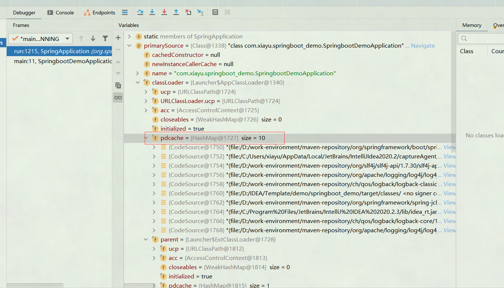
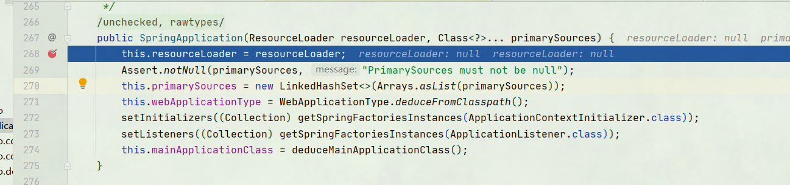
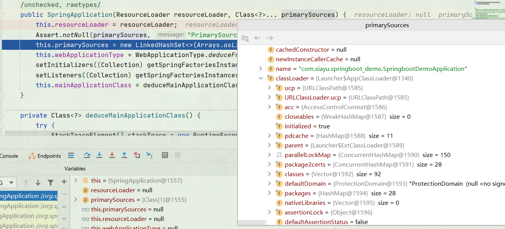
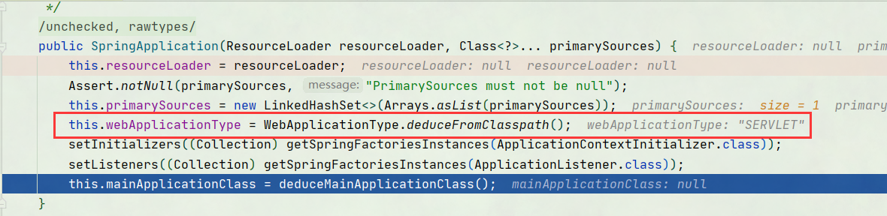
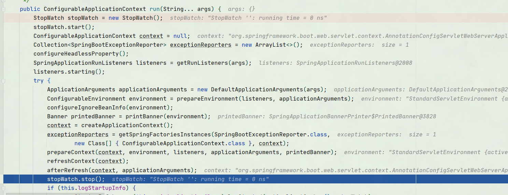

[参考文章](https://www.cnblogs.com/theRhyme/p/11057233.html)

## SpringBoot是什么

Spring Boot、Spring MVC 和 Spring 区别

### Spring MVC

SpringMvc提供了一种轻度耦合的方式来开发web应用；和struts功能相似。它是Spring的一个模块，是一个web框架；通过DispatcherServlet, ModelAndView 和 View Resolver，开发web应用变得很容易；解决的问题领域是网站应用程序或者服务开发——URL路由、Session、模板引擎、静态Web资源等等。

### Spring

Spring 框架就像一个家族，有众多衍生产品例如 boot、security、jpa等等；但他们的基础都是Spring 的ioc和 aop，ioc 提供了依赖注入的容器， aop解决了面向切面编程，然后在此两者的基础上实现了其他延伸产品的高级功能。他调解了控制层和数据库操作层的关系。

### SpringBoot

Spring Boot实现了auto-configuration**自动配置**（另外三大神器actuator监控，cli命令行接口，starter依赖），降低了项目搭建的复杂度。它主要是为了解决使用Spring框架需要进行大量的配置太麻烦的问题，所以它并不是用来替代Spring的解决方案，而是和Spring框架紧密结合用于提升Spring开发者体验的工具；同时它集成了大量常用的第三方库配置(例如Jackson, JDBC, Mongo, Redis, Mail等等)，Spring Boot应用中这些第三方库几乎可以零配置的开箱即用(out-of-the-box)。就相当于一个整合包

## Springboot

SpringBoot和其他项目明显的不一样，Springboot内置了tomcate不需要外部的tomcate来启动，Springboot有自己单独的启动类

```java
@SpringBootApplication
public class Application {
    public static void main(String[] args) {
        SpringApplication.run(Application.class, args);
    }
}
```

__@SpringBootApplication注解__

```java
@Target(ElementType.TYPE) // 注解的适用范围，其中TYPE用于描述类、接口（包括包注解类型）或enum声明
@Retention(RetentionPolicy.RUNTIME) // 注解的生命周期，保留到class文件中（三个生命周期）
@Documented // 表明这个注解应该被javadoc记录
@Inherited // 子类可以继承该注解
@SpringBootConfiguration // 继承了Configuration，表示当前是注解类
@EnableAutoConfiguration // 开启springboot的注解功能，springboot的四大神器之一，其借助@import的帮助
@ComponentScan(excludeFilters = { // 扫描路径设置（具体使用待确认）
@Filter(type = FilterType.CUSTOM, classes = TypeExcludeFilter.class),
@Filter(type = FilterType.CUSTOM, classes = AutoConfigurationExcludeFilter.class) })
public @interface SpringBootApplication {
...
}　
```

三个重要注解

+ @SpringBootConfiguration // 继承了Configuration，表示当前是注解类
+ @EnableAutoConfiguration // 开启springboot的注解功能，springboot的四大神器之一，其借助@import的帮助
+ @ComponentScan(excludeFilters = { // 扫描路径设置（具体使用待确认）


## 流程


第一部分进行SpringApplication的初始化模块，配置一些基本的环境变量、资源、构造器、监听器，第二部分实现了应用具体的启动方案，包括启动流程的监听模块、加载配置环境模块、及核心的创建上下文环境模块，第三部分是自动化配置模块，该模块作为springboot自动配置核心，

### 创建SpringApplication对象

若想自己Debug跑一下，SPringboot版本不能过高，Spring并没有开放源码。

在启动类中.SpringApplication的静态方法run()构建

```java
SpringApplication.run(Application.class, args);
```

加载，初始化信息所需要的文件。



初始化SpringApplication



1.  primarySources 类加载器加载的信息



2.  判断是否为web环境



```java
	/**
	 * 不启动内嵌的WebServer，不是运行web application
	 */
	NONE,

	/**
	 * 启动内嵌的基于servlet的web server
	 */
	SERVLET,

	/**
	 * 启动内嵌的reactive web server，这个application是一个reactive web application
	 */
	REACTIVE;
```

3.  创建初始化构造器

4. 初始化监听器
5. 配合启动类位置

### 开始启动 run()



1. 启动时间监控，启动
2. ConfigurableApplicationContext对象创建
3. exceptionReporters异常集合创建
4. configureHeadlessProperty 配置头属性
5. SpringApplicationRunListeners 创建并获取监听器，启动监听器（获取spring.factories中的监听器变量，args为指定的参数数组，默认为当前类SpringApplication）
6. ConfigurableEnvironment 配置环境模块
7. 设置需要忽略的bean
8. 打印banner
9. ConfigurableApplicationContext容器赋值
10. 实例化SpringBootExceptionReporter.class，用来支持报告关于启动的错误
11. prepareContext 准备容器
12. refreshContext刷新容器
13. 时间监控结束
14. 校验相关信息
15. 返回ConfigurableApplicationContext对象

大致理解为，创建启动时间监控，创建监听器，配置环境模块，打印彩蛋,加载上下文的Bean，刷新容器

