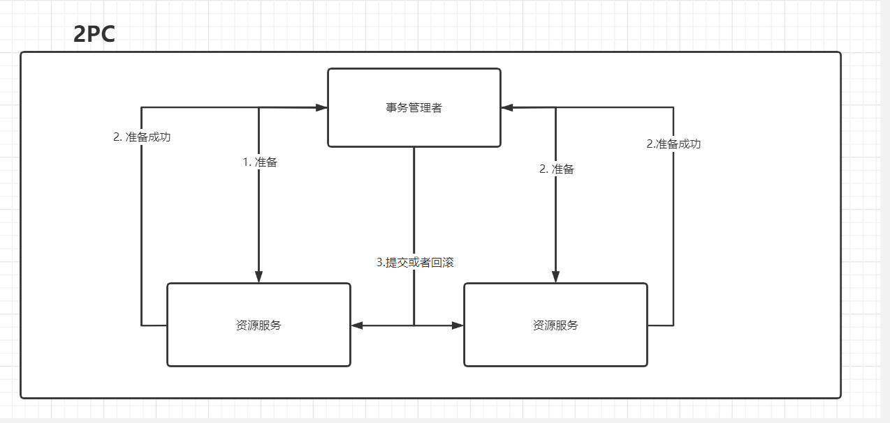
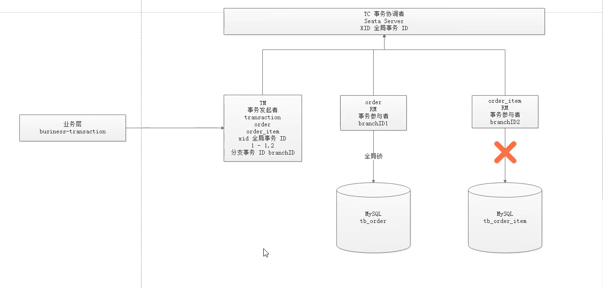

## 分布式事务的产生

在分布式项目中，如果出现在一个接口内修改了两个或者多个服务的数据，在出血异常时的回滚问题。

传统的项目的事务只需要记录对一个数据库的操作及回滚无法满足。

[流程图](https://www.processon.com/view/link/5f0bca8d637689789d284b8e)

## 分布式事务的实现

### XA协议

基于 XA 协议实现的分布式事务，XA 协议中分为两部分：事务管理器和本地资源管理器。其中本地资源管理器往往由数据库实现，比如 Oracle、MYSQL 这些数据库都实现了 XA 接口，而事务管理器则作为一个全局的调度者。

#### 2PC

两阶段提交协议(Two Phase Commitment Protocol)中，涉及到两种角色

一个事务协调者（coordinator）：负责协调多个参与者进行事务投票及提交(回滚)
多个事务参与者（participants）：即本地事务执行者

分为两个阶段

第一个阶段就是步骤1 和步骤2

第二阶段为步骤三



优点减少对业务的入侵，对使⽤⽅透明，用户可以像使⽤本地事务⼀样使⽤基于 XA 协议的分布式事务，能够严格保障事务 ACID 特性。

可 `2PC`的缺点也是显而易见，它是一个强一致性的同步阻塞协议，事务执⾏过程中需要将所需资源全部锁定，也就是俗称的 `刚性事务`。所以它比较适⽤于执⾏时间确定的短事务，整体性能比较差。


一旦事务协调者宕机或者发生网络抖动，会让参与者一直处于锁定资源的状态或者只有一部分参与者提交成功，导致数据的不一致。因此，在⾼并发性能⾄上的场景中，基于 XA 协议的分布式事务并不是最佳选择。

#### 3PC

三段提交（`3PC`）是二阶段提交（`2PC`）的一种改进版本 ，为解决两阶段提交协议的阻塞问题，上边提到两段提交，当协调者崩溃时，参与者不能做出最后的选择，就会一直保持阻塞锁定资源。

`2PC` 中只有协调者有超时机制，`3PC` 在协调者和参与者中都引入了超时机制，协调者出现故障后，参与者就不会一直阻塞。而且在第一阶段和第二阶段中又插入了一个准备阶段（如下图，看着有点啰嗦），保证了在最后提交阶段之前各参与节点的状态是一致的。

虽然 `3PC` 用超时机制，解决了协调者故障后参与者的阻塞问题，但与此同时却多了一次网络通信，性能上反而变得更差，也不太推荐

### TTC

所谓的 `TCC` 编程模式，也是两阶段提交的一个变种，不同的是 `TCC` 为在业务层编写代码实现的两阶段提交。`TCC` 分别指 `Try`、`Confirm`、`Cancel` ，一个业务操作要对应的写这三个方法。

以下单扣库存为例，`Try` 阶段去占库存，`Confirm` 阶段则实际扣库存，如果库存扣减失败 `Cancel` 阶段进行回滚，释放库存。

TCC 不存在资源阻塞的问题，因为每个方法都直接进行事务的提交，一旦出现异常通过则 `Cancel` 来进行回滚补偿，这也就是常说的补偿性事务。

原本一个方法，现在却需要三个方法来支持，可以看到 TCC 对业务的侵入性很强，而且这种模式并不能很好地被复用，会导致开发量激增。还要考虑到网络波动等原因，为保证请求一定送达都会有重试机制，所以考虑到接口的幂等性。


## Seata

[官方文档](https://seata.io/zh-cn/docs/overview/what-is-seata.html)

Seata` 也是从两段提交演变而来的一种分布式事务解决方案，提供了 `AT`、`TCC`、`SAGA` 和 `XA` 等事务模式，这里重点介绍 `AT`模式。

+ AT 强一致性
+ SAGA 若一致性

__这里主要将的时AT模式__

### AT模式

角色

+ TC 事务协调者
+ RM 资源管理器-事务参与者
+ TM 事务管理者-事务发起者



所有的调用过程都是RPC调用

### 第一阶段

第一阶段大致就是将一次对数据库操作，操作前和操作后额数据加以备份，当第二阶段需要回滚时就回滚，需要提交时就提交。

例如

现在需要更新一条数据。

```sql
update user set name = '夏雨' where name = '1234'
```

首先Seata的JDBC数据源代理通过对SQL解析，提取数据源的相关信息。

1. 查询更新前的数据
2. 记录更新后的数据

把业务数据在更新前后的数据镜像组织成回滚日志，将业务数据的更新和回滚日志在同一个本地事务中提交，分别插入到业务表和 `UNDO_LOG` 表中。

数据包括 `afterImage` 前镜像、`beforeImage` 后镜像、 `branchId` 分支事务ID、`xid` 全局事务ID

这样就可以保证，任何提交的业务数据的更新一定有相应的回滚日志。

在本地事务提交前，各分支事务需向 `全局事务协调者` TC 注册分支 ( `Branch Id`) ，为要修改的记录申请 **全局锁** ，要为这条数据加锁，利用 `SELECT FOR UPDATE` 语句。而如果一直拿不到锁那就需要回滚本地事务。TM 开启事务后会生成全局唯一的 `XID`，会在各个调用的服务间进行传递。

有了这样的机制，本地事务分支（`Branch Transaction`）便可以在全局事务的第一阶段提交，并马上释放本地事务锁定的资源。相比于传统的 `XA` 事务在第二阶段释放资源，`Seata` 降低了锁范围提高效率，即使第二阶段发生异常需要回滚，也可以快速 从`UNDO_LOG` 表中找到对应回滚数据并反解析成 SQL 来达到回滚补偿。

最后本地事务提交，业务数据的更新和前面生成的 UNDO LOG 数据一并提交，并将本地事务提交的结果上报给全局事务协调者 TC。

### 第二阶段

第二阶段根据各个分支的决议做提交或者回滚：

如果决议是全局提交，此时各分支事务已提交并成功，这时 `全局事务协调者（TC）` 会向分支发送第二阶段的请求。收到 TC 的分支提交请求，该请求会被放入一个异步任务队列中，并马上返回提交成功结果给 TC。异步队列中会异步和批量地根据 `Branch ID` 查找并删除相应 `UNDO LOG` 回滚记录。、

如果决议是全局回滚，过程比全局提交麻烦一点，`RM` 服务方收到 `TC` 全局协调者发来的回滚请求，通过 `XID` 和 `Branch ID` 找到相应的回滚日志记录，通过回滚记录生成反向的更新 SQL 并执行，以完成分支的回滚。

在回滚完成后删除回滚日志操作

## Seata AT 实现

### 部署Seata Server

- 我们使用 Docker 部署 Seata Server，Compose 配置文件如下

```yml
version: "3"
services:
  seata-server:
    image: seataio/seata-server
    hostname: seata-server
    container_name: seata-server
    ports:
      - "8091:8091"
    environment:
      - SEATA_PORT=8091
    volumes:
      - ./config:/root/seata-config
```

- 在 Compose 同级目录下创建配置文件 `vi config/registry.conf`

```json
registry {
  type = "file"

  file {
    name = "file.conf"
  }
}

config {
  type = "file"

  file {
    name = "file.conf"
  }
}
```

- 在 Compose 同级目录下创建配置文件 `vi config/file.conf`

```json
service {
  # 自定义事务组名称 tx_group，客户端配置需要和服务端一致
  vgroup_mapping.tx_group = "default"
  default.grouplist = "127.0.0.1:8091"
  disableGlobalTransaction = false
}

store {
  mode = "file"

  file {
    dir = "sessionStore"
  }
}
```

- 启动服务

```shell
docker-compose up -d
```

__Docker部署__

启动seata-server实例

```bash
# 第一次部署 需要拉去镜像
$ docker run --name seata-server -p 8091:8091 seataio/seata-server:latest
# 后续不需要拉去镜像
docker run -p -d 8091:8091 docker.io/seataio/seata-server
```

指定seata-server IP和端口 启动

```bash
$ docker run --name seata-server \
        -p 8091:8091 \
        -e SEATA_IP=192.168.1.1 \
        -e SEATA_PORT=8091 \
        seataio/seata-server
```

容器命令行及查看日志

```bash
$ docker exec -it seata-server sh
$ docker logs -f seata-server
# 停止
docker-compose down
```


### 创建数据库表

- 在每个数据库中创建 `undo_log` 表

```sql
CREATE TABLE `undo_log` (
  `id` bigint(20) NOT NULL AUTO_INCREMENT,
  `branch_id` bigint(20) NOT NULL,
  `xid` varchar(100) NOT NULL,
  `context` varchar(128) NOT NULL,
  `rollback_info` longblob NOT NULL,
  `log_status` int(11) NOT NULL,
  `log_created` datetime NOT NULL,
  `log_modified` datetime NOT NULL,
  `ext` varchar(100) DEFAULT NULL,
  PRIMARY KEY (`id`),
  UNIQUE KEY `ux_undo_log` (`xid`,`branch_id`)
) ENGINE=InnoDB AUTO_INCREMENT=1 DEFAULT CHARSET=utf8;
```

## 项目配置

pom

```xml
<dependency>
    <groupId>io.seata</groupId>
    <artifactId>seata-spring-boot-starter</artifactId>
    <version>1.0.0</version>
</dependency>
```

- 在 `resources` 目录下创建 `application.yml` 配置文件

```yml
spring:
  main:
    allow-bean-definition-overriding: true
  application:
    name: provider-order-item
  cloud:
    nacos:
      discovery:
        server-addr: 192.168.2.121:8848
    alibaba:
      seata:
        # 自定义事务组名称 tx_group，需要与服务端一致
        tx-service-group: tx-group
```

- 在 `resources` 目录下创建 `registry.conf` 配置文件

```
registry {
  type = "file"

  file {
    name = "file.conf"
  }
}

config {
  type = "file"

  file {
    name = "file.conf"
  }
}
```

- 在 `resources` 目录下创建 `file.conf` 配置文件

```java
transport {
  type = "TCP"
  server = "NIO"
  heartbeat = true
  enable-client-batch-send-request = true
  thread-factory {
    boss-thread-prefix = "NettyBoss"
    worker-thread-prefix = "NettyServerNIOWorker"
    server-executor-thread-prefix = "NettyServerBizHandler"
    share-boss-worker = false
    client-selector-thread-prefix = "NettyClientSelector"
    client-selector-thread-size = 1
    client-worker-thread-prefix = "NettyClientWorkerThread"
    boss-thread-size = 1
    worker-thread-size = 8
  }
  shutdown {
    wait = 3
  }
  serialization = "seata"
  compressor = "none"
}
service {
  # 自定义事务组名称 tx_group，需要与服务端一致
  vgroup_mapping.tx_group = "default"
  # 这里配置 Seata Server 的 IP 和 端口
  default.grouplist = "192.168.2.121:8091"
  enableDegrade = false
  disableGlobalTransaction = false
}

client {
  rm {
    async.commit.buffer.limit = 10000
    lock {
      retry.internal = 10
      retry.times = 30
      retry.policy.branch-rollback-on-conflict = true
    }
    report.retry.count = 5
    table.meta.check.enable = false
    report.success.enable = true
  }
  tm {
    commit.retry.count = 5
    rollback.retry.count = 5
  }
  undo {
    data.validation = true
    log.serialization = "jackson"
    log.table = "undo_log"
  }
  log {
    exceptionRate = 100
  }
  support {
    spring.datasource.autoproxy = false
  }
}
```

- **特别重要：** 每个需要参与分布式事务的服务都需要将数据源交由 Seata 托管，否则事务是不会生效的；创建一个名为 `SeataConfiguration` 自定义 Java 配置

```java
package com.funtl.spring.cloud.alibaba.provider.configuration;

import com.zaxxer.hikari.HikariDataSource;
import io.seata.rm.datasource.DataSourceProxy;
import io.seata.spring.annotation.GlobalTransactionScanner;
import org.apache.ibatis.session.SqlSessionFactory;
import org.mybatis.spring.SqlSessionFactoryBean;
import org.mybatis.spring.transaction.SpringManagedTransactionFactory;
import org.springframework.boot.context.properties.ConfigurationProperties;
import org.springframework.context.annotation.Bean;
import org.springframework.context.annotation.Configuration;
import org.springframework.context.annotation.Primary;
import org.springframework.core.io.support.PathMatchingResourcePatternResolver;

import javax.sql.DataSource;

@Configuration
public class SeataConfiguration {

    @Bean
    @ConfigurationProperties(prefix = "spring.datasource")
    public DataSource druidDataSource() {
        HikariDataSource hikariDataSource = new HikariDataSource();
        return hikariDataSource;
    }

    @Primary
    @Bean("dataSource")
    public DataSourceProxy dataSource(DataSource hikariDataSource) {
        return new DataSourceProxy(hikariDataSource);
    }

    @Bean
    public SqlSessionFactory sqlSessionFactory(DataSourceProxy dataSourceProxy) throws Exception {
        SqlSessionFactoryBean sqlSessionFactoryBean = new SqlSessionFactoryBean();
        sqlSessionFactoryBean.setDataSource(dataSourceProxy);
        sqlSessionFactoryBean.setMapperLocations(new PathMatchingResourcePatternResolver()
                .getResources("classpath*:/mapper/*.xml"));
        sqlSessionFactoryBean.setTransactionFactory(new SpringManagedTransactionFactory());
        return sqlSessionFactoryBean.getObject();
    }

    @Bean
    public GlobalTransactionScanner globalTransactionScanner() {
        /**
         * applicationId：同服务名即可
         * txServiceGroup：自定义事务组名，需要与 Seata Server 配置一致
         */
        return new GlobalTransactionScanner("provider-order-item", "tx_group");
    }
```

## 异常

### 数据源循环依赖

解决办法

解决方法就是在Spring boot启动的时候排除Spring的，并倒入自己的动态数据源类

```java
@EnableTransactionManagement
@MapperScan(value = "com.xiayu.provider.mapper")
@SpringBootApplication(scanBasePackageClasses = {ProviderOrderApplication.class},exclude={DataSourceAutoConfiguration.class})
public class ProviderOrderApplication {

    public static void main(String[] args) {
        SpringApplication.run(ProviderOrderApplication.class, args);
    }

}
```

