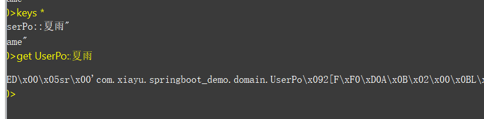

## Redis简介

键的类型只能为字符串，值支持五种数据类型：字符串、列表、集合、散列表、有序集合。

Redis 属于NoSQL数据库，非关系型数据库。内容以key-value 键值对的形式存储在内存中。

Redis 是完全开源的，遵守 BSD 协议，是一个高性能的 key-value 数据库。

Redis 与其他 key - value 缓存产品有以下三个特点：

- Redis支持数据的持久化，可以将内存中的数据保存在磁盘中，重启的时候可以再次加载进行使用。
- Redis不仅仅支持简单的key-value类型的数据，同时还提供list，set，zset，hash等数据结构的存储。
- Redis支持数据的备份，即master-slave模式的数据备份。

__优势__

- 性能极高 – Redis能读的速度是110000次/s,写的速度是81000次/s 。
- 丰富的数据类型 – Redis支持二进制案例的 Strings, Lists, Hashes, Sets 及 Ordered Sets 数据类型操作。
- 原子 – Redis的所有操作都是原子性的，意思就是要么成功执行要么失败完全不执行。单个操作是原子性的。多个操作也支持事务，即原子性，通过MULTI和EXEC指令包起来。
- 丰富的特性 – Redis还支持 publish/subscribe, 通知, key 过期等等特性。


首先redis内部使用一个redisObject对象来表示所有的key和value，redisObject最主要的信息如上图所示：type表示一个value对象具体是何种数据类型，encoding是不同数据类型在redis内部的存储方式。比如：type=string表示value存储的是一个普通字符串，那么encoding可以是raw或者int。

reids 快的原因

Redis确实是单进程单线程的模型，因为Redis完全是基于内存的操作，CPU不是Redis的瓶颈，Redis的瓶颈最有可能是机器内存的大小或者网络带宽。既然单线程容易实现，而且CPU不会成为瓶颈，那就顺理成章的采用单线程的方案了（毕竟采用多线程会有很多麻烦）。

Redis完全基于内存，绝大部分请求是纯粹的内存操作，非常迅速，数据存在内存中，类似于HashMap，HashMap的优势就是查找和操作的时间复杂度是O(1)。第二：数据结构简单，对数据操作也简单。第三：采用单线程，避免了不必要的上下文切换和竞争条件，不存在多线程导致的CPU切换，不用去考虑各种锁的问题，不存在加锁释放锁操作，没有死锁问题导致的性能消耗。第四：使用多路复用IO模型，非阻塞IO。

## redis安装

### windows

[下载地址](https://github.com/tporadowski/redis/releases)

选择 .zip包

解压，在redis文件夹下，cmd

```shell
redis-server.exe redis.windows.conf
```

### linux

[下载地址](https://redis.io/download)

下载

```shell
wget http://download.redis.io/releases/redis-4.0.8.tar.gz
```

解压

```shell
tar xzvf redis-4.0.8.tar.gz
```

安装

```shell
　cd redis-4.0.8

　　make

　　cd src

　　make install PREFIX=/usr/local/redis
```

如果报错 make

安装gcc：yum install gcc

再次执行：make install PREFIX=/usr/local/redis

还报错就升级gcc

```shell
[root@localhost redis-6.0.1]# gcc -v                             # 查看gcc版本
[root@localhost redis-6.0.1]# yum -y install centos-release-scl  # 升级到9.1版本
[root@localhost redis-6.0.1]# yum -y install devtoolset-9-gcc devtoolset-9-gcc-c++ devtoolset-9-binutils
[root@localhost redis-6.0.1]# scl enable devtoolset-9 bash
以上为临时启用，如果要长期使用gcc 9.1的话：
[root@localhost redis-6.0.1]# echo "source /opt/rh/devtoolset-9/enable" >>/etc/profile
```


移动配置文件到安装目录下

```shell
cd ../

　　mkdir /usr/local/redis/etc

　　mv redis.conf /usr/local/redis/etc
```

配置redis为后台启动

```shell
vi /usr/local/redis/etc/redis.conf //将daemonize no 改成daemonize yes
```

将redis加入到开机启动

```shell
vi /etc/rc.local //在里面添加内容：/usr/local/redis/bin/redis-server /usr/local/redis/etc/redis.conf (意思就是开机调用这段开启redis的命令)
```

开启redis

```shell
/usr/local/redis/bin/redis-server /usr/local/redis/etc/redis.conf 
```

将redis-cli,redis-server拷贝到bin下，让redis-cli指令可以在任意目录下直接使用

```shell
cp /usr/local/redis/bin/redis-server /usr/local/bin/

　　cp /usr/local/redis/bin/redis-cli /usr/local/bin/
```

__Docker安装Redis__

```shell
docker pull redis:latest
docker images
docker run -itd --name redis-test -p 6379:6379 redis
```

- **-p 6379:6379**：映射容器服务的 6379 端口到宿主机的 6379 端口。外部可以直接通过宿主机ip:6379 访问到 Redis 的服务。

测试

```shell
docker exec -it redis-test /bin/bash
```


## 数据类型

Redis支持五种数据类型：string（字符串），hash（哈希），list（列表），set（集合）及zset(sorted set：有序集合)

### String（字符串）

string是redis最基本的类型，可以理解成与memcached一模一样的类型，一个key对应一个value。value不仅是string，也可以是数字。string类型是二进制安全的，意思是redis的string类型可以包含任何数据，比如jpg图片或者序列化的对象。string类型的值最大能存储512M。

### Hash

Hash是一个键值（key-value）的集合。redis的hash是一个string的key和value的映射表，Hash特别适合存储对象。常用命令：hget,hset,hgetall等。

### List

list列表是简单的字符串列表，按照插入顺序排序。可以添加一个元素到列表的头部（左边）或者尾部（右边） 常用命令：lpush、rpush、lpop、rpop、lrange(获取列表片段)等。

- lpush    添加一个或多个元素插入到list的头部
- lpop   从 list 中删除并返回第一个元素
- rpush    添加字符串元素到对应 list 的尾部
- rpop    从list 的尾部删除元素，并返回删除元素
- llen      获取list的元素个数
- lrange     获取列表指定范围内的元素
- lindex    获取列表中指定位置的元素

应用场景：list应用场景非常多，也是Redis最重要的数据结构之一，比如twitter的关注列表，粉丝列表都可以用list结构来实现。

数据结构：list就是链表，可以用来当消息队列用。redis提供了List的push和pop操作，还提供了操作某一段的api，可以直接查询或者删除某一段的元素。

实现方式：redis list的是实现是一个双向链表，既可以支持反向查找和遍历，更方便操作，不过带来了额外的内存开销。

### Set

set是string类型的无序集合。集合是通过hashtable实现的。set中的元素是没有顺序的，而且是没有重复的。常用命令：sdd、spop、smembers、sunion等。应用场景：redis set对外提供的功能和list一样是一个列表，特殊之处在于set是自动去重的，而且set提供了判断某个成员是否在一个set集合中。

### Sorted Set

zset和set一样是string类型元素的集合，且不允许重复的元素。常用命令：zadd、zrange、zrem、zcard等。使用场景：sorted set可以通过用户额外提供一个优先级（score）的参数来为成员排序，并且是插入有序的，即自动排序。当你需要一个有序的并且不重复的集合列表，那么可以选择sorted set结构。和set相比，sorted set关联了一个double类型权重的参数score，使得集合中的元素能够按照score进行有序排列，redis正是通过分数来为集合中的成员进行从小到大的排序。实现方式：Redis sorted set的内部使用HashMap和跳跃表(skipList)来保证数据的存储和有序，HashMap里放的是成员到score的映射，而跳跃表里存放的是所有的成员，排序依据是HashMap里存的score，使用跳跃表的结构可以获得比较高的查找效率，并且在实现上比较简单。

### **场景总结**


## 基础操作

### 基础命令

```shell
keys *        // 查看所有key
type key      // 查看key类型
ttl key       // 查看key过期剩余时间-1表示存在，-2表示key已经不存在了
persist       // 取消key的过期时间-1表示key存在，没有过期时间
exists key    // 判断key存在存在返回1否则0
del keys      // 删除key可以删除多个
dbsize        // 计算key的数量
expire key seconds    // 过期时间
```

### String 操作

```shell
set 　　 // 设置key
get     // 获取key
append  // 追加string
mset    // 设置多个键值对
mget    // 获取多个键值对
del     // 删除key
incr    // 递增+1
decr    // 递减-1
```

### list操作

```shell
lpush           // 从列表左边插
rpush           // 从列表右边插
lrange          // 获取一定长度的元素  lrange key  start stop
ltrim           // 截取一定长度列表
lpop            // 删除最左边一个元素
rpop            // 删除最右边一个元素
lpushx/rpushx   // key存在则添加值，不存在不处理
```

### set操作

```shell
sadd        // 添加元素
srem        // 删除元素
sismember   // 判断是否为set的一个元素
smembers    // 返回集合所有的成员
sdiff       // 返回一个集合和其他集合的差异
sinter      // 返回几个集合的交集
sunion      // 返回几个集合的并集
```

有序set

```shell
ZADD         // 添加有序集合
ZREM         // 删除有序集合中的元素
ZREVRANGE    // 倒叙
ZRANGE       // 正序
ZCARD        // 有序集合的基数
ZSCORE       // 返回成员的值
ZRANK        // 返回有序集合中成员的排名
```

### 哈希操作

```shell
hset       // 设置散列值
hget       // 获取散列值
hmset      // 设置多对散列值
hmget      // 获取多对散列值
hsetnx     // 如果散列已经存在，则不设置（防止覆盖key）
hkeys      // 返回所有keys
hvals      // 返回所有values
hlen       // 返回散列包含域（field）的数量
hdel       // 删除散列指定的域（field）
hexists    // 判断是否存在
```


[参考文章](https://www.cnblogs.com/caesar-id/p/10846541.html)

## SpringBoot 中引入Redis

**（1）在SpringBoot中添加Redis依赖：**

```xml
 <!--Redis-->
        <dependency>
            <groupId>org.springframework.boot</groupId>
            <artifactId>spring-boot-starter-data-redis</artifactId>
        </dependency>
        
        <dependency>
            <groupId>org.apache.commons</groupId>
            <artifactId>commons-pool2</artifactId>
        </dependency>
        
        <dependency>
            <groupId>org.springframework.session</groupId>
            <artifactId>spring-session-data-redis</artifactId>
        </dependency>
```

- spring-boot-starter-data-redis:在spring boot 2.x以后底层不再使用Jedis，而是换成了Lettuce。
- commons-pool2：用作redis连接池，如不引入启动会报错
- spring-session-data-redis：spring session引入，用作共享session。配置文件

**（2）添加配置文件：**

在SpringBoot中使用`.properties`或者`.yml`都可以.

```xml
server:
  port: 8082
  servlet:
    session:
      timeout: 30ms
spring:
  cache:
    type: redis
  redis:
    host: 127.0.0.1
    port: 6379
    password:
    # redis默认情况下有16个分片，这里配置具体使用的分片，默认为0
    database: 0
    lettuce:
      pool:
        # 连接池最大连接数(使用负数表示没有限制),默认8
        max-active: 100
```

### **RedisTemplate的使用方式** 

默认情况下的模板只能支持RedisTemplate<String, String>，也就是只能存入字符串，所以自定义模板很有必要。添加配置类RedisCacheConfig.java

```java
@Configuration
@AutoConfigureAfter(RedisAutoConfiguration.class)
public class RedisCacheConfig {

    @Bean
    public RedisTemplate<String, Serializable> redisCacheTemplate(LettuceConnectionFactory connectionFactory) {

        RedisTemplate<String, Serializable> template = new RedisTemplate<>();
        template.setKeySerializer(new StringRedisSerializer());
        template.setValueSerializer(new GenericJackson2JsonRedisSerializer());
        template.setConnectionFactory(connectionFactory);
        return template;
    }
}
```

测试类

```java
@RestController
@RequestMapping("/user")
public class UserController {

    public static Logger logger = LogManager.getLogger(UserController.class);

    @Autowired
    private StringRedisTemplate stringRedisTemplate;

    @Autowired
    private RedisTemplate<String, Serializable> redisCacheTemplate;

    @RequestMapping("/test")
    public void test() {
        redisCacheTemplate.opsForValue().set("userkey", new User(1, "张三", 25));
        User user = (User) redisCacheTemplate.opsForValue().get("userkey");
        logger.info("当前获取对象：{}", user.toString());
    }
```

### **使用spring cache集成redis**

在使用时需要在启动类上加上 @EnableCaching

spring cache具备很好的灵活性，不仅能够使用SPEL(spring expression language)来定义缓存的key和各种condition，还提供了开箱即用的缓存临时存储方案，也支持和主流的专业缓存如EhCache、Redis、Guava的集成。定义接口UserService.java

三个核心注解

1、@Cacheable 根据方法的请求参数对其结果进行缓存

- key：缓存的key，可以为空，如果指定要按照SPEL表达式编写，如果不指定，则按照方法的所有参数进行组合。
- value：缓存的名称，必须指定至少一个（如 @Cacheable (value='user')或者@Cacheable(value={'user1','user2'})）
- condition：缓存的条件，可以为空，使用SPEL编写，返回true或者false，只有为true才进行缓存。

2、@CachePut 根据方法的请求参数对其结果进行缓存，和@Cacheable不同的是，它每次都会触发真实方法的调用。参数描述见上。

3、@CacheEvict 根据条件对缓存进行清空

- key：同上
- value：同上
- condition：同上
- allEntries：是否清空所有缓存内容，缺省为false，如果指定为true，则方法调用后将立即清空所有缓存
- beforeInvocation：是否在方法执行前就清空，缺省为false，如果指定为true，则在方法还没有执行的时候就清空缓存。缺省情况下，如果方法执行抛出异常，则不会清空缓存。

__注意这几个注解添加的缓存是没有过期时间的__

例如

```java

    @Override
    @Cacheable(value ="UserPo", key = "#userName")
    public UserPo selectUser(String userName) {

        UserExample userExample = new UserExample();
        userExample.createCriteria()
                .andLoginNameEqualTo(userName)
                .andDelFlagEqualTo(0);
        List<UserPo> userPos = userMapper.selectByExample(userExample);

        return userPos.size()==0? new UserPo(): userPos.get(0);
    }
```



## 淘汰策略


Redis4.0加入了LFU(least frequency use)淘汰策略，包括volatile-lfu和allkeys-lfu，通过统计访问频率，将访问频率最少，即最不经常使用的KV淘汰。

__redis5.0__

不同于之前的版本，redis5.0为我们提供了八个不同的内存置换策略。很早之前提供了6种。

（1）volatile-lru：从已设置过期时间的数据集中挑选最近最少使用的数据淘汰。

（2）volatile-ttl：从已设置过期时间的数据集中挑选将要过期的数据淘汰。(默认)

（3）volatile-random：从已设置过期时间的数据集中任意选择数据淘汰。

（4）volatile-lfu：从已设置过期时间的数据集挑选使用频率最低的数据淘汰。

（5）allkeys-lru：从数据集中挑选最近最少使用的数据淘汰

（6）allkeys-lfu：从数据集中挑选使用频率最低的数据淘汰。

（7）allkeys-random：从数据集（server.db[i].dict）中任意选择数据淘汰

（8） no-enviction（驱逐）：禁止驱逐数据，这也是默认策略。意思是当内存不足以容纳新入数据时，新写入操作就会报错，请求可以继续进行，线上任务也不能持续进行，采用no-enviction策略可以保证数据不被丢失。

这八种大体上可以分为4中，lru、lfu、random、ttl。

## 淘汰机制

__删除失效主键__

+ 消极方法（passive way）在主键被访问时如果发现它已经失效，那么就删除它
+ 积极方法（active way），周期性地探测，发现失效就删除。消极方法的缺点是，如果key 迟迟不被访问，就会占用很多内存空间，所以才有积极方式。
+ 主动删除：当内存超过maxmemory限定时，触发主动清理策略，该策略由启动参数的配置决定

主键具体的失效时间全部都维护在expires这个字典表中：

```cpp
1typedef struct redisDb {
2  dict *dict; //key-value
3  dict *expires;  //维护过期key
4  dict *blocking_keys;
5  dict *ready_keys;
6  dict *watched_keys;
7  int id;
8} redisDb;
```

**淘汰数据的量**

既然是淘汰数据，那么淘汰多少合适呢？

为了避免频繁的触发淘汰策略，每次会淘汰掉一批数据，淘汰的数据的大小其实是和置换的大小来确定的，如果置换的数据量大，淘汰的肯定也多。

**置换策略是如何工作**

理解置换策略的执行方式是非常重要的，比如：

（1）客户端执行一条新命令，导致数据库需要增加数据（比如set key value）

（2）Redis会检查内存使用，如果内存使用超过maxmemory，就会按照置换策略删除一些key

（3）新的命令执行成功

## 基本概念

### 数据一致性

分布式环境下非常容易出现缓存和数据库间数据一致性问题，针对这一点，如果项目对缓存的要求是强一致性的，那么就不要使用缓存。我们只能采取合适的策略来降低缓存和数据库间数据不一致的概率，而无法保证两者间的强一致性。合适的策略包括合适的缓存更新策略，更新数据库后及时更新缓存、缓存失败时增加重试机制。

### 缓存雪崩

目前电商首页以及热点数据都会去做缓存，一般缓存都是定时任务去刷新，或者查不到之后去更新缓存的，定时任务刷新就有一个问题。举个栗子：如果首页所有Key的失效时间都是12小时，中午12点刷新的，我零点有个大促活动大量用户涌入，假设每秒6000个请求，本来缓存可以抗住每秒5000个请求，但是缓存中所有Key都失效了。此时6000个/秒的请求全部落在了数据库上，数据库必然扛不住，真实情况可能DBA都没反应过来直接挂了，此时，如果没什么特别的方案来处理，DBA很着急，重启数据库，但是数据库立马又被新流量给打死了。这就是我理解的缓存雪崩。

- 处理缓存雪崩简单，在批量往Redis存数据的时候，把每个Key的失效时间都加个随机值就好了，这样可以保证数据不会再同一时间大面积失效。

```javajava
setRedis（key, value, time+Math.random()*10000）;
```

如果Redis是集群部署，将热点数据均匀分布在不同的Redis库中也能避免全部失效。或者设置热点数据永不过期，有更新操作就更新缓存就好了（比如运维更新了首页商品，那你刷下缓存就好了，不要设置过期时间），电商首页的数据也可以用这个操作，保险。

### 缓存穿透

缓存穿透是指缓存和数据库中都没有的数据，而用户（黑客）不断发起请求，举个栗子：我们数据库的id都是从1自增的，如果发起id=-1的数据或者id特别大不存在的数据，这样的不断攻击导致数据库压力很大，严重会击垮数据库。

缓存穿透我会在接口层增加校验，比如用户鉴权，参数做校验，不合法的校验直接return，比如id做基础校验，id<=0直接拦截。

**布隆过滤器（Bloom Filter）**这个也能很好的预防缓存穿透的发生，他的原理也很简单，就是利用高效的数据结构和算法快速判断出你这个Key是否在数据库中存在，不存在你return就好了，存在你就去查DB刷新KV再return。缓存击穿的话，设置热点数据永不过期，或者加上互斥锁就搞定了

### 缓存击穿

这个跟缓存雪崩有点像，但是又有一点不一样，缓存雪崩是因为大面积的缓存失效，打崩了DB，而缓存击穿不同的是缓存击穿是指一个Key非常热点，在不停地扛着大量的请求，大并发集中对这一个点进行访问，当这个Key在失效的瞬间，持续的大并发直接落到了数据库上，就在这个Key的点上击穿了缓存。


[参考文献](https://zhuanlan.zhihu.com/p/118561398)