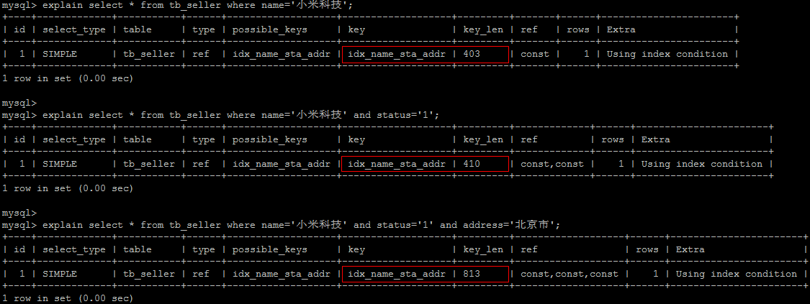
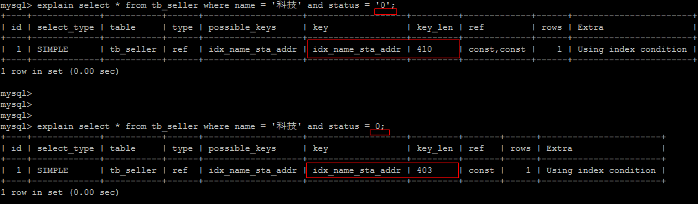
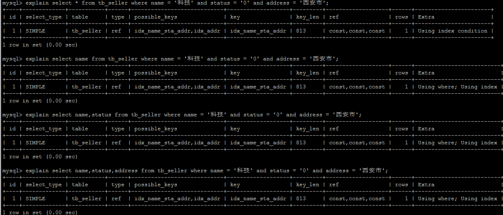
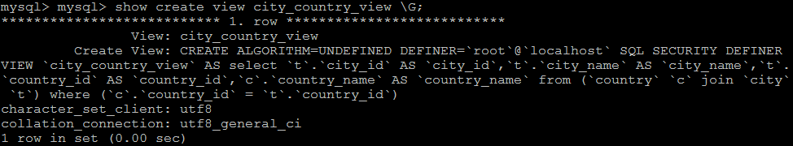

# 索引

## 索引概述

索引(index)是帮助Mysql高效的获取数据的数据结构(有序)。在数据之外，数据库还维护者满足特定算法的数据结构，这些数据结构，以某种方式引用(指向)，这样就可以在泽穴数据结构上实现高级算法的查找，这种数据结构就是索引。

## 优势与劣势

优势

1. 类似与书籍的目录。提高数据的检索效率，减低数据库的IO成本
2. 通过索引对数据进行排序，降低数据排序的成本，降低CPU的消耗

劣势

1. 索引实际上也是一种表，该表中保存了，主键与索引的字段，并指向实体类的记录，所以索引列也是要占用空间的。
2. 虽然索引大大的提高了查询的速度，但是页降低了表的更新的速度，在对表进行，INSERT,UPDATE,DELETE,因为更新表的时候不仅仅需要更新表的数据，还要保存一些索引文件，每次更新添加了索引的字段，都会调整更新所带来的简直变化后的索引信息。

## 索引的结构


索引是Mysql的存储引擎层中实现的，不是在服务层，索引每种存储引擎的索引都不一定完全一样，也不是所有的存储引擎都支持所有的索引类型。Mysql支持以下四种索引：

+ BTREE索引： 最常见的索引类型，大部分索引都支持B树索引
+ Hash 索引
+ R-tree索引（空间索引）
+ Full-text(全文索引)

三种存储引擎

+ InnoDb引擎 默认的
+ MyISAM 
+ Memory

平时说的索引就是B+树索引（多路搜索树，并不一定是二叉树）

B+Tree为BTree的变种，B+Tree与BTree区别：

1. n叉B+Tree最多含有n个key，而BTree最多含有n-1个key
2. B+Tree的子夜节点保存所有的Key信息，依key大小顺序排列
3. 所有的节点都可以看作是key的索引部分

## 索引的分类

1. 单值索引 ： NORMAL   normal一个索引只包含单个列，一个表可以有多个单值索引
2. 唯一索引 ：UNIQUE  unique 索引列的值必须唯一，允许有多个空值
3. 复合索引 ： 一个索引包含多个列

```sql
#创建组合索引：
CREATE INDEX INDEXNAME ON TABLENAME（id,name,tal）

# 相当于
	对 id, 创建索引
	对id,name,创建了索引
	对id,name，tal创建了索引；
```

## 索引语法

### 创建索引

```sql
#创建    索引的类型 唯一索引|全文索引|空间索引       索引的名称
CREATE [UNIQUE|FULLTEXT|SPATIAL] INDEX index_name
#索引的类型
[USING index_tyep]
#  创建的表名(字段)
on tableName(ziduan);

```

### 查看索引

```sql
show index from tableName \G;
```

### 删除索引

```sql
DROP INDEX index_name ON table_name;
```

### ALTER命令

```sql
1. alter table table_name add primary key(column_list)
# 该语句添加一个主键，这意味这索引值必须是唯一的，切不能为空

2. alter table table_name add unique index_name(colum_list)
# 这条语句创建索引的值必须是唯一的可以为null

3. alter table table_name add index index_name(column_list);
# 添加普通索引，索引值可以出现多次
 
 4. alter table table_name add fulltext index_name(column_list);
 # 该语句指定索引为FULLTEXT,用于全文索引
```

## 索引的设计原则

__表要求__

+ 查询次数较高，且数据量比较大的表

__字段要求__

+ 经常在where子句中的字段（查询条件的字段）尽量使用唯一索引
+ 尽可能的用短字段的索引 （索引也是占用内存的，这样剑圣访问I/n）
+ 利用最左前缀，N个列组合而成的组合索引，那么相当于创建了N个索引，如果查询时where子句中使用了组成该索引的前几个字段，那么这个条查询SQL可以利用组合索引来提高查询效率
+ 索引不是越多越好
+ 利用最左前缀，N个列组合而成的组合索引，那么相当于是创建了N个索引，如果查询时where子句中使用了组成该索引的前几个字段，那么这条查询SQL可以利用组合索引来提升查询效率。

## 索引的使用

### 验证索引提升查询效率

在我们准备的表结构tb_item 中， 一共存储了 300 万记录；

A. 根据ID查询 

```
select * from tb_item where id = 1999\G;
```

查询速度很快， 接近0s ， 主要的原因是因为id为主键， 有索引；


2). 根据 title 进行精确查询

```SQL
select * from tb_item where title = 'iphoneX 移动3G 32G941'\G;  
```

查看SQL语句的执行计划 ： 

处理方案 ， 针对title字段， 创建索引 ： 

```SQL
create index idx_item_title on tb_item(title);
```

索引创建完成之后，再次进行查询 ： 

通过explain ， 查看执行计划，执行SQL时使用了刚才创建的索引 

### 索引的使用

### 准备环境

```sql
create table `tb_seller` (
	`sellerid` varchar (100),
	`name` varchar (100),
	`nickname` varchar (50),
	`password` varchar (60),
	`status` varchar (1),
	`address` varchar (100),
	`createtime` datetime,
    primary key(`sellerid`)
)engine=innodb default charset=utf8mb4; 

insert into `tb_seller` (`sellerid`, `name`, `nickname`, `password`, `status`, `address`, `createtime`) values('alibaba','阿里巴巴','阿里小店','e10adc3949ba59abbe56e057f20f883e','1','北京市','2088-01-01 12:00:00');
insert into `tb_seller` (`sellerid`, `name`, `nickname`, `password`, `status`, `address`, `createtime`) values('baidu','百度科技有限公司','百度小店','e10adc3949ba59abbe56e057f20f883e','1','北京市','2088-01-01 12:00:00');
insert into `tb_seller` (`sellerid`, `name`, `nickname`, `password`, `status`, `address`, `createtime`) values('huawei','华为科技有限公司','华为小店','e10adc3949ba59abbe56e057f20f883e','0','北京市','2088-01-01 12:00:00');
insert into `tb_seller` (`sellerid`, `name`, `nickname`, `password`, `status`, `address`, `createtime`) values('itcast','传智播客教育科技有限公司','传智播客','e10adc3949ba59abbe56e057f20f883e','1','北京市','2088-01-01 12:00:00');
insert into `tb_seller` (`sellerid`, `name`, `nickname`, `password`, `status`, `address`, `createtime`) values('itheima','黑马程序员','黑马程序员','e10adc3949ba59abbe56e057f20f883e','0','北京市','2088-01-01 12:00:00');
insert into `tb_seller` (`sellerid`, `name`, `nickname`, `password`, `status`, `address`, `createtime`) values('luoji','罗技科技有限公司','罗技小店','e10adc3949ba59abbe56e057f20f883e','1','北京市','2088-01-01 12:00:00');
insert into `tb_seller` (`sellerid`, `name`, `nickname`, `password`, `status`, `address`, `createtime`) values('oppo','OPPO科技有限公司','OPPO官方旗舰店','e10adc3949ba59abbe56e057f20f883e','0','北京市','2088-01-01 12:00:00');
insert into `tb_seller` (`sellerid`, `name`, `nickname`, `password`, `status`, `address`, `createtime`) values('ourpalm','掌趣科技股份有限公司','掌趣小店','e10adc3949ba59abbe56e057f20f883e','1','北京市','2088-01-01 12:00:00');
insert into `tb_seller` (`sellerid`, `name`, `nickname`, `password`, `status`, `address`, `createtime`) values('qiandu','千度科技','千度小店','e10adc3949ba59abbe56e057f20f883e','2','北京市','2088-01-01 12:00:00');
insert into `tb_seller` (`sellerid`, `name`, `nickname`, `password`, `status`, `address`, `createtime`) values('sina','新浪科技有限公司','新浪官方旗舰店','e10adc3949ba59abbe56e057f20f883e','1','北京市','2088-01-01 12:00:00');
insert into `tb_seller` (`sellerid`, `name`, `nickname`, `password`, `status`, `address`, `createtime`) values('xiaomi','小米科技','小米官方旗舰店','e10adc3949ba59abbe56e057f20f883e','1','西安市','2088-01-01 12:00:00');
insert into `tb_seller` (`sellerid`, `name`, `nickname`, `password`, `status`, `address`, `createtime`) values('yijia','宜家家居','宜家家居旗舰店','e10adc3949ba59abbe56e057f20f883e','1','北京市','2088-01-01 12:00:00');


create index idx_seller_name_sta_addr on tb_seller(name,status,address);
```

### 避免索引失效

1).  全值匹配 ，对索引中所有列都指定具体值。

改情况下，索引生效，执行效率高。

```sql
explain select * from tb_seller where name='小米科技' and status='1' and address='北京市'\G;
```

 


2). 最左前缀法则

如果索引了多列，要遵守最左前缀法则。指的是查询从索引的最左前列开始，并且不跳过索引中的列。


匹配最左前缀法则，走索引：

  


违法最左前缀法则 ， 索引失效：

 


如果符合最左法则，但是出现跳跃某一列，只有最左列索引生效：

 


3). 范围查询右边的列，不能使用索引 。

 

根据前面的两个字段name ， status 查询是走索引的， 但是最后一个条件address 没有用到索引。


4). 不要在索引列上进行运算操作， 索引将失效。

 


5). 字符串不加单引号，造成索引失效。

 

由于，在查询是，没有对字符串加单引号，MySQL的查询优化器，会自动的进行类型转换，造成索引失效。


6). 尽量使用覆盖索引，避免select *

尽量使用覆盖索引（只访问索引的查询（索引列完全包含查询列）），减少select * 。

 

如果查询列，超出索引列，也会降低性能。

 

```
TIP : 
	
    using index ：使用覆盖索引的时候就会出现

    using where：在查找使用索引的情况下，需要回表去查询所需的数据

    using index condition：查找使用了索引，但是需要回表查询数据

    using index ; using where：查找使用了索引，但是需要的数据都在索引列中能找到，所以不需要回表查询数据
```


7). 用or分割开的条件， 如果or前的条件中的列有索引，而后面的列中没有索引，那么涉及的索引都不会被用到。

示例，name字段是索引列 ， 而createtime不是索引列，中间是or进行连接是不走索引的 ： 

```sql
explain select * from tb_seller where name='黑马程序员' or createtime = '2088-01-01 12:00:00'\G;	
```

 


8).  以%开头的Like模糊查询，索引失效。

如果仅仅是尾部模糊匹配，索引不会失效。如果是头部模糊匹配，索引失效。

 

解决方案 ： 

通过覆盖索引来解决 

 


9). 如果MySQL评估使用索引比全表更慢，则不使用索引。

 


10). is  NULL ， is NOT NULL  <font color='red'>有时</font>索引失效。

  


11). in 走索引， not in 索引失效。

  


12). 单列索引和复合索引。

尽量使用复合索引，而少使用单列索引 。

创建复合索引 

```
create index idx_name_sta_address on tb_seller(name, status, address);

就相当于创建了三个索引 ： 
	name
	name + status
	name + status + address

```


创建单列索引 

```
create index idx_seller_name on tb_seller(name);
create index idx_seller_status on tb_seller(status);
create index idx_seller_address on tb_seller(address);
```

数据库会选择一个最优的索引（辨识度最高索引）来使用，并不会使用全部索引 。

### 查看索引使用情况

```sql
show status like 'Handler_read%';	

show global status like 'Handler_read%';	
```

 

```
Handler_read_first：索引中第一条被读的次数。如果较高，表示服务器正执行大量全索引扫描（这个值越低越好）。

Handler_read_key：如果索引正在工作，这个值代表一个行被索引值读的次数，如果值越低，表示索引得到的性能改善不高，因为索引不经常使用（这个值越高越好）。

Handler_read_next ：按照键顺序读下一行的请求数。如果你用范围约束或如果执行索引扫描来查询索引列，该值增加。

Handler_read_prev：按照键顺序读前一行的请求数。该读方法主要用于优化ORDER BY ... DESC。

Handler_read_rnd ：根据固定位置读一行的请求数。如果你正执行大量查询并需要对结果进行排序该值较高。你可能使用了大量需要MySQL扫描整个表的查询或你的连接没有正确使用键。这个值较高，意味着运行效率低，应该建立索引来补救。

Handler_read_rnd_next：在数据文件中读下一行的请求数。如果你正进行大量的表扫描，该值较高。通常说明你的表索引不正确或写入的查询没有利用索引。
```

# 视图

## 视图概述

视图（View）是一种虚拟存在的表。视图并不在数据库中实际存在，行和列数据来自定义视图的查询中使用的表，并且是在使用视图时动态生成的。通俗的讲，视图就是一条SELECT语句执行后返回的结果集。所以我们在创建视图的时候，主要的工作就落在创建这条SQL查询语句上。

视图相对于普通的表的优势主要包括以下几项。

- 简单：使用视图的用户完全不需要关心后面对应的表的结构、关联条件和筛选条件，对用户来说已经是过滤好的复合条件的结果集。
- 安全：使用视图的用户只能访问他们被允许查询的结果集，对表的权限管理并不能限制到某个行某个列，但是通过视图就可以简单的实现。
- 数据独立：一旦视图的结构确定了，可以屏蔽表结构变化对用户的影响，源表增加列对视图没有影响；源表修改列名，则可以通过修改视图来解决，不会造成对访问者的影响。

##  创建或者修改视图

创建视图的语法为：

```sql
CREATE [OR REPLACE] [ALGORITHM = {UNDEFINED | MERGE | TEMPTABLE}]

VIEW view_name [(column_list)]

AS select_statement

[WITH [CASCADED | LOCAL] CHECK OPTION]
```

修改视图的语法为：

```sql
ALTER [ALGORITHM = {UNDEFINED | MERGE | TEMPTABLE}]

VIEW view_name [(column_list)]

AS select_statement

[WITH [CASCADED | LOCAL] CHECK OPTION]
```

```
选项 : 
	WITH [CASCADED | LOCAL] CHECK OPTION 决定了是否允许更新数据使记录不再满足视图的条件。
	
	LOCAL ： 只要满足本视图的条件就可以更新。
	CASCADED ： 必须满足所有针对该视图的所有视图的条件才可以更新。 默认值.
```

示例 , 创建city_country_view视图 , 执行如下SQL : 

```sql
create or replace view city_country_view 
as 
select t.*,c.country_name from country c , city t where c.country_id = t.country_id;

```

查询视图 : 

```sql
select * from view_name
```

##  查看视图

从 MySQL 5.1 版本开始，使用 SHOW TABLES 命令的时候不仅显示表的名字，同时也会显示视图的名字，而不存在单独显示视图的 SHOW VIEWS 命令。


同样，在使用 SHOW TABLE STATUS 命令的时候，不但可以显示表的信息，同时也可以显示视图的信息。


如果需要查询某个视图的定义，可以使用 SHOW CREATE VIEW 命令进行查看 ： 



## 删除视图

语法 : 

```sql
DROP VIEW [IF EXISTS] view_name [, view_name] ...[RESTRICT | CASCADE]	
```

示例 , 删除视图city_country_view :

```
DROP VIEW city_country_view ;
```

