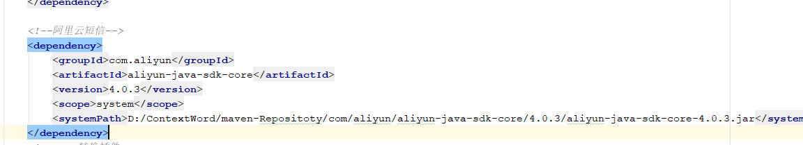

## 基本操作

### 重新安装

mvn clean install

### 正常打包

mvn package   

### 构建打包

mvn package -X

### 查看依赖树

mvn dependency:tree

## Maven打包异常

为了解决maven本地依赖jar文件没有打包到部署包的问题，我们这里以spring boot的项目依赖oracle驱动包的例子来说明，大家都知道oracle驱动包由于版权的问题，现在maven的仓库中一般都没有办法直接下载了，所以大部分情况都需要自己上传或者本地依赖，如图所示，采用<scope>system</scope>，在定义systemPath的位置信息




配置完成之后，刷新maven配置，然后clean package打包，spring boot打包的是项目targe目录下的jar文件

解压jar文件查看BOOT-INF/lib下面的所有依赖jar是否包含oracle驱动包，此时是没有的，因为默认spring-boot打包插件是不会将本地依赖jar文件打进部署包的

在pom.xml文件中找到spring-boot-maven-plugin插件，添加如下配置

```xml
<configuration>

  <includeSystemScope>true</includeSystemScope>

</configuration>
```

然后再次clean package，解压查看部署包里文件，现在可以看到oracle驱动包此时已经被打入进去

## Maven 种的依赖 scope

Maven的一个哲学是惯例优于配置(Convention Over Configuration), Maven默认的依赖配置项中，scope的默认值是compile，

scope的分类
### compile
默认就是compile，什么都不配置也就是意味着compile。compile表示被依赖项目需要参与当前项目的编译，当然后续的测试，运行周期也参与其中，是一个比较强的依赖。打包的时候通常需要包含进去。

test
scope为test表示依赖项目仅仅参与测试相关的工作，包括测试代码的编译，执行。比较典型的如junit。

### runntime
runntime表示被依赖项目无需参与项目的编译，不过后期的测试和运行周期需要其参与。与compile相比，跳过编译而已，说实话在终端的项目（非开源，企业内部系统）中，和compile区别不是很大。比较常见的如JSR×××的实现，对应的API jar是compile的，具体实现是runtime的，compile只需要知道接口就足够了。oracle jdbc驱动架包就是一个很好的例子，一般scope为runntime。另外runntime的依赖通常和optional搭配使用，optional为true。我可以用A实现，也可以用B实现。

### provided
provided意味着打包的时候可以不用包进去，别的设施(Web Container)会提供。事实上该依赖理论上可以参与编译，测试，运行等周期。相当于compile，但是在打包阶段做了exclude的动作。

### system
从参与度来说，也provided相同，不过被依赖项不会从maven仓库抓，而是从本地文件系统拿，一定需要配合systemPath属性使用。

scope的依赖传递
A–>B–>C。当前项目为A，A依赖于B，B依赖于C。知道B在A项目中的scope，那么怎么知道C在A中的scope呢？答案是：
当C是test或者provided时，C直接被丢弃，A不依赖C；
否则A依赖C，C的scope继承于B的scope。